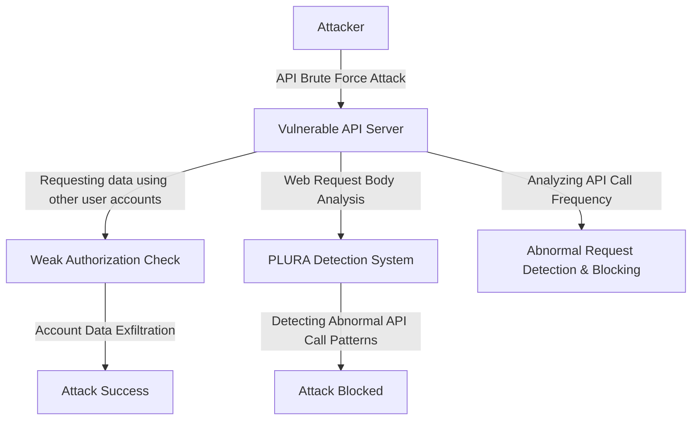

## `Case 2` Exploiting API Vulnerabilities (Zero-Day API Attack)   

### **1️⃣ Why Traditional Threat Hunting (SIEM + EDR + NDR + TI) Fails to Detect It**  

| **Comparison Items** | **Traditional Threat Hunting (SIEM + EDR + NDR + TI)** | **PLURA Web Request Body Analysis + EDR** |
|----------|-------------------------------|-------------------------------|
| **Detection Method** | Rule-based detection, capable of detecting abnormal traffic but unable to analyze detailed web request bodies | **Capable of detecting based on web request body and user behavior analysis** |
| **Web Application Attack Detection** | Able to analyze API request headers and URLs but not request bodies | **Can analyze API request bodies to detect API abuse and abnormal requests** |
| **Network Traffic Analysis** | NDR can decrypt SSL and analyze traffic, but it cannot examine API call contents | **Can analyze API request bodies in detail to detect authentication bypass and privilege escalation attempts** |
| **Endpoint Security** | EDR can detect malware and process execution on endpoints, but struggles to correlate with API requests | **Can detect API call patterns on web servers and analyze potential data exfiltration risks** |

### **2️⃣ Detailed Explanation of Why Traditional Threat Hunting Fails**  

1. **Limitations of SIEM + TI (Threat Intelligence)**  
   - Traditional SIEM and Threat Intelligence (TI) rely on **IOC (Indicator of Compromise)-based detection**,  
   - Making it difficult to detect **Zero-Day attacks like new API vulnerabilities and differentiate normal API calls from malicious API requests**.  
   - If an attacker exploits **a new API endpoint that has not been previously identified as vulnerable, detection becomes challenging**.  

2. **Limitations of NDR (Network Detection & Response)**  
   - NDR can analyze network traffic by decrypting SSL,  
   - **But it cannot analyze API request bodies (payloads), making it difficult to detect malicious API calls**.  
   - While NDR can detect anomalies in API traffic at the network level, **it cannot identify internal API data manipulations (e.g., modifying User IDs, changing roles, abusing OAuth tokens, etc.)**.  

3. **Limitations of EDR (Endpoint Security)**  
   - EDR can detect malware execution and file modifications on endpoints,  
   - **But it lacks the capability to detect API abuse and authentication bypass attacks within web applications**.  
   - If an API request appears normal, **an attacker attempting account takeover or data exfiltration may go undetected**.  

---

### **3️⃣ Detection Methods Using PLURA Web Request Body Analysis + EDR**  

✅ **1) Detecting Abnormal Request Patterns via API Request Body Analysis**  
   - **PLURA performs in-depth analysis of API request bodies (payloads)**,  
   - **Detecting patterns where attackers modify specific User IDs and make excessive API requests**.  
   - By comparing with normal API calls, **it can detect abnormal parameter manipulations (e.g., privilege escalation attempts, data scope modifications, etc.)**.  

✅ **2) Correlating Web Application Logs with User Behavior Data**  
   - A normal user executes a single `GET /api/getUserData?userId=1234` request,  
     - While an attacker repeatedly changes `userId` (`GET /api/getUserData?userId=5678`, `userId=91011`, etc.).  
   - **These abnormal access patterns can be analyzed for automatic detection and blocking**.  

✅ **3) Additional Security Detection Using EDR**  
   - If a malicious payload is uploaded to the web server through API exploitation,  
   - **File Integrity Monitoring (FIM) detects and alerts on immediate file modifications on the web server**.  

✅ **4) Correlating Attack Flows to Block Additional Attacks**  
   - **By combining log data, API request patterns, and user activity, authentication bypass and data exfiltration can be detected and blocked**.  

---

### **4️⃣ Attack Flow of API Vulnerability Exploitation**  

---

### **5️⃣ Conclusion: Why PLURA Web Request Body Analysis + EDR Excels in API Vulnerability Detection**  
✅ **Traditional threat hunting (SIEM + EDR + NDR + TI) only analyzes API request headers and URLs, making it difficult to detect new API vulnerabilities (Zero-Day Attacks) since request body analysis is unavailable**.  
✅ **PLURA-XDR analyzes API request bodies and performs behavior-based detection, enabling real-time detection of authentication bypass, privilege escalation, and API abuse attacks**.  
✅ **It can analyze internal API request patterns that cannot be detected through network traffic analysis (NDR)**.  
✅ **Even if attackers attempt to bypass existing rules by modifying API request formats, abnormal behavior can still be detected to prevent API abuse**.  

🔹 **PLURA-XDR is a next-generation security platform that detects and blocks API vulnerability attacks in real-time, where traditional security systems fail.** 🚀  

---
