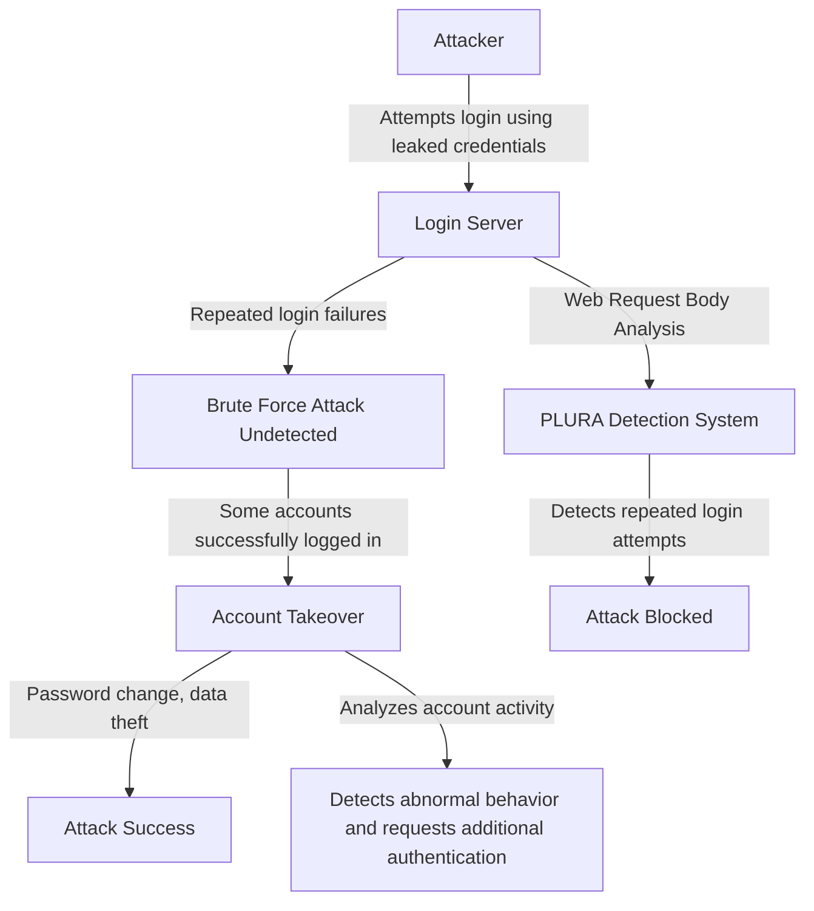

## `Case 3` Detecting Credential Stuffing Attacks

### 1️⃣ Why Traditional Threat Hunting (SIEM + EDR + NDR + TI) Fails to Detect It

| **Comparison Items** | **Traditional Threat Hunting (SIEM + EDR + NDR + TI)** | **PLURA Web Request Body Analysis + EDR** |
|----------|-------------------------------|-------------------------------|
| **Detection Method** | Static IP and User-Agent-based detection → Blocks the same IP or User-Agent but struggles to detect modified attacks | **Analyzes web request body and login patterns → Can detect and respond to repeated login attempts and account takeover attacks in real-time** |
| **Web Application Attack Detection** | Can detect an increase in failed login attempts but cannot analyze attack patterns | **Analyzes request body to detect and block automated login attempts (bot attacks)** |
| **Network Traffic Analysis** | NDR can detect traffic anomalies but cannot analyze the details of login requests | **Analyzes login request bodies to detect credential stuffing attacks** |
| **Endpoint Security** | EDR can detect malware on endpoints but struggles to correlate login patterns | **Detects account takeover attempts after login (password changes, mass data downloads, etc.)** |

---

### **2️⃣ Detailed Explanation of Why Traditional Threat Hunting Fails**  

1. **Limitations of SIEM + TI (Threat Intelligence)**  
   - Traditional SIEM and Threat Intelligence (TI) rely on **IOC (Indicator of Compromise)-based detection**,  
   - **Lacking behavior-based analysis to distinguish between automated login attempts (bot attacks) and legitimate login requests**.  
   - **Attackers can bypass detection systems by using various IPs and User-Agents for login attempts**.  

2. **Limitations of NDR (Network Detection & Response)**  
   - NDR can analyze network traffic by decrypting SSL,  
   - **But it cannot analyze login request bodies (payloads), making it difficult to detect automated login attempts by attackers**.  
   - While NDR can detect abnormal login traffic, **it cannot differentiate between a legitimate user's login attempt and an attacker's automated login requests**.  

3. **Limitations of EDR (Endpoint Detection & Response)**  
   - EDR can detect malware execution and file modifications on endpoints,  
   - **But it lacks the capability to detect automated login attacks within web applications**.  
   - **Even if an attacker successfully logs in and performs mass data downloads or account setting changes, it is difficult to detect**.  

---

### 3️⃣ Detecting Credential Stuffing Attacks with PLURA Account Takeover + EDR

✅ **1. Detecting Automated Attacks via Login Request Analysis**  
- Performs deep analysis of login request payloads to detect automated login attempts.  
- Accurately detects both rapid repeated login attempts and slow, stealthy attacks mimicking legitimate users.  

✅ **2. Detecting Account Takeover via User Behavior Analysis**  
- A normal user does not change their password multiple times or request large amounts of data within a short period.  
- Identifies abnormal actions such as password changes, account modifications, and mass data downloads for immediate response.  

✅ **3. Anomaly Detection and Preemptive Attack Prevention**  
- Provides higher detection accuracy compared to traditional SIEM systems.  
- Continuously analyzes attackers' login patterns and behaviors to detect and block sophisticated attacks like credential stuffing.  

✅ **4. Correlating Attack Flows and EDR Integration for Additional Threat Response**  
- Analyzes the sequence of attacks following account takeover and blocks related additional threats.  
- Detects and responds instantly to malicious process execution, malicious file installations, and web shell installations post-login through EDR integration.  

---

### 4️⃣ Credential Stuffing Attack Flow  

---

### **5️⃣ Conclusion: Why PLURA Web Request Body Analysis + EDR Excels in Detecting Credential Stuffing Attacks**  

✅ **Traditional threat hunting (SIEM + EDR + NDR + TI) relies on login failure counts but cannot analyze automated login attack patterns in real-time**.  
✅ **PLURA-XDR analyzes login request bodies and performs behavior-based detection, enabling the detection of automated credential stuffing attacks**.  
✅ **Applies AI-based anomaly detection to compare normal user login patterns and block abnormal login attempts**.  
✅ **Analyzes user behavior after login to detect early signs of account takeover**.  
✅ **Integrates with EDR to detect and prevent additional attacks such as malicious process execution and web shell installations post-login**.  

🔹 **PLURA-XDR is a next-generation security platform capable of detecting and blocking credential stuffing attacks in real-time, where traditional security systems fail.** 🚀

---
 
