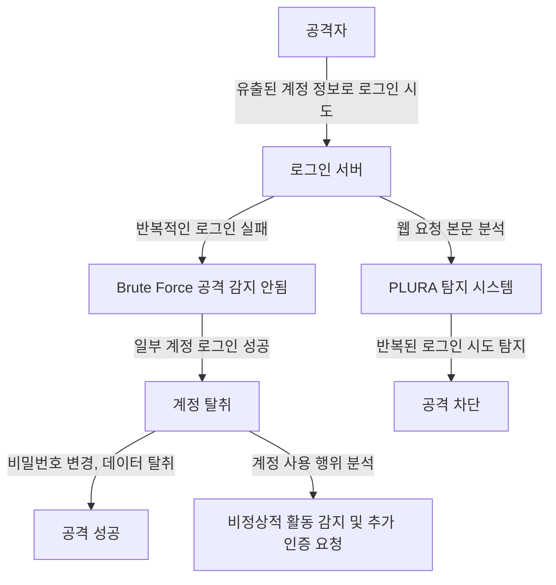

## `사례 3` 크리덴셜 스터핑(Credential Stuffing) 공격 탐지

### 1️⃣ 기존 위협 헌팅(SIEM + EDR + NDR + TI)이 탐지하지 못하는 이유

| **비교 항목** | **기존 위협 헌팅 (SIEM + EDR + NDR + TI)** | **PLURA 웹 요청 본문 분석 + EDR** |
|----------|-------------------------------|-------------------------------|
| **탐지 방식** | 정적인 IP, User-Agent 기반 탐지 → 동일한 IP 또는 User-Agent를 차단하지만 변형된 공격을 탐지하기 어려움 | **웹 요청 본문 및 로그인 패턴 분석 → 반복적인 로그인 시도 및 계정 탈취 공격 실시간 탐지 가능** |
| **웹 애플리케이션 공격 탐지** | 로그인 실패 횟수 증가를 탐지할 수 있지만, 공격 패턴을 분석하지 못함 | **요청 본문을 분석하여 자동화된 로그인 시도(봇 공격) 탐지 및 차단 가능** |
| **네트워크 트래픽 분석** | NDR이 트래픽 이상 탐지는 가능하지만 로그인 요청의 세부 내용 분석 불가 | **로그인 요청 본문을 분석하여 크리덴셜 스터핑 공격을 탐지 가능** |
| **엔드포인트 보안** | EDR이 엔드포인트 내 악성코드를 탐지 가능하지만 로그인 패턴과 연계 분석 어려움 | **로그인 후 계정 탈취 시도(비밀번호 변경, 대량 데이터 다운로드 등) 탐지 가능** |

---

### **2️⃣ 기존 위협 헌팅이 탐지하지 못하는 이유 상세 설명**  

1. **SIEM + TI(Threat Intelligence) 한계**  
   - 기존 SIEM 및 위협 인텔리전스(TI)는 **IOC(Indicator of Compromise) 기반 탐지**에 의존하므로,  
   - **자동화된 로그인 시도(봇 공격)와 정상적인 로그인 요청을 구별하는 행위 기반 분석이 부족**.  
   - **공격자가 다양한 IP, User-Agent를 사용하여 로그인 시도를 수행하면 기존 탐지 시스템을 우회 가능**.  

2. **NDR(네트워크 기반 탐지)의 한계**  
   - NDR은 SSL 복호화를 통해 네트워크 트래픽을 분석할 수 있지만,  
   - **로그인 요청 본문(payload)까지 분석하지 못하므로, 공격자의 로그인 자동화 시도를 탐지하는 데 한계가 있음**.  
   - 네트워크 단에서 비정상적인 로그인 트래픽을 감지할 수 있지만, **정상 사용자의 로그인 시도와 공격자의 자동화 로그인 요청을 구별하지 못함**.  

3. **EDR(엔드포인트 보안)의 한계**  
   - EDR은 엔드포인트에서 발생하는 악성코드 실행 및 파일 변조를 탐지할 수 있지만,  
   - **웹 애플리케이션에서 발생하는 자동화된 로그인 공격을 탐지하는 기능이 부족함**.  
   - 즉, **로그인 성공 후 공격자가 급격한 데이터 다운로드 또는 계정 설정 변경을 수행해도 탐지가 어려움**.  

---

### 3️⃣ PLURA 계정탈취 + EDR을 통한 크리덴셜 스터핑 공격 탐지 방법

✅ **1. 로그인 요청 분석을 통한 자동화 공격 탐지**
- 로그인 요청(payload)을 정밀 분석하여 자동화된 로그인 시도를 탐지합니다.
- 짧은 간격으로 반복되는 로그인 시도는 물론, 긴 간격으로 정상 사용자처럼 위장한 공격도 정확히 탐지합니다.

✅ **2. 사용자 행동 분석을 통한 계정 탈취 탐지**
- 정상 사용자는 로그인 후 짧은 시간 내에 비밀번호를 여러 번 변경하거나 대량의 데이터를 요청하지 않습니다.
- 비밀번호 변경, 계정정보 수정, 대량 데이터 다운로드 등 비정상 행위를 식별하여 즉각 대응합니다.

✅ **3. 이상 탐지 및 공격 사전 차단**
- 기존 SIEM 시스템보다 높은 탐지 정확성을 제공합니다.
- 공격자의 로그인 패턴과 행동을 지속적으로 분석하여 크리덴셜 스터핑과 같은 정교한 공격을 사전에 탐지하고 차단합니다.

✅ **4. 공격 흐름 상관 분석 및 EDR 연계를 통한 추가 공격 대응**
- 계정 탈취 이후 발생하는 연속된 공격 흐름을 분석하고, 연관된 추가 공격을 차단합니다.
- 로그인 성공 후 발생하는 악성 프로세스 실행, 악성 파일 설치, 웹쉘 설치 등의 위협도 EDR 연계로 즉시 탐지하고 대응합니다.

---

### 4️⃣ 크리덴셜 스터핑 공격 흐름

---

### **5️⃣ 결론: PLURA 웹 요청 본문 분석 + EDR이 크리덴셜 스터핑 공격 탐지에서 뛰어난 이유**  

✅ **기존 위협 헌팅(SIEM + EDR + NDR + TI)은 로그인 실패 횟수를 기반으로 탐지하지만, 자동화된 로그인 공격 패턴을 실시간으로 분석하지 못함**.  
✅ **PLURA-XDR은 로그인 요청 본문을 분석하고 행위 기반 탐지를 수행하여, 자동화된 크리덴셜 스터핑 공격을 탐지 가능**.  
✅ **AI 기반 이상 탐지를 적용하여, 정상 사용자의 로그인 패턴과 비교 후 비정상적인 로그인 시도를 차단 가능**.  
✅ **로그인 성공 후 사용자의 행동을 분석하여, 비정상적인 계정 탈취 시도를 조기에 탐지 가능**.  
✅ **PLURA는 EDR과 연계하여, 로그인 후 악성 프로세스 실행 및 웹쉘 설치 여부까지 탐지하여 추가 공격 차단 가능**.  

🔹 **PLURA-XDR은 기존 보안 체계가 탐지하지 못하는 크리덴셜 스터핑 공격을 실시간으로 탐지하고 차단할 수 있는 차세대 보안 플랫폼입니다.** 🚀  

---
 
