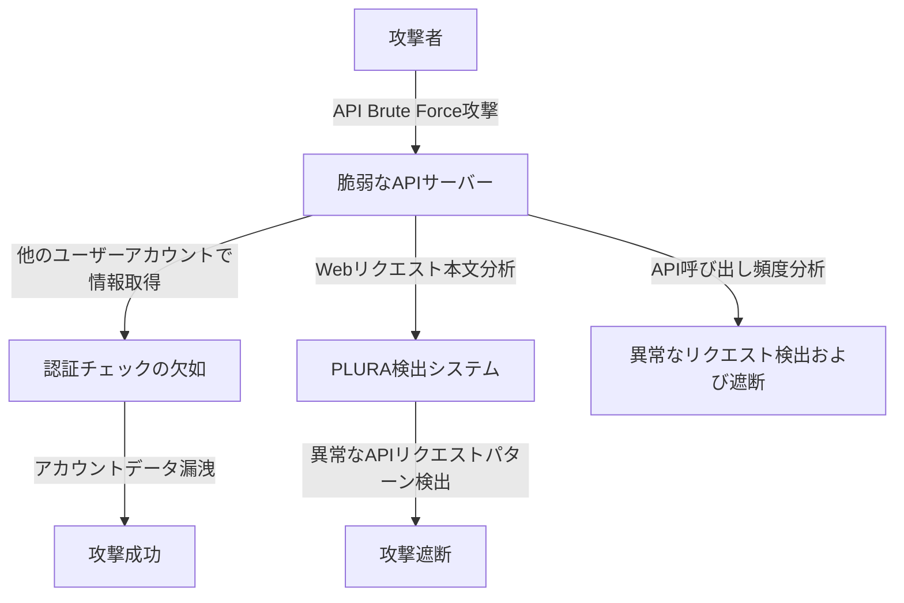

## `事例 2` API脆弱性の悪用 (Zero-Day API Attack)   

### **1️⃣ 既存の脅威ハンティング(SIEM + EDR + NDR + TI)が検出できない理由**  

| **比較項目** | **既存の脅威ハンティング (SIEM + EDR + NDR + TI)** | **PLURA Webリクエスト本文分析 + EDR** |
|----------|-------------------------------|-------------------------------|
| **検出方式** | ルールベースの検出、異常トラフィックの検出は可能だが、詳細なWebリクエスト本文の分析は不可 | **Webリクエスト本文とユーザー行動分析に基づく検出が可能** |
| **Webアプリケーション攻撃の検出** | APIリクエストヘッダー、URL分析は可能だがリクエスト本文の分析は不可 | **APIリクエスト本文を分析し、API Abuseや異常なリクエストを検出可能** |
| **ネットワークトラフィック分析** | NDRがSSL復号後のトラフィック分析は可能だが、API呼び出しの内容まで分析できない | **APIリクエスト本文を詳細に分析し、認証回避や権限昇格の試行を検出可能** |
| **エンドポイントセキュリティ** | EDRがエンドポイント内のマルウェアやプロセス実行の検出は可能だが、APIリクエストとの相関分析は困難 | **WebサーバーのAPI呼び出しパターンを検出し、データ漏洩の可能性を分析してブロック可能** |

### **2️⃣ 既存の脅威ハンティングが検出できない理由の詳細説明**  

1. **SIEM + TI(Threat Intelligence)の限界**  
   - 既存のSIEMおよび脅威インテリジェンス(TI)は **IOC(Indicator of Compromise)ベースの検出**に依存しているため、  
   - 新たなAPI脆弱性を悪用する **Zero-Day攻撃の検出が困難であり、正常なAPIリクエストと悪意のあるAPIリクエストを区別する行動ベースの検出が不足**。  
   - 攻撃者が **既存の既知の脆弱性ではなく、新しいAPIエンドポイントを悪用する場合、検出が困難**。  

2. **NDR(ネットワークベースの検出)の限界**  
   - NDRはSSL復号を通じてネットワークトラフィックを分析できるが、  
   - **APIリクエスト本文(payload)までは分析できないため、悪意のあるAPI呼び出しの検出には限界がある**。  
   - ネットワークレベルでAPIトラフィックの異常を検出できても、**API内部データの改ざん（例：User IDの変更、Role変更、OAuthトークンの悪用など）は検出できない**。  

3. **EDR(エンドポイントセキュリティ)の限界**  
   - EDRはエンドポイントで発生するマルウェアの実行やファイル改ざんの検出は可能だが、  
   - **Webアプリケーションで発生するAPI悪用や認証回避攻撃の検出機能が不足**。  
   - APIリクエストが正常に見える場合、**攻撃者がアカウントを乗っ取ったり、データを漏洩しようとしても検出が困難**。  

---

### **3️⃣ PLURA Webリクエスト本文分析 + EDRによる検出方法**  

✅ **1) APIリクエスト本文を分析し、異常なリクエストパターンを検出**  
   - **PLURAはAPIリクエストの本文(payload)を詳細に分析**し、  
   - **攻撃者が特定のUser IDを変更しながら過剰なAPIリクエストを送信するパターンを検出可能**。  
   - 正常なAPI呼び出しと比較し、**異常なパラメータ改ざん（例：権限昇格の試行、データ取得範囲の変更など）を検出可能**。  

✅ **2) Webアプリケーションログとユーザー行動データの相関分析**  
   - 正常なユーザーは `GET /api/getUserData?userId=1234` のリクエストを1回だけ実行するが、  
     - 攻撃者は `userId` を変更して繰り返しリクエスト (`GET /api/getUserData?userId=5678`、`userId=91011` など)。  
   - **このような異常なアクセスパターンを分析し、自動検出およびブロックが可能**。  

✅ **3) EDRを活用した追加のセキュリティ検出**  
   - APIを悪用してWebサーバーに悪意のあるペイロードがアップロードされた場合、  
   - **ファイル整合性(FIM, File Integrity Monitoring)機能を通じてWebサーバーファイルが改ざんされた場合、即時検出が可能**。  

✅ **4) 攻撃の流れを相関分析し、追加攻撃をブロック**  
   - **ログデータ、APIリクエストパターン、ユーザー活動データを組み合わせて、認証回避やデータ漏洩を検出・遮断可能**。  

---

### **4️⃣ API脆弱性悪用攻撃の流れ**  

---

### **5️⃣ 結論: PLURA Webリクエスト本文分析 + EDRがAPI脆弱性検出に優れている理由**  
✅ **既存の脅威ハンティング(SIEM + EDR + NDR + TI)はAPIリクエストのヘッダーおよびURLのみを分析し、本文の分析ができないため、新しいAPI脆弱性(Zero-Day Attack)の検出が困難**。  
✅ **PLURA-XDRはAPIリクエスト本文を分析し、行動ベースの検出を行うことで、認証回避、権限昇格、API Abuse攻撃をリアルタイムで検出可能**。  
✅ **ネットワークトラフィック分析(NDR)では検出できないAPI内部のリクエストパターンまで分析可能**。  
✅ **攻撃者が既存のルールを回避し、新しいAPIリクエストを変形させたとしても、異常な行動を検出しAPI Abuseを遮断可能**。  

🔹 **PLURA-XDRは、既存のセキュリティシステムが検出できないAPI脆弱性攻撃をリアルタイムで検出し遮断できる次世代セキュリティプラットフォームです。** 🚀  

---
