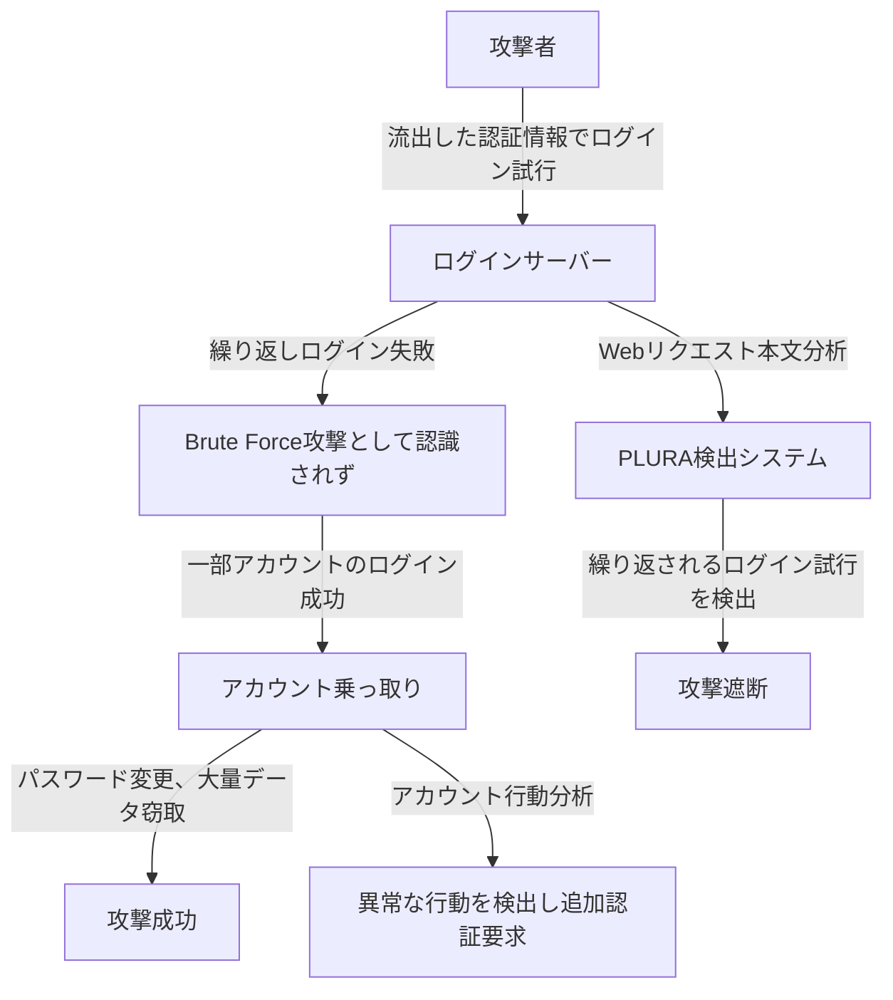

## `事例 3` クレデンシャルスタッフィング（Credential Stuffing）攻撃の検出

### 1️⃣ 既存の脅威ハンティング（SIEM + EDR + NDR + TI）が検出できない理由

| **比較項目** | **既存の脅威ハンティング（SIEM + EDR + NDR + TI）** | **PLURA Webリクエスト本文分析 + EDR** |
|----------|-------------------------------|-------------------------------|
| **検出方式** | 静的なIP、User-Agentベースの検出 → 同じIPまたはUser-Agentをブロックするが、変化する攻撃を検出するのが困難 | **Webリクエスト本文およびログインパターン分析 → 繰り返しのログイン試行やアカウント乗っ取り攻撃をリアルタイムで検出可能** |
| **Webアプリケーション攻撃の検出** | ログイン失敗回数の増加は検出できるが、攻撃パターンの分析は不可 | **リクエスト本文を分析し、自動化されたログイン試行（ボット攻撃）の検出および遮断が可能** |
| **ネットワークトラフィック分析** | NDRは異常なトラフィックを検出できるが、ログインリクエストの詳細な内容分析は不可 | **ログインリクエストの本文を分析し、クレデンシャルスタッフィング攻撃を検出可能** |
| **エンドポイントセキュリティ** | EDRはエンドポイント内のマルウェアを検出可能だが、ログインパターンとの関連分析が困難 | **ログイン後のアカウント乗っ取り試行（パスワード変更、大量データダウンロードなど）を検出可能** |

---

### **2️⃣ 既存の脅威ハンティングが検出できない理由 詳細説明**  

1. **SIEM + TI（Threat Intelligence）の限界**  
   - 既存のSIEMおよび脅威インテリジェンス（TI）は **IOC（Indicator of Compromise）ベースの検出**に依存しているため、  
   - **自動化されたログイン試行（ボット攻撃）と正常なログインリクエストを区別する行動ベースの分析が不足**。  
   - **攻撃者が異なるIPやUser-Agentを使用してログイン試行を行うと、既存の検出システムを回避可能**。  

2. **NDR（ネットワークベースの検出）の限界**  
   - NDRはSSL復号を通じてネットワークトラフィックを分析できるが、  
   - **ログインリクエスト本文（payload）までは分析できないため、攻撃者のログイン自動化試行を検出するのが困難**。  
   - ネットワーク層で異常なログイントラフィックを検出できても、**正常なユーザーのログイン試行と攻撃者の自動化されたログインリクエストを区別できない**。  

3. **EDR（エンドポイントセキュリティ）の限界**  
   - EDRはエンドポイントで発生するマルウェア実行やファイル改ざんを検出できるが、  
   - **Webアプリケーション上で発生する自動化されたログイン攻撃を検出する機能が不足**。  
   - つまり、**ログイン成功後に攻撃者が急激にデータをダウンロードしたり、アカウント設定を変更しても検出が難しい**。  

---

### 3️⃣ PLURA アカウント乗っ取り + EDR によるクレデンシャルスタッフィング攻撃の検出方法

✅ **1. ログインリクエスト分析による自動化攻撃の検出**
- ログインリクエスト（payload）を精密に分析し、自動化されたログイン試行を検出します。
- 短い間隔で繰り返されるログイン試行だけでなく、長い間隔をあけて正常ユーザーを装った攻撃も正確に検出します。

✅ **2. ユーザー行動分析によるアカウント乗っ取り検出**
- 正常なユーザーはログイン後、短時間で複数回パスワードを変更したり、大量のデータをリクエストすることはありません。
- パスワード変更、アカウント情報修正、大量データダウンロードなどの異常行動を特定し、即座に対応します。

✅ **3. 異常検出および攻撃の事前遮断**
- 既存のSIEMシステムより高精度な検出を提供します。
- 攻撃者のログインパターンと行動を継続的に分析し、クレデンシャルスタッフィングのような巧妙な攻撃を事前に検出・遮断します。

✅ **4. 攻撃フローの相関分析およびEDR連携による追加攻撃対策**
- アカウント乗っ取り後に発生する一連の攻撃フローを分析し、関連する追加攻撃を遮断します。
- ログイン成功後に発生する悪意のあるプロセス実行、マルウェア配布、Webシェル設置などの脅威もEDRと連携し即座に検出・対応します。

---

### 4️⃣ クレデンシャルスタッフィング攻撃の流れ

---

### **5️⃣ 結論: PLURA Webリクエスト本文分析 + EDRがクレデンシャルスタッフィング攻撃検出で優れている理由**  

✅ **既存の脅威ハンティング（SIEM + EDR + NDR + TI）はログイン失敗回数を基に検出するが、自動化されたログイン攻撃パターンをリアルタイムで分析できない**。  
✅ **PLURA-XDRはログインリクエスト本文を分析し、行動ベースの検出を行うことで、自動化されたクレデンシャルスタッフィング攻撃を検出可能**。  
✅ **AIベースの異常検出を適用し、正常ユーザーのログインパターンと比較し、不正なログイン試行を遮断可能**。  
✅ **ログイン成功後のユーザー行動を分析し、異常なアカウント乗っ取り試行を早期に検出可能**。  
✅ **PLURAはEDRと連携し、ログイン後のマルウェア実行やWebシェル設置まで検出し、追加攻撃を遮断可能**。  

🔹 **PLURA-XDRは、既存のセキュリティシステムが検出できないクレデンシャルスタッフィング攻撃をリアルタイムで検出・遮断できる次世代セキュリティプラットフォームです。** 🚀

---
 
