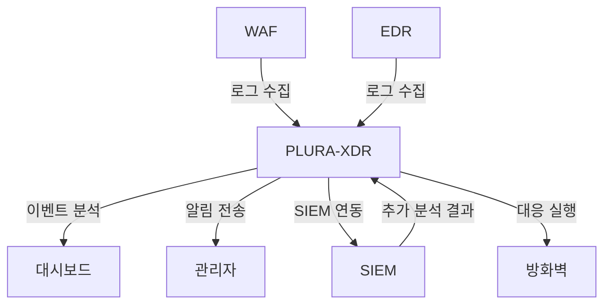

## **4. 보안 운영 효율화**  

PLURA-XDR은 보안 운영의 복잡성을 줄이고 생산성을 극대화할 수 있도록 설계되었습니다. 직관적인 대시보드, 실시간 로그 및 분석 결과 제공을 통해 **보안 관리자**는 빠르고 정확한 의사 결정을 내릴 수 있습니다. 이는 불필요한 리소스 낭비를 줄이고, 보안 운영의 효율성을 크게 향상시킵니다.

---

### **보안 운영 효율화의 주요 요소**  

#### **1. 직관적인 로그 관리 및 시각화**  
PLURA-XDR은 대량의 로그 데이터를 관리하기 위해 강력한 시각화 도구를 제공합니다.  
- **로그 데이터의 통합 관리:**  
  - 다양한 소스(WAF, EDR, SIEM 등)로부터 수집된 로그를 한 곳에서 관리.  
  - 로그 데이터는 공격 유형, 발생 위치, 시간대 등으로 분류하여 가독성을 높임.  

- **대시보드 및 실시간 시각화:**  
  - 실시간으로 공격 탐지 현황, 이벤트 통계, 시스템 상태를 모니터링 가능.  
  - 주요 데이터를 그래프, 차트, 히트맵 등으로 시각화하여 정보 전달력 강화.  
  - **예:**  
    - 공격 유형별 탐지 현황(예: SQL Injection 45%, XSS 30%, Credential Stuffing 25%).  
    - 시간대별 이벤트 발생 그래프(공격 집중 시간 파악).  

#### **2. 스마트 알림 시스템**  
보안 관리자가 즉각적으로 대응할 수 있도록 효율적인 알림 시스템을 제공합니다.  
- **알림 우선순위 설정:**  
  - 심각도 및 이벤트 유형에 따라 알림을 분류하여 중요 이벤트에 집중 가능.  
  - **예:**  
    - 심각도 높은 공격: 즉시 관리자 알림 전송.  
    - 일반적인 이벤트: 요약 보고서 생성 후 전달.  

- **다양한 알림 채널 지원:**  
  - 이메일, SMS, 협업 도구(Slack, Microsoft Teams 등)를 통한 알림 전송.  
  - 예: Credential Stuffing 탐지 시 즉시 Slack 채널로 알림 전송.  

---

### **운영 효율성을 높이는 PLURA-XDR의 주요 기능**  

#### **1. 자동화된 분석 및 보고서 생성**  
PLURA-XDR은 수동 분석 작업을 줄이고, 중요한 정보를 한눈에 파악할 수 있도록 자동화된 분석 및 보고서를 제공합니다.  
- **주요 기능:**  
  - 일간, 주간, 월간 보고서 자동 생성.  
  - 로그 데이터를 기반으로 공격 패턴 및 트렌드 분석.  
  - 관리자 맞춤형 보고서 제공: 관심 있는 데이터만 필터링하여 출력 가능.  
  - **예:**  
    - 지난 주 웹 애플리케이션 공격 통계.  
    - 특정 IP의 활동 내역 요약 보고서.  

#### **2. SIEM 및 SOAR와의 원활한 연동**  
PLURA-XDR은 SIEM, SOAR와 완벽히 통합되어 보안 운영팀의 워크플로를 간소화합니다.  
- **SIEM 연동:**  
  - PLURA-XDR에서 탐지된 이벤트 데이터를 SIEM으로 전송하여 추가적인 상관 분석 수행.  
- **SOAR 연동:**  
  - PLURA-XDR의 분석 결과를 활용하여 자동화된 대응 프로세스 실행.  
  - 예: 탐지된 공격에 대해 방화벽 규칙 업데이트, 침입 탐지 시스템(IDS) 설정 변경 등.  

#### **3. 운영 리소스 절감**  
PLURA-XDR의 자동화 및 통합 기능은 보안 관리자의 수작업을 줄이고 운영 효율성을 극대화합니다.  
- **효율성 향상 예시:**  
  - 기존: 로그 데이터를 수작업으로 분석하고, 공격 여부를 판단.  
  - PLURA-XDR 도입 후: 탐지된 로그 데이터를 자동으로 분석하고, 관리자에게 요약 제공.  

---

### **보안 운영 효율화의 실제 시나리오**

#### **시나리오: 보안 관리자 대응 프로세스 최적화**  

1. **실시간 로그 수집 및 분석:**  
   - PLURA-XDR이 WAF와 EDR 로그 데이터를 실시간으로 수집.  
   - SQL Injection 및 Credential Stuffing 시도 탐지.  

2. **자동화된 대시보드 업데이트:**  
   - 주요 이벤트가 대시보드에 실시간으로 업데이트.  
   - 탐지된 공격은 심각도에 따라 분류되어 관리자에게 표시.  

3. **스마트 알림 및 보고:**  
   - SQL Injection 탐지 → 이메일 및 Slack 알림 전송.  
   - 요약 보고서를 자동 생성하여 관리자에게 제공.  

4. **SIEM 연동을 통한 추가 분석:**  
   - 탐지된 이벤트가 SIEM으로 전송되어 상관 분석 수행.  
   - 다단계 공격 여부를 파악하고 추가 대응 전략 수립.  

5. **최종 대응 및 개선:**  
   - PLURA-XDR은 탐지 룰을 업데이트하고, 공격 IP를 차단.  
   - 보고된 데이터를 기반으로 추가적인 탐지 패턴 강화.  

#### **Mermaid 다이어그램**  

---

### **PLURA-XDR의 보안 운영 효율화로 얻는 주요 이점**  
1. **의사 결정 시간 단축:**  
   - 직관적인 시각화와 자동화된 보고를 통해 빠르게 위협 판단 가능.  
2. **운영 리소스 절감:**  
   - 수작업 분석 및 대응을 자동화하여 보안 팀의 업무 부담 감소.  
3. **보안 운영 생산성 극대화:**  
   - 반복적인 작업을 자동화하여 보안 팀이 더 중요한 작업에 집중할 수 있도록 지원.  
4. **최상의 대응 체계 구축:**  
   - SIEM 및 SOAR와의 연동을 통해 강력한 대응 체계를 마련.  

이를 통해 PLURA-XDR은 보안 운영의 새로운 기준을 제시하며, 조직의 사이버 보안 수준을 한 단계 높일 수 있습니다.  
