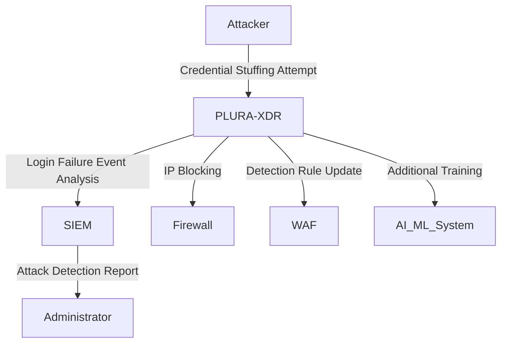

## **3. 공격 탐지 및 자동화된 대응**  

PLURA-XDR은 고도화된 **공격 탐지 알고리즘**과 **자동화된 대응 시스템**을 통해 해킹 시도를 실시간으로 차단합니다. 반복적인 해킹 시도와 새로운 공격에도 효과적으로 대응할 수 있는 **지능형 방어 시스템**을 제공합니다. 이를 통해 조직은 보다 안전하고 효율적인 보안 환경을 구축할 수 있습니다.

---

### **공격 탐지 및 자동화된 대응의 주요 단계**  

#### **1. 공격 탐지 (Detection)**  
PLURA-XDR은 다양한 데이터 소스에서 발생한 이벤트를 분석하고, 위협 여부를 실시간으로 탐지합니다.  
- **탐지 가능한 이벤트**:  
  - WAF에서 놓친 웹 애플리케이션 공격 (SQL Injection, XSS, Credential Stuffing 등).  
  - 네트워크 이상 트래픽 (DDoS, Port Scanning, Data Exfiltration 등).  
  - 시스템 로그에서 발견된 비정상적인 권한 상승 시도.  
- **탐지 알고리즘**:  
  - **시그니처 기반 탐지:** 기존의 알려진 위협 패턴 탐지.  
  - **행동 기반 탐지:** 비정상적인 사용자 행동 패턴 식별.  
  - **AI/ML 기반 탐지:** 새로운 위협 및 제로데이 공격 탐지.  

---

#### **2. 자동화된 대응 (Automated Response)**  
PLURA-XDR은 탐지된 공격에 대해 **실시간 자동화된 보안 조치**를 수행합니다.  
- **대응 조치 유형:**  
  1. **IP 차단:**  
     - 탐지된 공격자의 IP를 즉시 차단하여 추가적인 접근 방지.  
     - 예: Credential Stuffing을 시도한 IP가 다수의 실패한 로그인 시도를 하면 차단.  

  2. **탐지 룰 업데이트:**  
     - 새로운 위협이 탐지되면 탐지 룰을 자동으로 생성 및 업데이트하여, 향후 동일한 공격 차단.  
     - 예: 변형된 SQL Injection 코드가 탐지되면 해당 패턴을 탐지 룰에 추가.  

  3. **알림 및 보고:**  
     - 관리자에게 이메일 또는 대시보드 알림을 통해 탐지된 공격과 수행된 대응 조치 보고.  
     - 예: 특정 시간대에 집중된 공격에 대한 상세 보고서 전송.  

  4. **대응 프로세스 자동화:**  
     - SIEM 및 SOAR(Security Orchestration, Automation, and Response)와 연동하여, 다단계 보안 프로세스를 자동화.  
     - 예: 공격 탐지 → 취약점 스캔 → 방화벽 룰 업데이트.  

---

### **지능형 방어 시스템 (Intelligent Defense System)**  
PLURA-XDR은 단순한 탐지와 차단을 넘어, 반복적이고 고도화된 해킹 시도에도 지속적으로 대응할 수 있는 **지능형 방어 시스템**을 제공합니다.  

#### **1. 반복적인 공격 방어**  
- 동일 공격자가 IP를 변경하거나 새로운 변형된 코드를 사용할 경우에도 탐지 및 대응 가능.  
- **IP, User-Agent, Cookie, Referer** 등을 기준으로 탐지 패턴 업데이트.  
- **예:**  
  - 크리덴셜 스터핑 공격 후 SQL Injection 시도가 이어지는 경우, 다단계 탐지 및 차단.  

#### **2. 지속적 학습 및 강화**  
- 저장된 웹 트래픽 및 로그 데이터를 기반으로 공격 패턴을 학습하여 방어 역량 강화.  
- **AI/ML 모델 학습:**  
  - 정상 트래픽과 비정상 트래픽 간의 차이점을 학습하여 새로운 공격 패턴 탐지.  

#### **3. 다단계 공격 방어**  
- 복잡한 APT 공격, 크리덴셜 스터핑, 데이터 유출과 같은 다단계 공격에도 효과적으로 대응.  
- SIEM 연동을 통해 상관 분석 결과를 바탕으로 공격 단계를 식별하고, 각 단계에서 적절한 조치를 수행.  

---

### **공격 탐지 및 자동화된 대응의 시나리오**

#### **시나리오: 반복적인 크리덴셜 스터핑 공격 탐지 및 대응**  

1. **공격 탐지:**  
   - 동일 IP에서 다수의 로그인 시도 실패 이벤트 탐지.  
   - 특정 시간 내에 발생한 이벤트를 분석하여 Credential Stuffing 시도로 판단.  

2. **자동화된 대응:**  
   - 공격자 IP를 즉시 차단하여 추가적인 로그인 시도 방지.  
   - 탐지된 이벤트를 SIEM에 기록하고 보고서를 생성.  
   - 새로운 탐지 룰 생성: **"로그인 실패 횟수 초과 시 IP 차단"**.  

3. **추후 학습:**  
   - AI/ML 기반 분석을 통해 변형된 Credential Stuffing 공격 패턴을 학습.  
   - 향후 공격을 방지하기 위한 탐지 역량 강화.  

#### **Mermaid 다이어그램**  

---

### **PLURA-XDR의 가치: 자동화된 보안 환경 구축**  

PLURA-XDR은 다음과 같은 강점을 통해 조직의 보안 환경을 강화합니다:  
1. **지속적인 위협 대응:**  
   - 반복적인 해킹 시도에도 실시간으로 대응하여 지속적인 보호 제공.  
2. **운영 효율성 향상:**  
   - 보안 운영팀의 수동 개입을 최소화하고, 대응 속도 및 정확성을 향상.  
3. **확장 가능한 방어 체계:**  
   - AI/ML 기반 학습을 통해 새로운 위협에도 빠르게 대응 가능.  

이를 통해 PLURA-XDR은 기존 보안 체계의 한계를 보완하고, 완벽한 해킹 방어 시스템을 제공합니다.  
