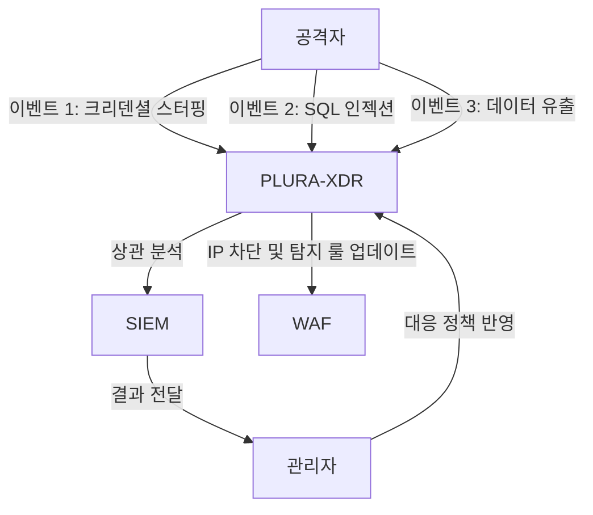

## **2. 실시간 상관 분석**  
PLURA-XDR은 SIEM(Security Information and Event Management)과 연동하여 **실시간 상관 분석**을 수행함으로써 단일 패킷 탐지가 어려운 **지속적이고 은밀한 공격**을 효과적으로 탐지합니다. 이를 통해 조직은 보다 정교하고 지능적인 보안 체계를 구축할 수 있습니다.

---

### **실시간 상관 분석의 핵심 요소**  

#### **1. 이벤트 데이터의 통합 수집**  
PLURA-XDR은 다양한 보안 장비 및 애플리케이션으로부터 이벤트 데이터를 수집하고 이를 통합합니다.  
- **수집 가능한 데이터 소스**  
  - 웹 방화벽(WAF), EDR, 네트워크 장비(방화벽, IPS, IDS 등), 애플리케이션 로그, 시스템 로그, 클라우드 서비스 로그 등.  
- **데이터 통합 및 정규화**  
  - 모든 데이터를 표준화하여 분석 가능하게 정리하며, 다양한 포맷(JSON, XML, CSV 등)을 지원.  

#### **2. 연관성 규칙 기반의 분석**  
수집된 이벤트 데이터를 분석하여 다양한 위협 요소 간의 연관성을 파악합니다.  
- **탐지 방법:**  
  - **이벤트 간의 시간적 관계**: 동일한 IP에서 일정 시간 내 반복적으로 발생하는 이벤트를 분석.  
    - 예) 동일 IP가 웹 로그인 실패 후 짧은 시간 내 데이터 다운로드 시도.  
  - **패턴 기반 상관 분석**: 공격 패턴을 시그니처로 정의하고, 다단계 공격 여부를 판단.  
    - 예) SQL 인젝션 시도 → 권한 상승 → 데이터 유출.  
  - **이상 탐지 기반 상관 분석**: 정상적인 행동 패턴과 비교하여 비정상적인 활동 탐지.  
    - 예) 한 사용자가 일반적으로 접근하지 않는 시스템에 대량 요청.  

---

### **실시간 상관 분석의 주요 기능**  

#### **1. 지속적이고 은밀한 공격 탐지**  
PLURA-XDR은 단일 패킷이나 이벤트로는 탐지할 수 없는 **APT(Advanced Persistent Threat)** 및 **제로데이 공격**에 대응합니다.  
- **APT 공격 대응:**  
  - 침투 후 장기적으로 지속되는 은밀한 공격 패턴 식별.  
  - 다단계 공격 시나리오 분석 및 탐지.  

#### **2. 보안 이벤트의 우선순위 지정**  
PLURA-XDR은 SIEM과 연동하여 탐지된 이벤트의 심각도를 분석하고 우선순위를 지정합니다.  
- **심각도 기준:**  
  - 데이터 유출 가능성.  
  - 시스템에 미치는 잠재적 영향.  
  - 기존 규칙과의 상관성.  
- **우선순위 별 대응 전략:**  
  - 높은 심각도: 즉각적인 자동 차단 및 관리자 알림.  
  - 중간 심각도: 탐지 룰 업데이트 및 추가적인 분석 수행.  
  - 낮은 심각도: 로그 저장 및 추후 검토.  

#### **3. 방어 전략의 실시간 적용**  
PLURA-XDR은 상관 분석 결과를 기반으로 즉각적인 보안 조치를 수행합니다.  
- **자동화된 대응 조치:**  
  - 공격자 IP 차단.  
  - 새로운 탐지 룰 생성 및 배포.  
  - 관련 시스템에서 취약점 점검 수행.  
- **지속적인 탐지 강화:**  
  - 새로운 위협 정보(Threat Intelligence)와 연동하여 탐지 역량 강화.  
  - SIEM을 통해 학습된 데이터를 기반으로 대응 정책 업데이트.  

---

### **실시간 상관 분석으로 탐지 가능한 주요 위협**  
1. **크리덴셜 스터핑(Credential Stuffing)**  
   - 다수의 사용자 계정에 대해 공격 시도를 지속하는 패턴 식별.  
2. **데이터 유출 공격**  
   - 다단계 공격으로 데이터베이스 접근 후 대량 데이터 다운로드 시도 탐지.  
3. **멀티 벡터 공격**  
   - 동일한 공격자가 여러 시스템을 통해 다양한 공격 기법을 사용하는 경우 식별.  
4. **권한 상승 공격**  
   - 낮은 권한에서 시작하여 높은 권한을 얻으려는 공격 패턴 탐지.  

---

### **실시간 상관 분석을 활용한 보안 대응 시나리오**  

#### **시나리오: 다단계 공격 탐지 및 차단**  

1. **단계 1: 이벤트 발생 및 수집**  
   - 동일 IP에서 크리덴셜 스터핑 시도 탐지.  
   - 동일 IP에서 SQL 인젝션 탐지.  
   - 데이터 유출 공격 시도 탐지.  

2. **단계 2: 상관 분석 수행**  
   - 크리덴셜 스터핑 성공 → SQL 인젝션 시도 → 데이터 유출 공격 시도로 이어지는 상관성 확인.  

3. **단계 3: 실시간 보안 조치**  
   - 공격자 IP를 즉시 차단.  
   - SIEM에 이벤트를 기록하고 추가 상관 분석 수행.  
   - 탐지 룰 업데이트 및 관리자 알림 전송.  

4. **단계 4: 추후 분석 및 대응 강화**  
   - 저장된 로그 데이터를 기반으로 추가적인 공격 시도 식별.  
   - 새로운 탐지 룰 생성 및 배포.  

---

### **Mermaid 다이어그램**  

---

PLURA-XDR의 실시간 상관 분석은 단일 이벤트 탐지를 넘어 다단계 위협 탐지와 실시간 대응을 가능하게 합니다. 이를 통해 기존의 보안 체계를 강화하고 조직의 보안 수준을 한 단계 높일 수 있습니다.
