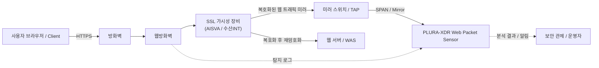

## 📖 SSL 가시성 장비와 PLURA-XDR 패킷 분석 엔진을 통한 웹 공격 재탐지 구성 문서

가시성 장비 예시:
  - AISVA (Application Insight SSL Visibility Appliance)
  - 수산INT SSL 가시성 장비 (SSL Visibility Appliance 계열)

---

## 1. 개요: SSL 가시성 + PLURA 웹 패킷 분석 통합

SSL 가시성 장비는 HTTPS 트래픽을 복호화하여 보안 장비가 내부 내용을 분석할 수 있도록 해 주는 장비입니다.

PLURA-XDR는 SSL 가시성 장비와 연동하여 **복호화된 웹 패킷을 미러 포트로 수집·분석**함으로써,

- **웹방화벽(WAF)이 통과시킨 공격**
- **정책 예외로 인해 차단되지 못한 요청**
- **최신 AI 기반 우회 공격**

까지 탐지·분석하고, **증적화·포렌식까지 자동 수행**하는 것을 목표로 합니다.

---

## 2. 특별한 환경에서 WAF 운영 시 발생하는 한계

일부 서비스/고객 환경에서는 WAF를 이상적으로 운영하기 어려워, 실제로 다음과 같은 한계가 발생합니다.

### 2-1. WAF가 공격을 놓치는 주요 원인

1. **예외처리(Whitelist, Policy Bypass)**
   - 특정 URL, 파라미터, 클라이언트 IP에 대해 업무 영향 최소화를 위해 예외 적용
   - → **사실상 WAF 미적용 구간**이 되어 공격이 그대로 통과

2. **시그니처 업데이트 미비**
   - 정책 반영 지연, 유지보수 이슈로 시그니처 업데이트 누락
   - → 최신 취약점 및 공격 패턴 탐지 불가

3. **운영자 실수·설정 오류**
   - 테스트 후 룰 복구 누락
   - 정책 우선순위 오류로 **실질적으로 무효화된 룰** 발생
   - → 로그조차 남지 않는 **블라인드 존** 생성

4. **신규 서비스/URL 반영 지연**
   - 빠르게 증가하는 API·모바일·SPA 경로가 WAF 정책 반영 이전에 운영됨
   - → 신규 경로는 **WAF가 인지하지 못하는 상태**

5. **성능 이슈로 인한 룰 축소**
   - TPS/Latency 문제로 탐지 룰 감소, 탐지 레벨 완화
   - → **서비스 가용성 우선 → 탐지 품질 저하**

6. **암호화·라우팅 우회 패턴**
   - 인코딩 변형, 분할 전송, 프록시 우회 등으로 비정상 경로 유입
   - → WAF 기준으로는 **트래픽 자체를 보지 못함**

---

## 3. AI 시대의 웹 공격 고도화

최근 공격자는 AI를 적극 활용하여 WAF를 우회하는 다양한 방법을 사용합니다.

- **Payload 자동 변형(Polymorphic Payload)**
- **WAF 시그니처 회피 패턴 자동 생성**
- **대량 자동화 공격 테스트(AI-driven fuzzing)**

이러한 환경에서는,

> **“WAF 로그에 없으니 안전하다”는 전제가 더 이상 유효하지 않습니다.**

따라서 **WAF를 통과한 웹 패킷을 별도로 분석하는 체계가 필수적**입니다.

---

## 4. SSL 가시성 장비의 역할과 배치 위치

### 4-1. SSL 복호화 장비가 필요한 이유

- HTTPS 기반 트래픽은 **암호화**되어 있어 일반 미러링으로는  
  **URI / QueryString / Cookie / POST-Body** 등을 확인할 수 없음
- SSL 가시성 장비는 트래픽을 **복호화 후 재암호화**하여 서버로 전달하며,
  동시에 **복호화된 평문을 미러 형태로 PLURA에 제공**

### 4-2. 왜 “웹방화벽 뒤”에 위치해야 하는가?

PLURA의 목적은 **WAF 통과 공격 재탐지**입니다.

- **WAF 앞단 배치 시 문제점**
  - PLURA가 WAF 차단 전 트래픽만 수집
  - → “차단된 공격”과 “통과된 공격” 구분 불가

- **WAF 뒤단 배치가 최적 구성** ✅
  - 클라이언트 → WAF → SSL 가시성 장비(복호화) → WAS
  - 복호화된 트래픽을 PLURA가 미러링하여 분석
  - → **WAF 미탐/우회 공격을 정확하게 포착**

---

## 5. PLURA가 제공하는 핵심 가치 (SSL 가시성 연동 시)

### 5-1. WAF 통과 공격 전용 “2차 방어선”

- WAF 이후 트래픽을 PLURA가 수집  
- 예외/미비/오류로 인해 놓친 공격을 **전문 탐지 엔진 + AI**로 재검증  
- WAF + PLURA 조합으로 **탐지 → 추적 → 증적화** 플로우 완성

### 5-2. 복호화된 웹 패킷 기반 정밀 분석

- Request Line, Header, 파라미터, Cookie, POST-Body 분석
- JSON·XML·Nexacro·multipart 등 포맷 파싱
- POST-Body 기반 웹셸 업로드·SQLi·RCE 공격까지 분석 가능

### 5-3. AI 기반 WAF 우회 공격 탐지

- WAF 로그 + PLURA 패킷 비교 분석  
- 변종 패턴을 AI가 자동 식별  
- `status 406`, `Blocked: 1` 등 **WAF 차단 로그의 오탐·미탐 여부까지 설명**

### 5-4. 포렌식·증적화 자동화

- 공격 시:
  - URI / 파라미터 / 계정 / IP / User-Agent
  - 세션 흐름 및 연속 공격 패턴
  - 원본 패킷(PCAP)까지 자동 저장
- 감사/보고서/규제 대응에 즉시 활용 가능

### 5-5. WAF 운영 고도화 지원

- “WAF가 놓친 공격”의 정량 분석 제공
- 예: 월간 미탐 TOP URL, 예외 정책 위험도 분석
- WAF 룰 최적화·예외 정책 점검·신규 취약점 대응까지 연계

---

## 6. 전체 구성도 (Mermaid)

---

## 7. 정리: SSL 가시성 + PLURA 도입 시 핵심 메시지

1. **“WAF를 통과한 공격까지, SSL 복호화 + 패킷 분석으로 끝까지 추적합니다.”**
2. **“예외·운영 오류·AI 기반 우회 공격 등 WAF 미탐을 PLURA가 다시 한 번 걸러냅니다.”**
3. **“SSL 가시성 장비와 PLURA는 탐지·추적·증적화·운영 개선까지 완전한 보안 체계를 제공합니다.”**

---
