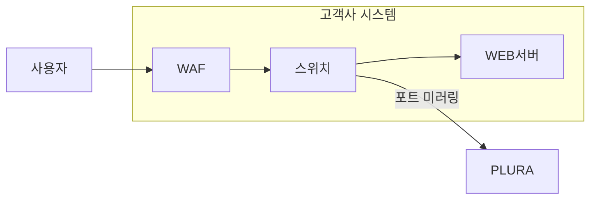

## **PLURA-XDR의 주요 가치: 웹 요청 본문 분석을 통한 심층 해킹 대응**  

PLURA-XDR은 웹 방화벽(WAF)이 놓칠 수 있는 웹 요청 본문(Request Body) 내의 위협을 분석하고 대응하는 강력한 기능을 제공합니다. 이를 통해 다음과 같은 가치를 제공합니다:

#### **WAF가 놓칠 수 있는 상황**  
- **정규식 기반 시그니처 한계:**  
  WAF는 대부분 정규식 기반의 시그니처로 동작하기 때문에, 해커는 이를 우회하기 위해 다양한 변형된 공격 코드를 시도합니다.
  
  예를 들어:  
  - SQL 인젝션 시 **공백을 주석 처리 방식**으로 대체 (`UNION SELECT` → `UNION/**/SELECT`)  
  - 크로스 사이트 스크립팅(XSS)에서 인코딩된 페이로드 사용 (`<script>` → `%3Cscript%3E`)  

- **새로운 공격 패턴의 탐지 어려움:**  
  기존에 정의되지 않은 공격 패턴이나 시그니처를 활용한 **제로데이 공격**은 WAF 시그니처로 탐지되지 않을 가능성이 높습니다.

- **복잡한 요청 본문 처리 부족:**  
  JSON, XML, 다중 파라미터, 또는 큰 데이터 페이로드처럼 복잡한 요청 본문을 정확히 분석하지 못해 탐지에 실패하는 경우가 있습니다.

✅ 결과적으로, 웹 방화벽(WAF)이 모든 공격을 차단하지 못할 가능성이 매우 높기 때문에, 이를 보완할 수 있는 추가적인 보안 솔루션이 필수적입니다. PLURA-XDR은 이러한 한계를 대비하여 안전하고 신뢰할 수 있는 시스템 구축을 가능하게 합니다.  

---

### **1. 웹 요청 및 응답 본문의 심층 분석**  
PLURA-XDR은 **웹 요청 본문**에 포함된 데이터(예: JSON, XML, POST 데이터 등)를 분석하여 웹 방화벽(WAF)에서 탐지하지 못한 복잡한 공격 패턴을 식별합니다.  
특히, 데이터 유출 공격과 같은 고도화된 위협을 효과적으로 탐지하기 위해 **웹 응답 본문**까지 분석하여 다음과 같은 다양한 공격 유형을 방어할 수 있습니다.  

#### **탐지 가능한 공격 유형:**  
- **크리덴셜 스터핑(Credential Stuffing):**  
  사용자 계정 탈취를 목적으로 한 대량의 로그인 시도를 식별.  
- **SQL 인젝션(SQL Injection):**  
  데이터베이스에 비정상적인 접근을 시도하는 악성 입력값 탐지.
- **그 외 OWASP TOP:**  
  인증 취약점, 민감 데이터 노출, XML 외부 엔터티, 권한 상승, 크로스 사이트 스크립팅(XSS) 등 웹 애플리케이션에 대한 주요 위협을 탐지 및 차단.    
- **데이터 유출 공격:**  
  요청 본문뿐만 아니라 **응답 본문**의 민감 정보(예: 개인정보, 인증 토큰, 파일 데이터 등)를 분석하여, 웹 방화벽이 놓칠 수 있는 민감 정보 유출을 탐지 및 차단.  

#### **WAF에서 놓친 공격을 탐지하는 PLURA-XDR의 차별점**  
PLURA-XDR은 단순한 실시간 탐지를 넘어, **모든 웹 트래픽을 저장 및 관리**하여 WAF가 놓친 공격에도 대응할 수 있는 강력한 기능을 제공합니다.  

1. **웹 트래픽 저장 및 관리:**  
   - PLURA-XDR은 모든 웹 요청 데이터를 저장하여, 실시간 탐지에서 놓친 공격 시도도 추후 분석이 가능합니다.  
   - 저장된 데이터는 공격자 IP, User-Agent, URL 등의 메타데이터와 함께 관리됩니다.  

2. **공격자 IP 기반 조사:**  
   - 탐지된 공격자 IP를 기반으로, 전체 웹 트래픽에서 해당 IP의 모든 활동을 조사할 수 있습니다.  
   - 이를 통해 WAF에서 놓친 **변형된 공격 코드**나 **패턴**을 재탐지하고, 신속히 대응할 수 있습니다.

3. **지능형 재탐지 및 대처:**  
   - 기존에 탐지되지 않은 패턴이라도, 저장된 트래픽 데이터로부터 **후속 분석**을 통해 추가적인 공격을 식별하고 차단합니다.  
   - 이러한 기능은 반복적인 공격 시도와 다단계 공격(예: 크리덴셜 스터핑, 데이터 유출 공격)을 효과적으로 차단할 수 있게 합니다.

#### **PLURA-XDR의 차별화된 데이터 유출 공격 대응 방식**  
- **웹 요청 본문과 응답 본문 모두 분석:**  
  단순히 요청 패턴만을 확인하는 기존 방식의 한계를 넘어, 응답 데이터 내 숨겨진 위험 요소까지 탐지.  
  예) 민감 정보 노출, 비정상적인 대량 데이터 응답, 악의적인 데이터 다운로드 시도 등.  

- **실시간 탐지 및 대응:**  
  탐지된 응답 데이터를 기반으로 공격자를 식별하고, IP 차단, 탐지 룰 업데이트 등의 **자동화된 보안 조치** 수행.  

- **SIEM 연동을 통한 상관 분석:**  
  응답 본문에서 탐지된 데이터를 이벤트로 기록하고, SIEM과 연동하여 **추가적인 상관 분석**으로 다단계 공격 시도에도 효과적으로 대응.  

---

### **2. 실시간 상관 분석**
- PLURA-XDR은 SIEM 연동을 통해 발생한 이벤트를 종합적으로 분석하여 단일 패킷 기반 탐지가 어려운 **지속적이고 은밀한 공격**을 탐지합니다.  
- 상관 분석 결과를 통해 추가적인 방어 전략을 실시간으로 적용할 수 있습니다.  

---

### **3. 공격 탐지 및 자동화된 대응**
- 공격이 탐지되면, PLURA-XDR은 자동으로 적절한 대응(예: IP 차단, 추가 탐지 룰 적용)을 수행합니다.  
- 해킹 시도가 반복되더라도 **지능형 방어 시스템**이 동작하여 지속적인 보호를 제공합니다.  

---

### **4. 보안 운영 효율화**
- PLURA-XDR의 로그와 분석 결과는 직관적으로 제공되어 **보안 관리자**가 빠르게 의사 결정을 내릴 수 있습니다.  
- 이를 통해 불필요한 리소스 소모를 줄이고, 사이버 보안 운영의 생산성을 극대화합니다.  

---

**결론:**  
PLURA-XDR은 단순히 탐지 기술을 넘어서 **웹 서비스에 대한 전방위적 보호**를 제공합니다. 웹 요청 본문 분석을 통해 기존 보안 솔루션의 한계를 극복하고, 실시간 대응 체계를 갖춘 통합 보안 플랫폼으로 고객의 웹 자산을 안전하게 보호합니다.
