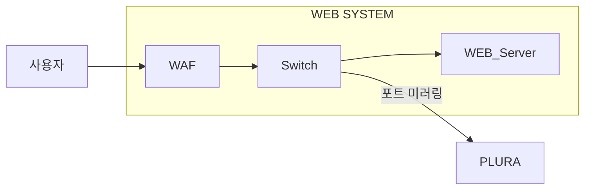

## **PLURA-XDR의 가치: 웹 요청 본문 분석을 통한 심층 해킹 대응**  

PLURA-XDR은 웹방화벽(WAF)이 놓칠 수 있는 웹 요청 본문(Request Body, Post-Body) 내의 위협을 분석하고 대응하는 강력한 기능을 제공합니다. 이를 통해 다음과 같은 가치를 제공합니다:

#### 먼저 **WAF가 놓칠 수 있는 상황에 대한 이해**  

---

```html
<div style="border: 2px solid #000; padding: 10px; margin: 10px 0;">
  <strong>먼저 WAF가 놓칠 수 있는 상황에 대한 이해</strong><br><br>

  <ul>
    <li><strong>정규식 기반 시그니처 한계:</strong><br>
      WAF는 대부분 정규식 기반의 시그니처로 동작하기 때문에, 해커는 이를 우회하기 위해 다양한 변형된 공격 코드를 시도합니다.<br><br>

      예를 들어:<br>
      - SQL 인젝션 시 <strong>공백을 주석 처리 방식</strong>으로 대체 (<code>UNION SELECT</code> → <code>UNION/**/SELECT</code>)<br>
      - 크로스 사이트 스크립팅(XSS)에서 <strong>인코딩된 페이로드</strong> 사용 (<code>&lt;script&gt;</code> → <code>%3Cscript%3E</code>)
    </li>

    <li><strong>새로운 공격 패턴의 탐지 어려움:</strong><br>
      기존에 정의되지 않은 공격 패턴이나 시그니처를 활용한 <strong>제로데이 공격</strong>은 WAF 시그니처로 탐지되지 않을 가능성이 높습니다.
    </li>

    <li><strong>복잡한 요청 본문 처리 부족:</strong><br>
      JSON, XML, 다중 파라미터, 또는 큰 데이터 페이로드처럼 복잡한 요청 본문을 정확히 분석하지 못해 탐지에 실패하는 경우가 있습니다.
    </li>
  </ul>

  ✅ 결과적으로, 웹 방화벽(WAF)이 모든 공격을 차단하지 못할 가능성이 매우 높기 때문에, 이를 보완할 수 있는 추가적인 보안 솔루션이 필수적입니다. PLURA-XDR은 이러한 한계를 대비하여 안전하고 신뢰할 수 있는 시스템 구축을 가능하게 합니다.
</div>
```



---

## **1. 웹 요청 본문의 심층 분석**
- PLURA-XDR은 요청 본문에 포함된 데이터(예: JSON, XML, POST 데이터 등)를 분석하여 웹 방화벽에서 탐지하지 못한 복잡한 공격 패턴을 식별합니다.  
- **탐지 가능한 공격 유형:**  
  - 크리덴셜 스터핑(Credential Stuffing)  
  - SQL 인젝션(SQL Injection)  
  - 데이터 유출 공격 등  

👉 [자세히](https://github.com/qubitsec/plura/blob/main/benefits/ko/deep_analysis_of_web_request_body.md)

---

## **2. 실시간 상관 분석**
- PLURA-XDR은 SIEM 연동을 통해 발생한 이벤트를 종합적으로 분석하여 단일 패킷 기반 탐지가 어려운 **지속적이고 은밀한 공격**을 탐지합니다.  
- 상관 분석 결과를 통해 추가적인 방어 전략을 실시간으로 적용할 수 있습니다.  

👉 [자세히](https://github.com/qubitsec/plura/blob/main/benefits/ko/realtime_correlation.md)

---

## **3. 공격 탐지 및 자동화된 대응**
- 공격이 탐지되면, PLURA-XDR은 자동으로 적절한 대응(예: IP 차단, 추가 탐지 룰 적용)을 수행합니다.  
- 해킹 시도가 반복되더라도 **지능형 방어 시스템**이 동작하여 지속적인 보호를 제공합니다.  

👉 [자세히](https://github.com/qubitsec/plura/blob/main/benefits/ko/automated_response.md)

---

## **4. 보안 운영 효율화**
- PLURA-XDR의 로그와 분석 결과는 직관적으로 제공되어 **보안 관리자**가 빠르게 의사 결정을 내릴 수 있습니다.  
- 이를 통해 불필요한 리소스 소모를 줄이고, 사이버 보안 운영의 생산성을 극대화합니다.  

👉 [자세히](https://github.com/qubitsec/plura/blob/main/benefits/ko/security_operations_optimization.md)

---

## **결론:**  
PLURA-XDR은 단순히 탐지 기술을 넘어서 **웹 서비스에 대한 전방위적 보호**를 제공합니다. 웹 요청 본문 분석을 통해 기존 보안 솔루션의 한계를 극복하고, 실시간 대응 체계를 갖춘 통합 보안 플랫폼으로 고객의 웹 자산을 안전하게 보호합니다.
