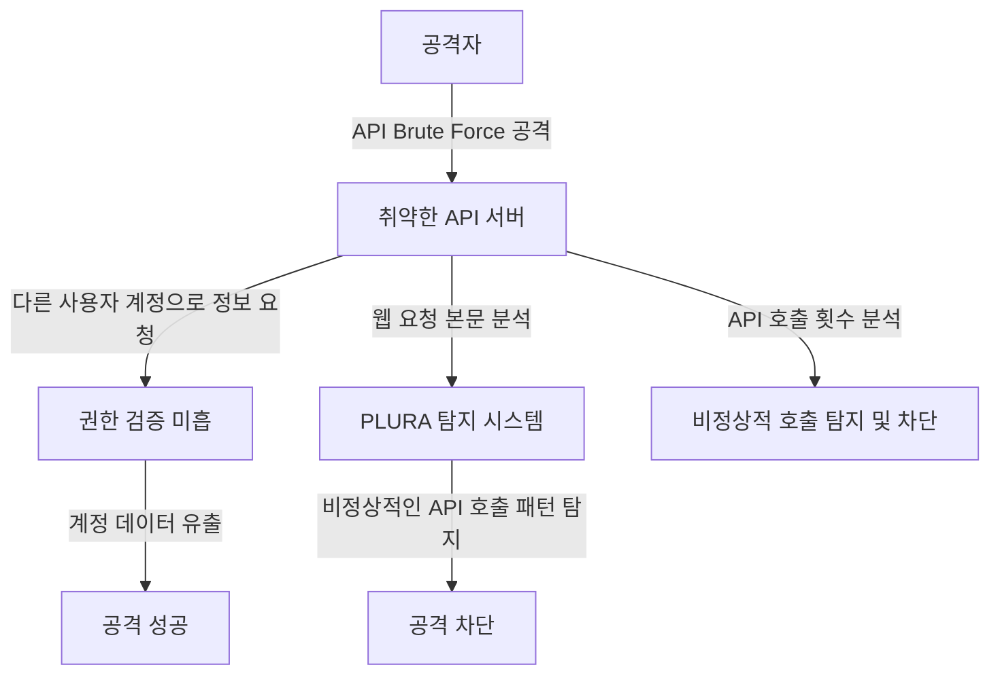

## **사례 2: API 취약점 악용 (Zero-Day API Attack)**  

### **📌 1️⃣ 기존 위협 헌팅(SIEM + EDR + NDR + TI)이 탐지하지 못하는 이유**  

| **비교 항목** | **기존 위협 헌팅 (SIEM + EDR + NDR + TI)** | **PLURA 웹 요청 본문 분석 + EDR** |
|----------|-------------------------------|-------------------------------|
| **탐지 방식** | 룰 기반 탐지, 이상 트래픽 감지 가능하지만 세부적인 웹 요청 본문 분석 불가 | **웹 요청 본문 및 사용자 행동 분석 기반 탐지 가능** |
| **웹 애플리케이션 공격 탐지** | API 요청 헤더, URL 분석 가능하지만 요청 본문 분석 불가 | **API 요청 본문을 분석하여 API Abuse 및 이상 요청 탐지 가능** |
| **네트워크 트래픽 분석** | NDR이 SSL 복호화 후 트래픽을 분석할 수 있지만 API 호출의 내용까지 분석하지 못함 | **API 요청 본문을 정밀 분석하여 인증 우회 및 권한 상승 시도 탐지 가능** |
| **엔드포인트 보안** | EDR이 엔드포인트 내 악성코드 및 프로세스 실행 탐지는 가능하지만 API 요청과 연계 분석 어려움 | **웹 서버의 API 호출 패턴을 감지하고, 데이터 유출 가능성을 분석하여 차단 가능** |

### **📌 2️⃣ 기존 위협 헌팅이 탐지하지 못하는 이유 상세 설명**  

1. **SIEM + TI(Threat Intelligence) 한계**  
   - 기존 SIEM 및 위협 인텔리전스(TI)는 **IOC(Indicator of Compromise) 기반 탐지**에 의존하므로,  
   - 신규 API 취약점과 같은 **Zero-Day 공격을 탐지하기 어렵고, 정상적인 API 호출과 악성 API 요청을 구별하는 행위 기반 탐지가 부족함**.  
   - 공격자가 **기존에 알려진 취약점이 아닌 새로운 API 엔드포인트를 악용할 경우 탐지가 어렵다**.  

2. **NDR(네트워크 기반 탐지)의 한계**  
   - NDR은 SSL 복호화를 통해 네트워크 트래픽을 분석할 수 있지만,  
   - **API 요청 본문(payload)까지 분석하지 못하므로, 악성 API 호출을 탐지하는 데 한계가 있음**.  
   - 네트워크 단에서 API 트래픽의 이상 여부를 탐지할 수 있지만, **API 내부 데이터 조작(예: User ID 변경, Role 변경, OAuth 토큰 남용 등)은 탐지할 수 없음**.  

3. **EDR(엔드포인트 보안)의 한계**  
   - EDR은 엔드포인트에서 발생하는 악성코드 실행 및 파일 변조를 탐지할 수 있지만,  
   - **웹 애플리케이션에서 발생하는 API 남용 및 인증 우회 공격을 탐지하는 기능이 부족함**.  
   - 즉, API 요청이 정상적으로 보이면, **공격자가 계정 탈취 또는 데이터 유출을 시도하더라도 탐지가 어려움**.  

---

### **📌 3️⃣ PLURA 웹 요청 본문 분석 + EDR을 통한 탐지 방법**  

✅ **1) API 요청 본문을 분석하여 비정상적인 요청 패턴 탐지**  
   - **PLURA는 API 요청의 본문(payload)을 정밀 분석**하여,  
   - **공격자가 특정 User ID를 변경하면서 과도한 API 요청을 하는 패턴을 탐지 가능**.  
   - 정상적인 API 호출과 비교하여, **비정상적인 파라미터 조작(예: 권한 상승 시도, 데이터 조회 범위 변경 등)을 탐지 가능**.  

✅ **2) 웹 애플리케이션 로그와 사용자 행동 데이터를 상관 분석**  
   - 정상 사용자는 `GET /api/getUserData?userId=1234` 요청을 한 번만 수행하지만,  
     - 공격자는 여러 `userId`를 변경하여 반복 요청 (`GET /api/getUserData?userId=5678`, `userId=91011` 등).  
   - **이러한 비정상적인 액세스 패턴을 분석하여 자동 탐지 및 차단 가능**.  

✅ **3) EDR을 활용한 추가 보안 탐지**  
   - API를 악용하여 웹 서버에 악성 페이로드가 업로드될 경우,  
   - **파일 무결성(FIM, File Integrity Monitoring) 기능을 통해 웹 서버 파일이 변조되는 즉시 탐지 가능**.  

✅ **4) 공격 흐름을 상관 분석하여 추가 공격 차단**  
   - **로그 데이터, API 요청 패턴, 사용자 활동 데이터를 결합하여, 인증 우회 및 데이터 유출을 탐지하고 차단 가능**.  

---

### **📌 4️⃣ API 취약점 악용 공격 흐름 (Mermaid Flowchart)**  

---

### **📌 5️⃣ 결론: PLURA 웹 요청 본문 분석 + EDR이 API 취약점 탐지에서 뛰어난 이유**  
✅ **기존 위협 헌팅(SIEM + EDR + NDR + TI)은 API 요청의 헤더 및 URL만 분석하며, 본문 분석이 불가능하여 새로운 API 취약점(Zero-Day Attack) 탐지가 어려움**.  
✅ **PLURA-XDR은 API 요청 본문을 분석하고 행위 기반 탐지를 수행하여, 인증 우회, 권한 상승, API Abuse 공격을 실시간 탐지 가능**.  
✅ **네트워크 트래픽 분석(NDR)으로 탐지할 수 없는 API 내부 요청 패턴까지 분석 가능**.  
✅ **공격자가 기존 룰을 우회하여 새로운 API 요청 변형을 시도하더라도, 이상 행위를 탐지하여 API 남용을 차단할 수 있음**.  

🔹 **PLURA-XDR은 기존 보안 체계가 탐지하지 못하는 API 취약점 공격을 실시간으로 탐지하고 차단할 수 있는 차세대 보안 플랫폼입니다.** 🚀  

---

### **📌 최종 개선된 핵심 포인트**  
1. 기존 위협 헌팅이 **API 요청의 헤더 및 URL 분석에 의존하여 API 취약점을 탐지하지 못하는 이유**를 명확히 설명.  
2. **PLURA가 API 요청 본문을 분석하여 인증 우회 및 권한 상승 시도를 탐지하고 차단하는 방식**을 상세히 설명.  
3. 기존 보안 시스템이 탐지하지 못하는 이유를 **SIEM, NDR, EDR 별로 구체적으로 정리**하여 차별점을 강조.  
4. **API 공격 흐름을 Mermaid 다이어그램으로 표현하여, PLURA의 대응 방식을 직관적으로 이해할 수 있도록 구성**.  

이제 독자가 **왜 기존 위협 헌팅이 API 취약점을 탐지하지 못하고, PLURA 웹 요청 본문 분석 + EDR이 더 강력한 탐지 방법인지**를 쉽게 이해할 수 있을 것입니다.  

📌 **추가 수정이 필요하시면 의견 주세요! 😊**
