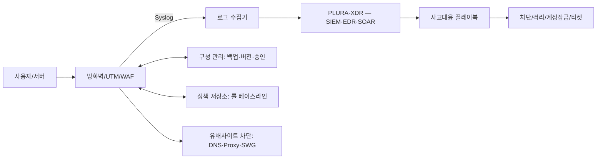

# 방화벽 관리 서비스 — xFirewall

**작성일:** 2025-09-24 (KST)  
**상품 기획서:** v1.0  
**연계 플랫폼:** PLURA-XDR, 유해사이트 차단 솔루션(DNS/Proxy/SWG), 내부 정보 유출 솔루션  
**1차 서비스 구성(요약):** *온프레미스 방화벽 하드웨어 포함*, **월 50만원** 관리 서비스, **초기 3개월 선납**  

---

## 1) Executive Summary

방화벽 운영을 “정책 거버넌스 + 공격 탐지·대응 + 변경관리”로 표준화하여 **해킹 대응 체감효과**를 만드는 매니지드 서비스입니다. 인입/아웃바운드 트래픽 통제, 설정(Config) 버전관리, Syslog 분석과 침해 징후 대응을 하나의 운영체계로 제공합니다. PLURA-XDR 및 유해사이트 차단 솔루션과의 연동으로 **탐지→격리→증거화**까지 자동화합니다.  
**1차 서비스는 온프레미스 방화벽 하드웨어가 서비스 비용에 포함되며, 월 50만원 관리형으로 제공(초기 3개월 선납)됩니다.**

---

## 2) Why Now (문제 정의)

* 취약점 악용·웹셸 업로드 등 **L7 기반 침투**가 빈번합니다.
* 아웃바운드(egress) 통제가 느슨해 **데이터 유출·C2 통신**을 놓칩니다.
* 변경관리 미흡으로 **룰 스프롤(rule sprawl)**, 우선순위 충돌, 예외 남발 문제가 누적됩니다.
* Syslog는 쌓이지만 **운영 시나리오 기반 탐지**와 **행동 지표**가 부재합니다.

> 본 서비스는 위 문제를 “가시성→표준 절차→자동화”로 해결합니다.

---

## 3) 서비스 범위 (Scope)

### In-Scope (핵심 제공)

1. **인입 트래픽 네트워크 관리**: 정책 체계 설계, L3/4/7 룰 베이스라인, 위협 카테고리 룰(봇/스캐너/웹셸 시그니처 등) 운영.
2. **아웃 트래픽 네트워크 관리**: egress 도메인/FQDN/카테고리 기반 허용 리스트, 데이터 유출 지표(세션 바이트/분당 전송량/도메인 신규성 등) 모니터링.
3. **설정(Config) 관리**: 변경요청(RFC) 프로세스, 2인 승인(4-eyes), 백업/롤백, 형상 버전관리(Git), 컴플라이언스 드리프트 탐지.
4. **Syslog 수집·분석 관리**: 관리 로그인·정책변경·세션/위협 로그 표준화, 탐지 룰(사용자/세션/URI 바이트, 장기 이동평균 편차, DNS 터널링 휴리스틱 등) 적용.
5. **부가 연동**: PLURA-XDR(EDR/SIEM/SOAR) 연동 운영, 유해사이트 차단(DNS/SWG) 정책 연동.
6. **(1차 서비스 특약)** **온프레미스 방화벽 하드웨어 제공(서비스 비용에 포함)** 및 관리 운영.

### Out-of-Scope (기본 제외, 옵션 제공)

* 물리 장비 **수리/교체**(결함 보증 범위 외), 데이터 복구, 고객 내부 개발 코드 리뷰, 비표준 장비 펌웨어 커스터마이징.

---

## 4) 서비스 아키텍처

---

## 5) 핵심 기능 상세

### 5.1 인입 트래픽 네트워크 관리

* **베이스라인 정책**: 기본 차단(deny-all) 후 승인 기반 허용(least privilege).
* **애플리케이션 인식**: App-ID/URL-Category/Geo-IP 활용.
* **웹 공격 방어**: (WAF 사용 시) 시그니처/행위 기반 룰, 가상패치.
* **모의공격/스캐너 억제**: 스캐닝 패턴·User-Agent·ASN 블록.
* **모니터링 지표**: 시도 대비 허용율, 신설 서비스 Hit율, 시즈널리티.

### 5.2 아웃 트래픽 네트워크 관리 (Egress)

* **허용 리스트(Allow-List) 우선**: 업무 도메인/FQDN 기반 허용, 나머지 제한.
* **데이터 유출 탐지 휴리스틱**: 세션 바이트 누적, 분당 전송량, 장기 이동평균 편차, 드물게 보는 도메인 빈도, 신규 등록 도메인, 토르/프록시/워프 등 우회 채널 지표.
* **DNS 보안**: DNS 암호화(DoH/DoT) 차단 예외 정책, DNS-over-HTTPS 도메인 카테고리 필터.
* **파일 업로드/클라우드 스토리지 제어**: 카테고리·태그 기반 허용/차단 + 예외절차.

### 5.3 설정(Config) 관리

* **RFC 포맷**: 목적·영향 서비스·롤백 계획·승인자 서명.
* **2인 승인(4-eyes)** 및 **변경창(Change Window)** 운영.
* **정책 버전관리**: Git 저장소(사설), 자동 백업/디프, 컴플라이언스 스냅샷.
* **드리프트 탐지**: 실장 정책 ≠ 저장소 정책 시 알림 및 자동 교정 옵션.

### 5.4 Syslog 수집·분석 관리

* **표준 필드**: ts, device, rule, action, src/dst ip\:port, app/url, ua, bytes\_in/out, session\_id, admin, cfg\_event.
* **운영 탐지 룰**

  * 관리자 로그인 이상(야간/해외/연속 실패→성공)
  * 정책 비활성화/우선순위 변경 급증
  * egress 이상: 소량·빈번 업로드 패턴(“작게, 자주”), Cloud-Drive 다중 업로드
  * DNS 터널링 의심: TXT/NULL/긴 도메인, qps 편차
* **장비 유지보수/설정 공격 대비**: 펌웨어/시그니처 업데이트 실패, 구성 잠금, 비인가 관리자 계정 탐지.

### 5.5 부가 연동

* **PLURA-XDR**: 방화벽 이벤트 → XDR 상관분석 → SOAR 플레이북 실행(차단/격리/티켓) → 증거화(타임라인, PCAP/로그 스냅샷).
* **유해사이트 차단 솔루션(DNS/SWG)**: 카테고리 정책(멀웨어/피싱/성인/도박/프록시) 수립, 사용자/부서별 예외, SSL 인스펙션 예외 관리.

---

## 6) 운영 모델 (RACI / 시간 / 에스컬레이션)

* **운영 시간**: 24×7 (옵션) / 평일 09:00–18:00 (기본)

* **RACI**

  * 정책 설계/검토: 우리 팀(Responsible) + 고객 보안팀(Accountable)
  * 변경 승인: 고객 보안 책임자(Accountable) + 우리 팀(Consulted)
  * 사고 대응: 우리 팀(Responsible) → 고객 CISO(Escalation) → 외부 IR(필요시)

* **에스컬레이션 레벨**

  * P1(중대): 30분 내 착수, 4시간 내 완화 조치
  * P2(높음): 2시간 내 착수, 1영업일 내 조치
  * P3(보통): 1영업일 내 분석/권고

---

## 7) 보고서 & 산출물 (Deliverables)

* **주간 리포트**: 정책 변경 내역, 차단 상위 Top-N, 신규 위협/도메인, 오탐/예외 처리, 권고사항.
* **월간 경영 리포트**: KPI 현황(MTTD/MTTR, 차단 건수, 예외 건수·리드타임), 리스크/개선계획.
* **분기 정책 리뷰**: 베이스라인 재정의, 오래된 예외 정리, 룰 건강성 점수 업데이트.
* **감사 패키지**: 변경 승인 이력, 버전 스냅샷, 접속 기록.

---

## 8) 온보딩 & 전환 계획 (Checklist)

**Week 0–1**

* [ ] 자산/회선/장비 인벤토리 수집
* [ ] 현재 정책/예외/업무 도메인 리스트 업
* [ ] Syslog 경로/포맷 점검, 시간 동기화(NTP)

**Week 2–3**

* [ ] 베이스라인 정책 설계/시뮬레이션
* [ ] egress 허용 도메인 초안, 고위험 카테고리 차단
* [ ] 유해사이트 차단 솔루션 연동(AD/부서 매핑)

**Week 4**

* [ ] 단계적 컷오버(모니터→차단)
* [ ] PLURA-XDR 플레이북 연결(차단/격리/티켓)
* [ ] 운영 대시보드/리포트 템플릿 확정

---

## 9) SLA (예시)

* **로그 수집 가용성** ≥ 99.9%
* **P1 대응 착수 시간** ≤ 30분(24×7 플랜), ≤ 2시간(비즈니스 플랜)
* **정책 변경 처리 리드타임(Median)** ≤ 2영업일
* **백업/버전 스냅샷 주기**: 일 1회 + 변경 즉시

---

## 10) 가격 정책 (초안)

| 플랜           | 운영 시간   | 포함 장비 | 핵심 기능                  | 연동              | 리포트      |
| ------------ | ------- | ----- | ---------------------- | --------------- | -------- |
| **Standard** | 평일 9–18 | 2대    | 인입/아웃 정책 운영, Config 백업 | -               | 주간       |
| **Advanced** | 평일+당직   | 5대    | + 탐지 룰, 예외 워크플로        | 유해사이트           | 주간/월간    |
| **Premium**  | 24×7    | 10대   | + SOAR 자동화, 플레이북       | PLURA-XDR+유해사이트 | 주간/월간/분기 |

> 장비수/스루풋/HA/멀티사이트는 옵션 산정.

### 10.1 **1차 서비스(런치 패키지)** — *온프레미스 방화벽 하드웨어 포함*

* **구성:** 온프레미스 방화벽 하드웨어 **포함** + 방화벽 관리 운영
* **요금:** **월 50만원** (관리 서비스)
* **결제 조건:** **초기 3개월 선납(선결제)**
* **운영 시간(기본):** 평일 09:00–18:00 (24×7는 옵션 업그레이드 가능)
* **비고:** 하드웨어 제공 범위 및 세부 조건은 계약서(별첨) 기준

---

## 11) KPI / 운영 건강성 지표

* **MTTD/MTTR**, **차단/탐지 건수 추세**, **오탐률**, **예외 리드타임**, **룰 중복/그림자 룰 비율**, **Top egress 도메인 변화**.

---

## 12) 리스크 & 가정

* 100% 차단 보장은 불가. 패치·개발 보안·사용자 교육과 병행 필요.
* 과도한 egress 제한은 업무에 영향 → 예외 프로세스 필수.
* SSL 인스펙션은 개인정보/규제 고려가 필요.

---

## 13) 운영 플레이북 (요약)

1. **탐지**: 방화벽/유해사이트 차단/PLURA-XDR 알림 접수
2. **분류**: P1/P2/P3 심각도 부여
3. **대응**: 차단/격리/세션 강제 종료/룰 임시 강화
4. **근본원인(RCA)**: 인입/아웃 규칙·시그니처·자산 영향 분석
5. **복구**: 정상 정책 복원, 예외·화이트리스트 결정
6. **증거화/보고**: 타임라인, 지표 업데이트, 경영 보고

---

## 14) 사례 기반 위협 시나리오 (예시)

* **웹로직 RCE→웹셸 설치→내부 확산**: 가상패치/시그니처 적용, egress 제어로 C2 차단, XDR로 lateral 이동 탐지.
* **소량·빈번 업로드 기반 데이터 유출**: 분당 전송량·장기 이동평균 편차 탐지, 스토리지 도메인 차단/예외 절차.
* **DNS 터널링**: TXT/긴 레이블·고QPS 탐지 후 도메인·클라이언트 격리.

---

## 15) 템플릿 (발췌)

### 15.1 변경요청서(RFC)

* 변경 목적 / 대상 정책 / 영향 서비스 / 테스트 계획 / 롤백 / 승인자 / 일정

### 15.2 예외요청서

* 업무 사유 / 대상 도메인·IP·기간 / 데이터 민감도 / 책임부서 / 만료 리마인더

### 15.3 주간 리포트 목차

* 요약 / 주요 차단 현황 / 신규 위협 / 오탐·예외 / 정책 변경 / 권고사항

---

## 16) 컴플라이언스/보안

* 접근권한 최소화, 이중 인증, 명령 실행 기록, 고객 데이터 분리 보관.
* ISO 27001/27701, 개인정보보호법/전자금융감독규정 등 준거 운영(요건 매핑은 프로젝트 킥오프 시 상세화).

---

## 부록 A. 데이터 필드 표준(예시)

| 필드                  | 설명                                 |
| ------------------- | ---------------------------------- |
| ts                  | 이벤트 시각(UTC/KST)                    |
| device              | 장비 식별(Hostname/Serial)             |
| action              | allow/deny/reset                   |
| rule                | 룰 이름/ID                            |
| src\_ip/dst\_ip     | 출발/도착 IP                           |
| src\_port/dst\_port | 출발/도착 Port                         |
| app/url             | 애플리케이션/URL/도메인                     |
| bytes\_in/out       | 수신/송신 바이트                          |
| admin               | 관리자 계정(설정 이벤트)                     |
| cfg\_event          | add/del/disable/priority\_change 등 |

---

### Next Steps

1. 대상 장비/회선/업무 도메인 목록 공유
2. 운영 시간/플랜 선택 (**1차 서비스: 월 50만원 · 초기 3개월 선납**)
3. PoV(2\~4주) 일정 확정 및 베이스라인 설계 착수

---

