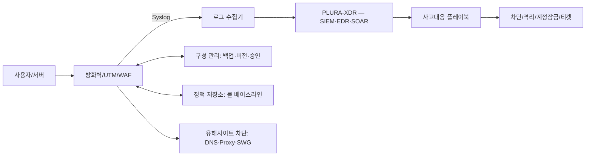

# 방화벽 관리 서비스 — xFirewall

**작성일:** 2025-09-24 (KST)  
**상품 기획서:** v1.0  
**연계 플랫폼:** PLURA-XDR, 유해사이트 차단 솔루션(DNS/Proxy/SWG), 내부 정보 유출 솔루션  
**1차 서비스 구성(요약):** *온프레미스 방화벽 하드웨어 포함*, **월 50만원** 관리 서비스, **초기 3개월 선납**  

---

## 1) Executive Summary

방화벽 운영을 “정책 거버넌스 + 공격 탐지·대응 + 변경관리”로 표준화하여 **해킹 대응 체감효과**를 만드는 매니지드 서비스입니다. 인입/아웃바운드 트래픽 통제, 설정(Config) 버전관리, Syslog 분석과 침해 징후 대응을 하나의 운영체계로 제공합니다. PLURA-XDR 및 유해사이트 차단 솔루션과의 연동으로 **탐지→격리→증거화**까지 자동화합니다.  
**1차 서비스는 온프레미스 방화벽 하드웨어가 서비스 비용에 포함되며, 월 50만원 관리형으로 제공(초기 3개월 선납)됩니다.**

---

## 2) Why Now (문제 정의)

* 취약점 악용·웹셸 업로드 등 **L7 기반 침투**가 빈번합니다.
* 아웃바운드(egress) 통제가 느슨해 **데이터 유출·C2 통신**을 놓칩니다.
* 변경관리 미흡으로 **룰 스프롤(rule sprawl)**, 우선순위 충돌, 예외 남발 문제가 누적됩니다.
* Syslog는 쌓이지만 **운영 시나리오 기반 탐지**와 **행동 지표**가 부재합니다.

> 본 서비스는 위 문제를 “가시성→표준 절차→자동화”로 해결합니다.

---

## 3) 서비스 범위 (Scope)

### In-Scope (핵심 제공)

1. **인입 트래픽 네트워크 관리**: 정책 체계 설계, L3/4/7 룰 베이스라인, 위협 카테고리 룰(봇/스캐너/웹셸 시그니처 등) 운영.
2. **아웃 트래픽 네트워크 관리**: egress 도메인/FQDN/카테고리 기반 허용 리스트, 데이터 유출 지표(세션 바이트/분당 전송량/도메인 신규성 등) 모니터링.
3. **설정(Config) 관리**: 변경요청(RFC) 프로세스, 2인 승인(4-eyes), 백업/롤백, 형상 버전관리(Git), 컴플라이언스 드리프트 탐지.
4. **Syslog 수집·분석 관리**: 관리 로그인·정책변경·세션/위협 로그 표준화, 탐지 룰(사용자/세션/URI 바이트, 장기 이동평균 편차, DNS 터널링 휴리스틱 등) 적용.
5. **부가 연동**: PLURA-XDR(EDR/SIEM/SOAR) 연동 운영, 유해사이트 차단(DNS/SWG) 정책 연동.
6. **(1차 서비스 특약)** **온프레미스 방화벽 하드웨어 제공(서비스 비용에 포함)** 및 관리 운영.

### Out-of-Scope (기본 제외, 옵션 제공)

* 물리 장비 **수리/교체**(결함 보증 범위 외), 데이터 복구, 고객 내부 개발 코드 리뷰, 비표준 장비 펌웨어 커스터마이징.

---

## 4) 서비스 아키텍처

---

## 5) 핵심 기능 상세

### 5.1 인입 트래픽 네트워크 관리

* **베이스라인 정책**: 기본 차단(deny-all) 후 승인 기반 허용(least privilege).
* **애플리케이션 인식**: App-ID/URL-Category/Geo-IP 활용.
* **웹 공격 방어**: (WAF 사용 시) 시그니처/행위 기반 룰, 가상패치.
* **모의공격/스캐너 억제**: 스캐닝 패턴·User-Agent·ASN 블록.
* **모니터링 지표**: 시도 대비 허용율, 신설 서비스 Hit율, 시즈널리티.

### 5.2 아웃 트래픽 네트워크 관리 (Egress)

* **허용 리스트(Allow-List) 우선**: 업무 도메인/FQDN 기반 허용, 나머지 제한.
* **데이터 유출 탐지 휴리스틱**: 세션 바이트 누적, 분당 전송량, 장기 이동평균 편차, 드물게 보는 도메인 빈도, 신규 등록 도메인, 토르/프록시/워프 등 우회 채널 지표.
* **DNS 보안**: DNS 암호화(DoH/DoT) 차단 예외 정책, DNS-over-HTTPS 도메인 카테고리 필터.
* **파일 업로드/클라우드 스토리지 제어**: 카테고리·태그 기반 허용/차단 + 예외절차.

### 5.3 설정(Config) 관리

* **RFC 포맷**: 목적·영향 서비스·롤백 계획·승인자 서명.
* **2인 승인(4-eyes)** 및 **변경창(Change Window)** 운영.
* **정책 버전관리**: Git 저장소(사설), 자동 백업/디프, 컴플라이언스 스냅샷.
* **드리프트 탐지**: 실장 정책 ≠ 저장소 정책 시 알림 및 자동 교정 옵션.

### 5.4 Syslog 수집·분석 관리

* **표준 필드**: ts, device, rule, action, src/dst ip\:port, app/url, ua, bytes\_in/out, session\_id, admin, cfg\_event.
* **운영 탐지 룰**

  * 관리자 로그인 이상(야간/해외/연속 실패→성공)
  * 정책 비활성화/우선순위 변경 급증
  * egress 이상: 소량·빈번 업로드 패턴(“작게, 자주”), Cloud-Drive 다중 업로드
  * DNS 터널링 의심: TXT/NULL/긴 도메인, qps 편차
* **장비 유지보수/설정 공격 대비**: 펌웨어/시그니처 업데이트 실패, 구성 잠금, 비인가 관리자 계정 탐지.

### 5.5 부가 연동

* **PLURA-XDR**: 방화벽 이벤트 → XDR 상관분석 → SOAR 플레이북 실행(차단/격리/티켓) → 증거화(타임라인, PCAP/로그 스냅샷).
* **유해사이트 차단 솔루션(DNS/SWG)**: 카테고리 정책(멀웨어/피싱/성인/도박/프록시) 수립, 사용자/부서별 예외, SSL 인스펙션 예외 관리.

---

## 6) 가격 정책 (초안)

| 플랜           | 운영 시간   | 포함 장비 | 핵심 기능                  | 연동              | 리포트      |
| ------------ | ------- | ----- | ---------------------- | --------------- | -------- |
| **Standard** | 평일 9–18 | 2대    | 인입/아웃 정책 운영, Config 백업 | -               | 주간       |
| **Advanced** | 평일+당직   | 5대    | + 탐지 룰, 예외 워크플로        | 유해사이트           | 주간/월간    |
| **Premium**  | 24×7    | 10대   | + SOAR 자동화, 플레이북       | PLURA-XDR+유해사이트 | 주간/월간/분기 |

> 장비수/스루풋/HA/멀티사이트는 옵션 산정.

### 6.1 **1차 서비스(런치 패키지)** — *온프레미스 방화벽 하드웨어 포함*

* **구성:** 온프레미스 방화벽 하드웨어 **포함** + 방화벽 관리 운영
* **요금:** **월 50만원** (관리 서비스)
* **결제 조건:** **초기 3개월 선납(선결제)**
* **운영 시간(기본):** 평일 09:00–18:00 (24×7는 옵션 업그레이드 가능)
* **비고:** 하드웨어 제공 범위 및 세부 조건은 계약서(별첨) 기준

---

## 7) 운영 플레이북 (요약)

1. **탐지**: 방화벽/유해사이트 차단/PLURA-XDR 알림 접수
2. **분류**: P1/P2/P3 심각도 부여
3. **대응**: 차단/격리/세션 강제 종료/룰 임시 강화
4. **근본원인(RCA)**: 인입/아웃 규칙·시그니처·자산 영향 분석
5. **복구**: 정상 정책 복원, 예외·화이트리스트 결정
6. **증거화/보고**: 타임라인, 지표 업데이트, 경영 보고

---

