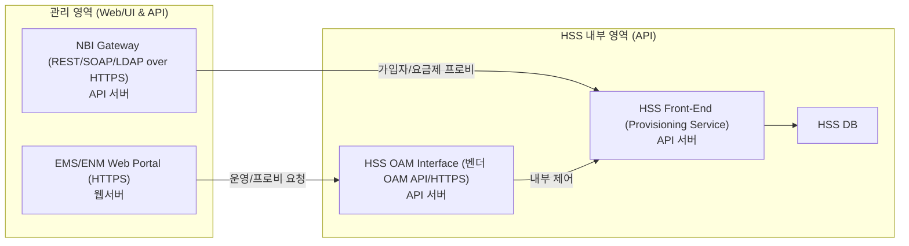

# SK텔레콤 HSS 웹셸 공격의 이해

HSS는 코어 신호 장비이지만, **운영·프로비저닝 면은 웹/API 시스템**입니다.
따라서 EMS 웹포털·NBI(API) 등 **웹 계층이 침해되면 HSS의 기밀 데이터(USIM 등)** 로 확장될 수 있습니다. 본 문서는 그 구조와 보안 시사점을 사례 중심으로 정리합니다.

## 핵심 요약

* **쟁점**: “HSS 자체가 웹서버인가?”가 아니라 **HSS 운영면이 웹/API 구조인지**가 핵심
* **사실**: EMS(Web UI)/NBI(API)를 통해 운영·프로비저닝이 이뤄짐 → **전통적 웹 공격면**(웹셸, 인증·세션, 권한)이 그대로 존재
* **결론**: **웹 보안 통제(WAF·mTLS·SSO/LDAPS·로깅)** 와 **관리망 분리**가 HSS 보호의 출발점

---

## 문서 구성

```
skt/hss/
 ├─ config/              # 다이어그램·표준 용어·템플릿 등 부속 자료
 ├─ about.md             # 배경, 문제 정의, 사건 개요(요약 타임라인)
 ├─ configuration.md     # 권장 아키텍처·보안 설정·정책 값
 └─ howtowork.md         # 운영 절차(계정/권한, 변경, 점검·감사, 사고 대응)
```

* **읽기 순서(추천)**

  1. [`about.md`](./about.md) → 2) [`howtowork.md`](./howtowork.md) → 3) [`configuration.md`](./configuration.md) → 4) `config/` 참고

---

## HSS 관리 경로(웹/API) 구성도



> 포인트: **서비스 신호 경로(Diameter 등)** 는 본 문서 범위 밖.
> 우리는 **관리 경로의 웹/API 면**(웹셸·권한·세션·입력검증·로그)을 방어 대상으로 봅니다.

---

## 보안 체크리스트(요약)

* **네트워크**: 관리망/업무망/서비스망 L3 분리, EMS·NBI는 전용 VLAN, 인터넷 직접 통신 금지
* **인증/권한**: VPN+MFA, EMS SSO+LDAPS, 최소권한·세션타임아웃, 계정분리(운영/배치/API)
* **암호화**: EMS/NBI **HTTPS+mTLS**, 파일 채널 **SFTP 고정**(키 기반)
* **경계**: 내부 WAF(EMS 앞단), API 스키마 검증, 레이트리밋/IP 화이트리스트
* **로깅**: **웹 요청 본문(POST-Body)**, API 호출 이력, OS **감사 로그**, DB 감사, Bastion **TTY 기록**
* **탐지/대응**: 웹셸 탐지 룰, 크리덴셜 탈취 징후, 비정상 프로비 이벤트 알림, 즉시 차단 플로우
* **운영**: 정기 리허설(접근/차단/로그 회수), 변경관리(MOC), 백업·복구 테스트

> 상세 항목은 [`configuration.md`](./configuration.md) 와 [`howtowork.md`](./howtowork.md) 에 각 표/체크리스트로 정리되어 있습니다.

---

## 용어 빠른 가이드

* **EMS/ENM**: HSS 운영 포털(웹 UI)
* **NBI**: Northbound Interface(REST/SOAP/LDAP 등 외부 연동 API)
* **HSS OAM/FE**: HSS 관리·프로비 중개 API / Front-End 서비스
* **웹셸(WebShell)**: 웹서버에 삽입되는 원격 명령 실행 스크립트

---

## 업데이트 메모

* v1.0: 초기 구조/체크리스트 게시, 웹/API 구성도 포함
* 다음: 실제 운영 예시(접속 포인트·계정 모델·보존 주기), 감사 템플릿 추가 예정

---

## 문의

* 보안 아키텍처/감사 템플릿 요청: 담당자에게 이슈 등록 또는 메일 문의

---
