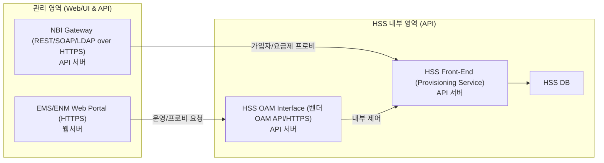

요지: **HSS 자체는 코어 신호 장비지만, 운영·프로비저닝 경로는 ‘웹/API 기반 시스템’**입니다. 따라서 **HSS “환경”은 전통적 웹 공격 범위에 포함**됩니다. 실제로 SKT 사건에서도 내부 서버들에서 **웹셸을 포함한 악성코드가 확인**되었고, 그 결과 **HSS 노드의 USIM 정보가 대량 유출**되었습니다. 즉, “DB가 있으니 웹서버가 아니다”라고 해도, **웹/API 관리면이 뚫리면 HSS의 기밀 데이터까지 도달**할 수 있다는 뜻입니다. ([대한민국 정책브리핑][1])

비유로 보면, **롯데카드**의 경우도 핵심 고객정보는 DB에 있지만 **웹셸이 다수 발견된 웹/서버가 침투 발판**이 되었습니다. 결국 **웹 계층이 뚫리면 DB 유출**로 이어질 수 있다는 점에서 맥락이 같습니다. HSS도 **웹 포털(EMS)·NBI(API)** 를 통해 운영되는 구성이라 **같은 공격면**을 가집니다. ([Korea Joongang Daily][2])

정리 문장(요청하신 톤):

> **HSS 시스템은 ‘웹시스템’ 면을 갖고 있으며, 롯데카드와 같은 웹 공격(예: 웹셸)으로 고객 기밀 정보가 유출될 수 있습니다. 실제 사건에서도 웹셸 등 웹 기반 침투 흔적이 확인되었고, 결과적으로 HSS의 USIM 정보 유출로 이어졌습니다.** ([대한민국 정책브리핑][1])

아래는 **웹/API 중심으로만** 단순화한 HSS 관리 구조입니다(서비스 경로·리모트·SIEM 등은 제외).

핵심 포인트(요약):

* **공격면**: EMS 웹 포털(HTTPS)·NBI(API)가 웹/WAF·인증·세션·권한·POST-Body 로깅 등 **전통적 웹 보안 통제**의 직접 대상.
* **사례 근거**: SKT 침해 조사 결과 **웹셸 포함 33종 악성코드**, **HSS 노드 접근 및 9.82GB USIM 데이터 압축·반출** 확인. ([대한민국 정책브리핑][1])
* **유사 맥락**: 롯데카드 사건에서도 **웹셸 다수**가 확인되어 웹 계층 침해 → 데이터 유출 위험으로 연결. ([Korea Joongang Daily][2])

원하시면 이 구조 기준으로 **웹/WAF 규칙, mTLS, 계정·권한, 로그(웹 요청 본문·감사) 체크리스트**를 바로 뽑아드릴게요.

[1]: https://www.korea.kr/news/policyNewsView.do?newsId=156721622&utm_source=chatgpt.com "SK텔레콤 침해사고 최종 조사결과 발표"
[2]: https://koreajoongangdaily.joins.com/news/2025-09-01/business/industry/Lotte-Card-reports-cyberattack-after-malware-found-on-internal-servers-last-month/2388889?utm_source=chatgpt.com "Lotte Card reports cyberattack after malware found on internal ..."
