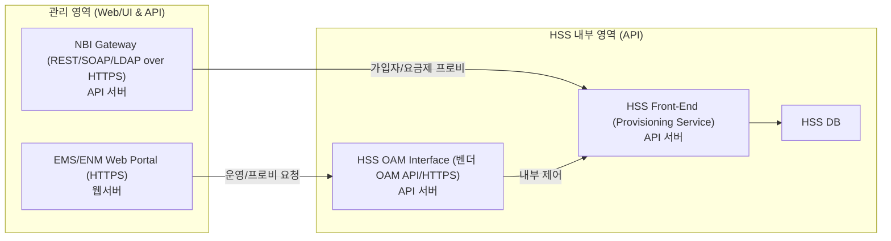
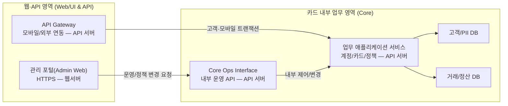

## SK텔레콤 HSS 웹셸 공격의 이해

요지: HSS 자체는 코어 신호 장비지만, 운영·프로비저닝 경로는 ‘웹/API 기반 시스템’입니다. 따라서 **HSS “환경”은 전통적 웹 공격 범위에 포함**됩니다. 실제로 SKT 사건에서도 내부 서버들에서 **웹셸을 포함한 악성코드가 확인**되었고, 그 결과 **HSS 노드의 USIM 정보가 대량 유출**되었습니다. 즉, “DB가 있으니 웹서버가 아니다”라고 해도, **웹/API 관리면이 뚫리면 HSS의 기밀 데이터까지 도달**할 수 있다는 뜻입니다. ([대한민국 정책브리핑][1])

비유로 보면, **롯데카드**의 경우도 핵심 고객정보는 DB에 있지만 **웹셸이 다수 발견된 웹/서버가 침투 발판**이 되었습니다. 결국 **웹 계층이 뚫리면 DB 유출**로 이어질 수 있다는 점에서 맥락이 같습니다. HSS도 **웹 포털(EMS)·NBI(API)** 를 통해 운영되는 구성이라 **같은 공격면**을 가집니다. ([Korea Joongang Daily][2])

정리 문장:

> **HSS 시스템은 ‘웹시스템’ 면을 갖고 있으며, 롯데카드와 같은 웹 공격(예: 웹셸)으로 고객 기밀 정보가 유출될 수 있습니다. 실제 사건에서도 웹셸 등 웹 기반 침투 흔적이 확인되었고, 결과적으로 HSS의 USIM 정보 유출로 이어졌습니다.** ([대한민국 정책브리핑][1])

---

### HSS 관리 경로(웹/API) — 최소 구성

**핵심 포인트(요약)**

* **공격면**: EMS 웹 포털(HTTPS)·NBI(API)가 웹/WAF·인증·세션·권한·POST-Body 로깅 등 **전통적 웹 보안 통제**의 직접 대상.
* **사례 근거**: SKT 침해 조사 결과 **웹셸 포함 다수 악성코드**, **HSS 노드 접근 및 USIM 데이터 압축·반출** 확인. ([대한민국 정책브리핑][1])
* **유사 맥락**: 롯데카드 사건에서도 **웹셸 다수**가 확인되어 웹 계층 침해 → 데이터 유출 위험으로 연결. ([Korea Joongang Daily][2])

---

## 롯데카드 시스템(“HSS-style” 뷰) — 동형화된 웹/API 구성

아래는 롯데카드의 운영면을 HSS 관리 경로와 **1:1 대응 개념**으로 표현한 최소 구조입니다.

---

## HSS ↔ 롯데카드: 구조 대응표(요약)

| HSS 구성요소              | 롯데카드(동형 구성)                    | 역할/공격면 공통점                           |
| --------------------- | ------------------------------ | ------------------------------------ |
| EMS Web Portal (웹서버)  | 관리 포털(Admin Web, 웹서버)          | 관리자 웹 UI: 인증·세션·파일 업로드·입력검증 취약점 위험   |
| NBI Gateway (API)     | API Gateway (모바일/외부 연동)        | 외부/내부 연동 API: mTLS, 스키마 검증, 레이트리밋 필요 |
| HSS OAM / FE (내부 API) | Core Ops Interface / 업무 애플리케이션 | 내부 제어/프로비 엔진: 권한 오남용·권한 상승 위험        |
| HSS DB                | 고객/PII DB·거래 DB                | 최종 목표 데이터 저장소: 대량 조회/덤프 탐지·DB 감사 필수  |

**결론(비교 관점)**
두 시스템 모두 **운영면이 웹/API 구조**이므로, **웹셸·취약 인증·세션 하이재킹·인풋 검증 실패** 같은 **전통적 웹 공격**이 내부 **업무 API → DB** 로 확장되는 동일한 위험을 가진다. 따라서 방어 전략도 **내부 WAF, mTLS, SSO/LDAPS, API 스키마 검증, POST-Body/DB 감사 로그**를 공통 필수로 본다.

---

[1]: https://www.korea.kr/news/policyNewsView.do?newsId=156721622 "SK텔레콤 침해사고 최종 조사결과 발표"
[2]: https://koreajoongangdaily.joins.com/news/2025-09-01/business/industry/Lotte-Card-reports-cyberattack-after-malware-found-on-internal-servers-last-month/2388889 "Lotte Card reports cyberattack after malware found on internal ..."
