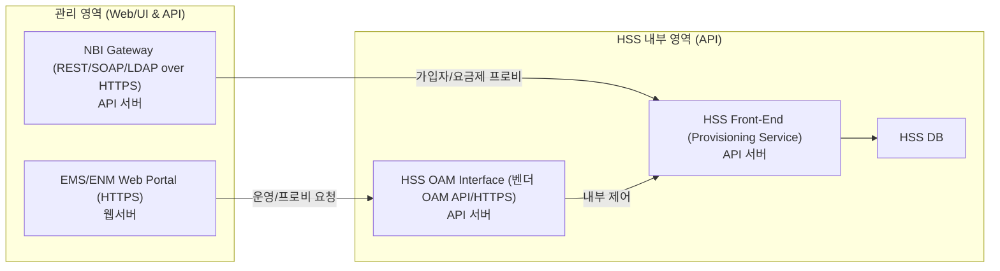

```mermaid
flowchart LR
  subgraph M["관리 영역 (Web/UI & API)"]
    EMS["EMS/ENM Web Portal (HTTPS)\n웹서버"]
    NBI["NBI Gateway (REST/SOAP/LDAP over HTTPS)\nAPI 서버"]
  end

  subgraph C["HSS 내부 영역 (API)"]
    HSS_OAM["HSS OAM Interface (벤더 OAM API/HTTPS)\nAPI 서버"]
    HSS_FE["HSS Front-End (Provisioning Service)\nAPI 서버"]
    HSS_DB["HSS DB"]
  end

  EMS -->|"운영/프로비 요청"| HSS_OAM
  NBI -->|"가입자/요금제 프로비"| HSS_FE
  HSS_OAM -->|"내부 제어"| HSS_FE
  HSS_FE --> HSS_DB
```
