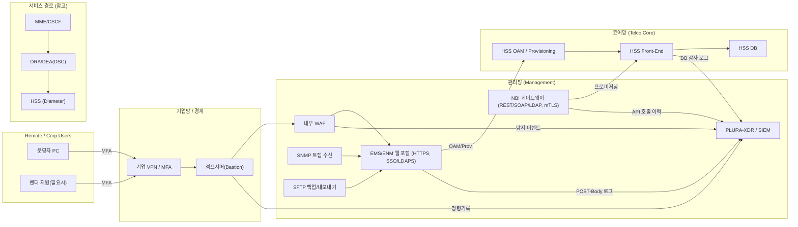

```mermaid
flowchart LR
  %% ===== Zones =====
  subgraph Z0["Remote / Corp Users"]
    OP["운영자 PC"]
    VENDOR["벤더 지원(필요시)"]
  end

  subgraph Z1["기업망 / 경계"]
    VPN["기업 VPN / MFA"]
    BASTION["점프서버(Bastion)"]
  end

  subgraph Z2["관리망 (Management)"]
    WAF["내부 WAF"]
    EMS["EMS/ENM 웹 포털 (HTTPS, SSO/LDAPS)"]
    NBI["NBI 게이트웨이 (REST/SOAP/LDAP, mTLS)"]
    SNMP["SNMP 트랩 수신"]
    SFTP["SFTP 백업/내보내기"]
    SIEM["PLURA-XDR / SIEM"]
  end

  subgraph Z3["코어망 (Telco Core)"]
    HSS_OAM["HSS OAM / Provisioning"]
    HSS_FE["HSS Front-End"]
    HSS_DB["HSS DB"]
  end

  %% ===== User access path =====
  OP -->|MFA| VPN
  VENDOR -->|MFA| VPN
  VPN --> BASTION
  BASTION --> WAF --> EMS
  EMS -->|OAM/Prov.| HSS_OAM

  %% ===== Provisioning / NBI =====
  NBI -->|프로비저닝| HSS_FE
  HSS_OAM --> HSS_FE
  HSS_FE --> HSS_DB

  %% ===== Aux channels =====
  SNMP --> EMS
  SFTP --> EMS

  %% ===== Logging / Evidence =====
  BASTION -->|명령기록| SIEM
  EMS -->|POST-Body 로그| SIEM
  NBI -->|API 호출 이력| SIEM
  WAF -->|탐지 이벤트| SIEM
  HSS_FE -->|DB 감사 로그| SIEM

  %% ===== Service signaling (reference) =====
  subgraph Z4["서비스 경로 (참고)"]
    MME["MME/CSCF"]
    DRA["DRA/DEA(DSC)"]
    HSS_SIG["HSS (Diameter)"]
  end
  MME --> DRA --> HSS_SIG
```
