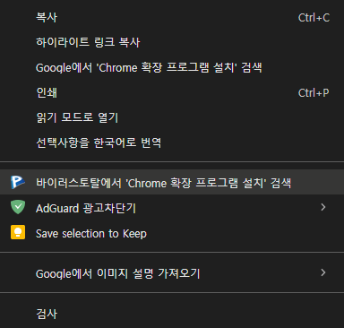

크롬 브라우저의 **컨텍스트 메뉴(오른쪽 클릭 메뉴)** 에 **"바이러스토탈에서 검색"** 옵션을 추가하려면 **Chrome 확장 프로그램** 등록 방법

---

## 1️⃣ **Chrome 확장 프로그램 설치 및 테스트** 
1. PLURA 확장 프로그램 다운로드 [👉](https://github.com/QubitSecurity/PLURA/tree/main/functions/browser-extention/chrome/web-search)
2. PLURA 폴더 생성 후 여기로 3가지 파일 이동

3. **Chrome 브라우저에서 `chrome://extensions/`로 이동**
4. **"개발자 모드" 활성화**
5. **"압축 해제된 확장 프로그램 로드" 버튼 클릭**
6. **PLURA 폴더를 선택**하여 확장 프로그램을 추가

이제 **텍스트를 선택하고 오른쪽 클릭하면 "바이러스토탈에서 검색" 옵션이 추가**됩니다.  
클릭하면 **VirusTotal 검색 페이지**가 열립니다. 🚀

---

