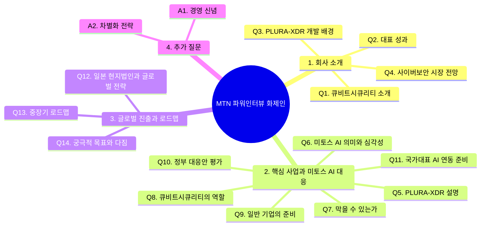

# MTN 파워인터뷰 화제인 질의응답 최종 구성안

> 출연: 큐비트시큐리티 신승민 대표  
> 방송: 2026년 5월 중 예정  
> 녹화일시: 2026년 5월 11일 월요일 오후 3시 45분  
> 녹화장소: 서울 영등포구 여의나루로 60, 여의도포스트타워 2층 스튜디오  
> 진행: 머니투데이방송 이인애 기자  
> 연출: 김성운 PD, 홍승일 PD  
> 작가: 황경희 작가  

---

## 1. 인터뷰 전체 흐름



---

## 2. 전체 질문 흐름 요약

```text
회사 소개
→ 대표 성과
→ PLURA-XDR 개발 배경
→ 사이버보안 시장 전망
→ PLURA-XDR의 실시간 해킹 대응 방식
→ 미토스 AI 해킹 공격의 심각성
→ 막을 수 있다는 메시지
→ 출시 전 대응 가능한 이유
→ 큐비트시큐리티의 역할
→ 일반 기업이 지금 해야 할 일
→ 정부 대응안 평가
→ 국가대표 AI와 사이버보안 회사의 전략적 연동
→ 일본 현지법인과 글로벌 진출
→ 중장기 로드맵
→ 궁극적 목표와 희망 메시지
```

---

## 3. 방송 리듬 기준 정리

| 구간 | 질문 | 역할 | 핵심 메시지 |
|---:|---|---|---|
| 1 | Q1~Q2 | 신뢰 형성 | 큐비트시큐리티는 기술과 운영 경험을 갖춘 사이버보안 플랫폼 회사 |
| 2 | Q3~Q4 | 시장 배경 | 공격은 AI로 고도화되고, 방어도 AI와 로그 중심으로 전환되어야 함 |
| 3 | Q5 | 제품 설명 | PLURA-XDR은 웹, 서버, PC, 계정 행위, 포렌식 증거를 통합 분석하는 플랫폼 |
| 4 | Q6~Q7 | 위기와 희망 | 미토스 AI 공격은 심각하지만 지금 준비하면 대응 가능 |
| 5 | Q8~Q9 | 실전 대응 | 공격면 최소화, 로그 생성, 실시간 분석과 차단이 핵심 |
| 6 | Q10~Q11 | 국가 해법 | 정부 대응은 방향보다 실행 기준이 중요하며, 국가대표 AI와 보안 플랫폼 연동 필요 |
| 7 | Q12~Q13 | 성장 전략 | 일본을 시작으로 글로벌 SaaS 보안 플랫폼으로 확장 |
| 8 | Q14 | 결론 | 누구나 AI 보안의 혜택을 누릴 수 있는 실시간 해킹 대응 플랫폼을 만들겠다는 다짐 |

---

# 4. 질의응답 구성안

## Q1. 바쁘신 가운데 출연해주셔서 고맙습니다. 먼저, 시청자들을 위해 큐비트시큐리티가 어떤 곳인지 간략하게 소개 부탁드립니다.

큐비트시큐리티는 **탐지·분석·차단·대응을 하나의 플랫폼에서 제공하는 통합 사이버보안 플랫폼 회사**입니다.

해킹 공격에 대응하기 위한 필수 기능은  
웹방화벽, EDR, 포렌식, 취약점 진단, 그리고 통합보안이벤트관리입니다.

큐비트시큐리티는 이러한 기능을 하나의 플랫폼으로 수직 통합해  
**제품과 서비스, 그리고 보안관제까지 함께 제공**하고 있습니다.

이처럼 여러 보안 기능을 직접 개발하고 운영하며,  
자체 플랫폼을 기반으로 보안관제까지 제공하는 회사는  
세계적으로도 드문 사례라고 말씀드릴 수 있습니다.

---

## Q2. 2014년 법인 설립 이후 12년 동안 성장해 오셨습니다. 그동안 회사가 이룬 많은 성과 중 대표적인 성과 몇 가지 짚어주신다면요?

가장 큰 성과는 **PLURA-XDR이라는 실시간 통합 해킹 대응 플랫폼을 상용화하고, 실제 현장에서 계속 고도화해 왔다는 점**입니다.

2016년 통합보안이벤트관리 제품을 시작으로,  
지금은 웹방화벽, EDR, 포렌식, 취약점 진단, AI 기반 탐지·차단 기능까지  
하나의 플랫폼으로 통합했습니다.

정부로부터 기술력도 인정받아  
우수 사이버보안 제품과 혁신제품으로 선정되었고,  
스케일업 팁스와 초격차 분야의 R&D 지원도 받고 있습니다.

해킹 대응 기술에 대해서는  
국내와 해외에서 여러 특허를 등록했습니다.

고객도 비영리단체, 대학, 지자체, 공공기관에서  
중소기업, 중견기업, 대기업까지 꾸준히 확대되고 있습니다.

무엇보다 가장 중요한 성과는  
저희 제품을 사용하는 고객들이 더 안전하게 운영될 수 있도록  
꾸준히 지켜 왔다는 점입니다.

---

## Q3. 대표 플랫폼인 ‘PLURA-XDR’을 개발하시게 된 배경은 무엇인지 궁금합니다.

출발점은 하나의 질문이었습니다.

**완벽한 해킹 공격 대응이 가능한가?**  
저는 이 질문에 “네”라고 답하고 싶었습니다.

그러기 위해서는 원칙이 필요했습니다.  
그 원칙이 바로 PLURA-XDR을 개발하게 된 출발점입니다.

**사이버보안의 제1원칙은 로그 분석**입니다.

해킹 공격은 아무리 고도화되어도 반드시 흔적을 남깁니다.  
그 흔적이 바로 웹 요청과 응답 본문, 로그인 행위, 서버와 운영체제 이벤트 같은 로그입니다.

그래서 저희는 처음부터  
로그를 생성하고, 수집하고, 실시간으로 분석하는  
통합보안이벤트관리 제품에서 출발했습니다.

이후 탐지된 공격을 실제로 차단하고 대응하기 위해  
웹방화벽, EDR로 영역을 확장했습니다.

그리고 지금은 AI 공격 시대입니다.  
AI가 공격한다면 방어도 AI로 해야 합니다.

그래서 PLURA-XDR은  
로그 기반 분석과 AI 자동 대응을 결합해  
실시간 해킹 대응을 제공하는 **독보적인 플랫폼**으로 발전해 왔습니다.

---

## Q4. 앞으로 사이버보안 시장의 전망에 대해서는 어떻게 보고 계시나요?

기존 보안 제품에도 같은 질문을 던질 수 있습니다.  
**완벽한 해킹 공격 대응이 가능한가?**

많은 분들이 어렵다고 생각합니다.

그 이유는 보안 제품들이 파편화되어 있고,  
서로 다른 제품들이 느슨하게 연결되어 있기 때문입니다.  
무엇보다 공격을 분석할 핵심 로그가 제대로 남지 않는 경우도 많습니다.

이 문제의 해결책은 결국 **플랫폼**입니다.  
그래서 앞으로 많은 보안 기업들이 플랫폼 경쟁에 나설 것으로 보고 있습니다.

여기에 미토스 AI로 대표되는  
공세적 해킹 AI의 등장 가능성까지 더해지고 있습니다.

앞으로 사이버보안 시장은  
단순한 보안 제품 경쟁이 아니라,  
**AI 공격에 대응할 수 있는 플랫폼 경쟁**이 될 것입니다.

결국 앞으로의 사이버보안 시장은  
**AI 공격을 막을 수 있는 플랫폼인가, 그렇지 못한 제품인가**로  
구분될 것이라고 봅니다.

---

# 5. 핵심 사업과 미토스 AI 해킹 공격 대응 전략

## Q5. 먼저, 큐비트시큐리티의 대표 플랫폼 ‘PLURA-XDR’이 화제인데요. 구체적으로 어떤 플랫폼인지, 또 어떤 방식으로 실시간 해킹 대응을 수행하는지 알기 쉽게 설명 부탁드립니다.

최근 주요 해킹 공격은  
크리덴셜 스터핑, APT, 제로데이,  
데이터 유출을 동반한 랜섬웨어로 요약할 수 있습니다.

이런 공격에 대응하려면  
웹방화벽, EDR, 포렌식, 취약점 진단, 통합보안이벤트관리가  
따로 움직이면 안 됩니다.

PLURA-XDR은 이 기능들을 하나의 플랫폼으로 통합해  
공격이 어디서 시작됐고, 어떤 경로로 확산됐으며,  
데이터 유출 위험이 있는지를 빠르게 확인합니다.

핵심은 **로그 기반 가시성**입니다.

로그가 있어야 해킹 피해, 즉 데이터 유출을 인지할 수 있고,  
로그가 있어야 해킹 경로를 파악해 실시간 대응할 수 있습니다.

PLURA-XDR은 웹 요청과 응답 본문, 로그인 행위,  
서버 이벤트, 운영체제 감사 로그를 생성·수집하고  
실시간으로 분석해 공격에 대응합니다.

또한 웹 요청·응답 로그 분석과  
운영체제 감사 정책 기반 로그 분석 기술로  
국내외 특허를 확보해 왔습니다.

결과적으로 PLURA-XDR은  
크리덴셜 스터핑, APT, 제로데이, 랜섬웨어를  
차단하는 독보적인 기술력을 갖추고 있습니다.

---

## Q6. 최근 세계적 이슈로 떠오른 ‘미토스 AI’의 정확한 의미는 무엇이고, 실제로 이것이 얼마나 심각한 문제가 되는지 설명 부탁드립니다.

미토스 AI는 **AI 기반 해킹 자동화 위협**으로 볼 수 있습니다.

기존에는 사람이 취약점을 찾고, 공격 코드를 만들고, 침투 경로를 조합해야 했습니다.  
그런데 미토스 AI와 같은 공세형 AI가 등장하면  
취약점 탐색, 공격 시나리오 생성, 우회 방법 제안, 악성코드 제작 지원 같은 과정이  
훨씬 빠르게 자동화될 수 있습니다.

이것이 심각한 이유는  
공격의 속도와 규모가 완전히 달라질 수 있기 때문입니다.

금융, 통신, 포털, ISP, IDC 같은 핵심 인프라에서  
대규모 데이터 유출이 발생할 수 있고,  
더 나아가 주요 서비스가 멈추는 상황도 배제하기 어렵습니다.

과거 2003년 1.25 인터넷 대란처럼  
국가 인터넷 환경이 큰 혼란을 겪었던 사례를 떠올려 보면,  
AI 기반 공격이 핵심 인프라를 향할 경우 그 파급력은 매우 클 수 있습니다.

따라서 미토스 AI 대응은  
개별 기업에게만 맡겨둘 문제가 아닙니다.

정부가 더 적극적으로 나서서  
국가 차원의 대응 준비를 긴급하게 추진해야 합니다.

---

## Q7. 그렇다면 막을 수는 있는 건지, 또 아직 출시 전인데 어떻게 대응할 수 있는지도 궁금합니다.

미토스 AI가 강력할 것으로 예상되지만,  
아직 영화 속 초지성 AI처럼 모든 것을 스스로 판단하고 완벽하게 공격하는  
AGI 수준은 아니라고 봅니다.

우선 대응 준비는 세 가지부터 바로 해야 합니다.

첫째, 외부에서 공격할 수 있는 **공격면을 줄여야 합니다.**  
둘째, 모든 주요 행위를 **로그로 남겨야 합니다.**  
셋째, 남겨진 로그를 **실시간으로 분석해야 합니다.**

놀랍게도 이 세 가지를 제대로 갖춘 곳은 매우 드뭅니다.  
그만큼 어렵고, 또 그만큼 지금 준비가 필요하다는 뜻입니다.

또 하나 중요한 점은  
미토스 AI 하나만 볼 문제가 아니라는 것입니다.

미토스 AI 이후에는 여러 공세형 AI가 계속 등장할 가능성이 있습니다.  
따라서 이제는 하나의 AI가 아니라,  
**공세형 AI가 확산되는 시대 전체**에 대비해야 합니다.

결국 공세적 AI 공격에 대응하려면  
AI가 로그를 실시간으로 분석하고 자동 대응할 수 있는 플랫폼이 필요합니다.

현재 시점에서는 금융, 통신, 공공, 민간을 막론하고  
이 준비가 충분히 되어 있다고 보기는 어렵습니다.

하지만 지금부터 이 체계를 제대로 구축한다면,  
미토스 AI 공격은 충분히 대응할 수 있습니다.

결론적으로 말씀드리면,  
**막을 수 있습니다.**

---

## Q8. 미토스 AI 해킹 공격 대응을 위해 앞장서고 있는 큐비트시큐리티의 역할은 무엇이라고 생각하시는지요?

큐비트시큐리티의 역할은  
모든 기업이 미토스 AI 공격에 대응할 수 있도록  
실전형 보안 플랫폼을 제공하는 것입니다.

PLURA-XDR은 쿠버네티스 기반으로 설계되어  
고객과 데이터가 증가해도 시스템을 유연하게 확장할 수 있습니다.

또한 클라우드 SaaS 방식으로 제공되기 때문에  
복잡한 구축 과정 없이 빠르게 사용할 수 있습니다.  
실제 1분이면 고객 자산을 실시간으로 보호하기 위한 준비를 시작할 수 있습니다.

이미 AI 기반 제로데이 공격 대응 기능을 제공하고 있기 때문에,  
미토스 AI와 같은 공세형 AI 공격에도 대응할 수 있는 기반을 갖추고 있습니다.

이제 해킹 공격은 서버나 PC 몇 대의 장애 문제가 아닙니다.  
기업의 존립과 신뢰를 좌우하는 핵심 리스크입니다.

그래서 지금 필요한 것은  
미토스 AI 공격을 실제로 탐지하고 차단할 수 있는  
실전형 보안 플랫폼이라고 말씀드리고 싶습니다.

---

## Q9. 일반 기업의 경우 막상 뭐부터 준비해야 할지 막막할 것 같은데요. 당장 무엇부터 준비하면 좋을까요?

앞서 말씀드린 것처럼 세 가지부터 시작하면 됩니다.

첫째는 **공격면 최소화**입니다.  
방화벽에서 `Any`로 열려 있는 접근을 줄여야 합니다.

둘째는 **로그 확보**입니다.  
웹 요청과 응답, 로그인과 계정 행위, 운영체제 감사 로그가  
제대로 남고 있는지 확인해야 합니다.

셋째는 **실시간 분석**입니다.  
공격이 진행되는 순간 로그를 분석하고,  
위험하다고 판단되면 차단까지 연결할 수 있어야 합니다.

PLURA-XDR은 이 세 가지를 하나의 플랫폼 안에서 제공합니다.  
따라서 미토스 AI 대응을 어디서부터 시작해야 할지 막막하다면,  
PLURA-XDR을 통해 바로 준비를 시작하실 수 있습니다.

---

## Q10. 얼마 전 정부에서도 미토스 대응과 관련해 AI 기반 실시간 방어 체계 구축과 글로벌 보안 협력체계 강화 등 대응안을 발표했는데요. 정부의 대응안에 대해서는 어떻게 생각하시는지요?

정부가 미토스 AI 위협을 인식하고,  
대응 필요성을 공식적으로 언급한 것은 의미가 있습니다.

다만 아쉬운 점은  
위협의 심각성에 비해 대응 강도가 매우 낮아 보인다는 것입니다.

태풍이나 해일이 곧 도착하는 상황이라면  
단순히 관심을 갖고 지켜보자는 수준으로는 부족합니다.

위기 경보 단계로 보면  
**관심·주의 단계가 아니라, 경계·심각 단계에 준하는 대응**이 필요합니다.

미토스 AI도 마찬가지입니다.

공세형 AI가 취약점을 찾고, 공격 경로를 조합하고,  
대규모 데이터 유출까지 자동화할 수 있는 상황이라면  
기업들이 알아서 준비하라는 수준으로는 부족합니다.

제로트러스트 아키텍처를 구축하라,  
사이버복원력을 강화하라,  
EDR 도입 여력이 없다면 스크립트를 주기적으로 실행하라는 식의 안내만으로는  
현재 위협 수준에 비해 대응이 너무 느슨해 보입니다.

지금 필요한 것은  
현장에서 즉시 실행할 수 있는 구체적인 대응 가이드입니다.

어떤 공격면을 우선 줄여야 하는지,  
어떤 로그를 반드시 남겨야 하는지,  
실시간 탐지와 차단을 어떻게 준비해야 하는지를 명확히 제시해야 합니다.

준비 여력이 부족한 기업에는  
클라우드 SaaS형 사이버보안 제품을 활용하도록  
정부가 더 적극적으로 안내해야 합니다.

또한 공세적 AI에 대응하기 위해서는  
방어형 AI 구축이 필요합니다.

이를 위해 국가대표 AI와 사이버보안 플랫폼 간의  
전략적 연동 방향까지 함께 안내되어야 합니다.

---

## Q11. 정부가 준비 중인 국가대표 AI와 사이버보안 회사의 전략적 연동을 위해 큐비트시큐리티는 어떻게 준비 중인가요?

PLURA-XDR은 현재 글로벌 AI와 연동하여  
해킹 공격 탐지와 차단 서비스를 제공하고 있습니다.

따라서 국가대표 AI와도 연동할 수 있는  
기술적 준비가 되어 있습니다.

기회가 주어진다면,  
국가대표 AI와 PLURA-XDR을 연동하여  
미토스 AI 대응을 빠르게 추진할 수 있습니다.

국가대표 AI와 PLURA-XDR 같은 보안 플랫폼이 전략적으로 연동된다면,  
대한민국이 자체 AI로 AI 해킹 공격에 대응하는  
**소버린 AI 사이버보안 체계**를 만들 수 있습니다.

이제는 국가대표 AI를 선발하는 데서 그치지 않고,  
실제 사이버보안 현장과 연결하는 단계로 나아가야 합니다.

큐비트시큐리티도 그 준비에 적극적으로 참여하겠습니다.

---

# 6. 글로벌 진출 현황과 중장기 로드맵

## Q12. 일본에 현지법인을 설립했다고 알고 있습니다. 구체적인 사업 진행 내용과 앞으로 진출 확대를 위한 전략은 무엇인지 함께 설명 부탁드립니다.

일본은 큐비트시큐리티에게 매우 중요한 시장입니다.

글로벌 진출의 전 단계이면서,  
한국어가 아닌 현지 언어로 서비스를 제공해야 하는 첫 번째 주요 시장이기 때문입니다.

일본도 사이버보안 대책이 대기업 중심으로 이루어져 있어,  
중소·중견기업이 자체적으로 보안 체계를 구축하기는 쉽지 않습니다.  
이 점은 한국 시장과 유사합니다.

다만 일본은 이미 많은 산업 분야가 클라우드 SaaS로 전환되고 있고,  
사이버보안 분야도 예외가 아니라고 보고 있습니다.

큐비트시큐리티는 클라우드 SaaS 기반의 PLURA-XDR을 통해  
일본 기업들의 사이버보안을 강화하는 데 중요한 역할을 하고자 합니다.

현재 일본 현지법인 설립과 함께  
잠재 파트너사들과 협력을 모색하고 있습니다.

사이버보안은 제품만으로 끝나는 사업이 아니라,  
보안관제 서비스와 현장 대응이 함께 중요합니다.  
그런 점에서 현지 파트너와의 협력은 매우 중요합니다.

올해 일본 시장 진출에 있어  
중요한 계기를 만들고자 합니다.

---

## Q13. 앞으로 큐비트시큐리티가 만들어갈 중장기 로드맵에 대해서도 알려주시죠.

큐비트시큐리티의 중장기 로드맵은 세 가지입니다.

첫째는 **PLURA-XDR의 AI 탐지·차단 기능을 고도화하는 것**입니다.

앞으로 공격은 더 빠르고 자동화될 것입니다.  
따라서 방어도 AI가 로그를 실시간으로 분석하고,  
위험한 공격을 자동으로 탐지하고 차단하는 방향으로 발전해야 합니다.

큐비트시큐리티는 PLURA-XDR을  
사람의 개입을 최소화한 **AI 에이전트 기반 자동 해킹 대응 플랫폼**으로  
계속 발전시켜 나가겠습니다.

둘째는 **국가대표 AI와 연동한 소버린 사이버보안 체계 구축**입니다.

AI 해킹 공격에 대응하려면  
대한민국의 보안 환경과 원본 로그를 이해하는 AI가 필요합니다.

큐비트시큐리티는 국가대표 AI와 PLURA-XDR의 전략적 연동을 통해  
대한민국이 자체 AI로 AI 해킹 공격에 대응할 수 있는  
소버린 AI 사이버보안 체계 구축에 기여하고자 합니다.

셋째는 **글로벌 SaaS 보안 플랫폼으로의 확장**입니다.

PLURA-XDR은 클라우드 SaaS 방식으로 제공되기 때문에  
해외 고객도 빠르게 사용할 수 있습니다.

결국 큐비트시큐리티의 목표는  
AI 공격 시대에 누구나 쉽고 빠르게 사용할 수 있는  
실시간 해킹 대응 플랫폼을 세계 시장에 제공하는 것입니다.

---

## Q14. 마지막으로 대표로서 꼭 이루고 싶은 궁극적인 목표와 다짐 한 말씀 부탁드립니다.

제가 꼭 이루고 싶은 목표는  
**누구나 사이버보안 걱정 없이 자신의 사업에 집중할 수 있는 세상**을 만드는 것입니다.

사이버보안은 이제 대기업이나 공공기관만의 문제가 아닙니다.  
중소기업, 스타트업, 병원, 학교, 비영리기관까지  
모두에게 필요한 기본 인프라가 되었습니다.

하지만 많은 조직은 여전히  
보안 인력과 예산이 부족합니다.

큐비트시큐리티는 PLURA-XDR을 통해  
누구나 합리적인 비용으로  
AI 기반 해킹 탐지와 차단을 사용할 수 있도록 하겠습니다.

비용 때문에 보안을 포기하지 않아도 되는  
안전한 사이버 세상을 만드는 것이 저희의 목표입니다.

정부가 믿고 지원해 주신 만큼,  
더 큰 성장과 실질적인 성과로 보답하겠습니다.

대한민국을 대표하는 AI 사이버보안 기업으로 성장할 수 있도록  
최선을 다하겠습니다.

---

# 7. 클로징 멘트

실시간 해킹 대응 플랫폼 **PLURA-XDR** 개발로 사이버보안 시장에 새로운 기준을 제시한 기업, 큐비트시큐리티에 대해 알아봤습니다.

특히 **미토스 AI 해킹 공격**과 같은 고도화된 AI 기반 신종 사이버 위협에 선제적으로 대응하며, 차세대 보안 기술 혁신을 이끌고 있는 큐비트시큐리티의 앞으로의 행보도 주목하겠습니다.

오늘 함께해주신 신승민 대표님 고맙습니다.

---

# 8. 추가 질문 답변

## 추가 Q1. 큐비트시큐리티의 대표로서 책임감도 무거우실 것 같은데요. 회사를 이끌어오시면서 가장 중요하게 생각하는 신념은 무엇인지요?

제가 가장 중요하게 생각하는 신념은  
**공격은 반드시 흔적을 남기고, 그 흔적을 놓치지 않으면 막을 수 있다**는 것입니다.

그 흔적이 바로 **로그**입니다.

웹 요청과 응답, 로그인 행위, 서버 이벤트, 운영체제 감사 로그가 제대로 남아 있다면  
공격이 언제 시작됐고, 어떤 경로로 진행됐으며, 어디까지 확산됐는지 알 수 있습니다.

그리고 그 로그를 AI가 실시간으로 분석하면  
공격으로 모든 것을 잃기 전에 탐지하고 차단할 수 있습니다.

큐비트시큐리티는 이 믿음으로 PLURA-XDR을 개발해 왔습니다.

앞으로도 고객이 사고 이후에야 피해를 확인하는 것이 아니라,  
공격이 진행되는 순간 막을 수 있는 보안을 제공하겠습니다.

---

## 추가 Q2. 사이버보안시장의 경쟁은 앞으로도 치열할 것 같습니다. 경쟁에서 우위를 점할 큐비트시큐리티만의 차별화 전략은 무엇인지요?

저희의 차별화 전략은  
**완벽에 가까운 실시간 해킹 대응을 합리적인 비용으로 제공하는 것**입니다.

앞으로 사이버보안은  
단순히 기능이 많은 제품의 경쟁이 아니라,  
실제 공격을 얼마나 빨리 탐지하고 차단할 수 있는가의 경쟁이 될 것입니다.

큐비트시큐리티는 PLURA-XDR을 통해  
웹방화벽, 호스트 보안, 포렌식, 통합보안이벤트관리, 취약점 진단,  
AI 탐지·차단 기능을 하나의 플랫폼으로 제공합니다.

또한 구축형뿐 아니라 클라우드 SaaS 방식으로도 제공하기 때문에  
대기업이나 공공기관뿐 아니라  
중소기업도 빠르게 사용할 수 있습니다.

결국 저희의 경쟁력은  
**고도화된 AI 해킹 대응을 쉽고, 빠르고, 합리적인 비용으로 제공하는 것**입니다.

이것이 큐비트시큐리티가  
AI 사이버보안 시장에서 우위를 점할 수 있는  
핵심 전략이라고 생각합니다.

---

# 9. 핵심 메시지 정리

## 방송용 한 문장

**AI가 공격하는 시대에는 AI로 방어해야 합니다.   
그 출발점은 원본 로그이고,   
PLURA-XDR은 그 로그를 실시간으로 분석해 탐지와 차단으로 연결하는 플랫폼입니다.**

## 반복 가능한 핵심 표현

- 미토스 AI 공격은 심각하지만, 지금 준비하면 대응할 수 있습니다.
- 공격자는 AI를 사용합니다. 방어자도 AI를 사용해야 합니다.
- AI가 판단하려면 원본 로그가 있어야 합니다.
- 웹 요청과 응답, 계정 행위, 서버 이벤트 로그가 핵심 증거입니다.
- 미토스 AI 대응은 사고 후 복구가 아니라, 공격 진행 중 탐지와 차단입니다.
- 국가대표 AI와 사이버보안 플랫폼의 전략적 연동이 필요합니다.
- PLURA-XDR은 AI 탐지·차단을 지금 바로 경험할 수 있는 플랫폼입니다.
