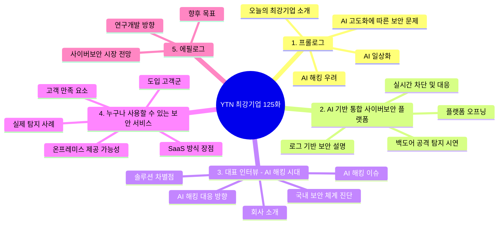

# YTN 최강기업 125화 큐비트시큐리티 촬영 구성안 정리본

> 프로그램: YTN 최강기업 125화  
> 주제: AI 기반 사이버보안 플랫폼과 AI 해킹 대응  
> 방송일시: 2026년 5월 30일 토요일 오전 11시 30분 YTN 사이언스 / 2026년 5월 31일 일요일 오후 8시 25분 YTN  
> 촬영일시: 2026년 5월 26일 화요일 오전 10시  
> 촬영장소: 서울시 강남구 강남대로 318, 9층, 타워837 본사  
> 담당: 최광균 PD, 최희진 작가  
> 출연: 신승민 대표, 담당자 인터뷰  

---

## 0. 심의 및 표현 주의사항

```text
회사명, 상품명, 서비스명 등은 심의로 인해 표현 불가합니다.
방송 대사에서는 "저희 회사", "저희 솔루션", "저희 플랫폼" 등으로 표현합니다.
```

### 방송 표현 기준

| 구분 | 사용 지양 표현 | 권장 표현 |
|---|---|---|
| 회사명 | 큐비트시큐리티 | 저희 회사 |
| 제품명 | PLURA-XDR | 저희 솔루션, 저희 플랫폼 |
| 서비스명 | 특정 상품명 | AI 기반 보안 플랫폼, 사이버보안 플랫폼 |
| 기술 설명 | 특정 브랜드 중심 설명 | 해킹 공격 탐지·분석·대응 중심 설명 |

---

## 1. 인터뷰 전체 흐름



---

## 2. 전체 구성 흐름 요약

```text
AI 일상화와 사회 변화
→ AI 고도화에 따른 보안 문제 제기
→ AI가 해킹에 이용될 수 있다는 우려
→ AI 시대를 대비한 사이버보안 기업 소개
→ 보안 플랫폼 화면 오프닝
→ 로그 기반 보안의 중요성 설명
→ 백도어 공격 탐지 및 대응 시연
→ 대표 인터뷰: 회사 소개와 AI 해킹 이슈
→ AI 해킹 대응 원칙: 방어도 AI 속도로 대응
→ 국내 보안 체계의 한계와 사이버보안 중심 전환 필요성
→ 솔루션 차별점: 원천 로그 데이터와 AI 분석
→ SaaS 방식으로 보안 도입 문턱을 낮춘 사례
→ 온프레미스 방식 제공 가능성
→ 다양한 고객군과 실제 탐지 사례
→ 고객 만족 포인트: 자동화 대응과 공격 흐름 가시성
→ AI 전환이 가속화될 사이버보안 시장 전망
→ 전 영역 AI 대응 연구개발 방향
→ 국내외 확장 목표
```

---

## 3. 방송 리듬 기준 정리

| 구간 | 주요 내용 | 역할 | 핵심 메시지 |
|---:|---|---|---|
| 1 | 프롤로그 | 문제 제기 | AI가 편리함을 주는 동시에 보안 위협도 키우고 있음 |
| 2 | 플랫폼 오프닝 | 제품 이해 | 복잡한 보안 장비 없이 AI로 보안 이벤트를 분석하고 대응 |
| 3 | 로그 기반 보안 | 원리 설명 | 해킹 공격은 반드시 흔적을 남기며, 그 흔적이 보안 이벤트와 로그 |
| 4 | 백도어 공격 시연 | 실증 | 공격 흔적을 실시간으로 탐지하고 대응하는 과정 제시 |
| 5 | 대표 인터뷰 | 시장 배경 | AI 해킹 시대에는 방어도 AI 속도로 움직여야 함 |
| 6 | 국내 보안 체계 진단 | 문제의식 | 정보보안·IT 통제 중심에서 실전 사이버보안 중심으로 전환 필요 |
| 7 | 솔루션 차별점 | 경쟁력 | AI가 정확히 판단할 수 있도록 원천 로그 데이터를 확보·분석 |
| 8 | SaaS와 온프레미스 | 도입 방식 | 중소기업부터 정부기관까지 환경에 맞게 활용 가능 |
| 9 | 고객 사례 | 신뢰 형성 | 웹쉘, 내부 PC 침투, 랜섬웨어 예방 등 실제 공격 대응 사례 보유 |
| 10 | 에필로그 | 비전 | AI 해킹 시대에 맞는 통합 보안 플랫폼으로 국내외 확장 |

---

# 4. 촬영 구성안

## 4-1. 프롤로그

### 화면 구성

| 화면 | 내레이션 / 메시지 |
|---|---|
| AI 활용하는 사람들 | 단순한 도구를 넘어 일상과 노동, 산업 전반의 패러다임을 바꾸어 가고 있는 AI |
| 운동하다 질문, 업무하다 AI 사용하는 모습 | AI가 우리 생활과 업무 속으로 빠르게 들어오고 있음 |
| AI 관련 이미지 | 하지만 AI가 고도화됨에 따라 많은 사회적 문제도 발생하고 있음 |
| 보안 관련 이미지 | 그중 하나가 바로 보안 문제 |
| AI 해킹 관련 자료 | AI가 해킹에 이용된다면 과연 보안은 안전하게 지켜질 수 있을까? |
| 회사 외경 | 그래서 찾아간 오늘의 최강기업 |
| 내부 사무실 스케치 | AI 시대를 대비한 사이버보안 기술을 보유한 기업 소개 |

---

## 4-2. 오프닝 대화

**피디/**  
안녕하세요.

**담당자/**  
네, 안녕하세요.

**피디/**  
지금 보고 계신 게 보안 플랫폼인가요?

**담당자/**  
네, 맞습니다!  
저희 플랫폼은 복잡한 보안 장비 구축 없이  
다양한 보안 이벤트 로그 데이터를 수집하고 AI로 실시간 분석해  
공격 징후를 빠르게 탐지하고 대응할 수 있는 플랫폼입니다!

---

# 5. AI 기반 통합 사이버보안 플랫폼

## 5-1. 섹션 도입

### 화면 구성

| 화면 | 내레이션 / 메시지 |
|---|---|
| 사이버 공격 자료 | AI에 의한 사이버 공격을 AI로 막는다 |
| 키워드 강조 | 핵심 키워드는 로그 |

---

## Q1. ‘로그 기반 보안’이 중요한 이유는 무엇인가요?

해킹 공격은 아무리 정교해도 반드시 흔적을 남깁니다.  
그 흔적이 바로 웹 요청, 서버 기록, PC 행위, 계정 로그인 기록과 같은 로그입니다.

**담당자/**  
해커들의 백도어 공격을  
실시간으로 탐지하고 대응하는 과정을  
한번 보여드리겠습니다.

---

## 5-2. 백도어 공격 시연 구성

### 화면 구성

| 화면 | 설명 |
|---|---|
| 백도어 공격 화면 예시 | 시스템의 인증 절차를 우회하여 피해자 네트워크에 무단 진입하는 비밀 통로를 만들고 정보를 탈취하는 사이버 공격 설명 |
| 플랫폼 조회 화면 | 탐지 결과 조회 |
| 단계별 탐지 필터 | 필터와 설명 내용을 보여주며 탐지 과정 설명 |
| 차단 모드 ON 인서트 | 실시간 차단 또는 강제 종료 가능성 제시 |
| 악성코드 실행 화면 | 프로그램이 자동으로 탐지하고 종료되는 장면 |

**담당자/**  
방금 이 공격에 대한  
탐지 결과를 플랫폼에서 조회해보겠습니다.

---

## Q2. 플랫폼은 어떤 방식으로 해킹 공격을 탐지하고 대응하나요?

저희 플랫폼은 웹, 서버, PC, 계정에서 발생하는 보안 이벤트 데이터를 함께 분석합니다.  
공격이 어느 지점에서 시작됐는지, 어떤 행위로 이어지는지, 현재 위험 수준이 어느 정도인지 AI가 실시간으로 판단합니다.

단순히 경고를 많이 보여주는 것이 아니라,  
공격 흐름을 분석해 실제 대응이 필요한 이벤트를 빠르게 찾아내는 것이 핵심입니다.

---

## Q3. 탐지 후에는 어떤 조치들을 할 수 있나요?

탐지 이후에는 대응 필터를 통해  
위험한 접근을 실시간으로 차단하거나,  
악성 행위를 수행하는 프로그램을 강제로 종료할 수 있습니다.

필요한 경우 보안관제와 연계해  
추가 확인과 대응 조치까지 이어갈 수 있습니다.

---

# 6. 대표님 인터뷰 - AI 해킹 시대와 대응 방향

## Q4. 간단한 회사 소개 부탁드립니다.

저희는 AI 기반 사이버보안 플랫폼 기업입니다.  
해킹 공격을 빠르게 탐지하고 대응하는 첨단 보안 기술을 통해  
기업의 웹사이트, 서버, PC, 계정 등 주요 IT 자산을 안전하게 지키고 있습니다.

고객이 해킹 걱정 없이  
안전하게 디지털 서비스를 운영할 수 있도록 돕는 것이 저희의 역할입니다.

---

## Q5. 최근 AI 해킹에 대한 우려가 큰데요, 큰 이슈가 되고 있는 사안이 있다고 들었습니다.

최근 미국의 한 기업이 내놓은 보안 특화 AI가 큰 화두가 되고 있습니다.

예전에는 사람이 직접 공격 대상을 찾고 하나씩 시도했다면,  
이제는 AI가 취약점을 찾고 공격 방법까지 빠르게 조합할 수 있습니다.

실제로 이미 AI가 해킹 공격에 활용된 정황에 대한 보고들도 나오고 있습니다.  
이제는 본격적인 AI 해킹 공격 시도가 시작됐다고 보아야 합니다.

이렇게 되면 사람이 일일이 확인하고 대응하는 방식만으로는 한계가 있습니다.

그래서 앞으로의 보안은  
공격이 들어온 뒤에 막는 수준을 넘어,  
공격 징후를 빨리 보고, 판단하고, 즉시 대응하는 것이 핵심입니다.

---

## Q6. AI 해킹, 어떻게 대응해야 하나요?

공격자가 AI를 사용한다면, 방어자도 AI의 속도로 대응해야 합니다.

AI가 취약점을 찾고, 공격 방법을 조합하고, 기존 탐지 규칙을 우회한다면  
방어 체계도 실시간으로 탐지하고 분석하고 대응할 수 있어야 합니다.

사람이 일일이 확인하고 판단하는 방식만으로는  
AI 해킹의 속도를 따라가기 어렵습니다.

결국 AI 해킹 공격은  
AI 기반 보안 플랫폼으로 탐지하고 대응해야 합니다.

---

## Q7. 현재 국내 보안 시스템이 어느 정도의 보안 능력을 갖췄다고 보시는지요?

국내 보안 체계는 아직 정보보안과 IT 통제 중심의 사고에 머물러 있다고 봅니다.

AI가 취약점을 찾고, 공격 방법을 조합하고, 자동으로 공격을 시도하는 시대에는  
기존 방식만으로는 충분하지 않습니다.

지난 4월 초, AI가 대규모 취약점을 찾아낼 수 있다는 사례가 공개된 이후  
벌써 두 달 가까이 지났습니다.

그런데도 국내 대응 논의는 여전히 제로트러스트, 사이버복원력처럼  
기존 정보보안과 IT 관리 체계의 연장선에 머무는 경우가 많습니다.

AI 해킹에 대응하려면 보안 체계도 달라져야 합니다.  
사고가 난 뒤 복구하는 것만으로는 부족합니다.

공격이 시작되는 순간부터 보안 이벤트를 실시간으로 분석하고,  
AI로 판단하고, 피해가 커지기 전에 대응할 수 있어야 합니다.

앞으로의 보안 기준은  
얼마나 많은 장비를 갖췄느냐가 아니라,  
공격 징후를 얼마나 빨리 보고, 판단하고, 끊어낼 수 있느냐가 되어야 합니다.

결국 이제는 정보보안과 IT 통제 중심에서 벗어나,  
실제 해킹 공격을 탐지하고 대응하는 사이버보안 중심 체계로 전환해야 합니다.

하지만 현재로서는 이런 전환이 충분히 준비되어 있다고 보기는 어렵습니다.

---

## Q8. AI 해킹 공격을 막을 수 있는 최강기업 보안 솔루션의 차별점은 무엇인가요?

저희는 해킹 공격에 직접 대응하기 위한  
사이버보안 체계 전반을 하나의 플랫폼으로 제공하고 있습니다.

AI 해킹에 대응하려면 방어 체계도 AI 기반으로 구축되어야 합니다.  
하지만 AI가 해킹을 제대로 탐지하고 판단하려면  
가장 중요한 것이 정확한 데이터입니다.

공격자가 아무리 정교하게 움직여도  
웹 요청, 서버 기록, PC 행위, 계정 로그인 기록 같은 원천 로그에는  
반드시 흔적이 남습니다.

저희는 이 원천 로그 데이터를 확보하고,  
AI가 이를 실시간으로 분석해 공격 징후를 판단할 수 있도록 하는 기술을 보유하고 있습니다.

특히 이 분야와 관련한 글로벌 특허 기술을 기반으로  
AI 해킹 대응에 필요한 데이터 중심 보안 플랫폼을 제공한다는 점이  
가장 큰 차별점입니다.

---

## 6-1. 특허·인증서 및 플랫폼 시연 구성

### 화면 구성

| 화면 | 내레이션 / 메시지 |
|---|---|
| 각종 특허증, 인증서 | AI 기반 보안 기술을 선제적으로 연구해 온 최강기업 |
| 국내외 특허 자료 | 관련 국내외 특허 출원 및 기술력 강조 |
| 플랫폼 시연 | 확장 탐지 및 대응, 통합 보안 이벤트 관리, 웹 방화벽, 호스트 보안, 포렌식, 취약점 점검, 보안 관제 화면 등 |
| 플랫폼 내 관리 화면 | 따로 관리하던 보안 기능들을 하나의 플랫폼으로 관리할 수 있어 운영 부담을 줄임 |
| 대시보드 화면 | 보안 이벤트와 대응 현황을 한눈에 확인 |

---

# 7. 누구나 사용할 수 있는 보안 서비스

## 7-1. 섹션 도입

| 화면 | 내레이션 / 메시지 |
|---|---|
| 아이디를 입력해 플랫폼 로그인 | 최강기업 플랫폼의 또 다른 장점 |
| 플랫폼 메인 화면 | 보안 시스템 도입의 문턱을 크게 낮춤 |

---

## Q9. SaaS 방식 보안 서비스의 장점은 무엇인가요?

SaaS 방식의 가장 큰 장점은  
복잡한 장비를 직접 사거나 구축하지 않아도  
클라우드 기반으로 빠르게 보안을 시작할 수 있다는 점입니다.

기존 보안 솔루션은 비용이 높고 운영도 어려워서  
중소기업이나 지방 소재 기업이 도입하기 쉽지 않았습니다.

하지만 SaaS 방식은 필요한 보안 기능을 서비스로 이용하기 때문에  
초기 비용 부담을 줄이고, 더 쉽게 해킹 대응 플랫폼을 도입할 수 있습니다.

또 보안관제까지 함께 제공받을 수 있어  
전문 보안 인력을 직접 채용하기 어려운 기업에도 도움이 됩니다.

쉽게 말씀드리면,  
제품 도입부터 운영, 보안관제까지의 부담을 줄이고  
기업이 해킹 대응을 더 쉽고 안정적으로 할 수 있도록 돕는 방식입니다.

그래서 SaaS 방식 보안 서비스는  
중소기업부터 대기업까지, 지자체부터 중앙정부까지  
폭넓게 활용할 수 있는 새로운 사이버보안 플랫폼이라고 할 수 있습니다.

---

## Q10. 내부 보안 기준에 따라 SaaS 외 다른 방식으로도 서비스 제공이 가능한가요?

네, 가능합니다.

기본적으로는 SaaS 방식으로 빠르고 편리하게 서비스를 제공하지만,  
내부 보안 기준이나 망 분리 정책이 엄격한 기관의 경우에는  
온프레미스 방식으로도 제공하고 있습니다.

특히 국방, 금융, 공공기관처럼  
보안 요구 수준이 높은 분야에서는  
전용 하드웨어와 소프트웨어를 함께 구성한 일체형 보안 플랫폼 형태로 제공할 수 있습니다.

이를 통해 고객의 보안 정책과 운영 환경에 맞춰  
SaaS, 온프레미스 등 다양한 방식으로 해킹 대응 체계를 구축할 수 있습니다.

---

# 8. 대표님 인터뷰 - 고객과 실제 사례

## Q11. 주로 어떤 기업이나 기관에서 많이 도입하고 있나요?

저희 플랫폼은 특정 업종에만 쓰이는 보안 솔루션이 아닙니다.

홈페이지가 있고, 서버와 PC를 운영하고,  
계정 로그인을 관리해야 하는 기업과 기관이라면  
모두 대상 고객이 될 수 있습니다.

실제로 지자체, 공공기관, 대기업, 교육기관, 이커머스 기업,  
비영리 단체까지 다양한 분야에서 활용되고 있습니다.

서울시와 같은 지자체부터 주택도시보증공사와 같은 공공기관,  
포스코DX, 삼성전자서비스 같은 대기업,  
YBM, 이투스 같은 교육기관,  
그리고 비영리·종교 관련 기관까지 폭넓게 사용하고 있습니다.

그만큼 사이버보안은 이제 특정 기업만의 문제가 아니라,  
디지털 서비스를 운영하는 모든 조직의 기본 인프라가 되고 있습니다.

---

## Q12. 공격 흔적을 빠르게 찾아낸 실제 사례가 있다면 소개 부탁드립니다.

네, 여러 사례가 있습니다.

대표적으로 공격자가 홈페이지 서버에  
정상 이미지 파일처럼 위장한 악성 코드를 업로드한 사례가 있었습니다.

겉으로는 이미지처럼 보였지만,  
실제로는 해커가 서버를 조종하기 위한 웹쉘 코드였습니다.

저희 플랫폼은 업로드 기록과 서버 행위를 함께 분석해  
이상 징후를 빠르게 탐지했고,  
서버 장악으로 이어지기 전에 대응할 수 있었습니다.

또 내부 직원 PC가 감염된 뒤  
그 PC를 통해 서버로 침투하려는 시도도 탐지한 사례가 있습니다.

직원이 실수로 악성 파일을 다운로드했지만,  
랜섬웨어로 확산되기 전 이상 행위를 찾아내  
피해를 예방한 경우도 있습니다.

이처럼 해킹 공격은 반드시 흔적을 남기기 때문에,  
웹, 서버, PC, 계정의 보안 이벤트를 함께 분석하면  
공격 흐름을 빠르게 찾아내고 대응할 수 있습니다.

---

## Q13. 실제 고객들이 가장 만족하는 부분은 어떤 점인가요?

고객들이 가장 만족하는 부분은  
해킹 공격을 빠르게 탐지하고 대응할 수 있다는 점,  
그리고 그 과정을 눈으로 확인할 수 있다는 점입니다.

사이버보안 전문가가 아닌 고객도 많기 때문에,  
단순히 어려운 경고 메시지만 보여줘서는 안 됩니다.

공격이 어디서 시작됐고,  
어떤 과정으로 진행됐으며,  
어떻게 대응했는지를 쉽게 설명할 수 있어야 합니다.

저희 플랫폼은 보안 이벤트 데이터를 기반으로  
공격 흐름을 한눈에 보여주고,  
필요한 대응까지 자동화해 고객의 보안 운영 부담을 줄여줍니다.

결국 고객 입장에서는  
해킹 공격으로부터 안전하게 보호받으면서도,  
현재 어떤 일이 일어나고 있는지 명확하게 알 수 있다는 점에서  
높은 만족을 느끼고 있습니다.

---

# 9. 에필로그

## 9-1. 화면 구성

| 화면 | 메시지 |
|---|---|
| 하이라이트 | AI 기반 보안 플랫폼과 실제 탐지 장면 요약 |
| 회의하는 모습 등 | AI 해킹 시대를 준비하는 기업 이미지 |

---

## Q14. 앞으로 사이버보안 시장은 어떻게 변화할 것으로 보시나요?

이제 AI 해킹은 현실로 받아들여야 합니다.

공격자가 AI를 활용한다면  
방어도 당연히 AI로 해야 합니다.

앞으로 사이버보안 분야는  
가장 빠른 AI 전환을 경험하게 될 것입니다.

AI가 취약점을 찾고, 공격 방법을 조합하고, 자동으로 공격을 시도하는 시대에  
AI 대응 체계가 없다면  
기업과 국가가 지금까지 경험하지 못한 수준의 해킹 피해를 겪을 수 있습니다.

이제 사이버보안은 단순한 IT 관리 문제가 아닙니다.  
국가 안보와 사회 안전을 지키는 핵심 영역입니다.

그만큼 정부와 기업 모두  
AI 해킹 시대에 맞는 비상한 준비 자세로 대응해야 한다고 봅니다.

---

## Q15. 변화할 시장에 대비하여 새롭게 연구개발 중이신 부분은 무엇인가요?

현재는 AI 대응 기능을 보안 기능별로 단계적으로 제공하고 있습니다.

예를 들어 웹 공격에 대해서는  
AI가 공격 징후를 분석하고 탐지하는 기능을 제공하고 있습니다.

특히 공격면에서 가장 중요한 영역은  
AI를 활용해 높은 수준으로 자동화 대응할 수 있도록 구현하고 있습니다.

다만 해킹 공격 기법은 계속 진화하고 있고,  
기존 탐지 방식을 우회하려는 시도도 늘어나고 있습니다.

그래서 저희는 AI 기반 탐지와 대응 기능을  
더 많은 보안 영역으로 확대하고 있습니다.

올해 안에는 이러한 기능을 전 영역으로 넓혀  
AI 해킹 시대에 맞는 통합 보안 플랫폼으로 고도화하는 것이 목표입니다.

---

## Q16. 최강기업이 앞으로 목표하는 방향은 무엇인가요?

저희의 목표는 먼저 우리나라의 기업, 지자체, 공공기관을  
해킹 공격으로부터 안전하게 보호하는 것입니다.

사이버보안은 이제 대기업만의 문제가 아니라  
중소기업, 지방 기업, 공공기관 모두에게 필요한 기본 인프라가 되었습니다.

저희는 더 많은 조직이 AI 기반 보안 플랫폼을 통해  
쉽고 빠르게 해킹에 대응할 수 있도록 돕고자 합니다.

나아가 일본 등 해외 시장으로도 진출해  
글로벌 고객들이 해킹 걱정 없이  
자신의 업무와 서비스에 집중할 수 있도록 지원하는 것이 목표입니다.

---

# 10. 클로징 멘트 초안

AI가 일상과 산업을 바꾸는 시대,  
해킹 공격 역시 더 빠르고 정교하게 진화하고 있습니다.

오늘 만나본 최강기업은  
AI 기반 사이버보안 플랫폼을 통해  
공격 징후를 빠르게 찾고, 분석하고, 대응하는 기술을 선보였습니다.

AI가 공격하는 시대에는  
방어도 AI의 속도로 움직여야 합니다.

중소기업부터 대기업, 지자체와 공공기관까지  
더 많은 조직이 안전하게 디지털 서비스를 운영할 수 있도록 돕는  
AI 사이버보안 플랫폼의 앞으로가 기대됩니다.

---

# 11. 핵심 메시지 정리

## 방송용 한 문장

**AI가 공격하는 시대에는 방어도 AI로 해야 합니다.  
그 출발점은 정확한 원천 로그 데이터이고,  
저희 플랫폼은 그 데이터를 AI로 실시간 분석해 해킹 공격을 탐지하고 대응합니다.**

## 반복 가능한 핵심 표현

- 해킹 공격은 아무리 정교해도 반드시 흔적을 남깁니다.
- AI가 공격한다면 방어도 AI의 속도로 움직여야 합니다.
- 보안의 기준은 장비를 얼마나 많이 갖췄느냐가 아니라, 공격 징후를 얼마나 빨리 보고 판단하고 끊어낼 수 있느냐입니다.
- AI가 정확히 판단하려면 정확한 원천 로그 데이터가 필요합니다.
- 웹, 서버, PC, 계정에서 발생하는 보안 이벤트를 함께 분석해야 공격 흐름을 볼 수 있습니다.
- SaaS 방식은 보안 도입 비용과 운영 부담을 낮추고, 보안관제까지 함께 활용할 수 있게 합니다.
- 중소기업부터 대기업, 지자체부터 중앙정부까지 폭넓게 활용할 수 있는 새로운 사이버보안 플랫폼입니다.
- 사이버보안은 이제 단순한 IT 관리 문제가 아니라 기업 생존과 국가 안보에 직결된 문제입니다.

---

# 12. 촬영 체크리스트

## 화면 자료

- [ ] AI 활용 일상 이미지
- [ ] AI 관련 이미지
- [ ] 보안 관련 이미지
- [ ] AI 해킹 관련 자료
- [ ] 회사 외경
- [ ] 내부 사무실 스케치
- [ ] 플랫폼 로그인 화면
- [ ] 플랫폼 메인 화면
- [ ] 백도어 공격 예시 화면
- [ ] 탐지 결과 조회 화면
- [ ] 단계별 탐지 필터 화면
- [ ] 차단 모드 ON 화면
- [ ] 악성코드 자동 탐지 및 종료 화면
- [ ] 특허증 및 인증서
- [ ] 대시보드 화면
- [ ] 보안관제 화면
- [ ] 회의 장면 및 에필로그용 스케치

## 인터뷰 포인트

- [ ] 회사명·제품명·서비스명 직접 언급 지양
- [ ] “저희 회사”, “저희 솔루션”, “저희 플랫폼”으로 표현
- [ ] 로그를 단순 기록이 아니라 “보안 이벤트 데이터”로 설명
- [ ] AI 해킹 대응은 “공격 징후를 빨리 보고, 판단하고, 대응하는 것”으로 설명
- [ ] 제로트러스트·사이버복원력은 부정하지 않고, AI 해킹 대응에는 실시간 탐지·분석·대응이 추가로 필요하다는 구조로 설명
- [ ] 고객사명 사용 가능 여부 사전 확인
- [ ] “완벽”, “전무” 등 과도한 단정 표현은 필요 시 완화

---

# 13. 문구 교정 메모

| 원문/주의 표현 | 권장 표현 |
|---|---|
| 해킹으로 부터 | 해킹으로부터 |
| 그렇치 | 그렇지 |
| 드린 다는 | 드린다는 |
| 하드웨어 일체용 | 전용 하드웨어와 소프트웨어를 함께 구성한 일체형 보안 플랫폼 |
| 이벤트 로그 데이터 | 보안 이벤트 데이터 또는 보안 이벤트 로그 데이터 |
| 완벽하게 자동화 대응 | 높은 수준으로 자동화 대응 |
| 전혀 준비가 안 되어 있음 | 충분히 준비되어 있다고 보기 어려움 |
| 해킹 고통으로부터 벗어남 | 해킹 대응 부담을 줄임 |
