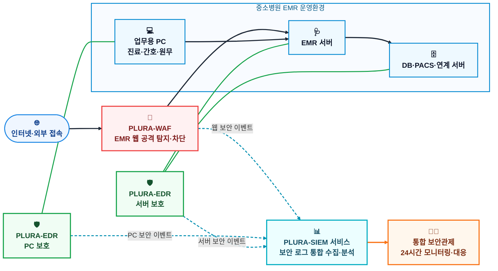

# 중소병원 EMR·사이버보안 통합 구독 서비스 제안

## EMR 운영부터 사이버위협 대응까지 하나의 서비스로 제공합니다

중소병원은 환자의 진료정보와 개인정보를 대량으로 처리하지만, 전문 보안인력과 예산이 부족하여 랜섬웨어, 계정 탈취, 서버 침해 및 개인정보 유출 사고에 충분히 대응하기 어렵습니다.

특히 병원 내에는 EMR이 설치된 Windows PC뿐만 아니라 Windows·Linux 서버, 데이터베이스, PACS 및 외부 연계 시스템이 함께 운영되고 있어 단일 보안제품만으로는 전체 환경을 보호하기 어렵습니다.

이에 **중소병원 EMR 솔루션과 통합 사이버보안 서비스를 구독 방식으로 함께 제공**하여, 병원이 별도의 보안제품과 관제업체를 각각 선정하지 않아도 되는 통합 서비스를 제안합니다.

---

## 제안 서비스

> **중소병원 EMR 솔루션**  
>    
> Windows PC·서버·Linux 통합 보안  
> 24시간 통합 보안관제  
>   = 병원 업무와 환자정보를 보호하는 통합 구독 서비스

| 구분      | 주요 제공 내용                                  |
| ------- | ----------------------------------------- |
| EMR 서비스 | 진료, 원무, 수납, 처방 및 병원 업무 지원                 |
| PC 보안   | 진료실·원무실·간호스테이션 Windows PC 위협 탐지 및 대응      |
| 서버 보안   | EMR·DB·PACS·연계 시스템의 Windows 및 Linux 서버 보호 |
| 웹 보안    | 인터넷에 공개된 예약·접수·병원 웹서비스 공격 탐지 및 차단         |
| 계정 보안   | 비정상 로그인, 무차별 대입, 계정 탈취 및 관리자 권한 악용 탐지     |
| 랜섬웨어 대응 | 악성 행위 탐지, 피해 확산 차단 및 침해 흔적 분석             |
| 통합 관제   | 보안 이벤트 실시간 분석, 위험 알림, 대응 지원 및 정기 보고       |
| 사고 대응   | 침해사고 발생 시 원인 분석, 차단·격리·포렌식 및 복구 지원        |

---

## 서비스 제공 방식

병원은 초기 보안시스템 구축에 따른 비용과 운영 부담 없이, 병원 규모와 보호 대상 수량에 따라 **월 구독 방식**으로 서비스를 이용할 수 있습니다.

EMR 솔루션 회사가 병원별 IT 환경을 파악하고, 보안 전문기업이 PC·서버·웹서비스에서 발생하는 위협을 통합 분석합니다. 탐지된 위험은 병원 담당자에게 안내하고, 필요한 경우 원격 대응과 사고 분석을 지원합니다.

### 통합 보안 서비스 구성

PLURA-WAF는 외부에서 접근하는 EMR 웹서비스의 공격을 탐지·차단하고, PLURA-EDR은 병원 업무용 PC와 Windows·Linux 서버를 보호합니다. 각 보안 이벤트는 PLURA-SIEM 서비스에서 통합 분석되며, 24시간 보안관제를 통해 위험 알림과 대응을 제공합니다.

---

## 병원이 얻는 효과

* EMR과 보안서비스를 하나의 계약과 구독 방식으로 도입
* 별도의 보안 전문인력 없이 전문 관제서비스 이용
* Windows PC, Windows Server, Linux 및 웹서비스 통합 보호
* 랜섬웨어와 개인정보 유출 사고의 조기 탐지 및 피해 확산 방지
* 보안제품별 관리 복잡성과 초기 구축비용 절감
* 사고 발생 시 원인과 대응 이력을 확인할 수 있는 증거 확보

---

## 제안 목표

단순히 EMR 프로그램을 공급하는 것을 넘어, 병원의 진료업무가 중단되지 않고 환자정보가 안전하게 보호될 수 있도록 지원합니다.

**EMR 운영과 사이버보안을 하나의 구독 서비스로 통합하여 중소병원도 대형병원 수준의 지속적인 보안 대응체계를 갖출 수 있도록 하겠습니다.**
