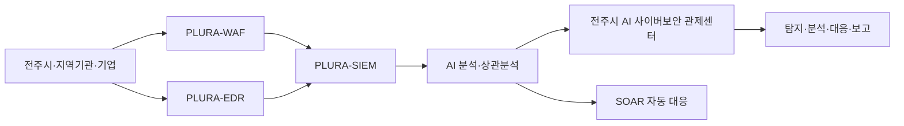

# 전주시 AI 사이버보안 관제센터 유치 제안서

**제안명:** 전주시 AI 사이버보안 관제센터 유치 및 전북권 사이버보안 거점 조성 제안  
**제안기관:** 큐비트시큐리티(주) / PLURA-XDR  
**작성일:** 2026.06.  
**제안 대상:** 전주시 및 전북특별자치도 산학연 협력기관

---

## 1. 제안 요약

전주시의 지속 가능한 성장과 청년 일자리 창출을 위해 **AI 사이버보안 관제센터**를 전주에 유치할 것을 제안합니다.

기존 2024년 제안서가 사이버보안 관제센터 유치를 통한 지역 일자리 창출과 지방 운영 가능성에 초점을 두었다면, 본 제안서는 2026년 현재의 보안 환경 변화를 반영하여 다음 방향으로 고도화합니다.

1. **AI 해킹 시대 대응**  
   생성형 AI와 AI 에이전트 기반 공격 자동화로 웹 공격, 크리덴셜 스터핑, 랜섬웨어, 웹셸 업로드, 데이터 유출 공격이 더 빠르고 정교해지고 있습니다. 이에 따라 보안관제도 단순 모니터링이 아니라 AI 기반 분석과 자동 대응 중심으로 전환되어야 합니다.

2. **지역 청년 일자리와 인재 정착**  
   전주시는 청년 인구 유출과 지역 일자리 부족이라는 구조적 문제를 겪고 있습니다. 사이버보안 관제센터는 고급 디지털 일자리, 지역 대학 연계 교육, 인턴십, 정규직 채용을 동시에 만들 수 있는 인력 중심 산업입니다.

3. **전북권 공공·민간 보안 거점화**  
   전주시청, 산하기관, 지역 공공기관, 병원, 학교, 제조·농생명·관광 관련 기업을 대상으로 보안관제, 침해사고 대응, 취약점 점검, 모의해킹, 보안교육을 제공하는 전북권 사이버보안 허브로 확장할 수 있습니다.

4. **PLURA-XDR 기반 통합 관제 모델**  
   WAF, EDR, SIEM, SOAR, 포렌식, 리소스 모니터링, 원격보안관제를 하나의 클라우드 SaaS 플랫폼에서 운영하여 초기 장비 투자와 운영 부담을 줄이고, 빠른 구축과 확장이 가능한 모델을 제안합니다.

---

## 2. 제안 배경 및 필요성

### 2.1 AI 기반 사이버 공격의 현실화

사이버 공격은 이미 수작업 중심에서 자동화 중심으로 바뀌고 있습니다. 특히 생성형 AI와 AI 에이전트는 다음과 같은 공격을 빠르게 자동화할 수 있습니다.

- 공개된 취약점과 공격 코드를 빠르게 수집
- 웹 애플리케이션 취약점 자동 탐색
- WAF 우회를 위한 공격 페이로드 변형
- 대량 로그인 시도 및 크리덴셜 스터핑
- 웹셸 업로드 및 서버 명령 실행
- 내부 확산과 랜섬웨어 실행
- 유출된 개인정보를 활용한 2차 공격

따라서 보안관제센터도 단순 알림 확인 수준을 넘어, **웹 요청·응답 본문 로그, 서버·PC 행위 로그, 계정 행위, 네트워크 이벤트를 통합 분석하고 자동 대응하는 구조**가 필요합니다.

### 2.2 대규모 개인정보 유출과 랜섬웨어 리스크 확대

최근 국내에서는 통신, 플랫폼, 유통, 공공·민간 핵심 IT 시스템을 대상으로 한 대규모 침해사고가 반복되고 있습니다. 개인정보 유출은 단순 기술 사고가 아니라 과징금, 고객 신뢰 하락, 행정 대응 부담, 피해자 지원, 후속 소송, 사회적 불안으로 이어집니다.

전주시와 지역 기업 역시 예외가 아닙니다. 행정 서비스, 복지, 교통, 문화·관광, 교육, 의료, 지역 기업의 디지털 전환이 확대될수록 사이버 공격 표면도 함께 넓어집니다.

전주시에 필요한 것은 일회성 장비 도입이 아니라, 지역 내에서 지속적으로 위협을 탐지하고 대응할 수 있는 **상시 보안 운영 역량**입니다.

### 2.3 정부 정책 방향과의 부합

정부는 반복되는 해킹 사고를 국가적 위기 상황으로 보고, 공공·금융·통신 등 국민 생활과 밀접한 핵심 IT 시스템에 대한 보안 점검, 상시 취약점 탐지, 모의해킹, 화이트해커 활용, 정보보호 인력·산업 육성을 강화하고 있습니다.

전주시가 AI 사이버보안 관제센터를 유치할 경우 다음 정책 흐름과 직접적으로 연계할 수 있습니다.

- 공공·민간 핵심 IT 시스템 보안 점검 강화
- ISMS, ISMS-P 등 보안 인증 실효성 강화
- 모의해킹 및 화이트해커 기반 상시 취약점 점검
- AI 기반 침해사고 분석·포렌식 고도화
- 정보보호 특성화대학, 화이트해커 양성, AI 보안기업 육성 등 정부 지원사업 연계

### 2.4 전주시 청년 일자리와 인구 유출 대응

전주시는 지역 청년층 유출과 인구 감소 문제를 해결하기 위한 실질적 산업 기반이 필요합니다. 단순 보조금이나 일회성 지원 정책만으로는 청년 정착을 만들기 어렵습니다.

사이버보안 관제센터는 다음 이유로 전주시에 적합합니다.

- 수도권에 있지 않아도 운영 가능한 원격 기반 산업
- 보안관제, 침해사고 분석, 시스템 운영, 데이터 분석 등 다양한 직무 창출
- 지역 대학과 연계한 실무형 교육 및 채용 가능
- 공공기관, 지자체, 지역 기업을 대상으로 한 안정적 수요 확보 가능
- 클라우드 SaaS 기반 운영으로 초기 시설·장비 부담 최소화 가능

---

## 3. 전주시 유치 필요성

### 3.1 전주는 사이버보안 관제센터 운영에 적합한 도시입니다

사이버보안 관제는 인터넷과 클라우드 기반으로 수행되는 업무입니다. 고객 시스템이 수도권에 있더라도 로그 수집, 이벤트 분석, 침해사고 대응, 원격 지원은 전주에서 충분히 수행할 수 있습니다.

전주시는 다음 강점을 가지고 있습니다.

- 전북특별자치도 중심 도시로서 행정·교육·교통 인프라 보유
- 전북대학교, 전주대학교 등 지역 대학과의 산학협력 가능성
- 수도권 대비 낮은 운영비와 안정적인 근무 환경
- 문화·생활 인프라 기반의 인재 정착 가능성
- 공공기관·지역 기업·교육기관을 대상으로 한 초기 수요 발굴 가능성

### 3.2 지역 인재를 보안 전문가로 전환할 수 있습니다

사이버보안은 단기간에 완성되는 직무가 아닙니다. 그러나 관제센터를 지역에 설치하면, 지역 대학생과 청년을 대상으로 다음과 같은 단계적 성장 경로를 만들 수 있습니다.

| 단계 | 인재 육성 내용 | 기대 효과 |
|---|---|---|
| 1단계 | 보안 기초, 네트워크, 운영체제, 웹 구조 교육 | 보안 직무 진입 장벽 완화 |
| 2단계 | WAF·EDR·SIEM 로그 분석 실습 | 실무형 관제 인력 양성 |
| 3단계 | 침해사고 대응, 포렌식, 모의해킹 훈련 | 고급 보안 분석가 육성 |
| 4단계 | AI 기반 위협 분석, 자동 대응 정책 운영 | AI 보안 전문 인력 확보 |
| 5단계 | 지역 기업·공공기관 프로젝트 참여 | 지역 정착형 일자리 창출 |

### 3.3 전북권 보안 수요를 흡수할 수 있습니다

전북권에는 공공기관, 지자체, 병원, 학교, 제조기업, 농생명·식품 기업, 관광·문화 서비스 기업 등 다양한 보안 수요가 존재합니다. 그러나 상당수 기관과 기업은 전문 보안 인력과 전용 장비를 자체적으로 확보하기 어렵습니다.

전주시 관제센터는 이 수요를 통합해 다음 서비스를 제공할 수 있습니다.

- 웹 공격 탐지 및 차단
- 서버·PC 위협 탐지
- 랜섬웨어 행위 탐지 및 대응
- 계정 탈취·크리덴셜 스터핑 탐지
- 개인정보 유출 징후 분석
- 로그 통합 분석 및 보안 리포트 제공
- 취약점 점검 및 모의해킹
- 보안 교육 및 사고 대응 훈련

---

## 4. 제안 사업 모델

### 4.1 센터 명칭

**전주시 AI 사이버보안 관제센터**  
또는  
**전주 AI-XDR 보안관제센터**

### 4.2 센터 역할

본 센터는 단순 모니터링 조직이 아니라, 다음 기능을 수행하는 지역 기반 AI 보안 운영센터로 설계합니다.

| 구분 | 주요 기능 |
|---|---|
| 보안관제 | 24시간 이벤트 모니터링, 위협 알림 분석, 고객 대응 |
| 웹 공격 대응 | SQL 인젝션, 웹셸, 크리덴셜 스터핑, 브루트포스, 데이터 유출 탐지 |
| EDR 분석 | 서버·PC 프로세스, 파일, 네트워크, 계정 행위 분석 |
| 통합 로그 분석 | WAF, EDR, 시스템 로그, 계정 로그, 감사 로그 상관분석 |
| 침해사고 대응 | 사고 접수, 원인 분석, 영향 범위 확인, 대응 가이드 제공 |
| AI 보안 운영 | AI 기반 이벤트 요약, 공격 체인 분석, 자동 대응 정책 검토 |
| 취약점 점검 | 웹·서버·시스템 취약점 점검 및 보완 권고 |
| 교육·훈련 | 지역 대학·청년 대상 보안 실무 교육, 인턴십, 채용 연계 |

### 4.3 PLURA-XDR 기반 운영 구조

센터 운영은 PLURA-XDR을 기반으로 합니다. PLURA-XDR은 단일 보안 제품이 아니라, WAF, EDR, SIEM, SOAR, 포렌식, 리소스 모니터링, 원격보안관제를 하나의 클라우드 SaaS 플랫폼에서 운영하는 통합 사이버보안 플랫폼입니다.

### 4.4 주요 제공 서비스

| 서비스 | 내용 | 대상 |
|---|---|---|
| 원격보안관제 | 보안 이벤트 모니터링, 위협 분석, 대응 안내 | 공공기관, 기업 |
| 웹방화벽 관제 | 웹 공격 탐지·차단, 우회 공격 분석 | 홈페이지, 웹서비스 |
| EDR 관제 | 서버·PC 악성 행위 탐지 | 서버, 업무용 PC |
| 개인정보 유출 대응 | 데이터 유출 징후 탐지, 보고서 작성 | 개인정보 처리기관 |
| 랜섬웨어 대응 | 감염 행위 탐지, 격리·대응 가이드 | 기업, 기관 |
| 취약점 점검 | 웹·시스템 취약점 진단, 보완 가이드 | 지역 기업, 학교 |
| 모의해킹 | 실제 공격 시나리오 기반 점검 | 주요 기관, 기업 |
| 보안 교육 | 관제 분석가·화이트해커 양성 | 대학생, 청년 |

---

## 5. 단계별 추진 방안

### 5.1 1단계: 전주 거점 설치 및 초기 운영

**기간:** 착수 후 3~6개월  
**목표:** 전주시 내 관제센터 거점 확보 및 초기 관제 인력 배치

주요 내용은 다음과 같습니다.

- 전주시 내 사무공간 확보
- 관제센터 네트워크 및 보안 운영 환경 구성
- PLURA-XDR 기반 원격 관제 체계 구축
- 초기 보안관제 인력 채용 및 교육
- 전주시 산하기관 또는 지역 기업 대상 시범 관제 추진
- 지역 대학과 인턴십 협약 추진

**초기 인력 목표:** 10~20명  
**주요 직무:** 보안관제 분석가, 고객지원, 시스템 운영, 교육 담당

### 5.2 2단계: 산학협력 및 지역 고객 확대

**기간:** 6~18개월  
**목표:** 전북권 공공·민간 수요 확대 및 지역 인재 채용 체계 구축

주요 내용은 다음과 같습니다.

- 전북대학교, 전주대학교 등 지역 대학과 교육 과정 연계
- 보안관제 실습 과정, 로그 분석 실습, 모의해킹 교육 운영
- 지역 기업 대상 보안 점검 패키지 제공
- 전주시 주요 웹서비스 및 산하기관 대상 보안관제 PoC 추진
- 지역 청년 인턴십 및 정규직 전환 프로그램 운영

**확대 인력 목표:** 30~50명  
**주요 직무:** 침해사고 분석가, WAF 분석가, EDR 분석가, 취약점 진단 인력, 교육 담당

### 5.3 3단계: 전북권 AI 보안 허브화

**기간:** 18~36개월  
**목표:** 전북권 대표 사이버보안 관제·교육·대응 거점으로 확대

주요 내용은 다음과 같습니다.

- 전북권 지자체·공공기관·기업 대상 보안관제 서비스 확대
- AI 기반 보안 분석 고도화
- 취약점 점검, 모의해킹, ISMS-P 대응 지원 서비스 확대
- 지역 보안 인재 양성 아카데미 운영
- 정부 AI 보안, 정보보호 인재양성, 지역 디지털 혁신 사업 공동 참여

**중장기 인력 목표:** 100명 이상  
**주요 직무:** 고급 침해대응, AI 보안 분석, 포렌식, 보안 컨설팅, 기술지원, 교육운영

---

## 6. 기대 효과

### 6.1 양질의 청년 일자리 창출

관제센터는 장비 중심 산업이 아니라 인력 중심 산업입니다. 센터가 전주에 설치되면 지역 청년에게 다음과 같은 고급 디지털 일자리를 제공할 수 있습니다.

- 보안관제 분석가
- 침해사고 대응 분석가
- WAF·EDR 로그 분석가
- 시스템·클라우드 보안 엔지니어
- 데이터·AI 보안 분석가
- 보안 교육 및 고객지원 전문가

이는 단순 사무직이나 단기 일자리가 아니라, 경력이 축적될수록 전문성이 높아지는 장기 성장형 직무입니다.

### 6.2 전주시 디지털 안전 수준 향상

전주시의 행정, 복지, 교통, 문화·관광, 교육 관련 디지털 서비스는 시민 생활과 직접 연결되어 있습니다. 사이버보안 관제센터를 통해 다음 효과를 기대할 수 있습니다.

- 주요 웹서비스 공격 탐지 및 차단 강화
- 개인정보 유출 사고 예방
- 랜섬웨어와 악성코드 대응 역량 강화
- 사고 발생 시 신속한 원인 분석과 대응
- 보안 리포트 기반의 지속적 개선 체계 확보

### 6.3 지역 기업의 보안 사각지대 해소

중소·중견기업은 별도의 보안 인력과 고가 장비를 갖추기 어렵습니다. 전주시 관제센터가 지역 기업에 클라우드 SaaS 기반 보안관제를 제공하면, 낮은 비용으로 실질적인 보안 체계를 갖출 수 있습니다.

특히 다음 업종에 효과적입니다.

- 지역 제조기업
- 농생명·식품 기업
- 병원 및 의료기관
- 교육기관
- 관광·문화 서비스 기업
- 전자상거래 및 플랫폼 기업
- 공공 위탁 운영 기업

### 6.4 전북권 보안산업 생태계 조성

관제센터 유치는 단일 기업 유치에 그치지 않고, 교육·채용·실증·서비스·컨설팅을 연결하는 보안산업 생태계 조성으로 이어질 수 있습니다.

- 지역 대학과 실무 교육 과정 개설
- 지역 청년 인턴십 및 취업 연계
- 보안 스타트업과 협력 프로젝트 발굴
- 지자체·공공기관 보안 실증 사업 추진
- 정보보호 특성화대학 및 정부 지원사업 연계
- 전북권 사이버보안 클러스터 조성 기반 마련

---

## 7. 전주시 지원 요청 사항

본 사업의 성공적인 정착을 위해 전주시에 다음 사항을 요청드립니다.

| 구분 | 요청 내용 | 기대 효과 |
|---|---|---|
| 공간 지원 | 관제센터 사무공간 제공 또는 임대료 지원 | 초기 투자 부담 완화 |
| 시설 지원 | 사무실 인테리어, 네트워크, 회의실 등 초기 구축 지원 | 빠른 센터 개소 |
| 고용 지원 | 지역 청년 채용 장려금, 인턴십 지원 | 지역 일자리 창출 |
| 산학 연계 | 지역 대학과 교육·인턴십·채용 협력 지원 | 실무형 인재 확보 |
| 수요 연계 | 전주시 산하기관, 지역 기업 대상 PoC 연계 | 초기 운영 안정화 |
| 홍보 지원 | 전주시 디지털 보안 거점 사업으로 공동 홍보 | 도시 브랜드 제고 |
| 국비 연계 | 정부 정보보호·AI 보안·인재양성 사업 공동 신청 | 재정 부담 완화 |

---

## 8. 산학협력 운영 방안

### 8.1 지역 대학 연계 교육

전주시 내 관제센터는 지역 대학과 협력하여 실무 중심 교육 과정을 운영할 수 있습니다.

예시 교육 과정은 다음과 같습니다.

| 과정 | 주요 내용 |
|---|---|
| 보안관제 기초 | 네트워크, 웹, 운영체제, 보안 로그 이해 |
| 웹 공격 분석 | SQL 인젝션, XSS, 웹셸, 크리덴셜 스터핑 분석 |
| EDR 분석 | 프로세스, 파일, 레지스트리, 네트워크 행위 분석 |
| SIEM 분석 | 로그 상관분석, 공격 체인 분석, 리포트 작성 |
| AI 보안 분석 | AI 기반 이벤트 요약, 자동 대응 정책 검토 |
| 침해사고 대응 | 사고 접수, 원인 분석, 영향 범위 확인, 재발 방지 |

### 8.2 인턴십 및 채용 연계

- 학기 중 현장실습
- 방학 중 보안관제 집중 교육
- 우수 수료자 인턴십
- 인턴십 평가 후 정규직 채용
- 재직자 역량 강화 교육

### 8.3 지역 청년 정착 프로그램

사이버보안 인력은 초기 교육 이후 지속적인 실무 경험이 중요합니다. 전주시는 청년 인력이 지역에 정착할 수 있도록 다음 프로그램을 함께 운영할 수 있습니다.

- 주거 지원 연계
- 지역 정착 멘토링
- 경력 개발 로드맵 제공
- 자격증 취득 지원
- 보안 세미나 및 커뮤니티 운영

---

## 9. 예상 문제점 및 대응 방안

| 예상 문제 | 설명 | 대응 방안 |
|---|---|---|
| 초기 인력 확보 어려움 | 보안 직무는 실무 경험이 중요 | 대학 연계 교육, 인턴십, 단계별 직무 교육 운영 |
| 초기 고객 확보 부담 | 센터 개소 초기에 안정적 수요 필요 | 전주시 산하기관·지역 기업 PoC 연계 |
| 운영비 부담 | 공간·인프라·인건비 초기 부담 발생 | SaaS 기반 구축, 단계별 확장, 국비사업 연계 |
| 보안 데이터 민감성 | 로그와 개인정보 처리에 대한 우려 | 접근통제, 비식별 처리, NDA, 보안 운영 규정 수립 |
| 수도권 인재 선호 | 고급 보안 인력이 수도권에 집중 | 지역 교육-채용-정착 패키지로 자체 인재 양성 |
| 단기 성과 압박 | 보안산업은 신뢰와 레퍼런스 축적 필요 | 3단계 로드맵과 정량 KPI 기반 관리 |

---

## 10. 추진 일정

| 단계 | 기간 | 주요 내용 | 산출물 |
|---|---:|---|---|
| 준비 단계 | 1~2개월 | 전주시 협의, 공간 검토, 산학협력 협의 | 사업 추진 계획서 |
| 구축 단계 | 3~6개월 | 센터 공간 구축, PLURA-XDR 관제 환경 구성, 초기 인력 채용 | 관제센터 개소 |
| 시범 운영 | 6~12개월 | 전주시 산하기관·지역 기업 PoC, 인턴십 운영 | 시범 운영 보고서 |
| 확대 운영 | 12~24개월 | 전북권 고객 확대, 취약점 점검·교육 사업 확대 | 운영 성과 보고서 |
| 거점화 | 24~36개월 | 전북권 AI 보안 허브화, 정부사업 공동 참여 | 전북권 보안 거점 모델 |

---

## 11. 성과 지표

센터 운영 성과는 다음 지표로 관리할 수 있습니다.

| 구분 | 성과 지표 |
|---|---|
| 고용 | 지역 청년 채용 인원, 인턴십 참여 인원, 정규직 전환율 |
| 교육 | 보안 교육 수료 인원, 자격증 취득 인원, 대학 연계 과정 수 |
| 관제 | 고객 기관 수, 탐지 이벤트 분석 건수, 사고 대응 건수 |
| 보안 수준 | 취약점 개선 건수, 침해사고 대응 시간 단축, 재발 방지 조치 건수 |
| 지역 확산 | 전주시 산하기관 참여 수, 지역 기업 참여 수, 전북권 확산 기관 수 |
| 산업 효과 | 정부사업 참여 건수, 협력 기업 수, 보안 서비스 매출 |

---

## 12. 결론

전주시는 청년 인구 유출, 지역 일자리 부족, 디지털 전환에 따른 보안 위협 확대라는 과제를 동시에 마주하고 있습니다.

AI 사이버보안 관제센터 유치는 이 세 가지 문제를 함께 해결할 수 있는 현실적인 대안입니다. 전주는 수도권 대비 운영비 부담이 낮고, 지역 대학과 연계한 인재 양성이 가능하며, 전북권 공공·민간 보안 수요를 흡수할 수 있는 입지를 갖추고 있습니다.

큐비트시큐리티는 PLURA-XDR 기반의 클라우드 SaaS 보안 플랫폼과 원격보안관제 역량을 바탕으로, 전주시가 전북권 AI 사이버보안 거점 도시로 성장할 수 있도록 협력하고자 합니다.

본 제안은 단순한 관제센터 설치가 아니라, **전주시 청년 일자리 창출, 지역 기업 보안 강화, 공공 디지털 안전 확보, 전북권 보안산업 생태계 조성**을 함께 추진하는 지역 전략 사업입니다.

전주시가 본 사업을 통해 AI 해킹 시대에 선제적으로 대응하는 지역 보안 거점으로 자리매김하기를 제안드립니다.

---

## 부록. 최근 이슈 반영 사항

| 최근 이슈 | 제안서 반영 내용 |
|---|---|
| AI 기반 사이버 공격 증가 | AI-XDR, AI 분석, 자동 대응, 미토스급 AI 해킹 대응 방향 반영 |
| 대규모 개인정보 유출 및 과징금 확대 | 개인정보 유출 예방, 사고 대응, 로그 기반 증적 확보 강조 |
| 범부처 정보보호 종합대책 | 핵심 IT 시스템 점검, 상시 취약점 탐지, 모의해킹, 인력양성 방향 반영 |
| 전주시 인구 감소 및 청년 유출 | 관제센터를 청년 정착형 고급 디지털 일자리 모델로 제안 |
| 정보보호 인재 양성 정책 확대 | 정보보호 특성화대학, 화이트해커 양성, AI 보안 교육과 연계 가능성 반영 |
| 지역 기업 보안 사각지대 | 전북권 중소·중견기업 대상 SaaS 기반 보안관제 모델 반영 |

---

## 참고 근거

- 기존 첨부 제안서: 2024.11. 「사이버보안 관제센터 유치 제안서」
- KISA: 2025년 사이버 위협 하반기 동향 및 2026년 전망
- 개인정보보호위원회: SK텔레콤 개인정보 유출사고 제재처분 의결, 쿠팡 및 계열사 개인정보 유출 및 침해 제재처분 의결
- 관계부처 합동: 범부처 정보보호 종합대책
- 전주시: 2026년 5월 동별 인구현황
- KISA: 2026년 정보보호 특성화대학 지원사업, AI 보안 유망기업 육성 지원사업, AI 시대 정보보호 인재양성 보도자료
