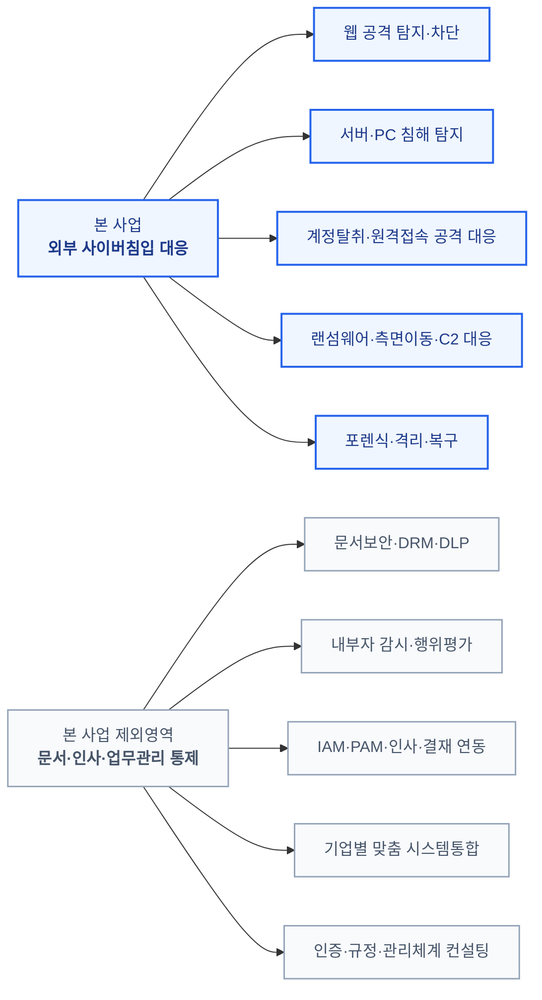
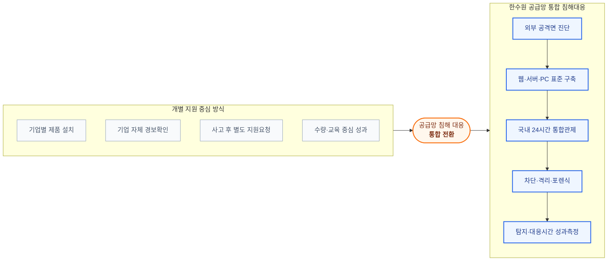
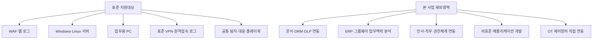
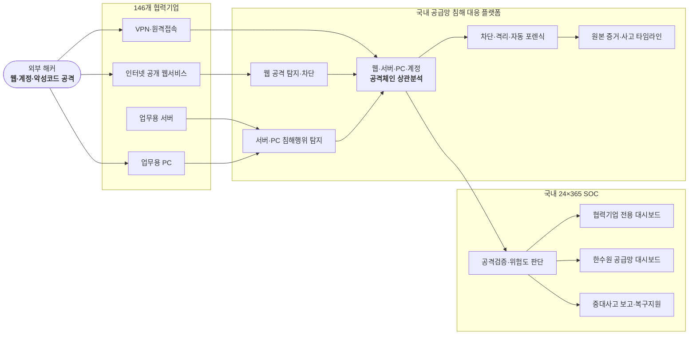
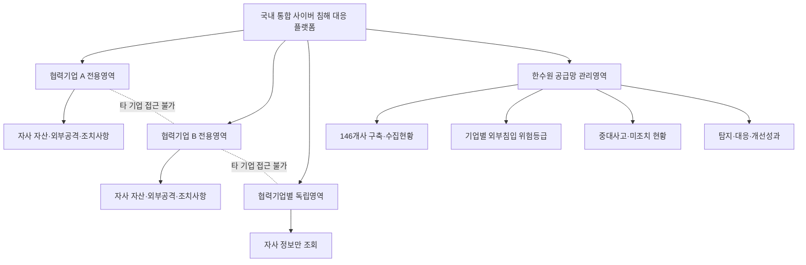
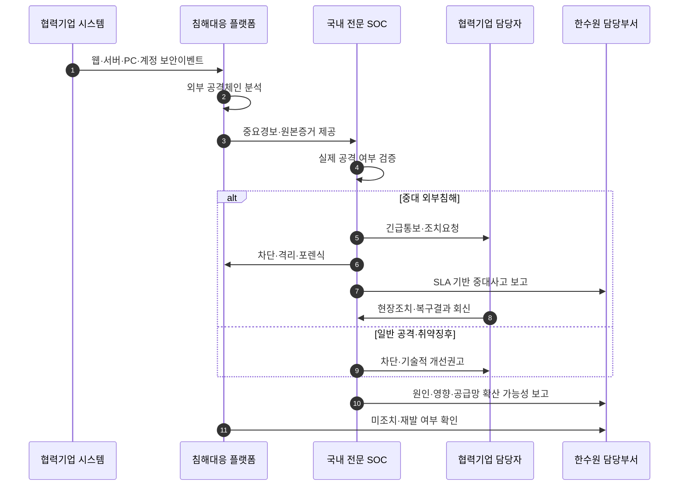
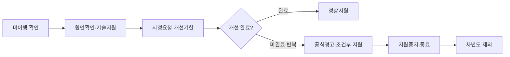
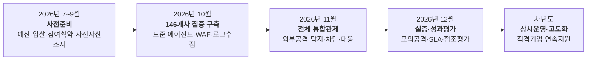

# 한국수력원자력 협력기업 공급망 사이버 침해 대응
# 소버린 사이버시큐리티 통합지원사업 최종 제안서

## 외부 해커의 침입을 탐지·차단하고, 사고 발생 시 즉시 대응하는 원전 공급망 통합 사이버보안 사업

### 146개 협력기업 대상 2026년 10~12월 3개월 집중 실증·구축 제안

---

# 제안 요약

한국수력원자력은 협력기업의 사이버보안 역량을 높이고 원전 공급망의 보안격차를 줄이기 위해 보안수준 평가, 보안관리 플랫폼, 사이버 보안관제와 교육 지원을 추진하고 있습니다.

이러한 정책이 실질적인 공급망 보호성과로 이어지기 위해서는 개별 보안제품을 공급하거나 보안관리 항목을 점검하는 데서 한 단계 더 나아가야 합니다.

협력기업의 웹서비스, 업무용 서버와 PC, 원격접속 계정이 외부 해커에게 공격받을 때 이를 24시간 탐지하고, 실제 침입 여부를 판단하며, 공격이 확인되면 차단·격리·포렌식·복구까지 지원하는 **통합 사이버 침해 대응체계**가 필요합니다.

> **본 사업의 최우선 목표는 외부 해커가 한수원 협력기업의 웹서비스·서버·PC·원격접속 계정을 공격하여 내부 시스템에 침입하는 것을 조기에 탐지·차단하고, 침해가 발생한 경우 원전 공급망으로 피해가 확대되기 전에 대응하는 것입니다.**

> **본 사업은 문서보안, 내부자 감시 또는 협력기업의 전반적인 정보보안 관리체계를 대신하는 사업이 아닙니다.**

문서보안, 기술자료 등급관리, 내부자 행위평가, 인사·직무·결재와 권한체계 재설계는 기업마다 조직과 업무시스템이 달라 표준화하기 어렵습니다. 이를 146개 협력기업 대상의 단일 사업에 포함하면 기업별 요구분석과 맞춤 시스템통합이 필요해지고, 사업기간과 비용이 크게 증가하며 정작 가장 중요한 외부 침입 대응성과를 만들기 어렵습니다.

따라서 본 제안은 사업범위를 다음과 같이 명확히 제한합니다.

- 외부 노출 웹서비스 공격 탐지·차단
- 서버·PC 침해행위 탐지
- 계정탈취·크리덴셜 스터핑·원격접속 공격 탐지
- 악성코드·랜섬웨어·권한상승·측면이동 탐지
- 외부 공격자의 C2 통신과 침해 후 데이터 외부전송 탐지
- 국내 24시간 전문 보안관제
- 공격 차단·호스트 격리·자동 포렌식·복구 지원
- 협력기업별 독립 대시보드와 한수원 공급망 통합 대시보드

2026년 10월부터 12월까지 3개월 동안 146개 협력기업에 표준화된 사이버 침해 대응 서비스를 집중 구축하고 운영할 것을 제안합니다.

한수원은 공개입찰을 통해 단일 책임사업자와 통합계약을 체결하고, 협력기업에 필요한 표준 침해대응 서비스 비용을 전액 지원합니다. 협력기업은 비용 대신 자산정보 제공, 표준 보안기능 설치, 긴급경보 조치, 사고조사와 복구 협조, 교육·훈련 참여 의무를 이행합니다.

> **보안 대응에 적극적으로 협조한 기업은 차년도 지원을 계속하고, 공공재원으로 보호받으면서도 보안기능을 중지하거나 긴급 대응을 반복적으로 방임한 기업은 다음 지원대상에서 제외할 수 있도록 운영해야 합니다.**

본 사업은 제품을 설치하는 사업이 아닙니다.

> **한수원이 원전 공급망 전체의 외부 사이버침입 위험을 하나의 기준·하나의 플랫폼·하나의 국내 전문관제 체계로 관리하고, 실제 탐지·차단·복구 성과를 지속적으로 확인하는 새로운 공급망 사이버보안 운영사업입니다.**

---

# 1. 사업의 정의와 범위

## 1.1 본 사업의 정의

본 사업은 다음과 같이 정의합니다.

> **한수원 146개 협력기업의 인터넷 노출영역, 업무용 서버·PC와 원격접속 환경을 대상으로 외부 해커의 공격을 탐지·차단하고, 침해 발생 시 국내 전문인력이 즉시 분석·격리·포렌식·복구를 지원하는 원전 공급망 사이버 침해 대응 사업**

핵심은 협력기업의 전반적인 정보보안 행정을 대신하는 것이 아니라 실제 외부 공격과 침해사고에 대응하는 것입니다.

## 1.2 가장 중차대한 사업목표

사업의 성과는 규정과 문서가 얼마나 많이 만들어졌는지가 아니라 다음 결과로 판단해야 합니다.

- 외부 해커의 웹 공격을 실제로 탐지·차단했는가
- 계정탈취와 원격접속 공격을 조기에 식별했는가
- 서버·PC 내부에서 실행된 악성 명령과 프로세스를 확인했는가
- 랜섬웨어와 내부 확산을 피해 확대 전에 차단했는가
- 침해 이후 C2 통신과 데이터 외부전송을 탐지했는가
- 여러 협력기업에서 반복되는 공급망 공격을 통합 분석했는가
- 중대 공격을 정해진 시간 안에 협력기업과 한수원에 통보했는가
- 사고 발생 시 공격경로와 영향범위를 확인할 증거를 확보했는가
- 협력기업이 차단·격리·복구와 재발방지에 적극 협조했는가

## 1.3 사업 지원범위

| 구분 | 지원내용 |
|---|---|
| 외부 공격면 보호 | 인터넷 공개 웹서비스, 외부 접근서비스, 원격접속 경로 |
| 웹 침입 대응 | WAF, 웹 요청·응답 분석, 변형·제로데이 의심 공격 분석 |
| 서버 침해 대응 | 로그인, 명령, 프로세스, 파일, 권한변경과 외부통신 분석 |
| PC 침해 대응 | 악성코드, 랜섬웨어, 의심 프로세스와 자격증명 탈취행위 분석 |
| 계정공격 대응 | 브루트포스, 크리덴셜 스터핑, 탈취계정과 비정상 원격접속 탐지 |
| 공격 확산 대응 | 권한상승, 내부 시스템 탐색, 측면이동과 C2 통신 탐지 |
| 침해 후 유출 대응 | 외부 공격자가 침해 후 수행하는 파일수집·압축·외부전송 탐지 |
| 사고대응 | 차단·격리·포렌식·영향분석·복구와 결과보고 |
| 공급망 관제 | 국내 24×365 전문 보안관제와 한수원 상향보고 |

## 1.4 명시적인 사업 제외범위

본 사업은 다음 영역을 지원하지 않습니다.

| 제외영역 | 제외사유 |
|---|---|
| 문서보안·DRM·DLP 구축 | 외부 해커의 침입 탐지·차단과 직접 관련이 없는 문서관리·업무통제 영역 |
| 기술자료 등급·분류체계 구축 | 외부 사이버침입 대응이 아닌 문서분류·보관·승인 관리영역 |
| 내부자 감시·행위평가 | 외부 공격 대응이 아닌 인사·감사·노무 기반의 내부 업무관리 영역 |
| IAM·PAM 전면 재설계 | 외부 계정공격 탐지를 넘어 기업 내부 권한·결재체계를 재설계하는 영역 |
| 내부 업무프로세스 통제 | 기업 내부 업무절차와 애플리케이션을 통제하는 관리·개발 영역 |
| 개인정보·ISMS 등 인증 컨설팅 | 외부 침해 대응이 아닌 인증·규정·컴플라이언스 관리영역 |
| 기업별 맞춤 애플리케이션 개발 | 표준 침해대응 서비스가 아닌 기업별 애플리케이션 개발영역 |
| OT·ICS 제어장비 직접 통제 | 본 사업의 표준 IT 침해대응 범위를 벗어나는 제어설비 직접 통제영역 |
| 백업시스템 신규 구축 | 기존 백업을 활용한 복구지원만 포함하며, 백업 인프라 신규구축은 지원범위에서 제외 |
| 상시 내부 직원 모니터링 | 본 사업의 외부 사이버침입 대응 목적과 다름 |

### 제외영역에 대한 해석 원칙

위 항목은 위 항목을 추가 구매나 추가 예산이 필요한 후속 과제로 제안하는 것이 아닙니다.

> **외부 해커의 침입 탐지·차단·포렌식·복구를 목적으로 하는 본 사이버 침해 대응사업과 직접 관련이 없으므로, 이번 사업의 요구사항·비용·성과평가에서 제외한다는 의미입니다.**

본 사업의 예산은 문서관리, 직원감시, 인사·권한체계와 기업별 업무시스템 개발에 사용하지 않고 외부 사이버공격 대응에 집중합니다.

계정과 데이터 외부전송을 분석하는 경우에도 범위를 명확히 제한합니다.

- 정상 직원의 업무행위를 평가하거나 감시하지 않음
- 외부 공격자가 계정을 탈취한 정황이 있는 경우에 한해 계정공격으로 분석
- 외부 침입 이후 나타난 악성 프로세스·파일수집·C2·외부전송 흐름을 침해사고로 분석
- 문서의 업무 적정성이나 직원의 행동성향을 판단하지 않음
- 기술자료 보안관리 플랫폼의 문서등급·승인·배포 기능을 대체하지 않음

> **사업범위를 외부 침입 대응으로 명확히 제한해야 146개 협력기업에 동일한 품질의 서비스를 제공하고, 3개월 안에 측정 가능한 성과를 만들 수 있습니다.**

---

# 2. 원전 공급망 사이버 침해 대응의 필요성

## 2.1 공격자는 공급망의 가장 취약한 지점을 찾습니다

외부 공격자는 보안수준이 높은 기관을 정면으로 공격하기보다, 상대적으로 보안인력과 대응역량이 부족한 협력기업의 웹서비스·PC·원격접속 계정을 공격할 수 있습니다.

협력기업 침해는 해당 기업의 피해에 그치지 않고 다음 경로를 통해 공급망 위험으로 확대될 수 있습니다.

- 탈취된 협력사 계정의 악용
- 원격 유지보수 경로와 VPN 접근
- 자료교환 웹사이트와 파일전송 서버 침해
- 악성파일이 포함된 납품·업데이트 자료 전달
- 협력기업 시스템을 경유한 피싱과 추가 공격
- 거래·생산·품질업무의 중단
- 공급망 전반의 사고대응 지연

> **한수원 공급망 보안의 핵심은 모든 협력기업을 동일한 관리규정으로 통제하는 것이 아니라, 외부 공격자가 어느 기업을 공격하더라도 조기에 발견하고 공급망으로 확산되기 전에 차단하는 것입니다.**

## 2.2 협력기업별 자체 대응만으로는 24시간 방어가 어렵습니다

협력기업은 규모와 업종, 시스템과 보안인력 수준이 서로 다릅니다.

일부 기업은 자체 보안조직과 여러 보안제품을 운영할 수 있지만, 많은 기업은 다음 어려움을 가질 수 있습니다.

- 전담 보안인력 부족
- 웹·서버·PC 보안제품의 분리 운영
- 야간·휴일 경보확인의 어려움
- 실제 공격과 오탐을 구분할 전문성 부족
- 침해사고 시 포렌식과 증거보존 역량 부족
- 긴급 차단과 복구 의사결정 지연
- 여러 고객사의 보안요구에 대한 대응부담

따라서 제품만 지원하는 방식이 아니라 국내 전문 보안관제와 사고대응을 결합해야 합니다.

## 2.3 기존 한수원 사업과의 역할 구분

한수원이 추진하는 보안수준 평가와 기술정보 전주기 보안관리 플랫폼은 협력기업의 관리체계와 기술자료 보호수준을 높이는 중요한 역할을 합니다.

본 제안은 보안수준 평가와 기술정보 관리의 역할을 포함하거나 대체하지 않으며, 외부 사이버침입 대응만을 목적으로 합니다.

| 사업영역 | 주요 역할 |
|---|---|
| 보안수준 평가 | 협력기업의 보안통제 구축상태와 개선과제 확인 |
| 기술정보 보안관리 | 기술자료의 등록·접근·배포·보관 등 생명주기 관리 |
| 본 사이버 침해 대응사업 | 외부 해커의 웹·서버·PC·계정 공격 탐지·차단·포렌식·복구 |

보안수준 평가와 기술정보 관리는 본 사업의 지원대상이 아닙니다. 본 제안의 성공을 위해서는 사이버 침해 대응범위를 문서보안과 내부자 관리영역으로 확장하지 않아야 합니다.

---

# 3. 기존 지원방식의 한계와 전환방향

## 3.1 개별 보안제품 지원만으로는 침해대응 공백이 남습니다

협력기업마다 서로 다른 제품을 설치하면 다음 문제가 발생할 수 있습니다.

- 설치 후 경보를 확인할 인력이 없음
- 웹·서버·PC 경보가 분리되어 공격전체를 보기 어려움
- 제품별 정책·보고서·유지보수 창구가 다름
- 실제 사고가 발생하면 별도 대응업체를 다시 찾아야 함
- 한수원이 협력기업 전체의 위험을 같은 기준으로 확인하기 어려움
- 성과가 제품수량과 교육횟수로만 측정될 수 있음

## 3.2 정보보안 관리사업으로 확대하면 표준화가 무너집니다

문서보안과 내부자 관리는 협력기업마다 다음 요소가 다릅니다.

- 인사조직과 직무
- 문서분류와 결재절차
- ERP·그룹웨어·생산·품질시스템
- 한수원 및 다른 고객사와의 자료교환 절차
- 영업비밀과 개인정보 관리규정
- 감사·법무·노무 요구사항

이를 146개 협력기업에 동일한 플랫폼으로 적용하려면 기업마다 요구사항 분석, 데이터모델 설계, 시스템 연동, 정책개발과 사용자 교육을 별도로 수행해야 합니다.

이는 표준 사이버 침해 대응 서비스가 아니라 146개 기업의 내부 업무체계를 각각 분석·개발해야 하는 맞춤형 관리 SI에 해당하므로 본 사업의 지원범위에서 제외해야 합니다.

기업별 SI를 3개월 사업에 포함하면 다음 문제가 발생할 수 있습니다.

- 구축완료 전에 사업기간 종료
- 기업별 범위와 품질의 큰 차이
- 시스템 연동 실패와 책임공방
- 외부 침입 탐지보다 문서·권한정책 협의에 인력 집중
- 성과 측정 불가능
- 추가비용과 일정지연
- 전체 협력기업 확산 실패

> **외부 침입 대응과 기업별 정보보안 SI를 한 사업에 섞으면 핵심목표가 흐려지고, 성과 없이 사업이 종료될 위험이 큽니다.**

## 3.3 통합 사이버 침해 대응 플랫폼으로 전환

| 구분 | 개별 제품·관리 중심 | 제안하는 침해대응 중심 |
|---|---|---|
| 목표 | 제품 구축과 관리수준 개선 | 외부 공격의 탐지·차단·사고대응 |
| 대상 | 광범위한 정보보안 항목 | 웹·서버·PC·계정·원격접속 공격 |
| 구축 | 기업별 서로 다른 구성 | 표준 패키지와 공통 정책 |
| 운영 | 기업별 자체 대응 | 국내 24시간 전문 SOC |
| 분석 | 제품별 경보 | 여러 협력기업의 공격체인 통합분석 |
| 사고 | 발생 후 별도 지원 | 실시간 차단·격리·포렌식 |
| 한수원 가시성 | 정기 자료취합 | 공급망 위험·사고·미조치 상시 확인 |
| 성과 | 구축수량·교육횟수 | 탐지·통보·차단·복구결과 |
| 확장성 | 기업별 SI로 확산 어려움 | 146개사 공통 표준 적용 |

---

# 4. 3개월 집중사업 구조

## 4.1 사업기간

- **사전 준비:** 2026년 7~9월
- **실제 서비스 운영:** 2026년 10월 1일~12월 31일
- **지원대상:** 한수원 146개 협력기업
- **사업방식:** 공개입찰을 통한 단일 책임사업자 통합계약
- **지원방식:** 한수원 전액지원, 협력기업 운영의무 이행
- **후속사업:** 운영성과와 협력기업 이행실적을 기반으로 차년도 연속지원·고도화

공개입찰, 협력기업 참여확약, 사전 자산조사와 구축일정은 9월 말까지 완료해야 합니다.

## 4.2 3개월 동안 확인할 성과

3개월은 협력기업의 전반적인 정보보안 관리체계를 재설계하는 기간이 아닙니다.

다음 성과를 집중적으로 확인합니다.

- 146개 협력기업을 표준절차로 구축할 수 있는가
- 외부 공격면과 보호대상 자산이 정상적으로 관제되는가
- 실제 공격을 탐지하고 SLA 안에 통보할 수 있는가
- 차단·격리·포렌식과 사고대응이 작동하는가
- 한수원이 공급망 전체의 중대위험과 미조치를 확인할 수 있는가
- 협력기업이 긴급 대응과 기술적 개선조치에 협조하는가
- 차년도 상시사업으로 전환할 기술·인력·인프라가 충분한가

## 4.3 사업비 산정원칙

기업별 정확한 비용은 보호대상 웹서비스·서버·PC 수량과 로그량, 관제범위와 보관기간을 기준으로 공개입찰에서 확정합니다.

사업비는 다음과 같이 구성합니다.

| 비용영역 | 주요내용 |
|---|---|
| 진단·온보딩 | 외부 공격면 확인, 자산등록, 에이전트·WAF·로그연계 |
| 플랫폼·인프라 | 기업별 분리환경, 로그수집·저장·검색·분석 |
| WAF·EDR·XDR | 웹·서버·PC·계정 공격 탐지·차단 기능 |
| 24시간 SOC | 공격검증, 위험분류, 기업·한수원 통보 |
| 사고대응 | 격리·포렌식·영향분석·복구지원 |
| 교육·실증 | 담당자 교육, 공격시나리오와 대응절차 검증 |
| 사업관리 | 한수원 대시보드, SLA·KPI·협력기업 이행평가 |
| 기술지원 | 수집장애, 오탐, 정책업데이트와 긴급지원 |

RFP에는 다음을 명시합니다.

- 기업별 표준 웹·서버·PC 지원수량
- 초과자산 단가
- 로그보관기간과 저장용량
- 사고대응·포렌식 지원범위
- 기업별 초기구축비와 월 운영비
- 3개월 총사업비와 차년도 전환단가
- 부가가치세 포함 여부

---

# 5. 표준 지원패키지

## 5.1 협력기업 공통 패키지

| 지원항목 | 표준범위 예시 |
|---|---|
| 외부 웹서비스 | 인터넷 공개 웹서비스의 WAF·웹 공격 탐지·차단 |
| 업무용 서버 | 로그인·명령·프로세스·파일·권한·외부통신 분석 |
| 업무용 PC | 악성코드·랜섬웨어·이상 프로세스 탐지 |
| 원격접속 | 표준 VPN·관리자·원격접속 로그 연계 |
| 계정공격 | 브루트포스·크리덴셜 스터핑·탈취계정 탐지 |
| 통합분석 | 웹·서버·PC·계정 이벤트의 공격체인 상관분석 |
| 전문관제 | 국내 24×365 SOC의 공격검증·통보·대응지원 |
| 사고대응 | 차단·격리·자동 포렌식·영향분석·복구지원 |
| 교육·훈련 | 담당자 교육과 모의 공격·대응점검 |
| 대시보드·보고 | 기업별 대시보드, 한수원 대시보드, 월간·종합보고 |

기업의 자산규모와 외부노출도에 따라 표준형·웹강화형·고위험형으로 구성할 수 있습니다. 다만 모든 유형은 외부 사이버침입 대응이라는 동일한 목적과 공통 SLA를 유지합니다.

## 5.2 표준화 원칙

- 지원대상 운영체제와 로그형식을 사전에 고지
- 에이전트와 표준 수집방식 중심으로 구축
- 기업별 별도 개발 최소화
- 비표준 연동은 본 사업 지원범위에서 제외
- 문서·인사·직무·결재시스템 분석 제외
- 동일한 탐지정책·SLA·보고체계 적용
- 예외정책은 침해탐지와 서비스가용성에 필요한 범위로 제한

## 5.3 IT·OT 경계 우선 보호

원전 공급망에는 생산·시험·품질과 관련된 환경이 존재할 수 있으므로 1차 사업은 OT·ICS 제어장비에 직접 에이전트를 설치하거나 자동차단하지 않습니다.

우선 보호대상은 다음과 같습니다.

- 생산망 접속용 관리자 PC
- 원격 유지보수 VPN
- 점프서버
- 패치·배포 서버
- 파일전송 서버
- 외부 협력사 접속계정
- 인터넷과 연결된 자료교환·품질·생산관리 웹서비스
- IT와 OT 사이의 인증·접속·파일이동 로그

OT 내부 제어장비에 대한 직접 통제는 본 사업의 지원범위에 포함하지 않습니다.

---

# 6. 한수원 공급망 통합 사이버 침해 대응 플랫폼

## 6.1 플랫폼의 역할

통합플랫폼은 146개 협력기업의 경보를 한 화면에 단순 표시하는 시스템이 아닙니다.

외부 해커의 공격이 웹·서버·PC·계정에서 어떻게 진행되는지 하나의 타임라인으로 연결합니다.

> 외부 공격  
> → 웹·원격접속 침입  
> → 명령·프로세스 실행  
> → 권한상승  
> → 내부 시스템 탐색·측면이동  
> → 랜섬웨어·C2·외부전송  
> → 차단·격리·포렌식

## 6.2 제안 아키텍처

## 6.3 협력기업별 데이터 분리

- 각 협력기업은 자사 자산·경보·사고정보만 조회
- 다른 협력기업의 상세 데이터 접근 금지
- 한수원은 구축률·위험등급·중대사고·미조치·SLA 등 공급망 관리지표 확인
- 상세 원본로그는 중대사고 공동대응 등 승인된 목적에 한해 제한적으로 사용
- 사용자·관리자 접근기록과 권한을 감사 가능하도록 관리

## 6.4 PLURA-XDR의 구체적인 역할

PLURA-XDR를 기반으로 다음 기능을 통합 제공할 것을 제안합니다.

- WAF 기반 알려진 웹 공격 탐지·차단
- 웹 요청본문과 응답정보 기반 변형·제로데이 의심 공격 분석
- 서버·PC의 명령·프로세스·파일·권한·네트워크 행위 분석
- 브루트포스·크리덴셜 스터핑·탈취계정 탐지
- 웹 침입과 서버 내부 명령실행의 연계분석
- MITRE ATT&CK 기반 권한상승·측면이동·C2 공격체인 분석
- 랜섬웨어와 정상 시스템도구 악용행위 탐지
- 외부 공격자의 파일수집·압축·외부전송 탐지
- 공격 IP·웹 요청·계정·세션·호스트 대응
- 자동 포렌식과 원본로그 증거보전
- 협력기업별 독립 대시보드와 한수원 중앙 대시보드
- 국내 24시간 전문 보안관제와 사고대응

---

# 7. 소버린 사이버시큐리티

## 7.1 원전 공급망 보안데이터의 중요성

사이버 침해 대응 데이터에는 다음 정보가 포함됩니다.

- 인터넷 노출서비스와 네트워크 구성
- 서버·PC 운영체제와 보안상태
- 공격자가 사용한 IP·명령·파일·프로세스
- 취약점과 침해흔적
- 협력기업별 사고원인과 대응절차
- 탐지·차단 정책과 포렌식 증거

이러한 정보는 공격자에게 악용될 수 있는 중요 보안자료이므로 데이터 저장위치, 관제주체, 기술지원과 사고대응 권한을 함께 검토해야 합니다.

## 7.2 소버린 사이버시큐리티 원칙

| 영역 | 원칙 |
|---|---|
| 데이터 주권 | 원본로그·사고정보·백업을 국내에 저장·처리 |
| 운영 주권 | 국내 SOC와 국내 사고대응 인력이 직접 운영 |
| 기술 주권 | 핵심 탐지·차단이 해외 SaaS 장애 없이 지속 |
| 통제 주권 | 한수원과 협력기업이 계정·정책·보존·반출·삭제를 통제 |
| 이관 주권 | 사업자 변경 시 표준형식으로 데이터·정책·사고이력 이관 |

## 7.3 외부 AI와 해외서비스 통제

- 협력기업 원본로그와 한수원 관련 사고정보를 외부 생성형 AI에 직접 전송하지 않음
- 외부 AI 연계 시 사전승인·최소수집·마스킹 적용
- 외부 AI가 중단되어도 기본 탐지·차단·관제 지속
- 승인 없는 국외 이전 금지
- 해외 재위탁자와 데이터 처리위치 공개
- 국내 개발·기술지원·사고대응 조직의 책임 명확화

국내 기술이라는 이유가 성능검증을 대신하지는 않습니다. 다만 국내 데이터·국내 관제·국내 사고대응은 성능과 함께 검증해야 할 공급망 보안주권 요건입니다.

---

# 8. 실제 외부 공격 시나리오와 대응

## 8.1 협력기업 웹서비스 침해

외부 해커가 협력기업 웹 취약점을 악용하여 서버에 명령을 실행하려는 상황입니다.

> 악성 웹 요청  
> → WAF 탐지 또는 우회  
> → 웹서버 명령·프로세스 실행  
> → 파일생성·외부통신  
> → 통합플랫폼 상관분석  
> → 웹 차단·호스트 격리·포렌식

## 8.2 크리덴셜 스터핑과 계정탈취

외부 공격자가 유출된 계정정보를 이용해 협력기업의 웹서비스·VPN·원격접속에 로그인합니다.

- 다수 IP의 반복 로그인
- 여러 계정에 대한 분산 시도
- 로그인 성공 후 비정상 원격접속
- 탈취계정 사용 이후 서버·파일·명령 접근
- 협력사 계정을 이용한 추가 피싱과 자료교환 공격

본 사업은 직원의 정상업무를 평가하는 것이 아니라 외부 계정탈취 징후와 침해 후 행위를 탐지합니다.

## 8.3 악성코드와 랜섬웨어

피싱·악성파일·취약점 공격으로 협력기업 PC 또는 서버가 감염됩니다.

- 의심 프로세스와 스크립트 실행
- 자격증명 접근
- 대량 파일변경과 암호화
- 네트워크 공유와 내부확산
- 외부 C2 통신

위험이 확인되면 감염 호스트를 격리하고 공격경로와 영향범위를 확인합니다.

## 8.4 권한상승과 측면이동

외부 공격자가 최초 침입 후 관리자 권한과 다른 시스템으로의 접근을 시도합니다.

- 운영체제·패치·보안제품 탐색
- 관리자 권한 획득
- 내부 호스트·서비스 탐색
- 원격명령과 측면이동
- 신규 계정·서비스·예약작업 생성

웹·서버·PC·계정 이벤트를 하나의 공격체인으로 연결합니다.

## 8.5 공급망 경로 악용

외부 공격자가 침해한 협력기업 시스템을 이용해 한수원 또는 다른 협력기업을 대상으로 추가 공격을 시도할 수 있습니다.

- 탈취된 이메일·계정으로 피싱 발송
- 자료교환 서버에 악성파일 등록
- 원격 유지보수 계정 악용
- 정상 협력기업 IP·도메인을 이용한 공격
- 납품·업데이트 파일의 변조 시도

본 사업은 이러한 외부 침해 후 공급망 확산징후를 조기에 탐지하여 한수원에 상향보고합니다.

## 8.6 침해 이후 데이터 외부전송

외부 공격자가 협력기업 서버나 PC를 침해한 뒤 파일을 수집·압축하여 C2 또는 외부 웹서비스로 전송하려는 상황입니다.

본 사업은 문서의 등급이나 직원의 업무 적정성을 판단하지 않습니다.

다음 침해흐름만 분석합니다.

> 외부 침입  
> → 악성 명령 실행  
> → 비정상 파일검색·수집  
> → 압축파일 생성  
> → 비정상 외부통신

## 8.7 로그 삭제와 탐지회피

공격자가 감사기능·에이전트를 중지하거나 로그를 삭제하려는 행위를 탐지합니다.

중앙에 이미 수집된 원본로그를 보존하여 포렌식 증거를 보호합니다.

---

# 9. 사고대응 절차와 SLA

## 9.1 공통 대응절차

## 9.2 권고 SLA

| 등급 | 외부침해 예시 | 기업 최초 통보 | 대응 착수 | 차단·격리 또는 조치계획 |
|---|---|---:|---:|---:|
| P1 긴급 | 침해 진행, 랜섬웨어, C2, 공급망 확산, 대량 외부전송 | SOC 확인 후 15분 이내 | 30분 이내 | 사전 승인범위 즉시, 그 외 60분 이내 협의 |
| P2 높음 | 웹침해 의심, 계정탈취, 권한상승, 측면이동 | 30분 이내 | 1시간 이내 | 4시간 이내 조치계획 |
| P3 보통 | 반복공격, 취약설정, 의심행위 | 4시간 이내 | 1영업일 이내 | 합의된 기한 |
| P4 정보 | 공격경향·정책개선 정보 | 정기보고 | 필요 시 | 월간 개선 반영 |

공통 운영지표:

- 플랫폼 월 가용성 99.9% 이상
- 정상 로그수집률 98% 이상
- 로그수집 중단 15분 이내 인지·통보
- P1 한수원 최초 보고: SOC 확인 후 30분 이내
- 협력기업 월간보고: 익월 5영업일 이내
- 중대사고 결과보고: 초동대응 종료 후 5영업일 이내
- 3개월 종합보고: 종료 후 10영업일 이내

최종 수치는 기술검증과 초기 구축결과를 반영하여 RFP에서 확정합니다.

---

# 10. 협력기업의 참여의무와 차년도 지원

## 10.1 필수 참여의무

- 대표 또는 권한 있는 책임자의 참여확약
- 보안·기술담당자와 24시간 긴급연락망 지정
- 외부 노출서비스와 보호자산 정보제공
- 표준 에이전트·로그수집·WAF 정책 설치와 유지
- P1·P2 경보 확인과 현장조치
- 차단·격리·포렌식·복구 협조
- 수집중단과 반복 취약노출 개선
- 교육과 모의공격·대응훈련 참여
- 보안기능과 로그를 고의로 중지·삭제하지 않을 의무
- 사업성과와 차년도 적격평가 협조

## 10.2 3개월 참여·이행 평가

| 평가기간 | 평가중점 |
|---|---|
| 10월 | 자산정보·설치·담당자·로그수집 정상화 |
| 11월 | 긴급경보 대응·차단·포렌식·기술적 개선협조 |
| 12월 | 모의훈련·잔여 미조치·종합성과 |

| 평가영역 | 배점 | 주요지표 |
|---|---:|---|
| 구축·로그수집 협조 | 20점 | 설치일정, 정상수집, 임의중지 여부 |
| 긴급경보 대응 | 25점 | 연락수신, 확인, 차단·격리와 회신 |
| 침해사고 조사·복구 | 20점 | 포렌식·증거보전·영향분석 협조 |
| 외부노출·취약점 개선 | 20점 | 반복공격 경로와 위험설정의 기술적 개선 |
| 교육·모의훈련 | 10점 | 담당자 교육과 대응훈련 참여 |
| 자산정보 현행화 | 5점 | 신규·변경·폐기 자산 통보 |
| **합계** | **100점** | － |

차년도 연속지원 기본조건:

- 종합점수 70점 이상
- 중대한 배제사유 없음
- P1 경보와 필수 개선의 장기 미조치 없음
- 표준 플랫폼을 정상적으로 유지할 수 있음

## 10.3 미협조·방임 기업의 조치

일시적인 기술문제에는 먼저 기술지원과 합리적인 개선기간을 제공합니다.

반복되거나 정당한 사유 없이 다음 행위가 지속되면 지원을 중단하거나 차년도에서 제외할 수 있습니다.

- 보안에이전트·WAF·로그수집의 반복적 중지
- P1·P2 경보 연락과 조치의 반복적 거부
- 침해사고 은폐 또는 포렌식·증거보전 방해
- 외부 노출 취약점과 반복공격의 장기 방치
- 자산·보안현황 허위제출
- 교육·모의훈련 반복 불참
- 로그·증거 삭제·조작
- 서비스의 부당사용 또는 제3자 제공

고의적 보안기능 무력화, 중대사고 은폐, 로그·증거 조작, 긴급사고 대응거부와 허위자료 제출은 즉시 배제심사를 진행할 수 있습니다.

지원중단 전에는 사전통지·소명·이의신청 절차를 보장합니다.

한수원의 협력사 등록·계약 등 다른 제도와의 연계 여부는 별도의 법률·계약 검토를 거쳐 결정하며, 본 제안에서는 우선 **차년도 보안지원 선정 제외**를 기본 조치로 제안합니다.

---

# 11. 한수원과 협력기업 대시보드

## 11.1 한수원 공급망 관리정보

한수원은 협력기업의 문서내용과 직원행위를 상시 확인하지 않습니다.

다음 사이버 침해 대응지표를 확인합니다.

- 146개사 구축·정상수집 현황
- 웹·서버·PC·원격접속 보호자산 수
- 기업별 외부침입 위험등급
- P1·P2 사고와 대응상태
- 공급망 확산 가능성이 있는 중대사고
- 여러 기업에서 반복되는 공통 공격
- 로그수집 중단과 미조치 기업
- 탐지·통보·차단·복구 소요시간
- 기업별 협조·이행점수
- 차년도 상시운영을 위한 기술·인프라 성과

## 11.2 협력기업 대시보드

- 자사 보호대상 자산
- 수집·에이전트·WAF 동작상태
- 최근 외부 공격과 침해경보
- 긴급조치와 미조치 항목
- 사고 타임라인과 포렌식 결과
- 월간 침해대응 보고서

다른 협력기업의 정보에는 접근할 수 없습니다.

---

# 12. 역할과 책임

## 12.1 한국수력원자력

- 사업목표를 외부 사이버침입 대응으로 명확히 정의
- 예산·지원범위·표준 자산수량 확정
- 146개 협력기업의 참여절차와 우선순위 확정
- RFP·SLA·기술검증 기준 수립
- 단일 책임사업자 선정
- 공급망 통합 대시보드와 사업성과 관리
- 중대사고·공급망 확산 보고체계 운영
- 미협조 기업의 시정·지원중단·차년도 제외 결정
- 차년도 상시운영과 고도화 결정

## 12.2 협력기업

- 외부 노출서비스와 보호자산 정보제공
- 표준 설치와 로그수집 협조
- 긴급경보와 침해사고 현장대응
- 포렌식·격리·복구 협조
- 반복 공격경로와 취약노출 개선
- 교육·훈련 참여
- 긴급연락망과 자산정보 현행화

## 12.3 수행사업자

- 표준 침해대응 플랫폼과 24시간 SOC 제공
- 146개사 차수별 온보딩
- WAF·서버·PC·계정 공격분석
- 공격검증·통보·차단·격리·포렌식
- 협력기업별 데이터 분리
- 한수원·기업 대시보드와 보고서
- SLA·KPI·협력기업 이행기록
- 탐지정책·대응 플레이북 지속 업데이트
- 사업종료 데이터 이관·폐기

수행사업자는 협력기업별 정보보안 규정·문서체계·인사·결재시스템을 분석하거나 맞춤 SI를 수행할 의무를 부담하지 않습니다.

---

# 13. 추진일정

공개입찰·참여확약·사전자산조사는 서비스 개시 전에 완료하고, 2026년 10~12월을 실제 운영기간으로 확보합니다.

## 13.1 2026년 7~9월 사전준비

- 정책·예산·RFP 확정
- 수행사업자 공개입찰·계약
- 협력기업 대상 설명회와 참여확약
- 표준 지원환경과 제외범위 안내
- 협력기업별 사전자산정보 수집
- 구축 차수와 작업일정 확정
- 긴급연락망·자동차단 승인범위 확정
- 기술호환성·네트워크 접근요건 사전점검

## 13.2 2026년 10월 집중 구축

146개사를 한 번에 동일 방식으로 설치하기보다 기업환경과 구축난이도에 따라 차수별로 운영합니다.

| 차수 | 권고 기업 수 | 주요내용 |
|---|---:|---|
| 선행차수 | 30~35개사 | 업종·환경별 대표기업 구축, 표준절차 검증 |
| 2차 | 35~40개사 | 선행결과 반영, 병렬확산 |
| 3차 | 35~40개사 | 웹·원격접속·고위험 기업 우선 |
| 4차 | 잔여기업 | 월말까지 정상수집과 대시보드 확인 |

10월의 핵심목표:

- 협력기업별 초기진단과 보호대상 확정
- 에이전트·WAF·로그수집 정책 적용
- 기업별 데이터와 권한 분리 검증
- 한수원 공급망 대시보드 연계
- 긴급연락망과 자동·승인 기반 대응범위 확정
- 협력기업 담당자 기본교육
- 146개사의 정상 로그수집과 관제전환

## 13.3 2026년 11월 전체 통합관제

- 146개사 24시간 관제
- P1·P2 사고 대응
- 공급망 확산 가능성 분석
- 외부노출 취약점과 반복 공격경로 개선
- 로그수집 장애와 미조치 관리
- 협력기업별 월간보고
- 한수원 공급망 위험현황 보고

## 13.4 2026년 12월 실증·평가

- 웹공격·계정탈취·랜섬웨어·C2·공급망 확산 모의시나리오
- 탐지·통보·차단·포렌식 SLA 검증
- 협력기업 협조·개선실적 평가
- 차년도 연속지원 적격기업 검토
- 상시운영에 필요한 기술·예산·인력계획 확정
- 3개월 사업 종합성과보고

## 13.5 차년도 상시사업

- 1차 연속지원 적격기업
- 미협조·방임 기업의 지원 제외
- 신규 협력기업 또는 우선지원 필요기업 편입
- 12개월 24시간 관제
- 분기별 모의훈련과 공급망 공격분석
- IT·OT 경계보안 고도화
- 공급망 위험지표와 경영진 보고체계 정착

---

# 14. 핵심 성과지표

| 영역 | 지표 | 목표·관리방향 |
|---|---|---|
| 구축 | 대상 협력기업 | 146개사 |
| 구축 | 10월 정상수집 | 합의된 대상기업·자산 완료 |
| 운영 | 로그수집률 | 98% 이상 |
| 운영 | 플랫폼 가용성 | 99.9% 이상 |
| 탐지 | 웹·서버·PC·계정 공격 | 합의 시나리오 탐지근거 제공 |
| 공급망 | 다수기업 공통 공격 | 캠페인 단위 분석·보고 |
| 대응 | P1 기업 통보 | SOC 확인 후 15분 이내 |
| 대응 | P1 한수원 보고 | SOC 확인 후 30분 이내 |
| 대응 | 차단·격리·포렌식 | 승인된 절차 정상 수행 |
| 증거 | 원본로그·사고 타임라인 | 중대사고 확보 |
| 협조 | 기업 이행점수 | 연속지원 기본 70점 이상 |
| 배제 | 고의중지·은폐·증거조작 | 중대 배제사유 |
| 주권 | 국내 저장·관제·대응 | 전 대상 적용 |
| 후속 | 차년도 상시운영 계획 | 기술·예산·인력안 확정 |

사업성과는 문서보안 규정 수, 내부자 적발건수 또는 관리체계 컨설팅 산출물로 측정하지 않습니다.

---

# 15. 공개입찰과 기술검증 기준

## 15.1 필수 검증항목

- 2026년 10월 안에 146개사를 구축할 인력·절차·자동화
- 협력기업별 데이터·권한 분리
- WAF·서버·PC·계정 공격의 통합 상관분석
- 웹 요청본문과 서버행위 연계
- 크리덴셜 스터핑·랜섬웨어·권한상승·측면이동 탐지
- 공급망 확산 가능성 분석과 한수원 상향보고
- 공격차단·호스트 격리·자동 포렌식
- 로그수집 중단과 증거보존
- 수치화된 SLA
- 국내 데이터 저장과 국내 관제·사고대응
- 외부 AI·해외 SaaS 중단 시 기본기능 지속
- 표준형식 데이터 반출과 API
- 사업자 변경 시 최소 30일 전환지원
- 데이터 반환·폐기확인서
- 한수원·협력기업별 대시보드
- 기업별 맞춤 SI 없이 표준 구축할 수 있는 구조

## 15.2 기술검증 시나리오

- 변형·제로데이 의심 웹 공격
- 크리덴셜 스터핑과 탈취계정
- 웹 침입 후 서버 명령실행
- 권한상승·내부탐색·측면이동
- 랜섬웨어와 C2 통신
- 외부 침입 후 파일수집·외부전송
- 로그삭제와 보안기능 중지
- 침해 협력기업을 이용한 공급망 확산 시도
- 차단·격리·포렌식과 한수원 보고

## 15.3 기술사례 제시원칙

수행사업자는 공개 또는 고객승인을 받은 다음 사례를 제시하도록 합니다.

- 웹 변형·제로데이 의심 공격 탐지
- 크리덴셜 스터핑 탐지·차단
- 서버 명령실행·권한상승·측면이동 분석
- 랜섬웨어와 C2 탐지
- 외부 침해 이후 파일수집·외부전송 탐지
- 자동 포렌식과 사고영향 분석
- 다수기업 데이터 분리·통합관제

비공개 사례는 고객명을 익명화하고 검증 가능한 탐지근거와 대응결과만 제시합니다.

## 15.4 사업자 종속 방지

- CSV·JSON 등 표준형식 로그·사고이력 반출
- 문서화된 API와 데이터 사전
- 자산·정책·예외·대응이력 이관
- 계약종료 전 30일 이상의 전환지원
- 백업·복제본 포함 데이터 폐기확인
- 신규 사업자 인수인계
- 사업자 변경 중 긴급관제 연속성

---

# 16. 한수원이 얻게 되는 효과

## 16.1 공급망 외부침입에 대한 실질적인 방어

한수원은 제품 설치수량이 아니라 실제 공격의 탐지·차단·격리·포렌식 결과를 확보합니다.

## 16.2 협력기업의 24시간 대응 공백 해소

자체 SOC를 운영하기 어려운 협력기업도 국내 전문인력의 24시간 지원을 받습니다.

## 16.3 다수 협력기업 공격의 공급망 가시성 확보

여러 기업에서 반복되는 웹 공격, 계정공격, 악성코드와 랜섬웨어를 개별사건이 아닌 하나의 공격캠페인으로 확인할 수 있습니다.

## 16.4 원전 공급망 확산 차단

침해된 협력기업의 계정·파일전송·원격접속 경로가 한수원 또는 다른 협력기업을 공격하는 데 악용되는 징후를 조기에 탐지합니다.

## 16.5 IT·OT 경계 보호

원격유지보수·VPN·점프서버·관리자 PC 등 외부 해커가 생산환경으로 접근하는 경로를 우선 보호합니다.

## 16.6 측정 가능한 사업성과

- 구축률
- 정상수집률
- 실제 탐지사례
- 통보·차단시간
- 포렌식 결과
- 공급망 확산 차단
- 협력기업 협조·개선실적
- 차년도 상시운영 가능성

## 16.7 실패위험 감소

문서보안·내부자 관리·맞춤 SI를 제외하여 범위확대, 일정지연, 추가비용과 성과부재를 방지합니다.

## 16.8 소버린 사이버시큐리티 확보

국내 플랫폼·국내 데이터·국내 전문관제·국내 사고대응을 기반으로 원전 공급망의 보안운영 주권을 확보합니다.

---

# 17. 제안드리는 의사결정

1. 사업명을 **한수원 협력기업 공급망 사이버 침해 대응 통합지원사업**으로 정의
2. 목표를 외부 해커의 침입 탐지·차단·사고대응으로 명확히 한정
3. 문서보안·내부자 감시·내부 권한체계 재설계·맞춤 SI는 외부 사이버침입 대응과 직접 관련이 없는 제외영역으로 명시
4. 2026년 10~12월 3개월간 146개 협력기업 집중사업으로 추진
5. 한수원 전액지원과 협력기업 운영의무를 결합
6. 기업별 표준 패키지·자산상한·초과단가를 RFP에서 확정
7. 공개입찰을 통해 단일 책임사업자와 국내 통합플랫폼 선정
8. 국내 24시간 SOC와 PLURA-XDR 기반 공급망 침해대응 제공
9. SLA와 실제 탐지·차단·포렌식 성과로 사업평가
10. 미협조·방임 기업은 시정기회를 거쳐 지원중단·차년도 제외
11. 1차 성과를 기반으로 차년도 12개월 상시운영과 고도화 추진

---

# 18. 맺음말

한수원 협력기업 보안지원사업이 성공하려면 목표를 넓히는 것이 아니라 가장 중요한 목표에 집중해야 합니다.

외부 해커가 협력기업의 웹서비스, 원격접속, 서버와 PC를 공격하여 내부에 침입하는 것을 발견하고 멈추는 것이 가장 중차대한 목표입니다.

문서보안, 기술자료 분류, 내부자 관리, 직무권한, 인사·결재와 업무프로세스 통제는 외부 해커의 침입을 탐지·차단하는 본 사업의 목표와 직접 관련이 없습니다. 이러한 관리영역을 포함하면 기업별 시스템 분석과 맞춤 개발이 필요해져 표준 구축이 불가능해지고, 146개 협력기업의 외부 침입 대응성과를 만들지 못할 위험이 있습니다.

> **본 사업은 정보보안 관리사업이 아니라 원전 공급망 사이버 침해 대응사업이어야 합니다.**

> **외부 해커의 공격을 탐지하고, 침입을 차단하며, 침해가 발생하면 즉시 격리·포렌식·복구하는 데 모든 역량과 예산을 집중해야 합니다.**

이를 통해 2026년 10월부터 12월까지 146개 협력기업에서 실제 침해대응 성과를 만들고, 기술성능과 협력기업의 대응협조를 검증한 뒤 차년도 상시 운영체계로 확대할 것을 제안드립니다.

국내에서 개발·운영되는 PLURA-XDR와 국내 전문 SOC를 기반으로, 외부 사이버공격으로부터 한수원 협력기업과 원전 공급망을 보호하는 **소버린 사이버시큐리티 침해대응 체계**를 구축할 것을 제안드립니다.

---

# 사업명 제안

공식 사업명:

> **한국수력원자력 협력기업 공급망 사이버 침해 대응 소버린 사이버시큐리티 통합지원사업**

간략 사업명:

> **한수원 협력기업 사이버안심 146**

부제:

> **외부 해커의 웹·서버·PC·계정 공격을 국내 통합플랫폼과 24시간 전문관제로 탐지·차단·대응하는 원전 공급망 보안사업**
