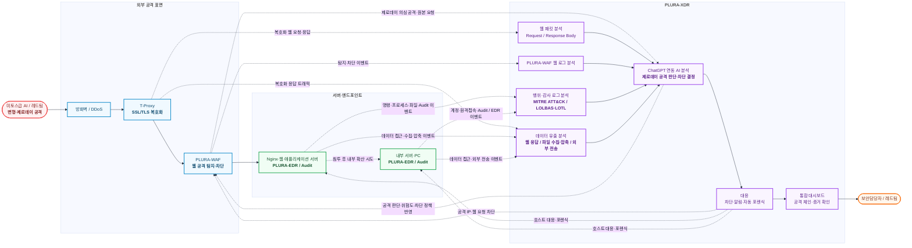
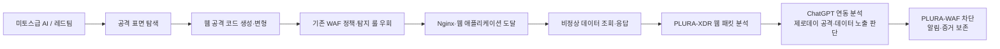
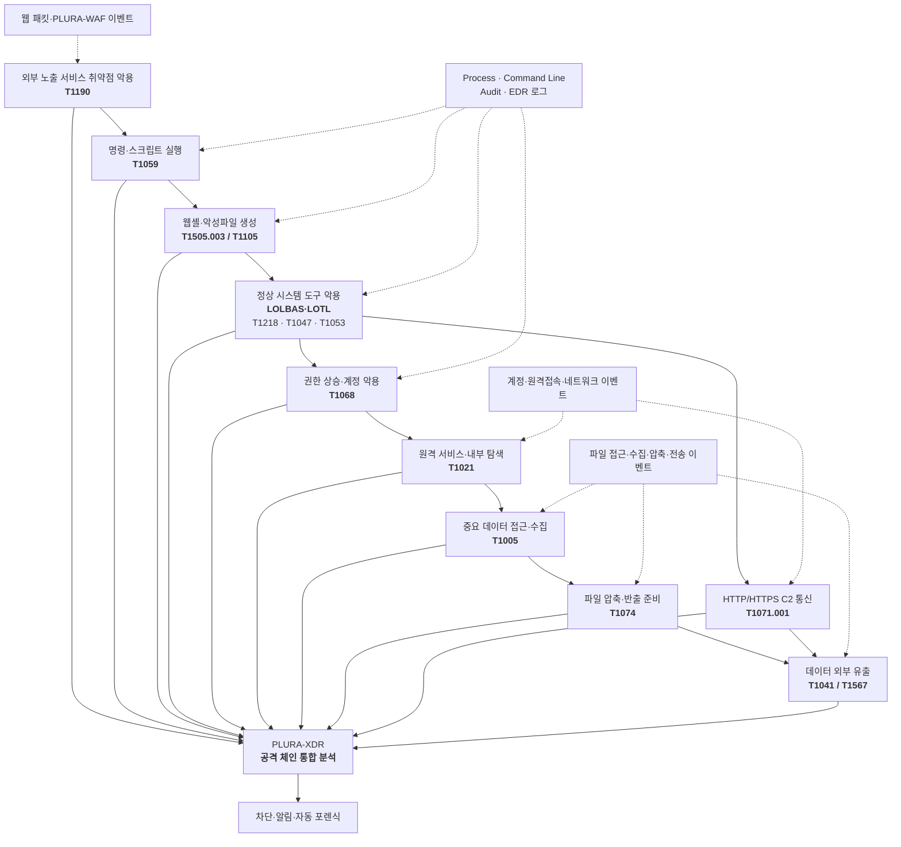
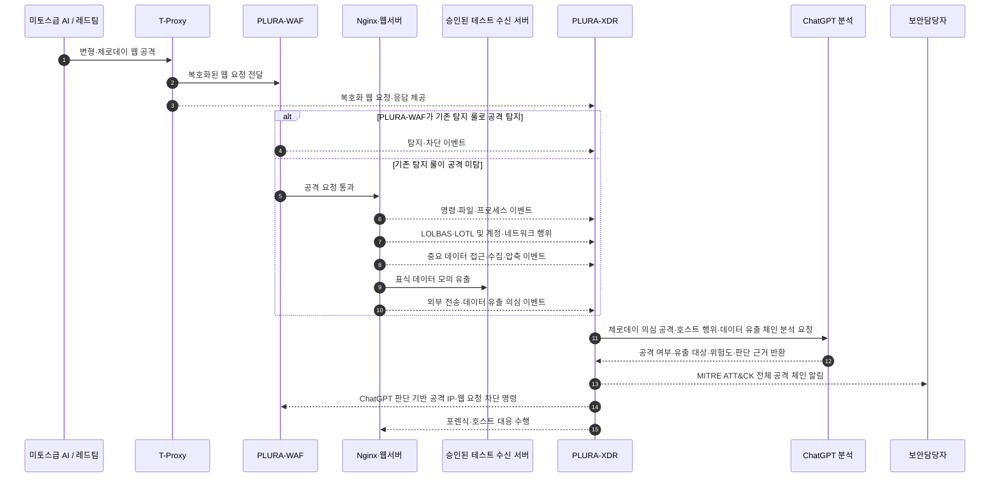

# LG 미토스급 AI 공격 대응 PLURA-XDR PoC 시나리오 제안서

## 1. 제안 목적

**미토스급 AI가 생성·변형한 공격이 기존 보안체계를 우회하더라도 PLURA-XDR이 웹 최초 침투부터 서버·PC 내부 행위와 데이터 유출까지 탐지하고 대응할 수 있는지**를 검증하는 것을 목적으로 합니다.

주요 검증 범위는 다음과 같습니다.

- 외부 웹 공격 표면 탐색 및 변형 공격
- 기존 WAF 정책 우회 및 제로데이 의심 공격
- ChatGPT 연동을 통한 제로데이 의심 공격 탐지·차단
- 웹서버에서의 최초 명령 실행
- 웹셸·악성파일 생성
- PowerShell·Windows 기본 도구 및 Linux 기본 명령을 악용하는 LOLBAS·LOTL 공격
- 권한 상승, 자격증명 접근 및 내부 탐색
- 웹 응답을 통한 데이터 노출
- 중요 데이터 접근·수집·압축 및 외부 유출
- 외부 C2 통신과 내부 확산
- MITRE ATT&CK 기반 탐지·대응
- 공격 IP 차단 및 자동 포렌식

---

## 2. PoC 전체 구성도

T-Proxy에서 제공하는 복호화 웹 트래픽과 PLURA-WAF·호스트 로그를 PLURA-XDR에서 통합 분석하는 구조로 구성합니다.

웹 최초 침투뿐 아니라 침투 이후의 명령, 프로세스, 파일, 계정, 네트워크 행위와 데이터 접근·수집·외부 전송을 하나의 공격 체인으로 연결하여 확인합니다.

기존 탐지 룰만으로 판단하기 어려운 변형·제로데이 의심 공격은 웹 요청·응답 원문을 ChatGPT와 연동하여 공격 여부와 위험도를 판단하고, 그 결과를 PLURA-WAF 차단에 반영합니다.

> T-Proxy의 실제 배치 위치와 미러링 방식은 LG의 네트워크 구성에 맞춰 조정합니다. T-Proxy는 복호화 웹 트래픽을 제공하는 역할로 한정하며, 메일 로그 분석은 이번 PoC 범위에 포함하지 않습니다.

> PLURA-WAF는 기존 탐지 룰로 알려진 공격을 우선 탐지·차단합니다. 기존 룰만으로 판단하기 어려운 변형·제로데이 의심 공격은 PLURA-XDR이 웹 요청·응답 원문을 ChatGPT와 연동하여 분석하고, 공격으로 판단된 결과를 PLURA-WAF 차단에 반영합니다.

---

## 3. PoC 시나리오 선택안

데이터 유출은 다음 두 영역으로 구분하여 검증합니다.

- **웹 응답 기반 데이터 노출**: SQL 인젝션, 인증·권한 우회, 경로 조작, API 오용 등에 의해 중요정보가 웹 응답으로 반환되는 상황
- **침투 이후 데이터 유출**: 서버·PC 내부에서 중요 데이터를 탐색·수집·압축한 후 C2 또는 외부 웹서비스를 통해 반출하는 상황

### 시나리오 1. ChatGPT 연동 제로데이 웹 공격 및 데이터 노출 탐지

#### 목표

AI가 생성·변형한 웹 공격이 기존 WAF 또는 기존 탐지 룰을 우회하는 경우에도, PLURA-XDR이 복호화 웹 패킷의 요청·응답 원문을 ChatGPT와 연동하여 분석하고 제로데이 의심 공격과 데이터 노출을 탐지·차단할 수 있는지 확인합니다.

#### 공격 흐름

#### 테스트 항목

- SQL 인젝션, 명령어 삽입 및 파일 업로드
- 인코딩·분할·문법 변경 등 변형 공격
- 정상 요청과 유사하게 위장한 공격
- Nginx와 웹 애플리케이션의 해석 차이를 이용한 공격
- 기존 WAF 또는 기존 탐지 룰이 탐지하지 못한 제로데이 의심 공격
- ChatGPT 연동을 통한 공격 코드의 목적·위험도·공격 성공 가능성 판단
- ChatGPT 판단 결과를 PLURA-WAF 차단 정책에 반영
- 요청 본문과 응답 본문을 함께 확인해야 하는 공격
- SQL 인젝션을 통한 DB 정보 조회·유출
- 인증·권한 우회를 통한 개인정보 및 중요정보 조회
- 경로 조작을 이용한 파일 다운로드
- API 응답을 통한 대량·비정상 데이터 노출
- 웹 응답 본문에 포함된 개인정보와 중요정보 탐지

#### 확인 결과

> 기존 WAF 또는 기존 탐지 룰이 놓친 AI 변형·제로데이 의심 공격과 이에 따른 데이터 노출을 PLURA-XDR이 웹 요청·응답 원문과 ChatGPT 연동 분석을 기반으로 탐지하고 PLURA-WAF에서 차단할 수 있는지 확인합니다.

---

### 시나리오 2. 최초 침투 이후 MITRE ATT&CK 및 LOLBAS·LOTL 기반 탐지

#### 목표

웹 공격이 기존 WAF 정책을 우회하여 서버에서 코드 실행에 성공한 경우, 별도의 악성코드를 설치하지 않고 운영체제의 정상 도구를 악용하는 LOLBAS·LOTL 행위와 중요 데이터 수집·외부 유출까지 PLURA-XDR이 MITRE ATT&CK 기반으로 탐지하고 대응할 수 있는지 확인합니다.

#### 공격·탐지 구성도

#### 테스트 항목

- 웹서버 프로세스가 실행한 비정상 명령과 부모·자식 프로세스 관계
- 웹셸 및 악성파일 생성
- Shell·PowerShell·Windows Command Shell·Python 등 명령·스크립트 실행
- `rundll32`, `regsvr32`, `mshta`, `wscript`, `cscript`, `wmic`, `schtasks` 등 LOLBAS 악용
- `bash/sh`, `curl/wget`, `python/perl`, `ssh/scp`, `cron/systemd` 등 Linux LOTL 행위
- 정상 도구를 이용한 다운로드, 실행, 지속성 확보 및 방어 회피
- 계정·권한 변경 및 권한 상승
- 외부 C2 통신과 내부 시스템 탐색·측면 이동
- 중요 파일·DB·설정정보 접근 및 수집
- 정상 시스템 도구를 이용한 파일 검색과 수집
- `zip`, `tar`, PowerShell 등 정상 도구를 이용한 파일 압축 및 반출 준비
- HTTPS·C2 채널을 이용한 데이터 외부 전송
- 정상 웹서비스 또는 승인된 테스트 서버를 이용한 모의 유출
- 데이터 접근부터 외부 전송까지의 공격 체인 분석
- 자동 포렌식 및 침해 증거 수집

#### 확인 결과

> 공격 코드나 악성파일의 해시를 알 수 없는 경우에도 웹 요청 이후 발생한 명령 실행, LOLBAS·LOTL 도구 악용, 파일·계정 변경, 권한 상승, 내부 이동, 중요 데이터 수집·압축 및 외부 유출을 하나의 공격 체인으로 탐지할 수 있는지 확인합니다.

#### LOLBAS·LOTL 및 데이터 유출 세부 검증 기준

LOTL은 공격자가 새로운 악성도구를 설치하는 대신 시스템에 이미 존재하는 정상 관리 도구를 악용하는 공격 방식입니다. Windows 환경에서 이러한 바이너리·스크립트·라이브러리를 체계화한 범주가 LOLBAS입니다.

| 환경 | 주요 행위 예시 | 핵심 확인 데이터 | MITRE ATT&CK 예시 |
|---|---|---|---|
| Windows | PowerShell·cmd 실행, 서명된 시스템 바이너리를 통한 우회 실행, WMI·예약 작업 악용 | 부모·자식 프로세스, 명령행, 사용자, 실행 경로, 파일·레지스트리 변경 | T1059, T1218, T1047, T1053 |
| Linux | Shell·Python 실행, curl·wget을 이용한 도구 유입, SSH·SCP 및 cron·systemd 악용 | Audit 로그, execve, 사용자·권한, 파일 생성, 원격접속·네트워크 연결 | T1059.004, T1059.006, T1105, T1021, T1053 |
| 데이터 수집 | 파일·DB·설정정보 검색, 복사, 임시 저장 및 압축 | 파일 접근, 명령행, 프로세스, 실행 계정, 생성 파일과 크기 | T1005, T1074 |
| 데이터 유출 | HTTPS·C2·정상 웹서비스를 통한 외부 전송 | 출발지 호스트, 실행 계정, 프로세스, 목적지, 전송 시각과 전송량 | T1041, T1567 |
| 공통 | 정상 도구를 이용한 실행·지속성·내부 이동·데이터 수집·유출 | 명령·프로세스·파일·계정·네트워크 이벤트의 시간순 상관분석 | T1105, T1071.001 등 |

단순히 PowerShell이나 시스템 관리 도구가 실행되었다는 이유만으로 공격으로 판단하지 않습니다.

**웹 공격 직후의 실행 관계, 비정상 인자, 실행 계정, 파일 생성, 데이터 접근·압축, 외부 통신과 후속 행위를 함께 연결**하여 정상 운영과 공격을 구분합니다.

---

### 시나리오 3. 미토스급 AI 공격 전체 체인 대응

#### 권고 시나리오

시나리오 1과 2를 연결하여 외부 공격부터 서버 내부 침해, 데이터 유출, 대응과 포렌식까지 하나의 공격 스토리로 검증합니다.

#### 전체 공격 체인

```mermaid
flowchart LR
    S1["1. 공격 표면 탐색"]
    S2["2. WAF 우회형 공격 생성"]
    S3["3. Nginx·웹 취약점 악용"]
    S4["4. 최초 명령 실행"]
    S5["5. 웹셸·악성파일 생성"]
    S6["6. LOLBAS·LOTL 악용"]
    S7["7. 권한 상승·계정 접근"]
    S8["8. 내부 탐색·측면 이동"]
    S9["9. 중요 데이터 수집·압축"]
    S10["10. C2·웹서비스를 통한 데이터 유출"]
    S11["11. ChatGPT 연동 분석<br/>PLURA-XDR 탐지·차단·포렌식"]

    S1 --> S2 --> S3 --> S4 --> S5 --> S6
    S6 --> S7 --> S8 --> S9 --> S10 --> S11
```

#### 실시간 시연 순서

#### 확인 결과

> AI가 생성한 변형·제로데이 웹 공격이 기존 WAF 정책을 우회하더라도, PLURA-XDR이 웹 요청·응답 원문을 ChatGPT와 연동하여 공격 여부를 판단하고, 최초 웹 요청부터 명령 실행, 웹셸·악성파일 생성, LOLBAS·LOTL 악용, 권한 상승, 내부 이동, 중요 데이터 수집 및 외부 유출까지 전체 공격 흐름을 탐지·차단·포렌식할 수 있는지 확인합니다.

---

## 4. PoC 수행 전제 및 안전 조건

미토스급 AI 공격 대응 역량을 검증하되, 실제 서비스 장애나 데이터 손상을 유발하지 않도록 다음 원칙을 적용합니다.

- 원칙적으로 스테이징 또는 격리된 PoC 환경에서 수행
- 공격 대상, 허용 계정, 출발지 IP, 시간대와 테스트 항목을 사전 승인
- 운영환경에서 수행하는 경우 비파괴 방식과 읽기 중심 검증으로 제한
- 실제 랜섬웨어 암호화, 대량 데이터 삭제 및 실제 중요정보 반출은 수행하지 않음
- 파일 생성·변경과 권한 상승은 무해한 표식 파일, 테스트 계정과 복구 가능한 범위로 제한
- 데이터 유출 테스트는 실제 개인정보나 중요정보 대신 사전에 승인된 표식 데이터와 테스트 파일을 사용
- 모의 유출은 승인된 테스트 수신 서버와 제한된 전송량으로 수행
- 서비스 지연, 오류율 상승, 자원 사용량 급증 시 즉시 중단하는 기준 마련
- 테스트 전 스냅샷·백업과 원상복구 절차 확보
- 기존 WAF·EDR 정책과 PLURA-XDR 정책 변경 이력을 모두 기록

AI 모의해킹 도구의 공격 강도를 낮추면 충분한 검증이 어려울 수 있으므로, **실제 공격 행위는 재현하되 결과는 무해하게 제한하는 방식**으로 시나리오를 설계합니다.

---

## 5. 보조 시나리오: 크리덴셜 스터핑 공격

전체 공격 체인과 별도로 다음 계정 공격을 병행할 수 있습니다.

- 다수 IP를 이용한 분산 로그인 공격
- 낮은 빈도로 장시간 지속되는 공격
- 여러 계정을 순환하는 공격
- 동일 인증정보의 반복 사용
- 로그인 성공 이후의 비정상 행위

PLURA-XDR에서는 임계치 기반 탐지, 공격 IP 차단, 계정·세션·IP 연계 분석을 확인합니다.

---

## 6. 시나리오별 비교

| 구분 | 시나리오 1 | 시나리오 2 | 시나리오 3 |
|---|---|---|---|
| 중심 영역 | 웹 공격·응답 데이터 노출 | 서버·PC 침해·데이터 수집과 유출 | 전체 공격 체인 |
| 주요 데이터 | 복호화 웹 패킷, PLURA-WAF·웹 로그, Response Body | Audit·EDR·파일·네트워크 로그 | 웹 패킷과 호스트·데이터 유출 로그 전체 |
| 핵심 검증 | WAF 미탐 공격과 웹 응답 데이터 노출 탐지 | MITRE ATT&CK, LOLBAS·LOTL 및 데이터 유출 탐지 | 최초 침투부터 데이터 유출·대응까지 연결 |
| PoC 난이도 | 낮음 | 중간 | 높음 |
| 차별성 | ChatGPT 연동 제로데이 공격·응답 데이터 분석 | 정상 도구 악용과 데이터 유출까지 포함한 행위 탐지 | ChatGPT·WAF·EDR 통합 대응 역량 |
| 권고 | 선택 가능 | 선택 가능 | **최종 권고** |

---

## 7. PoC 성공 기준

다음 수치는 PoC 제안 단계의 권고 목표이며, 실제 목표값은 LG의 환경과 테스트 수량을 확인한 후 확정합니다.

| 평가 항목 | 권고 성공 기준 |
|---|---|
| 핵심 공격 탐지 | 사전 합의한 중요 공격 시나리오 100% 탐지 |
| 전체 탐지율 | 전체 테스트 케이스 기준 90% 이상 |
| 기존 WAF 보완 | 기존 WAF 또는 기존 탐지 룰 미탐 공격 중 PLURA-XDR 추가 탐지 결과 제시 |
| ChatGPT 제로데이 분석 | 기존 룰이 없는 제로데이 의심 공격에 대해 공격 여부·목적·위험도와 판단 근거 제시 |
| ChatGPT 연동 차단 | ChatGPT가 공격으로 판단한 승인 대상 요청을 PLURA-WAF 차단에 정상 반영 |
| 웹 데이터 노출 탐지 | 테스트한 응답 본문 기반 데이터 노출 시나리오 100% 식별 |
| LOLBAS·LOTL 탐지 | 정상 도구의 단순 실행이 아니라 공격 전후 맥락과 연계된 악용 행위 탐지 |
| 데이터 수집 탐지 | 중요 파일 접근·수집·압축 행위를 공격 체인으로 연결 |
| 데이터 유출 탐지 | 승인된 모의 유출 시나리오 100% 탐지 및 전송 증거 확보 |
| 유출 영향 분석 | 유출 대상, 출발지 호스트, 실행 계정, 프로세스 및 전송 목적지 확인 |
| 공격 체인 연결 | 웹 요청부터 데이터 유출까지 동일 타임라인으로 연결 |
| MITRE ATT&CK | 합의한 공격 단계의 전술·기술 매핑 100% 제공 |
| AI 분석 | 공격 코드, 목적, 위험도, 유출 대상과 판단 근거 제시 |
| 탐지·상관분석 시간 | 공격 이벤트 발생 후 5분 이내 공격 체인 구성 |
| 자동 대응 | 승인된 차단·포렌식 동작 성공률 95% 이상 |
| 포렌식 | 테스트 대상 공격의 원본 로그와 핵심 증거 100% 확보 |
| 오탐 | 지정한 정상 트래픽에서 치명적 오탐 0건, 전체 오탐은 사전 합의 기준 이하 |

---

## 8. PoC 결과물 및 운영화 방안

PoC 종료 시 단순 탐지 건수 외에 다음 결과물을 제공합니다.

- 공격 시나리오별 탐지·미탐·오탐 결과
- ChatGPT 연동 제로데이 의심 공격의 판단 근거와 PLURA-WAF 차단 결과
- 최초 웹 요청부터 데이터 유출까지의 공격 타임라인
- 웹 응답 기반 데이터 노출과 호스트 침해 기반 데이터 유출의 구분
- 유출 대상 데이터와 접근 경로
- 데이터 수집·압축·전송 과정의 타임라인
- 데이터 유출에 사용된 계정·프로세스·명령어
- 외부 전송 목적지와 전송량
- 데이터 소스별 탐지 기여도와 가시성 공백
- MITRE ATT&CK 전술·기술 커버리지와 미탐 구간
- LOLBAS·LOTL 행위별 탐지 근거와 정상 운영 구분 기준
- 탐지·차단·포렌식까지의 소요 시간
- 기존 WAF·EDR과 PLURA-XDR의 역할 분담
- 운영환경 적용을 위한 정책·예외·우선순위 권고

PoC 이후에는 다음 순서로 운영화를 진행할 수 있습니다.

1. 탐지 정책과 정상 관리 행위의 허용 기준 정리
2. 중요 공격과 데이터 유출에 대한 IP 차단·호스트 포렌식 플레이북 확정
3. WAF·EDR·SOC 운영 절차와 PLURA-XDR 연계
4. 중요 데이터와 유출 경로에 대한 우선순위 설정
5. 우선 시스템부터 단계적으로 적용
6. 탐지 결과를 기반으로 정책과 대응 절차를 지속 보완

---

## 9. PLURA-XDR 제공 범위

- T-Proxy 복호화 웹 패킷 분석
- PLURA-WAF 기반 웹 공격 탐지와 차단
- 기존 WAF 또는 기존 탐지 룰이 놓치는 제로데이 의심 공격 분석
- 웹 요청·응답 원문과 ChatGPT 연동을 통한 제로데이 의심 공격 판단
- ChatGPT 공격 판단 결과의 PLURA-WAF 탐지·차단 연계
- 웹 요청·응답 본문 분석
- 웹 응답 본문 기반 개인정보·중요정보 노출 분석
- 중요 파일·DB·설정정보 접근 및 수집 행위 분석
- 파일 압축·임시 저장 및 반출 준비 행위 분석
- 외부 C2·웹서비스를 통한 데이터 전송과 유출 의심 행위 분석
- 서버·PC의 명령·프로세스·파일·계정·네트워크 및 감사 로그 분석
- MITRE ATT&CK 기반 침해 행위 탐지
- Windows LOLBAS 및 Linux LOTL 기반 정상 도구 악용 탐지
- 공격 IP 자동 차단
- 자동 포렌식과 침해 증거 제공

※ 메일 로그 분석은 제공 범위에 포함하지 않습니다.

---
