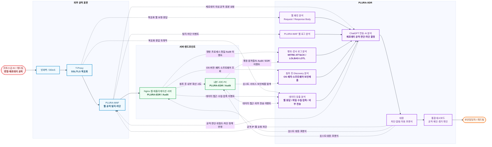
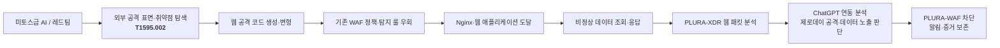
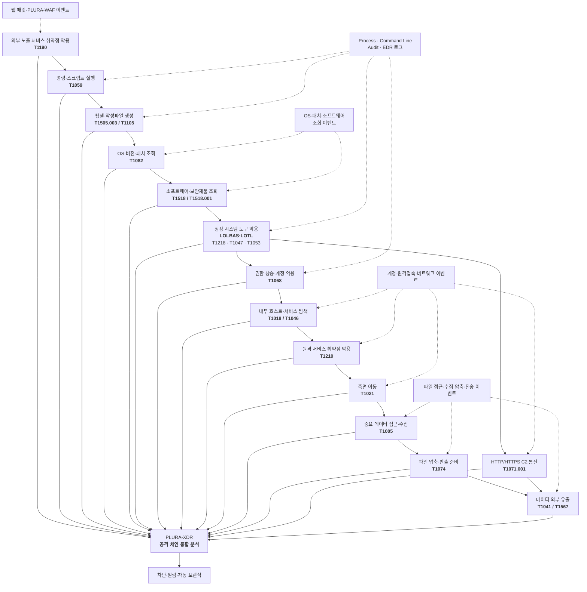
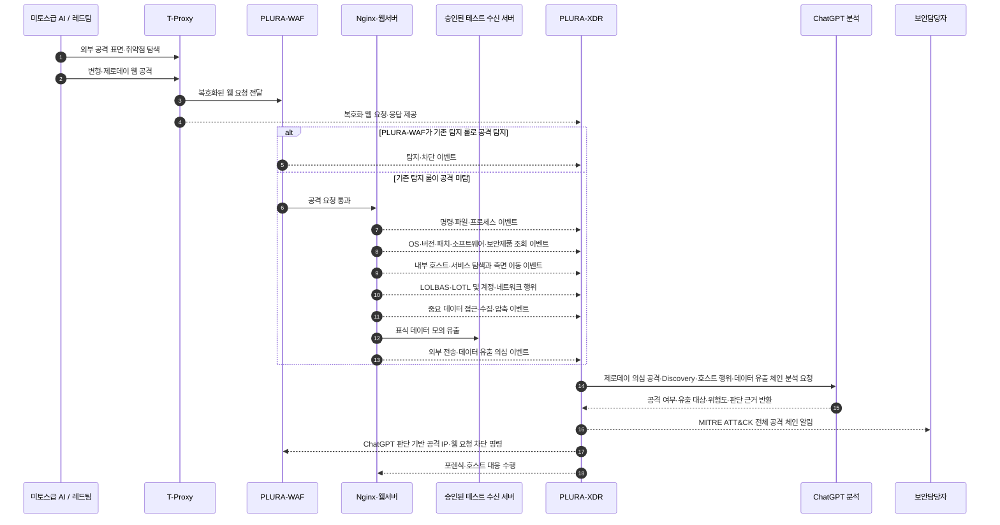

# LG 미토스급 AI 공격 대응 PLURA-XDR PoC 시나리오 제안서

## 미토스급 AI 공격과 PoC 검증 범위

미토스급 AI는 방화벽, VPN, 웹방화벽, 운영체제 및 웹 애플리케이션 등 외부에 노출된 다양한 공격 표면에서 취약점을 탐색하고, 실제 공격 코드를 생성하여 침투를 시도할 수 있습니다.

공격자가 방화벽이나 VPN의 취약점을 악용하여 내부 서버로 직접 진입하는 시나리오도 가능합니다. 다만 특정 보안장비의 실제 제로데이 취약점을 PoC 환경에서 재현하는 것은 현실적으로 어렵습니다.

따라서 이번 PoC에서는 미토스급 AI가 경계 보안체계의 탐지를 우회하거나 취약점을 악용해 내부로 침투하는 상황을 전제로 하되, 실제 시연이 가능한 대표 경로인 다음 시나리오를 검증합니다.

> 외부 공격 표면 및 취약점 탐색  
> → 웹방화벽 탐지 우회  
> → 웹서버 취약점 악용  
> → 최초 명령 실행  
> → OS·버전·패치·소프트웨어·보안제품 탐색  
> → LOLBAS·LOTL 기반 내부 행위  
> → 권한 상승 및 내부 이동  
> → 중요 데이터 수집·유출

이 시나리오의 목적은 웹방화벽 기능만을 검증하는 것이 아닙니다.

경계 보안체계가 제로데이 공격을 놓치거나 우회당한 이후에도 PLURA-XDR이 웹 요청·응답과 서버·PC의 명령·프로세스·파일·계정·네트워크 행위를 하나의 공격 체인으로 연결하여 탐지·차단·포렌식할 수 있는지를 입증하는 것이 핵심입니다.

### MITRE ATT&CK 단계별 PoC 검증 범위

미토스급 AI가 다음 공격을 선택하기 위해서는 외부에서는 공격 표면과 취약점을 탐색하고, 최초 호스트에 침투한 이후에는 운영체제·버전·패치·설치 소프트웨어와 보안제품을 파악할 수 있습니다.

침투 전 외부 탐색과 침투 후 호스트 탐색은 다음과 같이 구분합니다.

| 공격 단계 | 주요 행위 | MITRE ATT&CK | PoC 검증 범위 |
|---|---|---|---|
| 정찰 | 외부 서비스·제품·버전 및 취약점 탐색 | Reconnaissance, T1595.002 | 웹 패킷·WAF 로그에서 반복 탐색과 취약점 확인 요청 분석 |
| 자원 개발 | 익스플로잇·공격 인프라·도구 준비 | Resource Development, TA0042 | 공격자 측에서 수행되므로 직접 탐지 성공 기준에서는 제외 |
| 초기 진입 | 외부 노출 웹서비스 취약점 악용 | Initial Access, T1190 | 웹 요청·응답, ChatGPT 분석 및 PLURA-WAF 차단 연계 |
| 실행 | 웹서버에서 최초 명령·스크립트 실행 | Execution, T1059 | 부모·자식 프로세스, 명령행 및 실행 계정 분석 |
| 침투 후 탐색 | OS·버전·패치·소프트웨어·보안제품 조회 | Discovery, T1082, T1518, T1518.001 | Audit·EDR 로그 기반 조회 행위와 후속 공격 연계 분석 |
| 내부 탐색 | 내부 호스트·서비스 탐색 | Discovery, T1018, T1046 | 원격 시스템·서비스 탐색과 측면 이동 준비 행위 분석 |
| 권한 상승·측면 이동 | 로컬·원격 취약점 악용 및 내부 이동 | T1068, T1210, T1021 | 권한 변경, 원격 접속과 후속 프로세스 분석 |
| 수집·유출 | 중요 데이터 수집·압축·외부 전송 | T1005, T1074, T1041, T1567 | 파일·계정·프로세스·네트워크 이벤트 통합 분석 |

Resource Development는 주로 공격자 환경에서 수행되므로 LG 내부 로그만으로 직접 관찰하기 어렵습니다. 이번 PoC에서는 공격 트래픽이 대상 환경에 도달한 이후의 정찰, 초기 진입, 실행, Discovery, 권한 상승, 측면 이동과 데이터 유출을 검증합니다.

## Why PLURA-XDR

PLURA-XDR은 기존 방화벽이나 EDR을 대체하는 것이 아니라, 경계 보안체계가 우회되거나 침해된 상황에서도 다음과 같은 다층 대응을 제공합니다.

- 웹 요청·응답 원문과 ChatGPT 연동을 통한 제로데이 의심 공격 판단
- PLURA-WAF와 연계한 공격 IP 및 웹 요청 차단
- MITRE ATT&CK 기반 명령 실행·권한 상승·내부 이동 탐지
- 침투 후 OS·버전·패치·설치 소프트웨어와 보안제품 탐색 탐지
- 외부 웹 요청부터 Discovery와 후속 취약점 악용까지의 공격 맥락 분석
- LOLBAS·LOTL 기반 정상 시스템 도구 악용 탐지
- 중요 데이터 접근·수집·압축 및 외부 유출 탐지
- 최초 침투부터 데이터 유출까지의 공격 체인 분석
- 자동 포렌식과 침해 증거 보존

따라서 이번 PoC는 특정 보안장비의 실제 제로데이 취약점을 재현하는 시험이 아니라, 미토스급 AI가 경계 보안체계를 통과하여 내부에 침투한 상황에서 PLURA-XDR이 호스트 환경 탐색, 후속 취약점 선택, 권한 상승, 내부 이동과 데이터 유출을 어떻게 탐지하고 대응하는지를 검증하는 시험입니다.

> **1차 방어:** ChatGPT 연동을 통한 변형·제로데이 웹 공격 판단·차단  
> **2차 방어:** 초기 진입 이후 OS·패치·소프트웨어·보안제품 탐색 행위 탐지  
> **3차 방어:** 권한 상승·측면 이동·데이터 유출 탐지와 포렌식

---

## 1. 제안 목적

앞서 정의한 대표 공격 경로를 기반으로, 경계 보안체계를 통과한 미토스급 AI 공격을 PLURA-XDR이 최초 침투부터 내부 확산과 데이터 유출까지 탐지·차단·포렌식할 수 있는지 검증합니다.

주요 검증 범위는 다음과 같습니다.

- 외부 웹 공격 표면·제품·버전 및 취약점 탐색
- 기존 WAF 정책 우회 및 제로데이 의심 공격
- ChatGPT 연동을 통한 제로데이 의심 공격 탐지·차단
- 웹서버에서의 최초 명령 실행
- 웹셸·악성파일 생성
- Windows·Linux의 OS·버전·패치·설치 소프트웨어와 보안제품 탐색
- PowerShell·Windows 기본 도구 및 Linux 기본 명령을 악용하는 LOLBAS·LOTL 공격
- 권한 상승, 자격증명 접근, 내부 호스트·서비스 탐색 및 측면 이동
- 웹 응답을 통한 데이터 노출
- 중요 데이터 접근·수집·압축 및 외부 유출
- 외부 C2 통신과 내부 확산
- MITRE ATT&CK 기반 탐지·대응
- 공격 IP 차단 및 자동 포렌식

---

## 2. PoC 전체 구성도

T-Proxy에서 제공하는 복호화 웹 트래픽과 PLURA-WAF·호스트 로그를 PLURA-XDR에서 통합 분석하는 구조로 구성합니다.

웹 최초 침투뿐 아니라 침투 이후의 OS·버전·패치·소프트웨어 탐색, 명령, 프로세스, 파일, 계정, 네트워크 행위와 데이터 접근·수집·외부 전송을 하나의 공격 체인으로 연결하여 확인합니다.

기존 탐지 룰만으로 판단하기 어려운 변형·제로데이 의심 공격은 웹 요청·응답 원문을 ChatGPT와 연동하여 공격 여부와 위험도를 판단하고, 그 결과를 PLURA-WAF 차단에 반영합니다.

> T-Proxy의 실제 배치 위치와 미러링 방식은 LG의 네트워크 구성에 맞춰 조정합니다. T-Proxy는 복호화 웹 트래픽을 제공하는 역할로 한정하며, 메일 로그 분석은 이번 PoC 범위에 포함하지 않습니다.

> PLURA-WAF는 기존 탐지 룰로 알려진 공격을 우선 탐지·차단합니다. 기존 룰만으로 판단하기 어려운 변형·제로데이 의심 공격은 PLURA-XDR이 웹 요청·응답 원문을 ChatGPT와 연동하여 분석하고, 공격으로 판단된 결과를 PLURA-WAF 차단에 반영합니다.

---

## 3. PoC 시나리오 선택안

데이터 유출은 다음 두 영역으로 구분하여 검증합니다.

- **웹 응답 기반 데이터 노출**: SQL 인젝션, 인증·권한 우회, 경로 조작, API 오용 등에 의해 중요정보가 웹 응답으로 반환되는 상황
- **침투 이후 데이터 유출**: 서버·PC 내부에서 중요 데이터를 탐색·수집·압축한 후 C2 또는 외부 웹서비스를 통해 반출하는 상황

### 시나리오 1. ChatGPT 연동 제로데이 웹 공격 및 데이터 노출 탐지

#### 목표

AI가 생성·변형한 웹 공격이 기존 WAF 또는 기존 탐지 룰을 우회하는 경우에도, PLURA-XDR이 복호화 웹 패킷의 요청·응답 원문을 ChatGPT와 연동하여 분석하고 제로데이 의심 공격과 데이터 노출을 탐지·차단할 수 있는지 확인합니다.

#### 공격 흐름

#### 테스트 항목

- SQL 인젝션, 명령어 삽입 및 파일 업로드
- 인코딩·분할·문법 변경 등 변형 공격
- 정상 요청과 유사하게 위장한 공격
- 웹 배너·오류 응답·경로 탐색을 통한 제품·버전 추정
- 반복·변형 요청을 이용한 외부 취약점 확인
- Nginx와 웹 애플리케이션의 해석 차이를 이용한 공격
- 기존 WAF 또는 기존 탐지 룰이 탐지하지 못한 제로데이 의심 공격
- ChatGPT 연동을 통한 공격 코드의 목적·위험도·공격 성공 가능성 판단
- ChatGPT 판단 결과를 PLURA-WAF 차단 정책에 반영
- 요청 본문과 응답 본문을 함께 확인해야 하는 공격
- SQL 인젝션을 통한 DB 정보 조회·유출
- 인증·권한 우회를 통한 개인정보 및 중요정보 조회
- 경로 조작을 이용한 파일 다운로드
- API 응답을 통한 대량·비정상 데이터 노출
- 웹 응답 본문에 포함된 개인정보와 중요정보 탐지

#### 확인 결과

> 기존 WAF 또는 기존 탐지 룰이 놓친 AI 변형·제로데이 의심 공격과 이에 따른 데이터 노출을 PLURA-XDR이 웹 요청·응답 원문과 ChatGPT 연동 분석을 기반으로 탐지하고 PLURA-WAF에서 차단할 수 있는지 확인합니다.

---

### 시나리오 2. 최초 침투 이후 Discovery·MITRE ATT&CK 및 LOLBAS·LOTL 기반 탐지

#### 목표

웹 공격이 기존 WAF 정책을 우회하여 서버에서 코드 실행에 성공한 경우, 공격자가 후속 취약점과 공격 경로를 선택하기 위해 수행하는 OS·버전·패치·설치 소프트웨어·보안제품 탐색을 탐지할 수 있는지 확인합니다.

이후 별도의 악성코드를 설치하지 않고 운영체제의 정상 도구를 악용하는 LOLBAS·LOTL 행위, 권한 상승, 내부 이동과 중요 데이터 수집·외부 유출까지 PLURA-XDR이 MITRE ATT&CK 기반으로 탐지하고 대응할 수 있는지 확인합니다.

#### 공격·탐지 구성도

#### 테스트 항목

- 웹서버 프로세스가 실행한 비정상 명령과 부모·자식 프로세스 관계
- 웹셸 및 악성파일 생성
- Windows·Linux의 OS 종류, 버전, 빌드, 커널, 아키텍처 조회
- 설치된 패치·핫픽스·서비스팩과 패키지 버전 조회
- 설치 소프트웨어, 웹·미들웨어·DB 버전 및 보안제품 탐색
- 현재 실행 계정·권한과 실행 중인 프로세스·서비스 확인
- Shell·PowerShell·Windows Command Shell·Python 등 명령·스크립트 실행
- `rundll32`, `regsvr32`, `mshta`, `wscript`, `cscript`, `wmic`, `schtasks` 등 LOLBAS 악용
- `bash/sh`, `curl/wget`, `python/perl`, `ssh/scp`, `cron/systemd` 등 Linux LOTL 행위
- 정상 도구를 이용한 다운로드, 실행, 지속성 확보 및 방어 회피
- 탐색 결과를 이용한 후속 권한 상승 취약점 선택
- 계정·권한 변경 및 권한 상승
- 내부 호스트·서비스·포트 탐색
- 원격 서비스 취약점 악용과 측면 이동
- 외부 C2 통신과 내부 시스템 탐색·측면 이동
- 중요 파일·DB·설정정보 접근 및 수집
- 정상 시스템 도구를 이용한 파일 검색과 수집
- `zip`, `tar`, `PowerShell` 등 정상 도구를 이용한 파일 압축 및 반출 준비
- HTTPS·C2 채널을 이용한 데이터 외부 전송
- 정상 웹서비스 또는 승인된 테스트 서버를 이용한 모의 유출
- 데이터 접근부터 외부 전송까지의 공격 체인 분석
- 자동 포렌식 및 침해 증거 수집

#### 확인 결과

> 공격 코드나 악성파일의 해시를 알 수 없는 경우에도 웹 요청 이후 발생한 명령 실행, OS·버전·패치·소프트웨어·보안제품 탐색, 후속 취약점 선택, LOLBAS·LOTL 도구 악용, 권한 상승, 내부 이동, 중요 데이터 수집·압축 및 외부 유출을 하나의 공격 체인으로 탐지할 수 있는지 확인합니다.

#### 침투 후 Discovery 세부 검증 기준

최초 코드 실행 이후의 버전·패치 조회는 침투 전 정찰이 아니라 MITRE ATT&CK의 **Discovery** 단계에 해당합니다. 공격자는 조회 결과를 이용해 권한 상승, 방어 회피 또는 측면 이동에 사용할 후속 취약점과 공격 방식을 선택할 수 있습니다.

| 탐색 대상 | 주요 행위 예시 | 핵심 확인 데이터 | MITRE ATT&CK |
|---|---|---|---|
| 시스템 정보 | Windows·Linux 종류, 버전, 빌드, 커널, 아키텍처 조회 | 부모·자식 프로세스, 명령행, 실행 계정, 조회 시각 | T1082 |
| 패치 상태 | 핫픽스·서비스팩·설치 패키지와 업데이트 상태 조회 | 명령행, 패키지·레지스트리 조회, 프로세스 실행 | T1082 |
| 설치 소프트웨어 | 애플리케이션·웹서버·미들웨어·DB 제품과 버전 조회 | 프로세스, 파일·패키지 목록, 서비스 정보 | T1518 |
| 보안제품 | EDR·백신·방화벽·모니터링 센서와 설정 조회 | 프로세스·서비스·레지스트리·설정 조회 | T1518.001 |
| 내부 시스템 | 내부 IP·호스트명·인접 시스템 확인 | 네트워크 구성, DNS·ARP·원격 시스템 조회 | T1018 |
| 네트워크 서비스 | 내부 포트·서비스·버전 탐색 | 연결 시도, 목적지·포트, 프로세스, 실행 계정 | T1046 |
| 후속 공격 | 탐색 결과를 이용한 로컬·원격 취약점 악용 | 취약점 악용 직전 조회 행위와 후속 권한·원격접속 이벤트 | T1068, T1210 |

OS·패치 또는 소프트웨어 조회는 정상 운영에서도 발생할 수 있으므로 단일 명령만으로 공격으로 판단하지 않습니다.

**외부 웹 공격 → 웹서버 프로세스의 Shell 실행 → 짧은 시간 내 시스템·패치·보안제품 조회 → 권한 상승 또는 내부 서비스 공격**의 순서를 연결하여 정상 관리 행위와 공격을 구분합니다.

#### LOLBAS·LOTL 및 데이터 유출 세부 검증 기준

LOTL은 공격자가 새로운 악성도구를 설치하는 대신 시스템에 이미 존재하는 정상 관리 도구를 악용하는 공격 방식입니다. Windows 환경에서 이러한 바이너리·스크립트·라이브러리를 체계화한 범주가 LOLBAS입니다.

| 환경 | 주요 행위 예시 | 핵심 확인 데이터 | MITRE ATT&CK 예시 |
|---|---|---|---|
| Windows | PowerShell·cmd 실행, 서명된 시스템 바이너리를 통한 우회 실행, WMI·예약 작업 악용 | 부모·자식 프로세스, 명령행, 사용자, 실행 경로, 파일·레지스트리 변경 | T1059, T1218, T1047, T1053 |
| Linux | Shell·Python 실행, curl·wget을 이용한 도구 유입, SSH·SCP 및 cron·systemd 악용 | Audit 로그, execve, 사용자·권한, 파일 생성, 원격접속·네트워크 연결 | T1059.004, T1059.006, T1105, T1021, T1053 |
| 데이터 수집 | 파일·DB·설정정보 검색, 복사, 임시 저장 및 압축 | 파일 접근, 명령행, 프로세스, 실행 계정, 생성 파일과 크기 | T1005, T1074 |
| 데이터 유출 | HTTPS·C2·정상 웹서비스를 통한 외부 전송 | 출발지 호스트, 실행 계정, 프로세스, 목적지, 전송 시각과 전송량 | T1041, T1567 |
| 공통 | 정상 도구를 이용한 실행·지속성·내부 이동·데이터 수집·유출 | 명령·프로세스·파일·계정·네트워크 이벤트의 시간순 상관분석 | T1105, T1071.001 등 |

단순히 PowerShell이나 시스템 관리 도구가 실행되었다는 이유만으로 공격으로 판단하지 않습니다.

**웹 공격 직후의 실행 관계, OS·패치·소프트웨어 탐색, 비정상 인자, 실행 계정, 파일 생성, 데이터 접근·압축, 외부 통신과 후속 행위를 함께 연결**하여 정상 운영과 공격을 구분합니다.

---

### 시나리오 3. 미토스급 AI 공격 전체 체인 대응

#### 권고 시나리오

시나리오 1과 2를 연결하여 외부 공격부터 서버 내부 침해, 데이터 유출, 대응과 포렌식까지 하나의 공격 스토리로 검증합니다.

#### 전체 공격 체인

#### 실시간 시연 순서

#### 확인 결과

> AI가 생성한 변형·제로데이 웹 공격이 기존 WAF 정책을 우회하더라도, PLURA-XDR이 웹 요청·응답 원문을 ChatGPT와 연동하여 공격 여부를 판단하고, 최초 웹 요청부터 명령 실행, OS·버전·패치·소프트웨어·보안제품 탐색, 후속 취약점 선택, LOLBAS·LOTL 악용, 권한 상승, 내부 이동, 중요 데이터 수집 및 외부 유출까지 전체 공격 흐름을 탐지·차단·포렌식할 수 있는지 확인합니다.

---

## 4. PoC 수행 전제 및 안전 조건

미토스급 AI 공격 대응 역량을 검증하되, 실제 서비스 장애나 데이터 손상을 유발하지 않도록 다음 원칙을 적용합니다.

- 원칙적으로 스테이징 또는 격리된 PoC 환경에서 수행
- 공격 대상, 허용 계정, 출발지 IP, 시간대와 테스트 항목을 사전 승인
- 운영환경에서 수행하는 경우 비파괴 방식과 읽기 중심 검증으로 제한
- 실제 랜섬웨어 암호화, 대량 데이터 삭제 및 실제 중요정보 반출은 수행하지 않음
- 파일 생성·변경과 권한 상승은 무해한 표식 파일, 테스트 계정과 복구 가능한 범위로 제한
- 데이터 유출 테스트는 실제 개인정보나 중요정보 대신 사전에 승인된 표식 데이터와 테스트 파일을 사용
- 모의 유출은 승인된 테스트 수신 서버와 제한된 전송량으로 수행
- 서비스 지연, 오류율 상승, 자원 사용량 급증 시 즉시 중단하는 기준 마련
- 테스트 전 스냅샷·백업과 원상복구 절차 확보
- 기존 WAF·EDR 정책과 PLURA-XDR 정책 변경 이력을 모두 기록

AI 모의해킹 도구의 공격 강도를 낮추면 충분한 검증이 어려울 수 있으므로, **실제 공격 행위는 재현하되 결과는 무해하게 제한하는 방식**으로 시나리오를 설계합니다.

---

## 5. 보조 시나리오: 크리덴셜 스터핑 공격

전체 공격 체인과 별도로 다음 계정 공격을 병행할 수 있습니다.

- 다수 IP를 이용한 분산 로그인 공격
- 낮은 빈도로 장시간 지속되는 공격
- 여러 계정을 순환하는 공격
- 동일 인증정보의 반복 사용
- 로그인 성공 이후의 비정상 행위

PLURA-XDR에서는 임계치 기반 탐지, 공격 IP 차단, 계정·세션·IP 연계 분석을 확인합니다.

---

## 6. 시나리오별 비교

| 구분 | 시나리오 1 | 시나리오 2 | 시나리오 3 |
|---|---|---|---|
| 중심 영역 | 웹 공격·응답 데이터 노출 | 침투 후 Discovery·서버·PC 침해·데이터 유출 | 전체 공격 체인 |
| 주요 데이터 | 복호화 웹 패킷, PLURA-WAF·웹 로그, Response Body | Audit·EDR·파일·네트워크 로그 | 웹 패킷과 호스트·데이터 유출 로그 전체 |
| 핵심 검증 | WAF 미탐 공격과 웹 응답 데이터 노출 탐지 | OS·패치·소프트웨어 탐색, MITRE ATT&CK, LOLBAS·LOTL 및 데이터 유출 탐지 | 최초 침투부터 Discovery·데이터 유출·대응까지 연결 |
| PoC 난이도 | 낮음 | 중간 | 높음 |
| 차별성 | ChatGPT 연동 제로데이 공격·응답 데이터 분석 | 정상 도구 악용과 데이터 유출까지 포함한 행위 탐지 | ChatGPT·WAF·EDR 통합 대응 역량 |
| 권고 | 선택 가능 | 선택 가능 | **최종 권고** |

---

## 7. PoC 성공 기준

다음 수치는 PoC 제안 단계의 권고 목표이며, 실제 목표값은 LG의 환경과 테스트 수량을 확인한 후 확정합니다.

| 평가 항목 | 권고 성공 기준 |
|---|---|
| 핵심 공격 탐지 | 사전 합의한 중요 공격 시나리오 100% 탐지 |
| 전체 탐지율 | 전체 테스트 케이스 기준 90% 이상 |
| 기존 WAF 보완 | 기존 WAF 또는 기존 탐지 룰 미탐 공격 중 PLURA-XDR 추가 탐지 결과 제시 |
| ChatGPT 제로데이 분석 | 기존 룰이 없는 제로데이 의심 공격에 대해 공격 여부·목적·위험도와 판단 근거 제시 |
| ChatGPT 연동 차단 | ChatGPT가 공격으로 판단한 승인 대상 요청을 PLURA-WAF 차단에 정상 반영 |
| 외부 취약점 탐색 | 사전 합의한 공격 표면·제품·버전·취약점 탐색 요청을 식별하고 T1595.002로 분류 |
| 침투 후 Discovery | OS·버전·패치·소프트웨어·보안제품 조회를 탐지하고 T1082·T1518·T1518.001로 매핑 |
| 내부 탐색 | 내부 호스트·서비스 탐색을 탐지하고 T1018·T1046 및 후속 T1210과 연결 |
| 웹 데이터 노출 탐지 | 테스트한 응답 본문 기반 데이터 노출 시나리오 100% 식별 |
| LOLBAS·LOTL 탐지 | 정상 도구의 단순 실행이 아니라 공격 전후 맥락과 연계된 악용 행위 탐지 |
| 데이터 수집 탐지 | 중요 파일 접근·수집·압축 행위를 공격 체인으로 연결 |
| 데이터 유출 탐지 | 승인된 모의 유출 시나리오 100% 탐지 및 전송 증거 확보 |
| 유출 영향 분석 | 유출 대상, 출발지 호스트, 실행 계정, 프로세스 및 전송 목적지 확인 |
| 공격 체인 연결 | 웹 요청부터 침투 후 Discovery, 권한 상승, 측면 이동과 데이터 유출까지 동일 타임라인으로 연결 |
| MITRE ATT&CK | 합의한 공격 단계의 전술·기술 매핑 100% 제공 |
| AI 분석 | 공격 코드, 목적, 위험도, 유출 대상과 판단 근거 제시 |
| 탐지·상관분석 시간 | 공격 이벤트 발생 후 5분 이내 공격 체인 구성 |
| 자동 대응 | 승인된 차단·포렌식 동작 성공률 95% 이상 |
| 포렌식 | 테스트 대상 공격의 원본 로그와 핵심 증거 100% 확보 |
| 오탐 | 지정한 정상 트래픽에서 치명적 오탐 0건, 전체 오탐은 사전 합의 기준 이하 |

---

## 8. PoC 결과물 및 운영화 방안

PoC 종료 시 단순 탐지 건수 외에 다음 결과물을 제공합니다.

- 공격 시나리오별 탐지·미탐·오탐 결과
- ChatGPT 연동 제로데이 의심 공격의 판단 근거와 PLURA-WAF 차단 결과
- 외부 취약점 탐색부터 데이터 유출까지의 공격 타임라인
- OS·버전·패치·소프트웨어·보안제품 탐색과 후속 공격 선택의 연계 결과
- T1082·T1518·T1518.001·T1018·T1046 기반 Discovery 탐지 결과
- 웹 응답 기반 데이터 노출과 호스트 침해 기반 데이터 유출의 구분
- 유출 대상 데이터와 접근 경로
- 데이터 수집·압축·전송 과정의 타임라인
- 데이터 유출에 사용된 계정·프로세스·명령어
- 외부 전송 목적지와 전송량
- 데이터 소스별 탐지 기여도와 가시성 공백
- MITRE ATT&CK 전술·기술 커버리지와 미탐 구간
- LOLBAS·LOTL 행위별 탐지 근거와 정상 운영 구분 기준
- 탐지·차단·포렌식까지의 소요 시간
- 기존 WAF·EDR과 PLURA-XDR의 역할 분담
- 운영환경 적용을 위한 정책·예외·우선순위 권고

PoC 이후에는 다음 순서로 운영화를 진행할 수 있습니다.

1. 탐지 정책과 정상 관리 행위의 허용 기준 정리
2. 중요 공격과 데이터 유출에 대한 IP 차단·호스트 포렌식 플레이북 확정
3. WAF·EDR·SOC 운영 절차와 PLURA-XDR 연계
4. 중요 데이터와 유출 경로에 대한 우선순위 설정
5. 우선 시스템부터 단계적으로 적용
6. 탐지 결과를 기반으로 정책과 대응 절차를 지속 보완

---

## 9. PLURA-XDR 제공 범위

- T-Proxy 복호화 웹 패킷 분석
- PLURA-WAF 기반 웹 공격 탐지와 차단
- 기존 WAF 또는 기존 탐지 룰이 놓치는 제로데이 의심 공격 분석
- 웹 요청·응답 원문과 ChatGPT 연동을 통한 제로데이 의심 공격 판단
- ChatGPT 공격 판단 결과의 PLURA-WAF 탐지·차단 연계
- 웹 요청·응답 본문 분석
- 웹 응답 본문 기반 개인정보·중요정보 노출 분석
- 중요 파일·DB·설정정보 접근 및 수집 행위 분석
- 파일 압축·임시 저장 및 반출 준비 행위 분석
- 외부 C2·웹서비스를 통한 데이터 전송과 유출 의심 행위 분석
- 서버·PC의 명령·프로세스·파일·계정·네트워크 및 감사 로그 분석
- Windows·Linux의 OS·버전·패치·설치 소프트웨어와 보안제품 탐색 분석
- 내부 호스트·서비스 탐색과 원격 취약점 악용·측면 이동 연계 분석
- MITRE ATT&CK 기반 침해 행위 탐지
- Windows LOLBAS 및 Linux LOTL 기반 정상 도구 악용 탐지
- 공격 IP 자동 차단
- 자동 포렌식과 침해 증거 제공

※ 메일 로그 분석은 제공 범위에 포함하지 않습니다.

---
