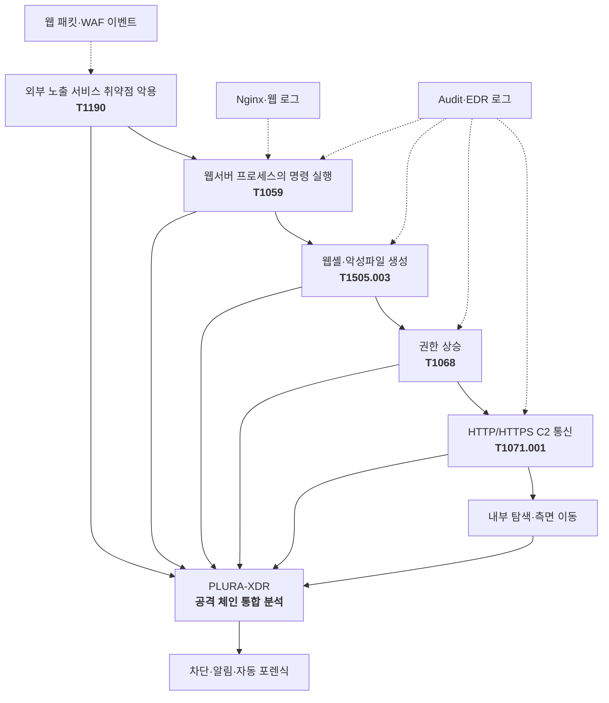
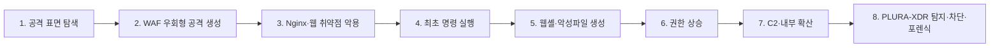
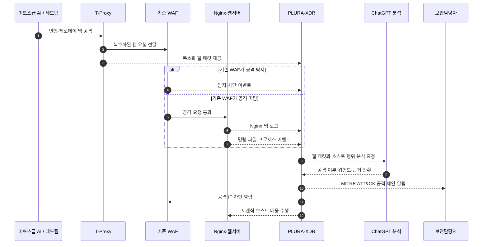

# LG 미토스급 AI 공격 대응 PLURA-XDR PoC 시나리오 제안서

## 1. 제안 목적

이번 PoC는 미토스라는 AI 모델 자체를 식별하는 것이 아니라, **미토스급 AI가 생성·변형한 공격이 기존 보안체계를 우회하더라도 PLURA-XDR이 웹 최초 침투부터 서버·PC 내부 행위까지 탐지하고 대응할 수 있는지**를 검증하는 것을 목적으로 합니다.

주요 검증 범위는 다음과 같습니다.

- 외부 웹 공격 표면 탐색 및 변형 공격
- 기존 WAF 우회 및 제로데이 의심 공격
- Nginx 리버스 프록시 또는 웹 애플리케이션 취약점 악용
- 웹서버에서의 최초 명령 실행
- 웹셸·악성파일 생성
- 권한 상승 및 외부 C2 통신
- MITRE ATT&CK 기반 탐지·대응
- 공격 IP 차단 및 자동 포렌식

메일 로그 분석과 일반적인 NDR 네트워크 가시성은 이번 PoC의 중심 범위에서 제외합니다.

---

## 2. PoC 전체 구성도

첨부된 H-은행 PoC 구성도를 기반으로, T-Proxy 복호화 웹 트래픽과 웹·호스트 로그를 PLURA-XDR에서 통합 분석하는 구조로 구성합니다.

```mermaid
%%{init: {
  "theme": "base",
  "themeVariables": {
    "fontFamily": "Pretendard, Noto Sans KR, Arial",
    "background": "#ffffff",
    "primaryTextColor": "#0f172a",
    "lineColor": "#1f2937"
  }
}}%%
flowchart LR

    ATTACKER(["미토스급 AI / 레드팀<br/><b>변형·제로데이 공격</b>"])

    subgraph EDGE["외부 공격 표면"]
        direction LR
        FW["방화벽 / DDoS"]
        TP["T-Proxy<br/><b>SSL/TLS 복호화</b>"]
        WAF["기존 WAF / PLURA-WAF<br/><b>웹 공격 탐지·차단</b>"]
        NGINX["Nginx<br/><b>리버스 프록시</b>"]
    end

    subgraph HOST["서버·엔드포인트"]
        direction LR
        WEB["웹·애플리케이션 서버<br/><b>PLURA-EDR</b>"]
        INTERNAL["내부 서버·PC<br/><b>PLURA-EDR</b>"]
    end

    subgraph XDR["PLURA-XDR"]
        direction TB
        PACKET["웹 패킷 분석<br/>Request / Response Body"]
        EVENT["WAF·Nginx·웹 로그 분석"]
        MITRE["감사 로그 분석<br/><b>MITRE ATT&CK 탐지</b>"]
        AI["AI 분석<br/><b>ChatGPT 기반 공격 판단</b>"]
        RESPONSE["대응<br/>차단·알림·자동 포렌식"]
        DASH["통합 대시보드<br/>공격 체인·증거 확인"]
    end

    SOC(["보안담당자 / 레드팀"])

    ATTACKER --> FW --> TP --> WAF --> NGINX --> WEB
    WEB -. "침투 후 내부 확산 시도" .-> INTERNAL

    TP -. "복호화 웹 트래픽" .-> PACKET
    WAF -. "탐지·차단 이벤트" .-> EVENT
    NGINX -. "Access / Error 로그" .-> EVENT
    WEB -. "Audit / EDR 이벤트" .-> MITRE
    INTERNAL -. "Audit / EDR 이벤트" .-> MITRE

    PACKET --> AI
    EVENT --> AI
    MITRE --> AI
    AI --> RESPONSE --> DASH --> SOC

    RESPONSE -. "공격 IP 차단" .-> WAF
    RESPONSE -. "호스트 대응·포렌식" .-> WEB
    RESPONSE -. "호스트 대응·포렌식" .-> INTERNAL

    classDef attack fill:#fff1f2,stroke:#ef4444,stroke-width:2px,color:#7f1d1d;
    classDef edge fill:#f0f9ff,stroke:#0284c7,stroke-width:2px,color:#0c4a6e;
    classDef host fill:#f0fdf4,stroke:#16a34a,stroke-width:2px,color:#14532d;
    classDef xdr fill:#faf5ff,stroke:#9333ea,stroke-width:2px,color:#581c87;
    classDef soc fill:#fff7ed,stroke:#f97316,stroke-width:2px,color:#7c2d12;

    class ATTACKER attack;
    class FW,TP,WAF,NGINX edge;
    class WEB,INTERNAL host;
    class PACKET,EVENT,MITRE,AI,RESPONSE,DASH xdr;
    class SOC soc;
```

> T-Proxy와 기존 WAF의 실제 배치 위치 및 미러링 방식은 LG의 네트워크 구성에 맞춰 조정합니다. T-Proxy는 복호화 웹 트래픽을 제공하는 역할로 한정합니다.

---

## 3. PoC 시나리오 선택안

### 시나리오 1. AI 변형 웹 공격 탐지

#### 목표

AI가 생성·변형한 웹 공격이 기존 WAF를 우회하는 경우에도 PLURA-XDR이 복호화 웹 패킷의 요청·응답 내용을 분석하여 공격을 탐지하고 대응할 수 있는지 확인합니다.

#### 공격 흐름

#### 테스트 항목

- SQL 인젝션, 명령어 삽입, 파일 업로드
- 인코딩·분할·문법 변경 등 변형 공격
- 정상 요청과 유사하게 위장한 공격
- Nginx와 웹 애플리케이션의 해석 차이를 이용한 공격
- 기존 WAF가 탐지하지 못한 제로데이 의심 공격
- 요청 본문과 응답 본문을 함께 확인해야 하는 공격

#### 확인 결과

> 기존 WAF가 놓친 AI 변형 웹 공격을 PLURA-XDR이 웹 요청·응답 내용을 기반으로 탐지하고 차단할 수 있는지 확인합니다.

---

### 시나리오 2. 최초 침투 이후 MITRE ATT&CK 기반 탐지

#### 목표

웹 공격이 기존 WAF를 우회하여 서버에서 코드 실행에 성공한 경우, 침투 이후 발생하는 행위를 PLURA-XDR이 MITRE ATT&CK 기반으로 탐지하고 대응할 수 있는지 확인합니다.

#### 공격·탐지 구성도

#### 테스트 항목

- 웹서버 프로세스가 실행한 비정상 명령
- 웹셸 및 악성파일 생성
- Shell·PowerShell·스크립트 실행
- 계정·권한 변경 및 권한 상승
- 외부 C2 통신
- 내부 시스템 탐색과 확산 시도
- 자동 포렌식 및 침해 증거 수집

#### 확인 결과

> 공격 코드가 알려지지 않은 제로데이라도, 침투 이후 나타나는 명령 실행·파일 생성·권한 상승·C2 통신을 MITRE ATT&CK 기반으로 탐지할 수 있는지 확인합니다.

---

### 시나리오 3. 미토스급 AI 공격 전체 체인 대응

#### 권고 시나리오

시나리오 1과 2를 연결하여 외부 공격부터 서버 내부 침해, 대응과 포렌식까지 하나의 공격 스토리로 검증합니다.

#### 전체 공격 체인

#### 실시간 시연 순서

#### 확인 결과

> AI가 생성한 변형·제로데이 웹 공격이 기존 WAF를 우회하더라도, PLURA-XDR이 최초 웹 요청부터 서버 내부의 명령 실행, 파일 생성, 권한 상승 및 외부 통신까지 전체 공격 흐름을 탐지하고 대응할 수 있는지 확인합니다.

---

## 4. 보조 시나리오: 크리덴셜 스터핑 공격

전체 공격 체인과 별도로 다음 계정 공격을 병행할 수 있습니다.

- 다수 IP를 이용한 분산 로그인 공격
- 낮은 빈도로 장시간 지속되는 공격
- 여러 계정을 순환하는 공격
- 동일 인증정보의 반복 사용
- 로그인 성공 이후의 비정상 행위

PLURA-XDR에서는 임계치 기반 탐지, 공격 IP 차단, 계정·세션·IP 연계 분석을 확인합니다.

---

## 5. 시나리오별 비교

| 구분 | 시나리오 1 | 시나리오 2 | 시나리오 3 |
|---|---|---|---|
| 중심 영역 | 웹 공격 | 서버·PC 침해 | 전체 공격 체인 |
| 주요 데이터 | 복호화 웹 패킷, WAF·웹 로그 | Audit·EDR 로그 | 웹 패킷과 호스트 로그 전체 |
| 핵심 검증 | WAF 미탐 공격 탐지 | MITRE ATT&CK 기반 탐지 | 최초 침투부터 대응까지 연결 |
| PoC 난이도 | 낮음 | 중간 | 높음 |
| 차별성 | AI 웹 공격 분석 | 침투 후 행위 탐지 | PLURA-XDR 통합 대응 역량 |
| 권고 | 선택 가능 | 선택 가능 | **최종 권고** |

---

## 6. PoC 성공 기준

| 평가 항목 | 확인 내용 |
|---|---|
| 웹 공격 탐지 | 기존·변형·제로데이 의심 공격 탐지 여부 |
| 기존 WAF 보완 | 기존 WAF가 놓친 공격의 추가 탐지 여부 |
| AI 분석 | 공격 코드, 목적, 위험도와 판단 근거 제시 |
| 침투 연계 | 웹 요청과 서버 내부 행위의 연결 여부 |
| MITRE ATT&CK | 공격 단계별 전술·기술 매핑 여부 |
| 대응 | 공격 IP 차단 및 호스트 대응 여부 |
| 포렌식 | 공격 이후 증거 수집과 영향 범위 확인 |
| 오탐 | 정상 트래픽에 대한 오탐 수준 |
| 탐지 속도 | 공격 발생부터 탐지·대응까지 소요 시간 |

---

## 7. PLURA-XDR 제공 범위

- T-Proxy 복호화 웹 패킷 분석
- WAF 기반 웹 공격 탐지와 차단
- 기존 WAF가 놓치는 제로데이 의심 공격 분석
- 웹 요청·응답 본문 분석
- Nginx 및 웹 애플리케이션 로그 분석
- 서버·PC 감사 로그 분석
- MITRE ATT&CK 기반 침해 행위 탐지
- 공격 IP 자동 차단
- 자동 포렌식과 침해 증거 제공

메일 로그 분석은 제공 범위에 포함하지 않습니다.

---

## 8. 최종 권고

이번 PoC는 **시나리오 3의 전체 공격 체인 대응**을 중심으로 구성하는 것이 가장 적합합니다.

시나리오 1만 진행하면 웹 공격 탐지 제품으로 보일 수 있고, 시나리오 2만 진행하면 일반적인 EDR 검증과 차별성이 약해질 수 있습니다.

두 영역을 연결해야 다음과 같은 PLURA-XDR의 핵심 가치가 드러납니다.

> **기존 WAF를 우회한 AI 웹 공격을 탐지하고, 최초 침투 이후 서버에서 발생한 행위까지 MITRE ATT&CK 기반으로 연결하여 차단·분석·포렌식하는 통합 대응체계**

크리덴셜 스터핑은 짧은 보조 시나리오로 추가하여, AI 변형 공격과 대규모 계정 공격에 대한 대응 능력을 함께 보여주는 구성을 권고합니다.
