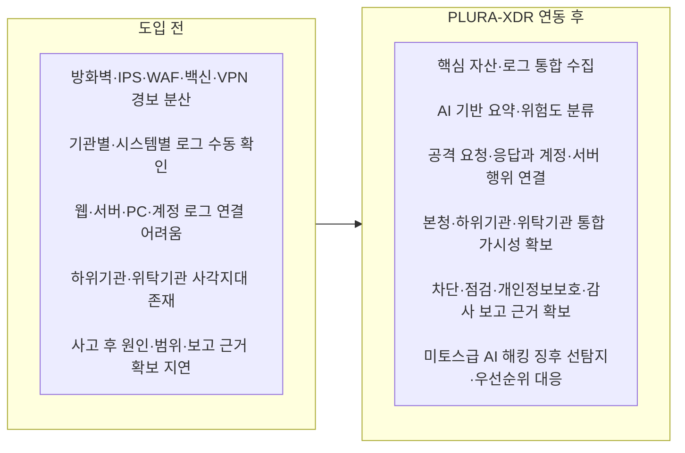
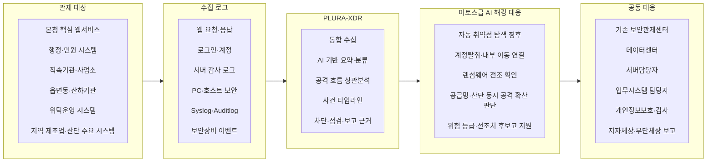
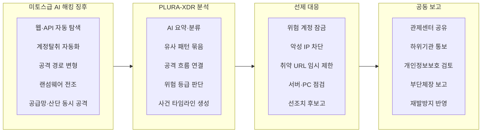
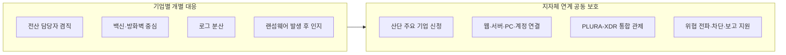
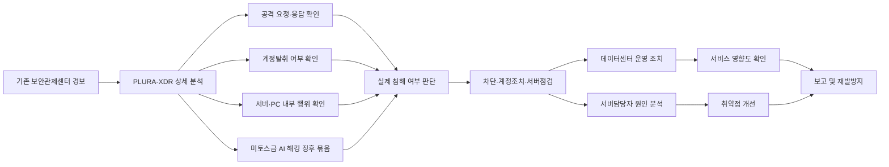

# 시·군 지자체 통합 사이버보안관제 고도화 제안서

## 기존 보안관제센터와 PLURA-XDR 연동을 통한 본청·하위기관·지역 제조업·미토스급 AI 해킹 통합 대응 방안

---

## 0. 제안 요약

본 제안은 시·군 지자체가 이미 운영 중인 보안관제센터를 대체하려는 제안이 아닙니다.

핵심은 기존 보안관제센터의 운영 체계는 유지하면서, PLURA-XDR을 연동해 **본청, 직속기관, 사업소, 읍면동, 산하기관, 위탁기관, 지역 제조업 주요 시스템까지 공격 흐름을 함께 보고 대응할 수 있는 통합 사이버보안관제 체계**를 구축하는 것입니다.

본 제안의 핵심 사항은 다음 네 가지입니다.

| 핵심 메시지 | 설명 |
|---|---|
| 기존 관제센터를 대체하지 않습니다 | 방화벽, IPS, WAF, DDoS, 기존 관제 흐름은 유지하고 PLURA-XDR의 상세 분석 정보를 결합합니다. |
| 본청만 보는 관제에서 하위기관까지 보는 관제로 확장합니다 | 직속기관, 사업소, 읍면동, 산하기관, 위탁기관, 외부 공개 웹서비스까지 단계적으로 확대합니다. |
| 공격 탐지에서 실제 침해 여부 판단과 보고까지 연결합니다 | 웹 요청·응답, 계정, 서버, PC, 로그를 연결해 차단, 계정조치, 서버점검, 개인정보보호, 감사·보고 근거를 확보합니다. |
| 미토스급 AI 해킹에 선제 대응합니다 | 자동화된 취약점 탐색, 계정탈취, 랜섬웨어, 공급망 공격, 산단 동시 공격 징후를 사건 단위로 묶고 위험 등급에 따라 선제 조치할 수 있게 합니다. |

본 문서에서 **미토스급 AI 해킹**은 공격자가 AI와 자동화 도구를 활용해 웹·API 취약점 탐색, 계정탈취, 내부 이동, 랜섬웨어 확산, 공급망 침투를 고속으로 결합하는 연쇄형 공격을 의미합니다.

---

## 1. 제안 개요

### 1.1 제안의 기본 방향

> “본 제안은 기존 보안관제센터를 바꾸자는 제안이 아니라, 기존 관제센터가 더 정확하게 판단하고 더 빠르게 조치할 수 있도록 PLURA-XDR을 연동하는 고도화 제안입니다.”

### 1.2 적용 필요성

시·군 지자체는 이미 보안장비와 관제체계를 운영하고 있습니다. 그러나 최근 공격은 단순 차단 이벤트만으로 판단하기 어렵습니다. 공격이 시도에 그쳤는지, 실제 침해로 이어졌는지, 어떤 계정과 서버가 영향을 받았는지, 개인정보나 행정정보가 외부로 노출되었는지 확인하려면 웹 요청·응답, 계정, 서버, PC, 로그를 함께 봐야 합니다.

PLURA-XDR은 이 부분을 보완합니다.

기존 관제센터가 경보를 확인하면, PLURA-XDR은 그 경보와 관련된 원본 웹 요청·응답, 로그인 성공·실패, 서버 내부 행위, 의심 파일, 프로세스, 데이터유출 가능성, 대응 이력을 하나의 사건 흐름으로 연결합니다.

따라서 지자체는 “공격이 있었습니다”에서 멈추지 않고, “어느 기관의 어떤 시스템에서 어떤 계정이 관련되었고, 실제 영향 가능성은 어느 정도이며, 어떤 조치를 했고, 누구에게 보고할 수 있는가”까지 설명할 수 있습니다.

특히 미토스급 AI 해킹처럼 공격자가 자동화 도구와 AI를 활용해 취약점을 빠르게 찾고, 공격 경로를 바꾸고, 계정탈취와 랜섬웨어를 결합하는 상황에서는 단일 장비 경보만으로는 대응이 늦습니다. PLURA-XDR은 빠르게 늘어나는 경보를 요약하고, 관련 이벤트를 하나의 사건으로 연결하며, 위험 등급과 조치 우선순위를 제시해 선제 대응을 가능하게 합니다.

### 1.3 주요 부서별 검토 관점

| 대상 부서·역할 | 검토 관심사 | 검토 포인트 |
|---|---|---|
| 정보화부서 | 기존 관제체계와 충돌 여부 | 기존 관제센터를 대체하지 않고 상세 분석을 보완합니다. |
| 보안관제센터 | 경보 과다, 오탐, 분석 시간 | 웹·계정·서버 로그를 사건 단위로 연결해 분석 우선순위를 높입니다. |
| 데이터센터 | 차단 시 서비스 영향 | 차단 대상 IP, URL, 계정, 서버를 근거 기반으로 판단할 수 있습니다. |
| 서버담당자 | 원인 분석과 조치 | 취약 URL, 파라미터, 파일 변경, 프로세스 실행을 직접 확인할 수 있습니다. |
| 개인정보보호 담당자 | 유출 가능성 판단 | 웹 응답, 조회 패턴, 계정 접근 이력으로 개인정보 노출 가능성을 확인합니다. |
| 감사·법무 부서 | 사고 경위와 증적 | 원본 로그, 사건 타임라인, 대응 이력을 근거로 남깁니다. |
| 부단체장·기획예산 | 예산 타당성, 행정 리스크 | 본청과 하위기관의 행정서비스 연속성, 주민 신뢰, 보고 책임을 줄이는 투자입니다. |
| 산업·기업지원 부서 | 지역 제조업·산단 보호 | 지역 기업이 혼자 감당하기 어려운 보안을 지자체형 공동 보호 모델로 확장할 수 있습니다. |
| 재난안전·정책 부서 | 미토스급 AI 해킹 선제 대응 | 산단 동시 공격, 랜섬웨어 확산, 공급망 침투를 지역 산업 리스크로 보고 등급별 대응 체계를 마련할 수 있습니다. |

---

## 2. 제안 배경

최근 사이버 공격은 대기업이나 중앙기관에만 국한되지 않습니다. 시·군 지자체, 산하기관, 위탁기관, 지역 공공서비스, 산업단지 입주기업까지 공격 범위가 확대되고 있습니다.

시·군 지자체는 주민 행정, 민원, 복지, 세정, 교통, 상하수도, 재난안전, 문화·체육시설, 보건소, 공공예약, 홈페이지 등 시민 생활과 직접 연결된 서비스를 운영합니다. 이 때문에 지자체에 대한 해킹은 단순한 정보시스템 장애가 아니라 다음과 같은 행정 리스크로 확산될 수 있습니다.

- 주민 개인정보 유출
- 민원·행정서비스 중단
- 복지·세정·재난안전 업무 차질
- 산하기관 및 위탁기관으로 침해 확산
- 지역 공공서비스 신뢰 하락
- 개인정보보호, 감사, 법적 책임 증가
- 지자체장, 부단체장, 정보화부서, 개인정보보호책임자의 설명 부담 증가
- 지역 제조업과 산업단지로 이어지는 공급망 위험 확대

사이버보안은 더 이상 IT 부서만의 기술 문제가 아닙니다. 지자체에서는 **행정 신뢰, 주민 안전, 공공서비스 지속성, 지역 산업 보호**와 연결되는 핵심 통제 체계입니다.

여기에 미토스급 AI 해킹 대응 관점이 추가되어야 합니다. 공격자가 AI와 자동화 도구를 이용해 웹·API 취약점 탐색, 계정탈취, 내부 이동, 랜섬웨어 확산, 공급망 침투를 빠르게 수행하는 환경에서는 사고 이후 복구보다 공격 징후를 먼저 발견하고 확산 전에 차단하는 체계가 필요합니다.

---

## 3. 현재 관제체계의 한계와 보완 필요성

현재 다수의 시·군 지자체는 자체 또는 상위기관 연계 방식으로 보안관제센터를 운영하고 있습니다. 방화벽, IPS, WAF, DDoS 대응 장비, 웹서버 로그, 보안장비 로그를 수집하고, 위협 이벤트가 발생하면 관제요원이 확인해 차단 또는 통보하는 구조입니다.

이 체계는 반드시 유지되어야 합니다. 다만 최근 공격은 단일 장비 경보만으로 판단하기 어렵습니다.

대표적인 공격 유형은 다음과 같습니다.

| 공격 유형 | 기존 관제에서 생기는 어려움 | PLURA-XDR 보완 방향 |
|---|---|---|
| 계정탈취 | 실패·성공 로그가 흩어져 있어 실제 탈취 여부 판단이 늦음 | 로그인 요청·응답, 출발지 IP, 대상 계정, 이후 행위를 연결 |
| 크리덴셜 스터핑 | 대량 로그인 시도와 실제 성공 계정 식별이 어려움 | 자동화 로그인 패턴과 실패 후 성공 계정을 사건으로 묶음 |
| 관리자 페이지 공격 | 단순 접근인지 침해 시도인지 판단이 어려움 | URL, 파라미터, 응답, 계정 이력을 함께 확인 |
| 웹쉘·파일 업로드 | 업로드 시도와 서버 내부 실행 여부 연결이 어려움 | 웹 요청, 파일 생성, 프로세스 실행을 연결 |
| API 대량 조회 | 정상 이용과 비정상 대량 조회 구분이 어려움 | 호출량, 응답 크기, 민감정보 노출 가능성을 분석 |
| 서버 내부 침해 | 보안장비 경보만으로 서버 내부 행위를 알기 어려움 | Syslog, Auditlog, 호스트 보안 로그로 의심 행위 확인 |
| 데이터유출 가능성 | 공격은 보이지만 실제 응답 내용 확인이 어려움 | 웹 응답 본문, 크기, 상태값, 조회 패턴으로 유출 가능성 판단 |
| 랜섬웨어 전조 | 파일 변경, 권한 상승, 내부 이동을 늦게 발견 | 계정, 파일, 프로세스, 서버 행위를 통합 분석 |
| AI 기반 취약점 자동 탐색 | 짧은 시간에 다수 시스템 경보가 폭증해 우선순위 판단이 어려움 | 유사 패턴을 묶고 위험도가 높은 자산부터 분석 |
| 공격 경로 자동 변형 | 하나의 룰이나 장비 이벤트만으로 공격 흐름 추적이 어려움 | 웹 요청·응답, 계정, 서버 행위를 상관분석해 사건 단위로 연결 |
| 산단·위탁기관 동시 공격 | 기관별 분산 대응으로 확산 판단과 전파가 늦음 | 유사 공격 패턴을 본청·하위기관·산단 단위로 공유하고 선제 차단 근거 확보 |

기존 보안장비 로그만으로는 공격이 시도에 그쳤는지, 실제 침해로 이어졌는지, 어느 서버와 계정이 영향을 받았는지, 개인정보나 행정정보가 노출되었는지 판단하기 어렵습니다.

PLURA-XDR은 웹 요청·응답 로그, 로그인 요청·응답 정보, 서버 감사 로그, Syslog, Auditlog, 호스트 보안 로그를 함께 분석하여 보안관제센터, 데이터센터, 서버담당자, 업무시스템 담당자가 같은 근거로 침해 여부와 영향도를 확인할 수 있도록 지원합니다.

---

## 4. 제안 목표

본 제안의 목표는 기존 시·군 보안관제센터를 대체하는 것이 아닙니다.

> **기존 보안관제센터의 운영 체계는 유지하면서, PLURA-XDR을 연동하여 본청·직속기관·사업소·읍면동·산하기관·위탁기관·지역 제조업 주요 시스템까지 통합적으로 탐지·분석·차단·보고할 수 있는 지자체형 사이버보안 대응 체계를 구축하는 것입니다.**

이를 통해 시·군은 다음 역량을 확보할 수 있습니다.

1. 기존 보안관제센터 경보의 분석 정확도 향상
2. 웹 공격, 계정탈취, 데이터유출, 서버 침해 행위 통합 분석
3. 본청뿐 아니라 하위기관과 위탁기관까지 공격 확산 여부 확인
4. 단순 탐지 중심 대응에서 실제 침해 여부 판단 중심 대응으로 전환
5. 관제센터, 데이터센터, 서버담당자, 업무부서, 개인정보보호 담당자 간 공동 대응 체계 구축
6. 사고 발생 시 지자체장, 부단체장, 감사, 개인정보보호, 의회 보고에 필요한 근거 확보
7. 차단, 계정조치, 서버점검, 취약점 개선, 재발방지까지 이어지는 대응 프로세스 정착
8. 지역 제조업과 산업단지까지 확장 가능한 공동 보안 모델 마련
9. 미토스급 AI 해킹에 대비한 선제 탐지, 위험 등급화, 선조치·후보고 기반 마련

---

## 5. PLURA-XDR 도입 전과 도입 후

PLURA-XDR 연동 효과는 도입 전후 비교를 통해 명확하게 확인할 수 있습니다.

| 구분 | 도입 전 | PLURA-XDR 연동 후 |
|---|---|---|
| 관제 방식 | 장비별 경보 확인 중심 | 사건 단위 통합 분석 중심 |
| 분석 범위 | 방화벽, IPS, WAF 등 보안장비 로그 중심 | 웹 요청·응답, 계정, 서버, PC, Syslog, Auditlog까지 연결 |
| 판단 기준 | 공격 시도 여부 중심 | 실제 침해 여부와 영향도 판단 |
| 대응 속도 | 담당자 수동 확인 후 조치 | 위험도, 타임라인, 관련 자산 기준으로 우선 조치 |
| 하위기관 보호 | 기관별 편차와 사각지대 발생 | 본청 기준으로 단계적 통합 관제 확대 |
| 보고 근거 | 장비 이벤트 중심 보고 | 원본 로그, 사건 흐름, 대응 이력 기반 보고 |
| 개인정보보호 | 유출 가능성 판단이 어려움 | 웹 응답, 조회 패턴, 계정 접근 이력 기반 판단 |
| 지역 제조업 확장 | 기업별 개별 보안에 의존 | 산단·위탁·공공서비스 연계형 공동 보호 모델 가능 |
| 미토스급 AI 해킹 대응 | 공격 속도와 경보량을 사람이 따라가기 어려움 | AI 기반 요약, 상관분석, 위험 등급화로 선제 조치와 후보고 지원 |

---

## 6. 제안 적용 구조

PLURA-XDR은 기존 관제센터와 병행·연동되는 구조로 적용합니다. 새로운 관제센터를 별도로 만드는 것이 아니라, 기존 보안관제센터가 이미 수행 중인 탐지·분석·차단·통보 업무에 PLURA-XDR의 상세 분석 정보를 결합합니다.

이 구조의 핵심은 **같은 사건을 같은 근거로 보는 것**입니다. 관제센터는 경보와 위험도를 보고, 데이터센터는 차단과 서비스 영향도를 보고, 서버담당자는 실제 내부 행위를 보고, 개인정보보호 담당자는 유출 가능성과 신고·통지 필요성을 검토할 수 있습니다.

### 6.1 미토스급 AI 해킹 대응 관점

미토스급 AI 해킹은 단순히 “AI가 만든 공격”이라는 뜻이 아닙니다. 공격자가 AI와 자동화 도구를 활용해 취약점 탐색, 공격 경로 변경, 계정탈취, 내부 이동, 랜섬웨어 확산, 공급망 침투를 빠르게 수행하는 **고속·자동화·연쇄형 공격**을 의미합니다.

시·군 지자체 관점에서는 이를 행정망, 산하기관, 위탁기관, 지역 제조업, 산업단지까지 연결되는 지역 리스크로 보아야 합니다.

| 미토스급 AI 해킹 위협 | 지자체·지역 산업 관점의 위험 | PLURA-XDR 대응 포인트 |
|---|---|---|
| 웹·API 취약점 자동 탐색 | 본청, 하위기관, 위탁운영 웹서비스가 짧은 시간에 동시 공격 대상이 됨 | 웹 요청·응답과 URL·파라미터를 수집해 유사 공격을 묶고 우선순위화 |
| 계정탈취 자동화 | 관리자 계정, 위탁업체 계정, 원격 접속 계정이 반복 공격 대상이 됨 | 로그인 성공·실패, 출발지 IP, 이후 서버 행위를 연결해 실제 탈취 여부 판단 |
| 공격 경로 자동 변형 | 공격자가 실패한 요청을 빠르게 바꾸며 WAF·룰 기반 탐지를 우회 시도 | 요청·응답, 계정, 서버 로그를 상관분석해 사건 흐름으로 추적 |
| 내부 이동과 권한 상승 | 한 시스템 침해가 다른 기관이나 서버로 확산될 수 있음 | 파일 변경, 프로세스 실행, 계정 생성, 권한 변경 이력을 통합 확인 |
| 랜섬웨어 전조 | 대량 파일 변경, 백업 훼손, 업무 서버 암호화로 행정서비스 중단 가능 | 서버·PC 행위, 파일 변경, 의심 프로세스를 조기에 탐지하고 격리 판단 지원 |
| 공급망·산단 동시 공격 | 위탁기관, 협력업체, 산업단지 기업을 통한 연쇄 피해 가능 | 유사 패턴을 본청·산하기관·산단 단위로 공유하고 차단·후보고 근거 확보 |

### 6.2 미토스급 AI 해킹 등급별 대응 기준

미토스급 AI 해킹 대응의 핵심은 사고 이후 복구가 아니라 **선제 탐지와 확산 전 차단**입니다. 지자체는 사전에 합의된 기준에 따라 관심·주의·경계·심각·긴급 등급을 운영하고, 긴급 상황에서는 서비스 영향도를 확인하면서 선조치·후보고가 가능하도록 절차를 정비해야 합니다.

| 등급 | 판단 상황 | 대응 원칙 | PLURA-XDR 활용 |
|---|---|---|---|
| 관심 | 신규 취약점 공개, 의심 IP 증가, 유사 공격 정보 수집 | 모니터링 강화와 담당자 공유 | 위협 패턴 등록, 관제 대상 점검 |
| 주의 | 특정 웹서비스·계정에 반복 공격 발생 | 예방 조치와 취약 서비스 점검 | 웹 요청·응답, 로그인 패턴, 대상 계정 확인 |
| 경계 | 비정상 로그인 급증, 취약점 악용 시도, 관리자 페이지 공격 집중 | 긴급 점검, 차단 후보 선별, 패치 안내 | 공격 흐름 상관분석, 위험도 분류, 조치 우선순위 제시 |
| 심각 | 실제 침투 정황, 관리자 계정 탈취, 서버 내부 의심 행위 확인 | 즉시 차단, 계정 잠금, 서버 점검, 부단체장 보고 | 사건 타임라인, 관련 IP·계정·서버 근거 제공 |
| 긴급 | 다수 기관·위탁기관·산단 동시 공격, 랜섬웨어 확산, 행정서비스 중단 우려 | 선조치·후보고, 확산 차단, 공동 대응 | 유사 패턴 묶음, 대량 이벤트 요약, 차단·격리·보고 근거 확보 |

---

## 7. 기존 보안관제센터 연동 운영 방안

### 7.1 연동 기본 원칙

PLURA-XDR은 기존 관제센터의 역할을 대체하지 않습니다. 다음 원칙으로 운영합니다.

1. 기존 보안관제센터 경보 체계 유지
2. PLURA-XDR 탐지 이벤트를 기존 관제 흐름에 연동
3. 초기에는 대응 필요성이 높은 이벤트부터 우선 연동
4. 중복 경보를 최소화하고, 실제 분석 가치가 높은 이벤트 중심으로 운영
5. 관제센터, 데이터센터, 서버담당자, 업무시스템 담당자가 동일한 분석 정보를 공유
6. 차단, 통보, 서버점검, 취약점 개선, 보고까지 하나의 프로세스로 연결
7. 미토스급 AI 해킹에 대비해 유사 공격 패턴 공유, 위험 등급화, 선조치·후보고 기준 마련

### 7.2 1단계 우선 연동 대상

초기에는 기존 관제센터가 가장 많이 접하는 웹 공격과 계정 기반 공격부터 연동합니다.

| 우선 연동 이벤트 | 설명 | 기대 효과 |
|---|---|---|
| 웹 공격 탐지 | SQL Injection, XSS, 경로 탐색, 명령어 삽입 | 공격 URL, 파라미터, 응답 확인 |
| 파일 업로드 공격 | 웹쉘 업로드, 악성 파일 업로드 의심 | 업로드 이후 서버 내부 행위 연결 |
| 관리자 페이지 공격 | 관리자 URL 접근, 인증 우회 시도 | 관리자 계정 보호와 접근제어 강화 |
| 계정탈취 의심 | 반복 로그인 실패, 실패 후 성공 | 위험 계정 잠금과 비밀번호 조치 |
| 크리덴셜 스터핑 | 다수 계정 대상 자동화 로그인 | 공격 IP 차단과 계정 보호 |
| 특정 IP 반복 공격 | 동일 출발지의 반복 공격 | 방화벽·WAF 차단 근거 확보 |

### 7.3 2단계 운영 조치 연계

PLURA-XDR 분석 결과는 데이터센터 운영 조치와 연결됩니다.

- 방화벽 차단
- WAF 정책 조정
- 접근제어 정책 변경
- 관리자 페이지 접근 제한
- 특정 국가·IP 대역 차단 검토
- 하위기관 서비스 공격 집중 여부 확인
- 차단 후 정상 사용자 영향도 확인
- 서비스 장애 가능성과 보안 조치의 균형 판단

### 7.4 3단계 서버담당자 원인 분석 확대

서버담당자는 PLURA-XDR의 상세 로그를 활용해 직접 원인 분석과 보완 조치를 수행합니다.

- 취약 URL 확인
- 취약 파라미터 확인
- 비정상 응답 확인
- 민감정보 응답 여부 확인
- 웹쉘 업로드 경로 확인
- 파일 변경 이력 확인
- 의심 프로세스 실행 여부 확인
- 계정 생성 및 권한 상승 여부 확인
- 소스 수정, 설정 변경, 패치, 접근제어 강화 수행

이 단계의 핵심은 서버담당자가 단순히 “보안관제센터에서 통보받는 대상”이 아니라, 실제 원인 분석과 보완 조치의 주체가 되도록 만드는 것입니다.

---

## 8. 주요 활용 시나리오

### 8.1 웹 공격 탐지 및 차단

PLURA-XDR은 웹 요청·응답 로그를 기반으로 SQL Injection, XSS, 파일 업로드 공격, 웹쉘 업로드, 경로 탐색, 명령어 삽입 등 웹 공격을 탐지합니다.

보안관제센터는 PLURA-XDR에서 탐지된 이벤트를 확인해 다음을 판단합니다.

- 공격 대상 URL은 무엇인가
- 어떤 파라미터가 공격에 사용되었는가
- 공격이 단발성인지 반복성인지
- 특정 하위기관 서비스에 공격이 집중되는지
- 서버가 어떤 응답을 반환했는지
- 응답에 개인정보나 내부정보가 포함되었는지
- WAF 또는 방화벽 차단이 필요한지
- 서버담당자의 취약 기능 개선 조치가 필요한지

### 8.2 계정탈취 및 크리덴셜 스터핑 대응

지자체 행정서비스, 직원 포털, 관리자 페이지, 민원 시스템, 예약 시스템은 계정 기반 공격의 주요 대상입니다.

PLURA-XDR은 로그인 요청·응답 정보를 분석해 다음 이벤트를 탐지합니다.

- 동일 계정에 대한 반복 로그인 실패
- 다수 계정을 대상으로 한 자동화 로그인 시도
- 특정 IP에서 발생하는 대량 로그인 시도
- 로그인 실패 후 성공한 계정
- 관리자 계정 대상 공격
- 비정상 사용자 에이전트 또는 자동화 도구 사용
- 해외·익명망·의심 IP 기반 로그인 시도

관제센터와 담당자는 계정탈취 가능성을 판단하고, 출발지 IP 차단, 계정 잠금, 비밀번호 변경, MFA 적용 검토, 관리자 페이지 접근제어 강화 등을 수행할 수 있습니다.

### 8.3 데이터유출 가능성 확인

지자체는 주민등록 관련 정보, 복지 대상자 정보, 세금·체납 정보, 민원 내용, 인허가 정보, 내부 문서 등 민감한 데이터를 다수 보유합니다.

PLURA-XDR은 웹 응답 본문, 응답 헤더, 상태값, 응답 크기, URL, 파라미터 정보를 기반으로 데이터유출 가능성을 분석할 수 있습니다.

활용 예시는 다음과 같습니다.

- SQL Injection 이후 응답 본문에 개인정보가 포함되었는지 확인
- 인증 우회 이후 민감정보가 노출되었는지 확인
- API 응답에 불필요한 계정정보나 내부정보가 포함되었는지 확인
- 대량 조회 요청에 대한 응답 크기와 반복 패턴 확인
- 민감정보 마스킹, 권한 검증, 조회 제한 등 개선 조치 수행

### 8.4 서버 침해 행위 확인

웹 공격이나 계정탈취가 실제 서버 침해로 이어졌는지 확인하려면 호스트 내부 로그 분석이 필요합니다.

PLURA-XDR은 호스트보안, Syslog, Auditlog, 감사정책 로그를 활용해 다음 행위를 확인할 수 있습니다.

- 의심 프로세스 실행
- 웹쉘 실행
- 파일 생성·변경·삭제
- 신규 계정 생성
- 권한 상승
- 서비스 등록
- 스케줄러 등록
- 비정상 명령 실행
- 외부 통신 시도
- 지속성 확보 행위

이를 통해 보안관제센터는 공격 단계와 위험도를 판단하고, 서버담당자는 실제 서버 내부에서 어떤 행위가 발생했는지 확인해 격리, 복구, 패치, 설정 변경, 계정 조치 등 후속 대응을 수행할 수 있습니다.

### 8.5 미토스급 AI 해킹 대응 시나리오

미토스급 AI 해킹은 한 번의 단일 공격보다 여러 공격이 빠르게 결합되는 형태로 나타납니다. 예를 들어 공격자는 자동화 도구로 본청과 하위기관의 웹·API 취약점을 탐색하고, 동시에 관리자 계정과 위탁업체 계정을 반복 공격할 수 있습니다. 일부 시스템에서 로그인 성공이나 취약 URL이 확인되면 내부 서버 탐색, 웹쉘 업로드, 권한 상승, 대량 파일 변경, 데이터 반출 시도로 이어질 수 있습니다.

기존 방식에서는 각 장비와 기관에 흩어진 경보를 수동으로 비교해야 하므로 “동일한 공격이 여러 기관에서 진행 중인지” 판단이 늦어질 수 있습니다.

PLURA-XDR을 연동하면 다음 순서로 대응할 수 있습니다.

1. 여러 기관에서 발생한 유사 웹 공격과 로그인 이상 징후를 사건 단위로 묶습니다.
2. 공격 대상 URL, 계정, 출발지 IP, 서버 내부 행위를 연결합니다.
3. 실제 침해 가능성과 행정서비스 영향도를 기준으로 위험 등급을 부여합니다.
4. 위험 계정 잠금, 악성 IP 차단, 취약 URL 임시 제한, 서버 점검을 우선 조치합니다.
5. 지자체장·부단체장 보고, 개인정보보호 검토, 감사 대응, 하위기관 조치에 동일한 사건 타임라인과 조치 근거를 활용합니다.

---

## 9. 하위기관과 위탁기관 보호 모델

시·군 지자체의 가장 큰 보안 과제 중 하나는 하위기관의 다양성과 분산성입니다.

하위기관은 규모가 작고, 보안 전담 인력이 부족하며, 외부 위탁 운영 시스템이 많고, 오래된 웹서비스가 남아 있는 경우가 많습니다. 공격자는 이러한 취약 지점을 통해 본청 또는 주요 행정망으로 접근하려고 시도할 수 있습니다.

### 9.1 우선 적용 대상

| 우선순위 | 적용 대상 | 이유 |
|---|---|---|
| 1 | 대표 홈페이지 | 외부 공격의 가장 일반적인 진입점 |
| 2 | 민원 신청·공공예약 시스템 | 주민 개인정보와 신청 정보 보유 |
| 3 | 직원 포털·관리자 페이지 | 계정탈취와 권한 상승 위험 |
| 4 | 보건소·복지·세정 시스템 | 민감정보와 행정서비스 연속성 중요 |
| 5 | 파일 업로드 기능이 있는 시스템 | 웹쉘, 악성 파일 업로드 위험 |
| 6 | 위탁운영 중인 외부 공개 웹서비스 | 관리 주체 분산에 따른 사각지대 발생 |
| 7 | 산하기관 주요 홈페이지 | 본청보다 보안 수준이 낮을 수 있음 |

### 9.2 하위기관 대응 흐름

이 구조를 통해 하위기관은 자체 보안 인력이 부족하더라도 본청 보안관제센터와 PLURA-XDR 분석 결과를 기반으로 신속하게 대응할 수 있습니다.

---

## 10. 지역 제조업과 산업단지 확장 모델

시·군 지자체의 사이버보안은 본청과 산하기관 보호에만 머물러서는 안 됩니다. 지역 제조업, 산업단지, 스마트공장, 협력업체 포털, 원격 유지보수 계정도 지역 경제와 행정 신뢰에 영향을 주는 중요한 보호 대상입니다.

지방 제조업은 전문 사이버보안 인재 채용, 비용, 보안 제품 운영 측면에서 취약합니다. 전산 담당자가 ERP, MES, 네트워크, PC, 프린터, 현장 설비 업체 연락, 장애 대응을 함께 처리하는 경우가 많습니다. 보안 제품을 추가로 구매해도 이를 해석하고 계속 운영할 사람이 부족합니다.

따라서 시·군은 산업단지와 지역 제조기업을 대상으로 PLURA-XDR 기반 공동 보안 모델을 단계적으로 검토할 수 있습니다.

| 지역 제조업의 현실적 공백 | 지자체·PLURA-XDR 연계로 만드는 변화 |
|---|---|
| 사이버보안 전문가 채용이 어려움 | AI 기반 요약·분류와 원격보안관제로 대응 부담 감소 |
| 보안 예산이 제한적임 | 핵심 자산부터 단계적으로 관제 시작 |
| 전산 담당자가 보안까지 겸직함 | 사건 단위 정리로 분석 시간을 줄임 |
| 원격 유지보수 계정이 불안함 | 계정 이상 행위와 외부 접속 흐름 확인 |
| ERP·MES·파일 서버가 랜섬웨어에 취약함 | 이상 파일 변경, 의심 프로세스, 내부 이동 징후 확인 |
| 사고 후 원청·거래처 설명 근거가 부족함 | 원본 로그, 사건 타임라인, 대응 이력 확보 |
| 산단 내 유사 공격 전파가 늦음 | 유사 공격 패턴을 참여 기업과 신속 공유 가능 |
| 미토스급 AI 해킹에 공동 대응이 어려움 | 자동화 공격 징후, 계정탈취, 랜섬웨어 전조를 통합 관제로 보고 선제 대응 |

이 모델은 지자체가 기업 내부를 과도하게 들여다보는 구조가 아닙니다. 보안 목적에 필요한 최소한의 기록과 탐지 정보를 기준으로 운영하고, 기업의 영업비밀과 개인정보는 보호하면서 지역 산업 보호를 위한 공동 대응 체계를 만드는 방식입니다.

---

## 11. 역할 분담 체계

PLURA-XDR 도입 효과는 단순히 탐지 이벤트가 늘어나는 데 있지 않습니다. 핵심은 사고 발생 시 각 담당자가 무엇을 보고, 무엇을 판단하고, 어떤 조치를 해야 하는지가 명확해지는 것입니다.

| 구분 | 주요 역할 | PLURA-XDR 활용 포인트 |
|---|---|---|
| 보안관제센터 | 탐지 이벤트 확인, 위험도 판단, 공격 흐름 분석, 차단 요청, 보고자료 작성 | 경보를 사건 단위로 연결하고 우선순위 판단 |
| 데이터센터 | 네트워크 차단, 접근제어 정책 조정, 서비스 영향도 확인, 운영 조치 | 차단 대상과 정상 서비스 영향도 확인 |
| 서버담당자 | 서버 내부 행위 확인, 취약 URL·파라미터 분석, 계정·파일·프로세스 점검, 보완 조치 | 원본 로그와 호스트 행위 기반 원인 분석 |
| 업무시스템 담당자 | 업무 영향도 확인, 사용자 공지, 기능 개선 요청, 하위기관 협조 | 어떤 기능과 사용자가 영향을 받는지 확인 |
| 개인정보보호 담당자 | 개인정보 유출 가능성 판단, 신고·통지 여부 검토, 증적 관리 | 웹 응답, 조회 이력, 접근 계정, 조치 내역 확인 |
| 감사·법무 부서 | 사고 경위, 조치 내역, 책임 범위, 재발방지 대책 검토 | 원본 로그와 사건 타임라인 확보 |
| 지자체장·부단체장 | 주요 사고 상황 보고, 주민 신뢰 유지, 대외 설명 방향 결정 | 사고 범위, 영향도, 조치 현황을 요약 보고 |
| 산업·기업지원 부서 | 지역 제조업·산단 지원 사업 연계 | 지역 기업 공동 보호 모델과 위협 공유 체계 운영 |

---

## 12. 사고 대응 운영 흐름

다음은 PLURA-XDR 연동 이후의 표준 사고 대응 운영 흐름입니다.

이 흐름의 장점은 명확합니다.

- 관제센터는 경보를 더 정확히 해석합니다.
- 데이터센터는 차단 근거와 서비스 영향도를 함께 봅니다.
- 서버담당자는 실제 원인과 침해 여부를 확인합니다.
- 개인정보보호 담당자는 유출 가능성과 증적을 확인합니다.
- 지자체장과 부단체장은 주민과 의회, 감사기관에 설명할 수 있는 근거를 확보합니다.

---

## 13. 도입 로드맵

PLURA-XDR은 모든 기관과 시스템을 한 번에 연결하는 방식보다, 위험이 높고 효과가 빠르게 확인되는 영역부터 단계적으로 적용하는 방식이 적합합니다.

| 단계 | 적용 범위 | 주요 내용 | 산출물 |
|---|---|---|---|
| 1단계 | 본청 핵심 웹서비스 | 웹 공격, 계정탈취 이벤트 중심으로 기존 보안관제센터 연동 | 우선 탐지 이벤트 목록, 차단 기준, 담당자 알림 체계 |
| 2단계 | 주요 행정·민원 시스템 | 로그인, 관리자 페이지, 개인정보 조회, 파일 업로드 기능 분석 | 계정 이상 징후, 민감정보 응답 여부, 취약 URL 목록 |
| 3단계 | 직속기관·사업소 | 하위기관 주요 홈페이지와 업무시스템으로 탐지 범위 확대 | 기관별 위험도, 조치 이력, 취약 서비스 목록 |
| 4단계 | 읍면동·산하기관·위탁기관 | 분산된 외부 공개 서비스와 취약 시스템 통합 관제 | 위탁기관 통보 체계, 재발방지 조치 내역 |
| 5단계 | 지역 제조업·산단 선택 확장 | 산단 주요 기업, 협력사 포털, 스마트공장 관련 서버로 확장 검토 | 참여 기업 보호 모델, 위협 공유 체계 |
| 6단계 | 미토스급 AI 해킹 대응 | 자동화 공격, 계정탈취, 랜섬웨어, 공급망 확산에 대한 등급별 대응 운영 | 위험 등급 기준, 선조치·후보고 기준, 유사 공격 공유 체계 |
| 7단계 | 공동 대응 체계 정착 | 관제센터, 데이터센터, 서버담당자, 업무부서, 개인정보보호 담당자 협업 운영 | 정기 보고서, 사고 대응 훈련, 개선 과제 |

---

## 14. 지자체장·부단체장 보고 관점의 기대 효과

PLURA-XDR 도입 효과는 단순히 보안 이벤트를 더 많이 보는 데 있지 않습니다.

가장 중요한 효과는 사고 발생 시 다음 질문에 답할 수 있다는 점입니다.

| 보고 질문 | PLURA-XDR로 확보할 수 있는 근거 |
|---|---|
| 공격은 언제 시작되었는가? | 사건 타임라인, 최초 탐지 시각, 관련 로그 |
| 어떤 기관 또는 시스템이 공격 대상이었는가? | 대상 URL, 서버, 계정, 기관 정보 |
| 실제 침해로 이어졌는가? | 웹 응답, 서버 내부 행위, 파일·프로세스 이력 |
| 어떤 계정이 관련되었는가? | 로그인 성공·실패, 관리자 계정 사용, 권한 변경 |
| 개인정보 또는 행정정보 유출 가능성이 있는가? | 응답 본문, 조회 패턴, 응답 크기, 접근 계정 |
| 어떤 차단 조치를 했는가? | IP 차단, 계정 잠금, URL 차단, 서버 격리 이력 |
| 정상 행정서비스에 영향이 있었는가? | 서비스 영향도 확인, 데이터센터 조치 내역 |
| 주민 안내 또는 신고가 필요한 수준인가? | 개인정보보호 검토 자료와 증적 |
| 재발 방지를 위해 무엇을 했는가? | 취약점 개선, 패치, 설정 변경, 교육·점검 내역 |

지자체는 주민, 의회, 감사기관, 개인정보보호 감독기관, 언론에 설명할 수 있는 근거를 확보해야 합니다. PLURA-XDR은 원본 로그, 사건 타임라인, 대응 이력, 피해 가능성 판단 근거를 남겨 이러한 보고 체계를 지원합니다.

---

## 15. 기대 효과

### 15.1 기존 보안관제센터의 분석 품질 향상

기존 보안장비 로그만으로 판단하기 어려웠던 웹 공격 성공 여부, 계정탈취 가능성, 데이터유출 가능성, 서버 내부 침해 행위를 PLURA-XDR로 보완 분석할 수 있습니다.

### 15.2 본청·하위기관 통합 가시성 확보

본청 중심의 관제에서 벗어나 직속기관, 사업소, 읍면동, 산하기관, 위탁기관까지 공격 흐름을 확인할 수 있습니다.

### 15.3 실제 침해 여부 판단 가능

단순히 “공격이 탐지되었다”가 아니라, 서버가 어떤 응답을 했는지, 계정이 실제로 탈취되었는지, 파일이 생성되었는지, 프로세스가 실행되었는지 확인할 수 있습니다.

### 15.4 차단과 운영 조치의 근거 확보

출발지 IP, 공격 URL, 대상 계정, 취약 파라미터, 의심 파일, 프로세스 정보를 기반으로 방화벽, WAF, 접근제어, 계정조치, 서버점검을 수행할 수 있습니다.

### 15.5 서버담당자와 업무부서의 대응력 강화

서버담당자는 보안 이벤트를 단순 전달받는 것이 아니라, PLURA-XDR의 상세 로그를 직접 확인하여 원인 분석과 보완 조치를 수행할 수 있습니다.

### 15.6 개인정보보호 및 감사 대응 근거 확보

개인정보 유출 가능성, 민감정보 응답 여부, 계정 접근 이력, 서버 내부 행위, 조치 내역을 근거로 개인정보보호 및 감사 대응 자료를 확보할 수 있습니다.

### 15.7 주민 신뢰와 행정서비스 연속성 보호

해킹이 일상화된 환경에서 지자체의 핵심 책임은 주민 서비스를 안정적으로 제공하고, 사고 발생 시 신속히 설명하고 통제하는 것입니다. PLURA-XDR은 이를 위한 실질적인 관제·분석·대응 기반을 제공합니다.

### 15.8 지역 제조업과 산업단지 보안 지원 기반 마련

시·군은 본청과 하위기관 운영 경험을 바탕으로 지역 제조업, 산업단지, 스마트공장, 협력업체 포털까지 확장 가능한 공동 보안 모델을 마련할 수 있습니다.

### 15.9 미토스급 AI 해킹 선제 대응 체계 확보

자동화된 취약점 탐색, 계정탈취, 랜섬웨어 전조, 공급망 공격, 산단 동시 공격을 개별 경보가 아니라 하나의 사건 흐름으로 분석할 수 있습니다. 이를 통해 공격 속도를 사람이 따라가는 방식에서 벗어나 AI 기반 요약, 위험도 분류, 우선순위 조치, 선조치·후보고 중심의 대응 체계를 마련할 수 있습니다.

---

## 16. 예산 및 투자 대비 효과 검토

본 제안은 기존 보안관제센터와 보안장비를 교체하는 신규 구축 사업이 아니라, 기존 관제체계에 PLURA-XDR의 상세 분석·상관분석·보고 근거 확보 기능을 연동하는 고도화 사업입니다. 따라서 예산 검토의 핵심은 장비를 더 늘리는 것이 아니라, 이미 운영 중인 관제와 로그를 실제 침해 판단, 차단, 보고, 재발방지까지 연결하는 데 있습니다.

| 예산 검토 항목 | 기존 방식의 부담 | PLURA-XDR 연동 방식 | 투자 대비 기대 효과 |
|---|---|---|---|
| 보안장비 활용 | 장비별 경보와 로그가 분산되어 추가 분석 비용이 발생 | 기존 방화벽, IPS, WAF, 웹서버, Syslog, Auditlog, 호스트 로그를 연동 | 기존 투자를 유지하면서 분석 품질을 높임 |
| 관제 운영 | 경보를 수동으로 비교하고 실제 침해 여부를 별도 확인 | AI 요약, 유사 이벤트 묶음, 공격 흐름 상관분석 지원 | 분석 시간과 반복 확인 부담 감소 |
| 사고 대응 | 사고 후 원본 로그 수집, 영향 범위 확인, 보고자료 작성이 지연 | 사건 타임라인, 관련 계정·서버·URL·IP, 조치 이력을 함께 확보 | 차단, 점검, 보고, 감사 대응의 근거 확보 |
| 하위기관 확장 | 기관별 개별 구축과 운영 수준 편차 발생 | 본청 핵심 서비스부터 하위기관·위탁기관으로 단계적 확장 | 사각지대 축소와 단계별 예산 집행 가능 |
| 지역 제조업 확장 | 기업별 개별 보안 투자에 의존 | 산단·제조업 주요 시스템을 선택적으로 공동 보호 모델에 연계 | 지역 산업 보호와 지자체 지원사업 연계 가능 |
| 미토스급 AI 해킹 대응 | 다수 기관 경보를 사람이 수동으로 취합 | 유사 공격 패턴, 계정탈취, 내부 이동, 랜섬웨어 전조를 사건 단위로 분석 | 공격 속도에 맞춘 위험 등급화와 선제 조치 가능 |
| 예산 심의 근거 | 제품 목록과 구축비 중심 설명 | 행정서비스 연속성, 주민 신뢰, 개인정보보호, 보고 책임 감소 중심 설명 | 기획예산·감사·부단체장 보고에 적합한 근거 확보 |

정량 효과는 1단계 연동 후 실제 운영 데이터를 기준으로 산정하는 것이 적절합니다. 다음 지표를 사전에 정의하면 예산 심의와 성과 평가에 활용할 수 있습니다.

| 성과 지표 | 측정 기준 | 활용 목적 |
|---|---|---|
| 주요 경보 검토 시간 | 경보 발생부터 1차 판단까지 걸린 시간 | 관제 운영 효율 확인 |
| 실제 침해 여부 판단 시간 | 공격 탐지부터 영향 가능성 판단까지 걸린 시간 | 사고 분석 속도 확인 |
| 위험 계정 식별·조치 시간 | 로그인 이상 징후 탐지부터 계정 잠금·점검까지 걸린 시간 | 계정탈취 대응력 확인 |
| 원본 로그·증적 확보 시간 | 사고 관련 URL, IP, 계정, 서버 로그 확보 시간 | 보고·감사 대응력 확인 |
| 하위기관 통보 시간 | 본청 탐지 후 하위기관 조치 요청까지 걸린 시간 | 공동 대응 체계 확인 |
| 유사 공격 패턴 묶음 건수 | 다수 기관·시스템에서 동일 패턴으로 묶인 사건 수 | 미토스급 AI 해킹 대응 효과 확인 |
| 재발방지 조치 완료율 | 취약 URL, 계정 정책, 접근제어, 패치 조치 완료 비율 | 개선 이행률 관리 |

위 지표는 임의의 효과 수치를 제시하기 위한 항목이 아닙니다. 지자체의 실제 로그 수집 범위, 기존 관제 운영 방식, 적용 대상 시스템 수에 따라 실측하고, 이후 확대 예산의 근거로 활용하기 위한 성과 관리 항목입니다.

---

## 17. 제안 검토 주요 질의와 답변

| 검토 질문 | 제안 답변 |
|---|---|
| 기존 보안관제센터와 중복되는 것 아닙니까? | 중복이 아니라 보완입니다. 기존 관제센터는 유지하고, PLURA-XDR은 공격 요청·응답, 계정, 서버 내부 행위, 데이터유출 가능성 등 상세 분석 정보를 제공합니다. |
| 기존 보안장비를 교체해야 합니까? | 아닙니다. 기존 방화벽, IPS, WAF, DDoS, 웹서버, 보안장비 로그를 유지하면서 필요한 로그와 이벤트를 연동합니다. |
| 처음부터 모든 기관을 연결해야 합니까? | 아닙니다. 본청 핵심 웹서비스와 계정 기반 공격부터 시작하고, 운영 결과를 바탕으로 하위기관과 위탁기관으로 단계적으로 확대합니다. |
| 개인정보나 내부정보가 과도하게 수집되는 것 아닙니까? | 보안 목적에 필요한 로그와 탐지 정보를 기준으로 운영하며, 권한과 보존 기준을 명확히 설정합니다. 개인정보보호 담당자와 함께 운영 기준을 수립합니다. |
| 운영 업무 부담이 증가하지 않습니까? | 경보를 하나씩 수동 확인하는 부담을 줄이고, 사건 단위 요약과 타임라인으로 우선순위를 명확히 합니다. 서버담당자도 필요한 근거를 빠르게 확인할 수 있습니다. |
| 사고가 나면 어떤 보고에 도움이 됩니까? | 최초 탐지 시각, 관련 계정, 공격 URL, 서버 행위, 차단 조치, 개인정보 유출 가능성, 재발방지 조치 등 보고 근거를 확보할 수 있습니다. |
| 지역 제조업 지원과도 연결할 수 있습니까? | 가능합니다. 본청·하위기관 모델을 기반으로 산업단지와 지역 제조업의 주요 웹서비스, 계정, 서버, 원격 유지보수 경로를 단계적으로 보호하는 모델로 확장할 수 있습니다. |
| 미토스급 AI 해킹 대응은 무엇이 다릅니까? | 단일 공격만 보는 것이 아니라 자동화된 취약점 탐색, 계정탈취, 내부 이동, 랜섬웨어, 공급망 공격을 하나의 연쇄 사건으로 보고 위험 등급과 선제 조치 기준을 함께 운영하는 것입니다. |

---

## 18. 초기 도입 범위 확인 항목

도입 범위 산정을 위해 다음 항목을 사전에 확인합니다.

| 구분 | 확인 항목 |
|---|---|
| 기존 관제체계 | 현재 관제센터 운영 방식, 관제 대상 장비, 이벤트 통보 체계 |
| 핵심 서비스 | 대표 홈페이지, 민원, 공공예약, 보건·복지, 세정, 직원 포털, 관리자 페이지 |
| 하위기관 | 직속기관, 사업소, 읍면동, 산하기관, 위탁운영 시스템 목록 |
| 계정 체계 | 관리자 계정, 외부 접속 계정, 위탁업체 계정, 로그인 이력 보관 여부 |
| 서버 로그 | 웹서버 로그, Syslog, Auditlog, 감사정책 로그, 호스트 보안 로그 수집 여부 |
| 개인정보 | 개인정보 조회 기능, 민감정보 응답 여부, 대량 조회 제한 정책 |
| 차단 체계 | 방화벽, WAF, 접근제어, 계정 잠금, 서버 격리 절차 |
| 보고 체계 | 사고 보고 라인, 개인정보보호 검토, 감사 대응, 의회·주민 설명 절차 |
| 지역 확장 | 산업단지, 스마트공장, 지역 제조업 보안 지원 사업과의 연계 가능성 |
| 미토스 대응 | 자동화 공격 징후, 위험 등급, 선조치·후보고 기준, 유사 공격 공유 절차 |

---

## 19. 제안 결론

시·군 지자체는 이미 보안관제센터를 운영하고 있습니다. 따라서 본 제안의 핵심은 기존 체계를 대체하는 것이 아니라, 기존 관제센터가 더 정확하게 보고, 더 빠르게 판단하고, 더 안전하게 차단할 수 있도록 PLURA-XDR을 연동하는 것입니다.

해킹이 일상화된 상황에서 지자체는 본청만 보호해서는 충분하지 않습니다. 직속기관, 사업소, 읍면동, 산하기관, 위탁기관까지 포함한 통합 관제와 공동 대응 체계가 필요합니다. 나아가 지역 제조업과 산업단지까지 연결되는 사이버보안은 지역 경제와 주민 신뢰를 지키는 행정 과제입니다.

PLURA-XDR은 웹 공격, 계정탈취, 데이터유출, 서버 침해 행위를 통합 분석하고, 기존 보안관제센터와 연동해 탐지, 분석, 차단, 통보, 서버점검, 원인분석, 재발방지까지 이어지는 대응 체계를 제공합니다.

또한 미토스급 AI 해킹 대응 관점에서 자동화된 취약점 탐색, 계정탈취, 랜섬웨어 전조, 공급망 공격, 산단 동시 공격을 선제적으로 확인하고 위험 등급에 따라 우선 조치할 수 있는 기반을 제공합니다.

> **PLURA-XDR은 시·군 지자체가 기존 보안관제센터를 유지하면서도, 본청과 하위기관을 함께 보호하고, 실제 침해 여부를 설명하며, 신속한 차단과 재발방지까지 수행할 수 있도록 하는 현실적인 통합 사이버보안관제 고도화 방안입니다.**

---

## 부록 A. 제안 핵심 요약

| 구분 | 한 줄 설명 |
|---|---|
| 제안 핵심 | 기존 관제센터를 유지하면서 PLURA-XDR로 상세 분석과 공동 대응을 보완합니다. |
| 우선 시작 | 본청 핵심 웹서비스와 계정탈취 탐지부터 시작합니다. |
| 가장 큰 변화 | 장비별 경보를 사건 단위 타임라인으로 연결합니다. |
| 공동 대응 장점 | 관제센터, 데이터센터, 서버담당자, 개인정보보호 담당자가 같은 근거를 봅니다. |
| 보고 장점 | 사고 시 원본 로그, 영향 범위, 조치 이력, 재발방지 근거를 확보합니다. |
| 확장 방향 | 직속기관, 사업소, 읍면동, 산하기관, 위탁기관, 지역 제조업으로 단계적 확대가 가능합니다. |
| AI 해킹 대응 | 미토스급 AI 해킹 징후를 사건 단위로 묶고 위험 등급에 따라 선조치·후보고합니다. |
| 최종 효과 | 주민 정보, 행정서비스, 하위기관, 지역 산업을 함께 보호하는 지자체형 통합 관제 체계를 만듭니다. |

---

## 부록 B. 제안 검토 의제

| 검토 구분 | 주요 안건 | 확인 내용 |
|---|---|---|
| 제안 배경 | 행정 리스크 인식 | 지자체 사이버 사고는 전산 장애를 넘어 주민 신뢰와 행정서비스 연속성 문제로 확산될 수 있습니다. |
| 적용 원칙 | 기존 관제체계 유지 | 기존 보안관제센터를 대체하지 않고 PLURA-XDR의 상세 분석 정보를 연동합니다. |
| 적용 효과 | 도입 전후 변화 | 장비별 경보 중심에서 사건 흐름과 보고 근거 중심의 관제로 전환합니다. |
| 도입 범위 | 단계적 연동 | 본청 핵심 웹서비스와 계정 공격 대응부터 시작해 하위기관·위탁기관·지역 제조업으로 확장합니다. |
| 고도화 대응 | 미토스급 AI 해킹 대응 | 자동화 공격을 개별 경보가 아니라 빠르게 연결되는 사건으로 분석하고 위험 등급에 따라 선제 조치합니다. |
| 공동 대응 | 부서 간 역할 분담 | 관제센터, 데이터센터, 서버담당자, 개인정보보호 담당자가 동일한 사건 근거를 기준으로 대응합니다. |
| 착수 준비 | 1단계 범위 산정 | 우선 관제 대상 목록과 연동 가능한 로그를 확인해 초기 적용 범위와 산출물을 산정합니다. |

---
