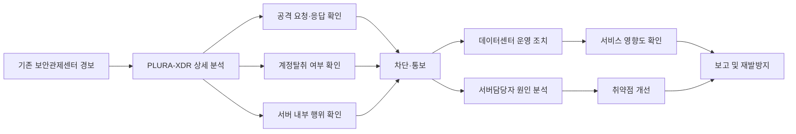

# 시·군 지자체 통합 사이버보안관제 고도화 제안서

## 기존 보안관제센터와 PLURA-XDR 연동을 통한 본청·하위기관 통합 보호 방안

---

## 1. 제안 배경

최근 사이버 공격은 특정 대기업이나 상장사에만 국한되지 않고, 지방자치단체와 산하·위탁·출연기관까지 일상적으로 확대되고 있습니다. 시·군 지자체는 주민 행정, 민원, 복지, 세정, 교통, 상하수도, 재난안전, 문화·체육시설, 보건소, 공공예약, 홈페이지 등 시민 생활과 직접 연결된 서비스를 운영하고 있습니다.

따라서 지자체에 대한 해킹은 단순한 정보시스템 장애가 아니라 다음과 같은 행정 리스크로 확산될 수 있습니다.

- 주민 개인정보 유출
- 민원·행정서비스 중단
- 복지·세정·재난안전 업무 차질
- 산하기관 및 위탁기관으로의 침해 확산
- 언론 보도 및 주민 신뢰 하락
- 개인정보보호·감사·법적 책임 증가
- 지자체장, 부단체장, 정보화부서, 개인정보보호책임자에 대한 설명 부담

사이버보안은 더 이상 IT 부서만의 기술 문제가 아니라 조직 신뢰, 서비스 지속성, 준법, 경영진 책임과 연결되는 핵심 리스크입니다. 지자체 역시 같은 관점에서 사이버보안을 **행정 신뢰, 주민 안전, 공공서비스 지속성**을 지키는 핵심 통제 체계로 보아야 합니다.

---

## 2. 기존 보안관제센터 운영 현황과 보완 필요성

현재 다수의 시·군 지자체는 자체 또는 상위기관 연계 방식으로 보안관제센터를 운영하고 있습니다. 방화벽, IPS, WAF, DDoS 대응 장비, 웹서버 로그 등 주요 보안장비 로그를 수집·분석하고, 위협 이벤트 발생 시 관제요원이 확인하여 차단 또는 통보하는 구조입니다.

이러한 기존 관제체계는 반드시 유지되어야 합니다. 다만 최근 공격은 단순한 차단 이벤트만으로 판단하기 어려운 형태로 고도화되고 있습니다.

대표적인 예는 다음과 같습니다.

- 계정탈취
- 크리덴셜 스터핑
- 관리자 페이지 공격
- 인증 우회
- API 대량 조회
- 웹 요청·응답 기반 개인정보 노출
- 웹쉘 업로드
- 서버 내부 명령 실행
- 권한 상승
- 파일 변경 및 악성 프로세스 실행
- 랜섬웨어 전 단계 행위

기존 보안장비 로그만으로는 공격이 시도에 그쳤는지, 실제 침해로 이어졌는지, 어느 서버와 계정이 영향을 받았는지, 개인정보나 행정정보가 외부로 노출되었는지 판단하기 어렵습니다.

PLURA-XDR은 웹 요청·응답 로그, 로그인 요청·응답 정보, 서버 감사 로그, Syslog, Auditlog, 호스트 보안 로그 등을 함께 분석하여 보안관제센터뿐 아니라 데이터센터, 서버담당자, 업무시스템 담당자가 함께 침해 여부와 영향도를 확인할 수 있도록 지원합니다.

---

## 3. 제안 목표

본 제안의 목표는 기존 시·군 보안관제센터를 대체하는 것이 아닙니다.

본 제안의 핵심 목표는 다음과 같습니다.

> **기존 보안관제센터의 운영 체계는 유지하면서, PLURA-XDR을 연동하여 본청·직속기관·사업소·읍면동·산하기관·위탁기관까지 통합적으로 탐지·분석·차단·보고할 수 있는 지자체형 사이버보안 대응 체계를 구축하는 것입니다.**

이를 통해 시·군은 다음과 같은 대응 역량을 확보할 수 있습니다.

1. 기존 보안관제센터 경보의 분석 정확도 향상
2. 웹 공격, 계정탈취, 데이터유출, 서버 침해 행위에 대한 통합 분석
3. 본청뿐 아니라 하위기관까지 공격 확산 여부 확인
4. 단순 탐지 중심 대응에서 실제 침해 여부 판단 중심 대응으로 전환
5. 관제센터, 데이터센터, 서버담당자, 업무부서 간 공동 대응 체계 구축
6. 사고 발생 시 지자체장·부단체장·감사·개인정보보호·의회 보고에 필요한 근거 확보
7. 차단, 계정조치, 서버점검, 취약점 개선, 재발방지까지 이어지는 대응 프로세스 정착

---

## 4. 서울시 보안관제 활용 사례의 시사점

서울시의 보안관제 활용 방안이 실제 운영 사례로 사용되고 있다는 점은 시·군 지자체 대상 제안에서 중요한 의미가 있습니다.

서울시와 같은 광역 지자체 환경은 다수의 기관, 자치구, 업무시스템, 대민서비스가 연결되어 있으며, 단일 보안장비 이벤트만으로는 전체 공격 흐름과 실제 침해 여부를 판단하기 어렵습니다. 따라서 보안관제센터가 기존 관제 체계를 유지하면서도 웹 요청·응답, 계정 로그인, 서버 내부 행위, 데이터유출 가능성, 호스트 보안 로그를 함께 확인하는 방식은 지자체 보안관제 고도화에 적합한 모델입니다.

이 사례가 시·군 지자체에 주는 시사점은 다음과 같습니다.

- 기존 관제센터를 폐기하거나 대체하지 않고, 기존 체계를 보완하는 방식이 현실적입니다.
- 본청뿐 아니라 하위기관까지 관제 범위를 확대해야 합니다.
- 웹 공격, 계정탈취, 서버 침해, 데이터유출을 각각 따로 보는 것이 아니라 하나의 사건 흐름으로 연결해야 합니다.
- 보안관제센터, 데이터센터, 서버담당자, 업무부서가 동일한 분석 정보를 공유해야 합니다.
- 탐지 이후 차단, 원인 분석, 취약점 개선, 재발방지까지 연결되어야 합니다.

따라서 PLURA-XDR을 기존 보안관제센터와 연동하는 방식은 서울시 보안관제 활용 사례와도 부합하는 현실적인 지자체 보안관제 고도화 방안입니다.

---

## 5. PLURA-XDR 적용 방향

PLURA-XDR은 기존 관제센터와 병행·연동되는 구조로 적용합니다.

핵심은 “새로운 관제센터를 별도로 만드는 것”이 아니라, 기존 보안관제센터가 이미 수행 중인 탐지·분석·차단·통보 업무에 PLURA-XDR의 상세 분석 정보를 결합하는 것입니다.

### 5.1 기존 관제체계 유지

시·군 보안관제센터는 현재와 같이 방화벽, IPS, WAF, DDoS, 웹서버, 주요 보안장비 로그를 기반으로 1차 경보를 확인합니다.

PLURA-XDR은 이 경보를 보완하여 다음 정보를 제공합니다.

- 원본 웹 요청 로그
- 웹 응답 본문 및 응답 크기
- 로그인 성공·실패 이력
- 대상 계정 및 출발지 IP
- 공격 대상 URL·API·파라미터
- 서버 내부 프로세스 실행 이력
- 파일 생성·변경 이력
- 계정 생성 및 권한 상승 이력
- Syslog, Auditlog, 감사정책 로그
- MITRE ATT&CK 기반 공격 단계 분석
- 데이터유출 가능성 분석

이를 통해 관제센터는 단순 공격 시도와 실제 침해 가능성이 있는 사건을 구분할 수 있습니다.

### 5.2 본청·하위기관 통합 보호

시·군에는 본청 외에도 다양한 하위기관이 존재합니다.

- 직속기관
- 사업소
- 읍·면·동 행정복지센터
- 보건소
- 도서관
- 문화·체육시설
- 복지시설
- 출자·출연기관
- 공사·공단
- 위탁운영기관
- 지역 공공서비스 시스템
- 각종 홈페이지와 예약·신청 시스템

공격자는 보안이 강한 본청보다 상대적으로 관리가 어려운 하위기관, 외부 공개 웹사이트, 위탁운영 시스템, 관리자 페이지, 오래된 서버를 먼저 노릴 수 있습니다.

따라서 PLURA-XDR 적용 범위는 본청 핵심 시스템에서 시작하되, 단계적으로 하위기관과 외부 공개 서비스까지 확대해야 합니다.

---

## 6. 주요 활용 시나리오

### 6.1 웹 공격 탐지 및 차단

PLURA-XDR은 웹 요청·응답 로그를 기반으로 SQL Injection, XSS, 파일 업로드 공격, 웹쉘 업로드, 경로 탐색, 명령어 삽입 등 웹 공격을 탐지합니다.

보안관제센터는 PLURA-XDR에서 탐지된 이벤트를 확인하여 다음 사항을 판단합니다.

- 공격 대상 URL은 무엇인가
- 어떤 파라미터가 공격에 사용되었는가
- 공격이 단발성인지 반복성인지
- 특정 하위기관 서비스에 공격이 집중되는지
- 서버가 어떤 응답을 반환했는지
- 응답에 개인정보나 내부정보가 포함되었는지
- WAF 또는 방화벽 차단이 필요한지
- 서버담당자에게 취약 기능 개선 요청이 필요한지

기존 관제에서는 “공격 시도”만 보이는 경우가 많습니다. 그러나 PLURA-XDR을 활용하면 공격 요청과 서버 응답을 함께 확인할 수 있어 실제 영향 가능성을 보다 정확히 판단할 수 있습니다.

### 6.2 계정탈취 및 크리덴셜 스터핑 대응

지자체 행정서비스, 직원 포털, 관리자 페이지, 민원 시스템, 예약 시스템은 계정 기반 공격의 주요 대상입니다.

PLURA-XDR은 로그인 요청·응답 정보를 분석하여 다음과 같은 이벤트를 탐지합니다.

- 동일 계정에 대한 반복 로그인 실패
- 다수 계정을 대상으로 한 자동화 로그인 시도
- 특정 IP에서 발생하는 대량 로그인 시도
- 로그인 실패 후 성공한 계정
- 관리자 계정 대상 공격
- 비정상 사용자 에이전트 또는 자동화 도구 사용
- 해외·익명망·의심 IP 기반 로그인 시도

관제센터는 계정탈취 가능성을 판단하고, 데이터센터 및 서버담당자는 다음 조치를 수행할 수 있습니다.

- 출발지 IP 차단
- 계정 잠금
- 비밀번호 변경
- MFA 적용 검토
- 관리자 페이지 접근제어 강화
- 인증 오류 메시지 개선
- 세션 정책 점검
- 계정 권한 재검토

### 6.3 데이터유출 가능성 확인

지자체는 주민등록 관련 정보, 복지 대상자 정보, 세금·체납 정보, 민원 내용, 인허가 정보, 내부 문서 등 민감한 데이터를 다수 보유합니다.

PLURA-XDR은 웹 응답 본문, 응답 헤더, 상태값, 응답 크기, URL, 파라미터 정보를 기반으로 데이터유출 가능성을 분석할 수 있습니다.

활용 예시는 다음과 같습니다.

- SQL Injection 이후 응답 본문에 개인정보가 포함되었는지 확인
- 인증 우회 이후 민감정보가 노출되었는지 확인
- API 응답에 불필요한 계정정보나 내부정보가 포함되었는지 확인
- 대량 조회 요청에 대한 응답 크기와 반복 패턴 확인
- 민감정보 마스킹, 권한 검증, 조회 제한 등 개선 조치 수행

이 기능은 단순히 공격을 탐지하는 수준을 넘어, 실제 유출 가능성을 판단하고 개인정보보호 대응의 근거를 확보하는 데 중요합니다.

### 6.4 서버 침해 행위 확인

웹 공격이나 계정탈취가 실제 서버 침해로 이어졌는지 확인하려면 호스트 내부 로그 분석이 필요합니다.

PLURA-XDR은 호스트보안, Syslog, Auditlog, 감사정책 로그 등을 활용하여 다음 행위를 확인할 수 있습니다.

- 의심 프로세스 실행
- 웹쉘 실행
- 파일 생성·변경·삭제
- 신규 계정 생성
- 권한 상승
- 서비스 등록
- 스케줄러 등록
- 비정상 명령 실행
- 외부 통신 시도
- 지속성 확보 행위

이를 통해 보안관제센터는 공격 단계와 위험도를 판단하고, 서버담당자는 실제 서버 내부에서 어떤 행위가 발생했는지 확인하여 격리, 복구, 패치, 설정 변경, 계정 조치 등 후속 대응을 수행할 수 있습니다.

---

## 7. 보안관제센터 연동 운영 방안

### 7.1 연동 기본 원칙

PLURA-XDR은 기존 관제센터의 역할을 대체하지 않습니다.

다음 원칙으로 운영합니다.

1. 기존 보안관제센터 경보 체계 유지
2. PLURA-XDR 탐지 이벤트를 기존 관제 흐름에 연동
3. 초기에는 대응 필요성이 높은 이벤트부터 우선 연동
4. 중복 경보를 최소화하고, 실제 분석 가치가 높은 이벤트 중심으로 운영
5. 관제센터, 데이터센터, 서버담당자, 업무시스템 담당자가 동일한 분석 정보를 공유
6. 차단·통보·서버점검·취약점 개선·보고까지 하나의 프로세스로 연결

첨부된 보안관제 활용방안 자료에서도 초기에는 필터탐지-웹, 보안탐지-계정탈취 기능을 중심으로 연동하고, 운영 결과를 바탕으로 전체로그-웹, 전체로그-호스트보안, 데이터유출, 호스트보안 검사정책 등으로 확대하는 단계적 적용이 적절하다고 제시하고 있습니다.

### 7.2 1단계: 웹 공격 및 계정탈취 중심 연동

초기에는 다음 이벤트를 우선 연동합니다.

- 웹 공격 탐지
- SQL Injection
- XSS
- 파일 업로드 공격
- 웹쉘 업로드 의심
- 관리자 페이지 공격
- 계정탈취 의심
- 크리덴셜 스터핑
- 로그인 실패 후 성공
- 특정 IP의 반복 공격

이 단계의 목표는 기존 보안관제센터가 가장 많이 접하는 웹 공격과 계정 기반 공격에 대해 분석 정확도를 높이는 것입니다.

### 7.3 2단계: 데이터센터 운영 조치 연계

PLURA-XDR 분석 결과를 데이터센터 운영 조치와 연결합니다.

- 방화벽 차단
- WAF 정책 조정
- 접근제어 정책 변경
- 관리자 페이지 접근 제한
- 특정 국가·IP 대역 차단 검토
- 서비스 부하 및 장애 가능성 확인
- 하위기관 서비스 공격 집중 여부 확인
- 차단 후 정상 사용자 영향도 확인

이 단계에서는 단순 보안 이벤트 처리에서 벗어나, 서비스 운영 영향도와 보안 차단을 함께 판단합니다.

### 7.4 3단계: 서버담당자 원인 분석 확대

서버담당자는 PLURA-XDR의 전체로그-웹, 전체로그-호스트보안, 호스트보안 검사정책 기능을 활용하여 직접 원인 분석을 수행합니다.

- 취약 URL 확인
- 취약 파라미터 확인
- 비정상 응답 확인
- 민감정보 응답 여부 확인
- 웹쉘 업로드 경로 확인
- 파일 변경 이력 확인
- 의심 프로세스 실행 여부 확인
- 계정 생성 및 권한 상승 여부 확인
- 소스 수정, 설정 변경, 패치, 접근제어 강화 수행

이 단계의 핵심은 서버담당자가 단순히 “보안관제센터에서 통보받는 대상”이 아니라, 실제 원인 분석과 보완 조치의 주체가 되도록 만드는 것입니다.

### 7.5 4단계: 본청·하위기관 공동 대응 체계 정착

최종적으로는 본청, 하위기관, 보안관제센터, 데이터센터, 서버담당자가 동일한 PLURA-XDR 분석 정보를 기준으로 공동 대응합니다.

| 구분 | 주요 역할 |
|---|---|
| 보안관제센터 | 탐지 이벤트 확인, 위험도 판단, 공격 흐름 분석, 차단 요청, 보고자료 작성 |
| 데이터센터 | 네트워크 차단, 접근제어 정책 조정, 서비스 영향도 확인, 운영 조치 |
| 서버담당자 | 서버 내부 행위 확인, 취약 URL·파라미터 분석, 계정·파일·프로세스 점검, 보완 조치 |
| 업무시스템 담당자 | 업무 영향도 확인, 사용자 공지, 기능 개선 요청, 하위기관 협조 |
| 개인정보보호 담당자 | 개인정보 유출 가능성 판단, 신고·통지 여부 검토, 증적 관리 |
| 감사·법무 부서 | 사고 경위, 조치 내역, 책임 범위, 재발방지 대책 검토 |
| 지자체장·부단체장 | 주요 사고 상황 보고, 주민 신뢰 유지, 대외 설명 방향 결정 |

---

## 8. 하위기관 보호를 위한 적용 모델

시·군 지자체의 가장 큰 보안 과제 중 하나는 하위기관의 다양성과 분산성입니다.

하위기관은 규모가 작고, 보안 전담 인력이 부족하며, 외부 위탁 운영 시스템이 많고, 오래된 웹서비스가 남아 있는 경우가 많습니다. 공격자는 이러한 취약한 지점을 통해 본청 또는 주요 행정망으로 접근하려고 시도할 수 있습니다.

따라서 PLURA-XDR 적용은 다음 모델로 추진하는 것이 적절합니다.

### 8.1 우선 적용 대상

우선 적용 대상은 다음과 같습니다.

- 대표 홈페이지
- 민원 신청 시스템
- 공공예약 시스템
- 보건소 및 복지 관련 시스템
- 세정·납부 관련 시스템
- 직원 포털
- 관리자 페이지
- 대민 API
- 파일 업로드 기능이 있는 시스템
- 개인정보 조회 기능이 있는 시스템
- 위탁운영 중인 외부 공개 웹서비스
- 산하기관 주요 홈페이지

### 8.2 하위기관 공통 탐지 항목

하위기관에는 다음 공통 탐지 항목을 적용합니다.

- 웹 공격
- 계정탈취
- 관리자 페이지 접근 시도
- 파일 업로드 공격
- 개인정보 응답 노출
- 비정상 대량 조회
- 웹쉘 업로드 의심
- 서버 내부 의심 프로세스
- 신규 계정 생성
- 권한 상승
- 비정상 파일 변경

### 8.3 하위기관 대응 체계

하위기관에서 공격 이벤트가 발생하면 다음 순서로 대응합니다.

1. PLURA-XDR 탐지
2. 기존 보안관제센터 경보 확인
3. 원본 요청·응답 로그 분석
4. 실제 영향 가능성 판단
5. 하위기관 담당자 통보
6. 필요 시 IP·계정·URL 차단
7. 서버 내부 침해 여부 확인
8. 취약 기능 개선
9. 조치 결과 본청 보안관제센터에 공유
10. 재발방지 대책 반영

이 구조를 통해 하위기관은 자체 보안 인력이 부족하더라도 본청 보안관제센터와 PLURA-XDR 분석 결과를 기반으로 신속하게 대응할 수 있습니다.

---

## 9. 지자체장·부단체장 보고 관점의 기대 효과

PLURA-XDR 도입 효과는 단순히 탐지 이벤트 증가에 있지 않습니다.

가장 중요한 효과는 사고 발생 시 다음 질문에 답할 수 있다는 점입니다.

- 공격은 언제 시작되었는가?
- 어떤 하위기관 또는 시스템이 공격 대상이었는가?
- 실제 침해로 이어졌는가?
- 어떤 계정이 관련되었는가?
- 개인정보 또는 행정정보 유출 가능성이 있는가?
- 어떤 IP, URL, 파일, 프로세스가 관련되었는가?
- 차단 조치는 언제 수행되었는가?
- 정상 행정서비스에는 영향이 있었는가?
- 주민 안내 또는 신고가 필요한 수준인가?
- 재발 방지를 위해 어떤 보완 조치를 했는가?

상장사 자료에서 강조한 것처럼, 사이버 사고는 기술 복구만의 문제가 아니라 조직의 신뢰와 책임의 문제입니다. 지자체 역시 주민, 의회, 감사기관, 개인정보보호 감독기관, 언론에 설명할 수 있는 근거를 확보해야 합니다. PLURA-XDR은 원본 로그, 사건 타임라인, 대응 이력, 피해 가능성 판단 근거를 남겨 이러한 보고 체계를 지원합니다.

---

## 10. 기대 효과

### 10.1 기존 보안관제센터의 분석 품질 향상

기존 보안장비 로그만으로 판단하기 어려웠던 웹 공격 성공 여부, 계정탈취 가능성, 데이터유출 가능성, 서버 내부 침해 행위를 PLURA-XDR로 보완 분석할 수 있습니다.

### 10.2 본청·하위기관 통합 가시성 확보

본청 중심의 관제에서 벗어나 직속기관, 사업소, 읍면동, 산하기관, 위탁기관까지 공격 흐름을 확인할 수 있습니다.

### 10.3 실제 침해 여부 판단 가능

단순히 “공격이 탐지되었다”가 아니라, 서버가 어떤 응답을 했는지, 계정이 실제로 탈취되었는지, 파일이 생성되었는지, 프로세스가 실행되었는지 확인할 수 있습니다.

### 10.4 차단과 운영 조치의 근거 확보

출발지 IP, 공격 URL, 대상 계정, 취약 파라미터, 의심 파일, 프로세스 정보를 기반으로 방화벽, WAF, 접근제어, 계정조치, 서버점검을 수행할 수 있습니다.

### 10.5 서버담당자와 업무부서의 대응력 강화

서버담당자는 보안 이벤트를 단순 전달받는 것이 아니라, PLURA-XDR의 상세 로그를 직접 확인하여 원인 분석과 보완 조치를 수행할 수 있습니다.

### 10.6 개인정보보호 및 감사 대응 근거 확보

개인정보 유출 가능성, 민감정보 응답 여부, 계정 접근 이력, 서버 내부 행위, 조치 내역을 근거로 개인정보보호 및 감사 대응 자료를 확보할 수 있습니다.

### 10.7 주민 신뢰와 행정서비스 연속성 보호

해킹이 일상화된 환경에서 지자체의 핵심 책임은 주민 서비스를 안정적으로 제공하고, 사고 발생 시 신속히 설명하고 통제하는 것입니다. PLURA-XDR은 이를 위한 실질적인 관제·분석·대응 기반을 제공합니다.

---

## 11. 도입 로드맵

| 단계 | 적용 범위 | 주요 내용 |
|---|---|---|
| 1단계 | 본청 핵심 웹서비스 | 웹 공격, 계정탈취 이벤트 중심으로 기존 보안관제센터 연동 |
| 2단계 | 주요 행정·민원 시스템 | 로그인, 관리자 페이지, 개인정보 조회, 파일 업로드 기능 분석 |
| 3단계 | 직속기관·사업소 | 하위기관 주요 홈페이지와 업무시스템으로 탐지 범위 확대 |
| 4단계 | 읍면동·산하기관·위탁기관 | 분산된 외부 공개 서비스와 취약 시스템 통합 관제 |
| 5단계 | 공동 대응 체계 정착 | 관제센터, 데이터센터, 서버담당자, 업무부서, 개인정보보호 담당자 협업 체계 운영 |

---

## 12. 제안 운영 흐름

---

## 13. 결론

시·군 지자체는 이미 보안관제센터를 운영하고 있습니다. 따라서 본 제안의 핵심은 기존 체계를 대체하는 것이 아니라, 기존 관제센터가 더 정확하게 보고, 더 빠르게 판단하고, 더 안전하게 차단할 수 있도록 PLURA-XDR을 연동하는 것입니다.

해킹이 일상화된 상황에서 지자체는 본청만 보호해서는 충분하지 않습니다. 직속기관, 사업소, 읍면동, 산하기관, 위탁기관까지 포함한 통합 관제와 공동 대응 체계가 필요합니다.

PLURA-XDR은 웹 공격, 계정탈취, 데이터유출, 서버 침해 행위를 통합 분석하고, 기존 보안관제센터와 연동하여 탐지·분석·차단·통보·서버점검·원인분석·재발방지까지 이어지는 대응 체계를 제공합니다.

서울시의 보안관제 활용 사례에서 확인할 수 있듯이, 지자체 보안관제는 다기관 로그 수집, 통합 분석, XDR 기반 확장 방향으로 발전하고 있습니다. 시·군 지자체 역시 이러한 흐름에 맞춰 기존 관제센터와 PLURA-XDR을 연동함으로써 주민 정보, 행정서비스, 하위기관, 지역사회 신뢰를 안전하게 보호할 수 있습니다.

> **PLURA-XDR은 시·군 지자체가 기존 보안관제센터를 유지하면서도, 본청과 하위기관을 함께 보호하고, 실제 침해 여부를 설명하며, 신속한 차단과 재발방지까지 수행할 수 있도록 하는 현실적인 통합 사이버보안관제 고도화 방안입니다.**

---

## 참고 문서

- `2026 0622 PLURA 보안관제 활용방안-2.pdf`
- `listed-company-cybersecurity-investment.md`

