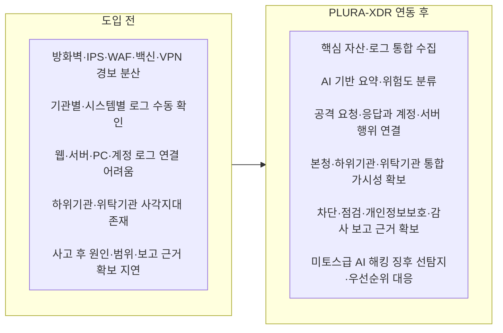

# 시·군 지자체 통합 사이버보안관제 고도화 제안 요약

## 기존 보안관제센터와 PLURA-XDR 연동을 통한 본청·하위기관·지역 제조업·미토스급 AI 해킹 통합 대응

---

## 1. 제안 핵심

본 제안은 시·군 지자체가 운영 중인 기존 보안관제센터를 대체하는 신규 구축 사업이 아닙니다. 기존 관제센터, 방화벽, IPS, WAF, DDoS, 백신, 보안장비 로그와 운영 흐름은 유지하면서, PLURA-XDR을 연동해 **상세 분석·상관분석·보고 근거 확보 기능을 보완하는 관제 고도화 사업**입니다.

PLURA-XDR은 웹 요청·응답, 로그인·계정, 서버 감사 로그, PC·호스트 보안, Syslog, Auditlog, 보안장비 이벤트를 연결해 장비별 경보를 하나의 사건 흐름으로 정리합니다. 이를 통해 지자체는 “공격이 있었다”에서 멈추지 않고, **어느 기관의 어떤 시스템과 계정이 관련되었는지, 실제 침해 가능성은 어느 정도인지, 어떤 조치를 했고 누구에게 보고할 수 있는지**까지 설명할 수 있습니다.

| 핵심 방향 | 요약 |
|---|---|
| 기존 체계 유지 | 기존 보안관제센터와 보안장비를 교체하지 않고 PLURA-XDR을 연동합니다. |
| 통합 가시성 확보 | 본청, 직속기관, 사업소, 읍면동, 산하기관, 위탁기관까지 단계적으로 확대합니다. |
| 실제 침해 판단 | 웹·계정·서버·PC·로그를 연결해 공격 성공 여부와 영향도를 판단합니다. |
| 보고 근거 확보 | 차단, 계정조치, 서버점검, 개인정보보호, 감사·부단체장 보고 근거를 남깁니다. |
| AI 해킹 선제 대응 | 미토스급 AI 해킹 징후를 사건 단위로 묶고 위험 등급에 따라 우선 조치합니다. |

## 2. 추진 필요성

최근 공격은 단일 장비 경보만으로 판단하기 어렵습니다. 자동화된 웹·API 취약점 탐색, 계정탈취, 공격 경로 변형, 내부 이동, 랜섬웨어 확산, 공급망 침투가 결합된 **미토스급 AI 해킹**은 본청뿐 아니라 하위기관, 위탁운영 시스템, 지역 제조업과 산업단지까지 동시에 노릴 수 있습니다.

따라서 지자체 사이버보안은 단순 전산 관리가 아니라 **행정서비스 연속성, 주민 개인정보 보호, 감사·법적 책임 대응, 지역 산업 보호**와 연결된 행정 리스크 관리 체계가 되어야 합니다. PLURA-XDR은 기존 관제센터가 보던 장비별 경보를 실제 침해 여부 판단, 차단, 서버점검, 개인정보보호 검토, 보고자료 작성까지 이어지는 공동 대응 흐름으로 전환합니다.

## 3. PLURA-XDR 도입 전과 도입 후

## 4. 적용 범위와 단계적 추진

초기에는 효과가 빠르게 확인되는 **본청 핵심 웹서비스와 계정 기반 공격**부터 연동합니다. 이후 행정·민원 시스템, 직속기관·사업소, 읍면동·산하기관·위탁기관, 지역 제조업·산업단지로 단계적으로 확대합니다.

| 단계 | 적용 범위 | 주요 내용 |
|---|---|---|
| 1단계 | 본청 핵심 웹서비스 | 웹 공격, 관리자 페이지 공격, 파일 업로드, 계정탈취 탐지 연동 |
| 2단계 | 행정·민원 시스템 | 개인정보 조회, API 대량 호출, 로그인 이상 징후, 민감정보 응답 확인 |
| 3단계 | 하위기관·위탁기관 | 직속기관, 사업소, 읍면동, 산하기관, 위탁운영 서비스의 사각지대 축소 |
| 4단계 | 지역 제조업·산단 | 산단 주요 기업, 협력사 포털, 원격 유지보수 계정, ERP·MES 서버 선택 연계 |
| 5단계 | 미토스급 AI 해킹 대응 | 유사 공격 패턴 묶음, 위험 등급화, 선조치·후보고 기준 운영 |

## 5. 기대 효과와 예산 관점

PLURA-XDR 연동의 핵심 효과는 경보를 더 많이 만드는 것이 아니라, **기존 관제와 로그를 실제 판단과 조치에 사용할 수 있게 만드는 것**입니다.

| 검토 항목 | PLURA-XDR 연동 효과 |
|---|---|
| 관제 운영 | AI 요약, 유사 이벤트 묶음, 공격 흐름 상관분석으로 반복 확인 부담을 줄입니다. |
| 사고 대응 | 사건 타임라인, 관련 URL·IP·계정·서버, 조치 이력을 함께 확보합니다. |
| 개인정보보호·감사 | 웹 응답, 조회 패턴, 접근 계정, 서버 행위를 근거로 유출 가능성과 조치 내역을 설명합니다. |
| 하위기관 보호 | 본청 기준으로 단계적 통합 관제를 확대해 기관별 보안 편차와 사각지대를 줄입니다. |
| 지역 제조업 확장 | 기업별 개별 보안 투자에만 의존하지 않고 산단·제조업 공동 보호 모델을 마련합니다. |
| 미토스급 AI 해킹 대응 | 공격 속도에 맞춰 위험 등급화, 우선순위 조치, 선조치·후보고 체계를 운영합니다. |

예산 관점에서는 기존 장비를 교체하는 비용보다 **기존 투자와 운영 데이터를 더 잘 활용하는 고도화 효과**가 중요합니다. 정량 효과는 1단계 연동 이후 주요 경보 검토 시간, 실제 침해 여부 판단 시간, 위험 계정 조치 시간, 원본 로그·증적 확보 시간, 하위기관 통보 시간, 재발방지 조치 완료율을 기준으로 실측해 확대 예산의 근거로 활용할 수 있습니다.

## 6. 결론

시·군 지자체는 이미 보안관제센터를 운영하고 있습니다. 따라서 필요한 것은 기존 체계를 바꾸는 일이 아니라, 기존 관제센터가 더 정확하게 보고, 더 빠르게 판단하고, 더 안전하게 차단할 수 있도록 PLURA-XDR을 연동하는 것입니다.

PLURA-XDR은 본청과 하위기관, 위탁기관, 지역 제조업까지 연결되는 지자체형 통합 사이버보안관제 고도화 방안입니다. 지자체는 이를 통해 실제 침해 여부를 설명하고, 행정서비스 연속성과 주민 신뢰를 보호하며, 미토스급 AI 해킹에 선제 대응할 수 있는 근거 기반 대응 체계를 확보할 수 있습니다.

> **기존 보안관제센터는 유지합니다. PLURA-XDR로 웹·계정·서버·PC·로그를 연결합니다. 본청에서 하위기관과 지역 제조업까지 단계적으로 확장합니다. 공격 탐지에서 실제 침해 판단, 차단, 점검, 보고 근거 확보까지 하나의 흐름으로 만듭니다.**
