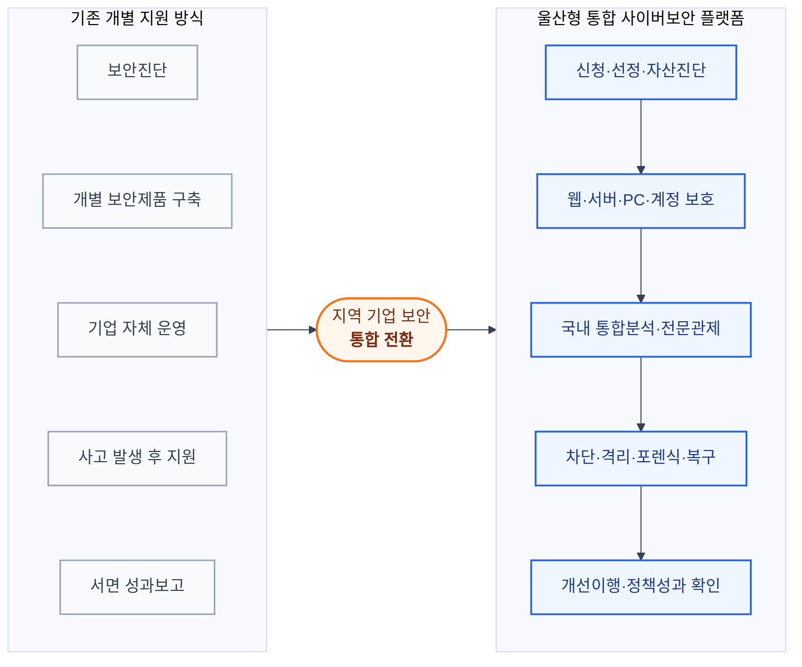
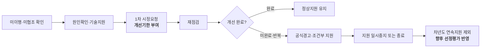
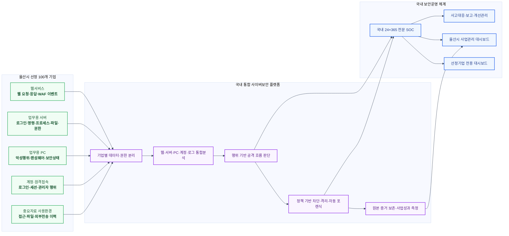
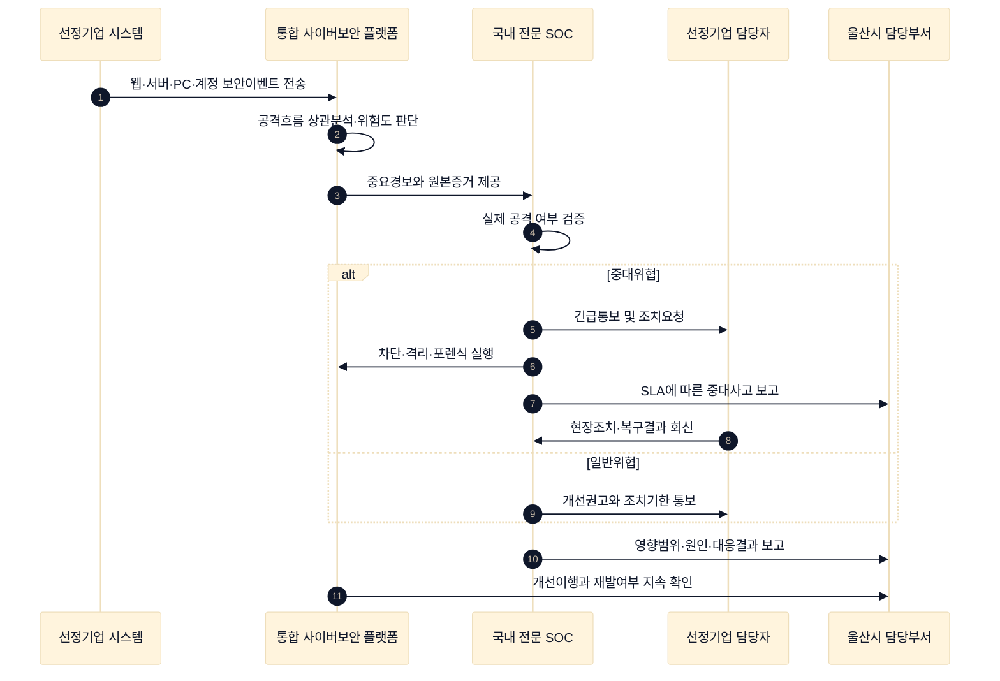
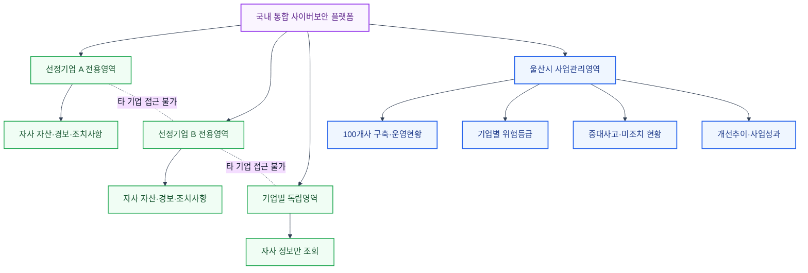
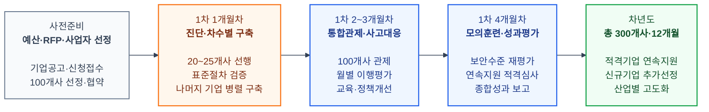

# 울산광역시 기업 소버린 사이버시큐리티
# 통합지원사업 최종 제안서

## 1차 100개사·4개월 실증확산에서 차년도 총 300개사·12개월 본사업으로

### 개별 보안제품 지원에서 울산형 통합 사이버보안 플랫폼 운영으로

---

# 제안 요약

기업의 디지털 전환과 온라인 업무가 확대될수록 웹서비스, 업무용 서버와 PC, 계정, 원격접속 및 클라우드 환경을 노리는 사이버공격도 함께 증가합니다.

그러나 기업마다 보안인력과 투자여력, 운영경험이 다르기 때문에 개별기업의 노력만으로 일정한 보안수준을 유지하기는 어렵습니다. 특히 보안제품을 설치하더라도 경보를 24시간 확인하고, 실제 공격 여부를 판단하며, 차단·복구·포렌식까지 수행할 전문인력을 별도로 확보하기는 쉽지 않습니다.

본 제안은 울산광역시가 기업의 신청을 받아 지원 필요성과 사업 적합성을 심사하고, **1차로 100개 기업을 선정하여 연말까지 4개월간 통합 사이버보안 서비스를 제공하는 지역 기업지원사업**입니다.

선정기업에는 기업당 월 1천만 원 상당의 통합 사이버보안 서비스를 제공하며, 1차 사업비는 40억 원입니다. 차년도에는 1차 사업의 운영성과와 참여기업의 협조·개선 실적을 평가한 뒤, 연속지원 기업과 신규 선정기업을 합하여 **총 300개 기업을 12개월간 지원하는 360억 원 규모의 본사업**으로 확대합니다.

> **선정기업의 보안수준을 진단하고, 필요한 보안기능을 구축하며, 실제 공격을 국내 24시간 전문관제로 탐지·대응하고, 울산시가 사업성과와 개선상태를 지속적으로 확인할 수 있는 하나의 운영체계를 제안드립니다.**

> **지원은 자동으로 연장되지 않습니다. 공공재원으로 보안서비스를 제공받으면서도 보안정책 적용, 중요경보 조치, 사고조사, 교육과 개선권고에 반복적으로 협조하지 않는 기업은 지원을 중단하거나 차년도 연속지원 및 향후 지원대상 선정에서 제외할 수 있도록 운영합니다.**

선정된 100개 기업의 웹서비스, 서버, 업무용 PC, 계정과 보안로그는 기업별로 안전하게 분리하여 보호합니다. 국내 통합 사이버보안 플랫폼과 국내 전문 보안관제센터를 통해 공격을 조기에 발견하고, 위험이 확인되면 통보·차단·격리·포렌식과 복구를 지원합니다.

울산시는 기업의 모든 업무정보를 열람하는 것이 아니라, 지원사업 운영에 필요한 구축현황, 위험등급, 중대사고, 미조치 사항과 개선성과를 통합 대시보드에서 확인합니다. 각 선정기업은 자사의 자산과 경보, 조치사항만 독립적으로 관리합니다.

본 사업은 보안제품을 일회성으로 보급하는 사업이 아닙니다.

> **울산시가 선정기업의 사이버 위험을 하나의 기준, 하나의 플랫폼, 하나의 관제체계로 지속적으로 관리하는 새로운 지역 산업 사이버보안 운영사업입니다.**

### 제안의 핵심을 한눈에 보면

| 현재 과제 | 제안하는 변화 | 울산시가 얻게 되는 결과 |
|---|---|---|
| 기업별 보안투자와 운영역량의 차이 | 공개신청과 객관적 평가를 통해 1차 100개사 선정 | 지원 필요성과 정책효과를 함께 확보 |
| 진단·제품·관제가 분리될 수 있음 | 진단·보호·관제·대응·성과확인을 하나의 플랫폼으로 연결 | 지역 기업의 위험과 개선상태를 지속 확인 |
| 경보 발생 후 기업 자체 대응에 의존 | 수치화된 SLA 기반 검증·차단·포렌식·복구지원 | 사고 대응시간 단축과 책임체계 명확화 |
| 지원을 받고도 기업이 경보와 개선을 방임할 수 있음 | 참여의무를 정량 평가하여 미협조 기업의 지원중단·차년도 제외 | 공공예산의 실효성과 참여기업의 책임 확보 |
| 해외 서비스와 운영정책에 종속될 가능성 | 국내 데이터·국내 관제·국내 기술지원 중심 운영 | 울산형 소버린 사이버시큐리티 확보 |
| 지원 종료 후 운영성과 확인이 어려움 | 실제 수집·탐지·조치 데이터로 성과 측정 | 예산 투입에 따른 실질적인 보안개선 증명 |

---

# 1. 제안 배경

## 1.1 지역 기업의 사이버보안은 울산 산업 경쟁력과 연결됩니다

기업의 핵심자료, 고객정보, 생산·품질·계약자료와 업무시스템은 더 이상 사내에만 존재하지 않습니다.

웹사이트, 이메일, 원격근무, 협업도구, 클라우드, 외부 유지보수와 파일전송을 통해 다양한 시스템과 사용자가 연결됩니다. 이 과정에서 한 기업의 계정이나 서버가 침해되면 해당 기업의 업무중단에 그치지 않고 고객사, 협력사와 거래관계까지 영향을 받을 수 있습니다.

기업이 취급하는 주요 보호대상은 다음과 같습니다.

- 인터넷에 공개된 웹사이트와 업무서비스
- 업무용 서버와 데이터베이스
- 임직원이 사용하는 PC와 계정
- 원격접속·관리자 계정과 외부 유지보수 경로
- 설계·생산·품질·계약·고객 관련 자료
- 소프트웨어와 업데이트 파일
- 클라우드와 협업시스템의 접근기록

따라서 지역 기업의 사이버보안은 개별기업의 비용문제만이 아니라 기업의 지속운영과 지역 산업의 신뢰도를 지키기 위한 공공적 지원과제입니다.

## 1.2 보안격차가 기업의 운영위험으로 이어질 수 있습니다

기업의 규모, 인력, 시스템과 보안투자 수준은 서로 다릅니다.

일부 기업은 자체 보안조직과 여러 보안제품을 운영할 수 있지만, 많은 기업은 다음과 같은 어려움을 겪을 수 있습니다.

- 보안전문 인력 부족
- 어떤 시스템부터 보호해야 하는지 판단하기 어려움
- 웹·서버·PC별로 분리된 보안제품 운영
- 24시간 관제인력 확보의 어려움
- 경보는 발생하지만 실제 공격 여부를 판단하기 어려움
- 사고 발생 시 분석·포렌식·복구 역량 부족
- 지원사업 종료 후 보안서비스가 중단될 가능성

지역 기업의 보안수준을 높이기 위해서는 일부 기업에 고가 장비를 공급하는 것보다, 지원이 필요한 기업을 객관적으로 선정하고 공통된 최소 보안기준과 지속적인 전문관제를 제공하는 방식이 효과적입니다.

> **가장 취약한 기업이 공격자의 쉬운 진입점으로 남지 않도록, 선정기업에 공통 보안기준과 실제 대응이 가능한 통합운영체계를 제공해야 합니다.**

---

# 2. 기존 기업지원 방식에서 발생할 수 있는 한계

기업 보안지원사업이 실질적인 위험감소로 이어지려면 단순한 장비 보급이나 단기 컨설팅을 넘어, 운영방식 자체를 통합할 필요가 있습니다.

## 2.1 개별 보안제품 지원만으로는 전체 위험을 보기 어렵습니다

기업마다 서로 다른 보안제품이 설치되면 제품별 경보기준, 저장방식, 보고서와 운영절차가 달라집니다.

그 결과 지원기관은 기업의 보안상태를 동일한 기준으로 비교하거나, 여러 기업에서 동시에 발생하는 공통 공격을 지역 산업 차원의 위협으로 파악하기 어려울 수 있습니다.

## 2.2 구축과 실제 운영 사이에 공백이 발생할 수 있습니다

보안제품은 설치 자체보다 지속적인 운영이 중요합니다.

제품이 설치되어 있어도 다음과 같은 문제가 남을 수 있습니다.

- 경보를 확인할 담당자가 없음
- 중요 경보가 장기간 미조치됨
- 정책과 탐지기준이 갱신되지 않음
- 로그수집 중단을 인지하지 못함
- 사고 발생 시 분석과 대응이 지연됨
- 제품별 유지보수 창구가 달라 책임소재가 불분명함

따라서 지원사업은 설치 완료가 아니라 **탐지·통보·조치·복구까지 실제로 작동하는지**를 기준으로 관리되어야 합니다.

## 2.3 보안진단과 실제 운영결과가 분리될 수 있습니다

설문, 체크리스트와 증빙자료 중심의 보안진단은 실제 운영상태와 차이가 생길 수 있습니다.

예를 들어 보안제품이 설치되었다고 보고되더라도 다음 사항은 별도로 확인해야 합니다.

- 실제 보호 대상 자산에 모두 적용되었는가
- 로그가 정상적으로 수집되고 있는가
- 중요 경보가 기한 내 처리되는가
- 반복되는 취약점이 개선되고 있는가
- 모의공격에서 실제 탐지와 차단이 이루어지는가

보안수준 평가는 통합플랫폼의 실제 운영데이터와 연결될 때 객관성과 지속성을 확보할 수 있습니다.

## 2.4 기업의 핵심자료 보호와 단말·서버 보안이 분리될 수 있습니다

문서보안, 접근통제 또는 백업체계를 운영하더라도 자료를 열람하거나 처리하는 PC와 서버가 침해되거나 정상 계정이 탈취되면 공격의 전체 흐름을 확인하기 어렵습니다.

예를 들어 정상 계정으로 중요자료를 조회한 뒤 PC에서 파일을 압축하고 외부로 전송하는 경우, 계정 접근기록과 단말의 파일·프로세스·외부통신 행위를 함께 분석해야 실제 유출 가능성을 확인할 수 있습니다.

## 2.5 지원 종료 후 보안 공백이 다시 발생할 수 있습니다

일회성 장비 구축은 사업기간이 끝난 이후 유지보수, 구독 갱신과 관제 지속 여부가 기업별 상황에 따라 달라질 수 있습니다.

기업 보안지원은 일정 기간 장비를 보급하는 방식이 아니라, 울산시가 공통 기준과 운영성과를 확인하고 지역 기업의 보안수준을 지속적으로 높이는 서비스형 사업으로 설계하는 것이 적절합니다.

## 2.6 기존 방식과 제안방식의 차이

다음 도표는 본 제안이 단순히 보안제품을 추가하는 방식이 아니라, 분리될 수 있었던 진단·구축·관제·보고를 하나의 운영체계로 연결하는 전환임을 보여줍니다.

> **기존 방식은 각 지원항목이 개별적으로 완료될 수 있지만, 제안 방식은 기업 선정부터 대응과 개선확인까지 하나의 흐름으로 운영합니다.**

| 구분 | 개별 지원 중심 방식 | 제안하는 통합 플랫폼 방식 |
|---|---|---|
| 지원대상 | 선착순·개별 추천 등에 의존할 수 있음 | 공개신청과 객관적 평가를 통해 100개사 선정 |
| 사업의 기준 | 제품 설치와 구축 완료 | 기업 위험감소와 실제 대응성과 |
| 보안제품 | 기업별로 서로 다른 제품 운영 가능 | 공통 플랫폼과 표준 보안정책 적용 |
| 관제 | 기업 또는 제품별 분리 운영 | 국내 통합 SOC에서 일관된 기준으로 관제 |
| 위협분석 | 웹·서버·PC 경보를 개별 확인 | 웹·서버·PC·계정·로그를 하나의 공격 흐름으로 분석 |
| 울산시 가시성 | 기업별 자료 취합과 정기 보고 중심 | 선정기업 전체의 위험도와 미조치 현황을 상시 확인 |
| 보안평가 | 설문·증빙 중심 평가 가능 | 실제 수집·탐지·조치 데이터와 평가 연계 |
| 사고대응 | 기업별 역량에 따라 대응수준 차이 | 공통 SLA와 전문 사고대응 체계 적용 |
| 사업 지속성 | 지원 종료 후 기업별 갱신 | 울산시 중심의 통합운영과 성과평가 |

---

# 3. 제안하는 새로운 사업방식

## 3.1 1차 사업과 차년도 확대계획

본 사업은 단기적인 장비보급이 아니라, 1차 실증확산과 차년도 본사업을 연계하는 단계적 지역 기업 보안정책으로 추진합니다.

| 구분 | 지원대상 | 지원기간 | 기업당 지원규모 | 총사업비 |
|---|---:|---:|---:|---:|
| 1차 실증확산사업 | 울산시 선정 100개사 | 연말까지 4개월 | 월 1천만 원, 총 4천만 원 | 40억 원 |
| 차년도 본사업 | 연속지원 및 신규 선정 총 300개사 | 12개월 | 연 1억 2천만 원 | 360억 원 |
| 2개 연도 사업규모 | 1차 100개사에서 총 300개사로 확대 | 총 16개월 | 단계별 적용 | 400억 원 |

※ 상기 금액은 제안 단계의 사업규모이며, 부가가치세 포함 여부와 세부 산정방식은 예산편성 및 제안요청서에서 확정합니다.

차년도 300개사는 1차 참여기업 전원이 자동으로 연장되는 구조가 아닙니다.

1차 참여기업 가운데 보안정책 적용, 로그수집 유지, 중요경보 조치, 사고대응 협조와 개선권고 이행이 우수한 기업은 연속지원 대상으로 검토합니다. 반복적으로 보안을 방임하거나 정당한 사유 없이 사업운영에 협조하지 않은 기업은 연속지원 대상에서 제외하고, 해당 자리는 신규 신청기업 가운데 선정합니다.

> **차년도 총 300개사는 ‘기존 기업 자동연장’이 아니라 ‘운영성과가 확인된 연속지원 기업 + 신규 선정기업’으로 구성합니다.**

## 3.2 공개모집과 울산시 선정 방식

울산시가 지원사업을 공고하고, 참여를 희망하는 울산시 소재 기업이 신청하며, 울산시가 지원 필요성과 사업 적합성을 평가하여 1차 100개 기업을 선정합니다.

```mermaid
%%{init: {
  "theme": "base",
  "themeVariables": {
    "fontFamily": "Pretendard, Noto Sans KR, Arial",
    "background": "#ffffff",
    "primaryTextColor": "#0f172a",
    "lineColor": "#334155"
  }
}}%%
flowchart LR
    A["울산시 사업공고<br/><b>지원범위·선정기준 공개</b>"]
    B["기업 신청<br/><b>자산·보안현황·참여확약 제출</b>"]
    C["기본요건 검토<br/><b>소재지·중복지원·설치 가능성</b>"]
    D["정량·정성 평가<br/><b>위험도·시급성·협조의지</b>"]
    E["울산시 100개사 선정"]
    F["참여협약<br/><b>보안책임자·이행의무 확정</b>"]
    G["진단·구축·24시간 관제"]
    H["월별 이행평가<br/><b>경보조치·개선·교육·사고협조</b>"]
    I{"연속지원 적격?"}
    J["차년도 연속지원 검토"]
    K["지원종료·차년도 제외<br/><b>신규기업으로 대체</b>"]

    A --> B --> C --> D --> E --> F --> G --> H --> I
    I -- "적격" --> J
    I -- "미달·중대위반" --> K

    classDef city fill:#eff6ff,stroke:#2563eb,stroke-width:1.8px,color:#1e3a8a;
    classDef company fill:#f0fdf4,stroke:#16a34a,stroke-width:1.5px,color:#14532d;
    classDef evaluate fill:#fff7ed,stroke:#f97316,stroke-width:1.8px,color:#7c2d12;
    classDef operate fill:#faf5ff,stroke:#9333ea,stroke-width:1.8px,color:#581c87;
    classDef stop fill:#fff1f2,stroke:#e11d48,stroke-width:1.8px,color:#881337;

    class A,E,J city;
    class B,F company;
    class C,D,H,I evaluate;
    class G operate;
    class K stop;
```

## 3.3 신청기업 기본 적격요건

다음 기본요건을 충족한 기업을 대상으로 본 평가를 실시합니다.

- 울산광역시에 본사, 사업장 또는 주요 운영거점을 두고 있을 것
- 지원대상 시스템과 네트워크에 보안기능을 설치·연계할 수 있을 것
- 기업 내부 보안책임자와 실무담당자를 지정할 것
- 보호대상 자산과 기존 보안현황을 사실대로 제출할 것
- 중요경보 조치, 사고조사, 교육과 개선권고 이행에 협조할 것
- 동일 범위의 다른 공공지원사업과 중복 여부를 공개할 것
- 사업기간 동안 참여협약과 개인정보·영업비밀 보호절차를 준수할 것

## 3.4 최초 선정평가표

적격기업을 대상으로 다음 100점 기준을 적용할 것을 제안합니다.

| 평가영역 | 배점 | 평가내용 |
|---|---:|---|
| 사이버 위험 노출도 | 25점 | 인터넷 공개서비스, 원격접속, 서버·PC, 관리자 계정과 외부 유지보수 경로 |
| 보호정보 중요도 | 20점 | 기술·설계·생산·품질·고객·계약·영업정보의 중요도 |
| 현재 보안 취약성 | 20점 | 전담인력, WAF·EDR·로그수집·24시간 관제의 부재 또는 부족 |
| 지원 시급성 | 15점 | 최근 사고·공격경험, 미조치 취약점, 업무중단과 공급망 영향 가능성 |
| 사업 수행의지 | 10점 | 책임자 지정, 설치협조, 경보조치, 교육과 개선이행 계획 |
| 정책효과·확산성 | 10점 | 울산 주력산업 대표성, 공급망 영향, 우수사례 확산 가능성 |
| **합계** | **100점** | － |

동점기업이 발생하면 사이버 위험 노출도, 보호정보 중요도, 현재 보안 취약성 순으로 우선순위를 정할 수 있습니다.

자동차·조선·석유화학·에너지·기계·정보서비스 등 특정 업종에 지원이 지나치게 집중되지 않도록 울산시의 산업정책에 따라 업종별 균형을 조정할 수 있습니다.

## 3.5 울산시 중심의 통합지원 구조

울산시는 공개입찰을 통해 단일 책임사업자와 통합계약을 체결하고, 선정기업의 초기진단, 구축, 플랫폼 구독, 24시간 관제, 사고대응, 교육과 성과평가에 필요한 비용을 전액(100%) 지원합니다.

기업에 현금을 직접 지급하는 방식이 아니라, 울산시가 통합 사이버보안 서비스를 계약하여 선정기업에 제공합니다.

| 지원영역 | 주요내용 |
|---|---|
| 초기진단·온보딩 | 자산조사, 위험도 확인, 에이전트와 로그연계, 정책 설정 |
| 통합 보안플랫폼 | 웹·서버·PC·계정·보안로그의 수집·검색·상관분석 |
| 전문 보안관제 | 국내 SOC의 24시간 공격 검증·통보·대응 |
| 사고대응 | 차단·격리·포렌식·영향분석·복구지원 |
| 교육·훈련 | 기업 담당자 교육, 모의훈련과 대응절차 점검 |
| 사업관리 | 기업별 월간보고, 울산시 통합 대시보드와 성과평가 |

## 3.6 기업당 월 1천만 원 표준 지원패키지

월 지원금은 단순 제품사용료가 아니라 초기구축, 플랫폼, 로그분석, 전문관제, 대응과 교육을 포함한 통합서비스 비용으로 구성합니다.

다음은 제안 단계의 표준범위이며, 최종 수량과 초과단가는 RFP와 자산조사를 통해 확정합니다.

| 지원항목 | 표준범위 예시 |
|---|---|
| 웹서비스 | 기업당 인터넷 공개 웹서비스 1식의 웹 공격 탐지·차단 및 웹로그 분석 |
| 업무용 서버 | 최대 20대의 로그인·명령·프로세스·파일·권한·외부통신 분석 |
| 업무용 PC | 최대 100대의 악성행위·랜섬웨어·이상 프로세스와 보안상태 분석 |
| 계정·원격접속 | 지원 가능한 인증·VPN·관리자·원격접속 로그 연계 |
| 로그분석 | 보안·감사로그 통합검색, 공격 상관분석과 증거보존 |
| 전문관제 | 국내 24×365 SOC, 중요경보 검증·통보·대응지원 |
| 사고대응 | 승인범위의 차단·격리·자동 포렌식과 결과보고 |
| 교육·보고 | 담당자 교육, 월간보고, 1차 사업 중 모의훈련 또는 대응점검 |
| 대시보드 | 기업별 독립 대시보드와 울산시 사업관리 대시보드 |

웹서비스가 없는 기업은 서버·PC·계정 관제비중을 확대하는 등 월 지원한도 안에서 자산구성을 조정할 수 있습니다. 표준수량을 초과하는 자산은 입찰 시 확정된 단가표와 환산기준에 따라 별도로 관리합니다.

## 3.7 선정기업에 부여하는 운영책임

선정기업은 비용을 부담하지 않는 대신 다음 의무를 이행해야 합니다.

- 대표 또는 권한 있는 책임자의 참여확약
- 보안책임자와 실무담당자 지정
- 보호대상 웹서비스·서버·PC·계정의 정확한 등록
- 보안에이전트, 로그수집과 탐지정책의 설치·유지
- 중요경보 확인과 정해진 시간 내 조치
- 자산·인사·시스템·원격접속 변경사항 통보
- 사고 발생 시 분석·포렌식·복구와 증거보전에 협조
- 정기 교육과 모의훈련 참여
- 개선권고와 취약점 조치의 기한 내 이행
- 사업성과 측정에 필요한 최소한의 자료 제공
- 보안기능을 임의로 중지하거나 로그를 삭제하지 않을 의무

> **공공재원의 지원을 받는 기업은 보안서비스를 수동적으로 제공받는 대상이 아니라, 울산시·수행사업자와 함께 위험을 줄이는 공동 책임주체입니다.**

## 3.8 월별 참여·이행 평가

참여기업의 협조상태는 담당자의 주관적 판단이 아니라 플랫폼 기록과 조치이력으로 평가합니다.

| 평가영역 | 배점 | 주요 지표 |
|---|---:|---|
| 보안기능·로그수집 유지 | 25점 | 에이전트 정상동작, 로그수집률, 임의중지와 장기 미수집 여부 |
| 긴급경보 대응 | 25점 | 연락수신, 확인, 차단·격리·현장조치와 회신시간 |
| 개선권고 이행 | 20점 | 취약설정, 반복위험과 미조치 항목의 기한 내 개선 |
| 사고조사·복구 협조 | 15점 | 포렌식, 영향분석, 증거보전과 재발방지 협조 |
| 교육·훈련·보고 | 10점 | 담당자 교육, 모의훈련과 정기점검 참여 |
| 자산정보 현행화 | 5점 | 신규·변경·폐기 자산과 담당자 변경 통보 |
| **합계** | **100점** | － |

차년도 연속지원은 다음 원칙으로 판단합니다.

- 종합점수 70점 이상
- 중대한 배제사유가 없을 것
- 긴급경보와 필수 개선조치의 장기 미처리가 없을 것
- 사업종료 시점까지 참여협약상 핵심의무를 이행할 것

평가점수와 기준은 울산시의 정책과 기업규모를 고려하여 최종 확정하되, 모든 참여기업에 사전 공개합니다.

## 3.9 미협조·방임 기업의 지원중단과 차년도 제외

일시적인 기술문제나 인력부족만으로 즉시 불이익을 주어서는 안 됩니다. 수행사업자는 먼저 기술지원과 합리적인 개선기간을 제공해야 합니다.

다만 다음 행위가 반복되거나 정당한 사유 없이 지속되는 경우에는 공공지원의 목적을 훼손하는 것으로 판단할 수 있습니다.

- 보안에이전트나 로그수집 기능의 반복적·고의적 중지
- 긴급경보 연락을 지속적으로 받지 않거나 조치를 거부
- 중대사고 발생 사실 은폐 또는 조사·포렌식 거부
- 개선명령 이후에도 고위험 취약점과 반복위험을 방치
- 자산정보와 보안현황을 허위로 제출
- 교육·모의훈련과 정기점검에 반복적으로 불참
- 승인 없이 보안로그를 삭제·변조하거나 증거보전을 방해
- 사업목적과 다른 용도로 서비스를 이용하거나 제3자에게 부당 제공

### 단계별 조치원칙

다음 중대한 행위는 시정기회와 별개로 즉시 지원중지와 배제심사를 진행할 수 있습니다.

- 고의적인 보안기능 무력화
- 중대사고 은폐
- 로그·증거의 삭제 또는 조작
- 사고확산 위험이 명백한 상황에서의 반복적인 대응거부
- 허위자료 제출이나 부정수급

지원중단이나 차년도 제외 전에는 사전통지, 기업의 소명과 이의신청 절차를 보장합니다. 불가항력, 생산안전, 시스템 호환성 등 합리적인 사유가 확인되고 승인된 개선계획을 이행하는 기업에는 불이익을 적용하지 않습니다.

지원이 중단된 기업의 잔여 지원분은 예비순위 기업에 제공하거나 차년도 신규선정 규모에 반영할 수 있습니다.

## 3.10 단일 책임사업자와 사업자 종속 방지

단일 책임사업자는 플랫폼 구축뿐 아니라 다음 업무를 통합적으로 책임집니다.

- 신청기업의 기술현황 확인과 선정평가 지원
- 선정기업별 초기진단과 적용설계
- 웹·서버·PC·계정·로그 보안기능 제공
- 기업별 데이터와 권한 분리
- 국내 24시간 전문 보안관제
- 중요사고의 통보·차단·격리·포렌식 지원
- 탐지정책과 대응절차의 지속 업데이트
- 월간·분기·연간 보고서 제공
- 기업 담당자 교육과 운영지원
- 사업 종료 시 데이터 반환·이관·폐기

특정 사업자에 대한 종속을 방지하기 위해 RFP에는 다음을 포함합니다.

- 원본로그, 분석결과와 사고이력의 CSV·JSON 등 표준형식 반출
- 문서화된 API와 데이터 사전 제공
- 자산·사용자·정책·예외·대응이력의 이관지원
- 계약종료 전 최소 30일의 전환지원
- 백업·복제본을 포함한 데이터 폐기확인서 제출
- 신규 사업자에 대한 운영매뉴얼과 인수인계
- 사업자 변경기간에도 긴급관제가 중단되지 않는 전환계획

이를 통해 울산시는 하나의 SLA와 책임창구를 확보하면서도 데이터와 운영의 최종 통제권을 유지할 수 있습니다.

---
# 4. 울산형 통합 사이버보안 플랫폼의 개념

## 4.1 개별 경보를 모으는 시스템이 아니라 공격의 전체 흐름을 보는 플랫폼입니다

공격은 하나의 장비 안에서 끝나지 않습니다.

예를 들어 선정기업의 웹서비스가 공격받은 경우 다음과 같은 순서로 확대될 수 있습니다.

> 웹 취약점 공격  
> → 서버 명령 실행  
> → 관리자 권한 획득  
> → 계정과 중요자료 접근  
> → 파일 수집·압축  
> → 외부 전송  
> → 로그 삭제

웹방화벽, 서버 보안, PC 보안과 로그분석이 서로 분리되어 있으면 각 단계가 별개의 경보로 보일 수 있습니다.

통합 사이버보안 플랫폼은 웹 요청과 응답, 서버 프로세스와 명령어, 계정 사용, 파일 접근, 권한변경과 외부통신을 시간순서로 연결하여 하나의 사고로 분석합니다.

## 4.2 다섯 개 운영계층

### 1. 자산·수집계층

- 선정기업의 웹서비스, 서버, PC와 계정 등록
- 보안에이전트와 로그수집 상태 확인
- 신규·미관리·수집중단 자산 식별

### 2. 통합분석계층

- 웹 공격, 계정 공격, 악성코드와 랜섬웨어 탐지
- 서버 명령, 권한변경, 파일변경과 외부통신 분석
- 여러 보안이벤트를 하나의 공격 흐름으로 상관분석

### 3. 대응계층

- 공격 IP와 악성 요청 차단
- 계정·세션 차단
- 단말·서버 격리
- 증거보전과 자동 포렌식
- 사고담당자와 울산시 상향보고

### 4. 관제계층

- 국내 전문인력의 24시간 보안관제
- 오탐 제거와 공격 여부 검증
- 중요도 분류, 통보와 조치지원
- 사고원인과 영향범위 분석

### 5. 관리·증명계층

- 선정기업별 전용 대시보드
- 울산시 사업관리 대시보드
- 초기진단과 실제 운영지표 연계
- 월간·분기·연간 성과보고
- 사고대응과 개선조치 이력 보존

## 4.3 제안 아키텍처

다음 구조는 선정된 100개 기업의 보안정보를 기업별로 안전하게 분리하면서도, 울산시가 사업 전체의 위험과 대응상태를 하나의 기준으로 확인하도록 설계한 통합운영 모델입니다.

각 기업의 데이터는 논리적으로 분리되며, 선정기업은 자신의 정보만 조회합니다.

울산시는 기업의 원시정보를 무차별적으로 열람하는 방식이 아니라 사업관리 목적에 필요한 구축현황, 위험등급, 중요사고, 미조치 사항과 개선추이를 확인합니다.

중대사고가 발생한 경우에는 사전에 정한 승인절차와 범위에 따라 상세정보를 공유하고 공동 대응합니다.

---

# 5. 소버린 사이버시큐리티 적용 제안

## 5.1 지역 산업의 보안에는 데이터와 운영의 주권이 필요합니다

선정기업의 보안로그에는 다음과 같은 민감정보가 포함될 수 있습니다.

- 시스템과 네트워크 구성
- 계정과 권한정보
- 취약점과 공격흔적
- 기술·영업·고객자료의 접근이력
- 사고원인과 대응절차
- 보안정책과 탐지기준

이러한 정보는 단순한 운영데이터가 아니라 공격자가 악용할 수 있는 중요 보안자료입니다.

따라서 본 사업은 제품의 기능뿐 아니라 데이터가 어디에 저장되고, 누가 관제하며, 사고가 발생했을 때 누가 직접 대응하는지를 함께 검토해야 합니다.

## 5.2 본 사업에서의 소버린 사이버시큐리티

본 제안에서 소버린 사이버시큐리티는 단순히 국내 제품을 구매한다는 의미가 아닙니다.

> **울산 지역 기업의 보안데이터, 탐지정책, 운영권한, 기술지원과 사고대응 역량을 대한민국의 법률과 통제 아래 두고, 울산시와 선정기업이 최종 통제권을 확보하는 보안주권 체계입니다.**

| 구분 | 적용원칙 |
|---|---|
| 데이터 주권 | 보안 원시로그·분석정보·백업을 국내에 저장·처리 |
| 운영 주권 | 국내 보안관제센터와 국내 사고대응 조직이 직접 운영 |
| 기술 주권 | 핵심 탐지·차단 기능이 해외 SaaS나 외부 AI 장애 없이 지속 동작 |
| 통제 주권 | 울산시와 선정기업이 계정·권한·정책·보존·반출·삭제를 통제 |
| 지속성 주권 | 사업자 변경이나 외부 서비스 중단에도 국내에서 데이터와 운영을 이관·지속 |

## 5.3 국내 사이버보안 체계가 제공하는 가치

- 보안데이터와 사고정보를 국내 법률과 관할 아래 유지
- 침해사고 발생 시 국내 개발·관제·사고대응 인력의 신속한 협업
- 국내 위협환경과 한국어 시스템·로그에 대한 이해
- 해외 서비스 정책변경이나 중단에 따른 운영종속 최소화
- 지역 기업에서 발생한 위협과 대응경험을 국내 보안생태계에 축적
- 다른 지방자치단체와 산업지원사업으로 확산 가능한 울산형 운영모델 확보

국내 기술이라는 이유만으로 성능검증을 대신해서는 안 됩니다.

그러나 국내에서 개발·운영되고, 보안데이터와 통제권이 국내에 남으며, 국내 인력이 사고에 직접 대응할 수 있는지는 지역 기업의 보안지원사업에서 반드시 검증해야 할 독립적인 보안요건입니다.

## 5.4 외부 AI와 해외서비스 이용 통제

- 보안 원시로그와 기업 중요정보를 외부 생성형 AI에 직접 전송하지 않음
- 외부 AI 연계가 필요한 경우 사전승인과 최소수집·마스킹 적용
- 핵심 탐지·차단과 관제는 외부 AI 없이도 정상 운영
- 해외 재위탁자와 데이터 처리위치를 사전에 공개
- 승인 없는 국외 이전과 해외 관제센터의 원시데이터 접근 제한

---

# 6. 선정기업에 제공하는 표준 보안서비스

기업의 규모와 업무환경은 서로 다르므로 모든 기업에 동일한 수량의 장비를 지급하는 방식보다, 공통 필수기능과 위험도별 추가기능을 결합하는 것이 적절합니다.

## 6.1 선정기업 공통 필수영역

| 보호영역 | 제공기능 |
|---|---|
| 자산·상태관리 | 서버·PC·웹서비스 등록, 수집상태와 정책 적용상태 확인 |
| 서버 보안 | 로그인, 권한, 프로세스, 명령어, 파일변경, 외부통신과 감사로그 분석 |
| PC 보안 | 악성코드, 랜섬웨어, 의심 프로세스, 지속성 확보와 자격증명 접근 탐지 |
| 계정 보안 | 브루트포스, 크리덴셜 스터핑, 비정상 로그인과 휴면·공유계정 사용 탐지 |
| 로그 보안 | 중요로그 중앙수집, 검색·분석, 수집중단·삭제·시간이상 탐지 |
| 사고 대응 | 중요도 분류, 즉시 통보, 차단·격리, 증거보전과 영향분석 |
| 관제·보고 | 24시간 관제, 중대사고 보고, 월간보고와 개선이행 확인 |

## 6.2 웹서비스 보유기업 추가영역

- 웹방화벽을 통한 알려진 웹 공격 탐지·차단
- 요청본문과 응답정보를 활용한 상세 공격분석
- 제로데이 의심공격과 비정상 요청흐름 분석
- 로그인·인증 API 공격 탐지
- 웹 공격과 서버 명령실행의 연계 탐지
- 비정상적인 중요정보 반환과 데이터 유출징후 분석

## 6.3 고위험 기업 추가영역

- 중요시스템의 상세 감사정책 적용
- 특권계정과 관리자 행위 강화관제
- 자동 포렌식 수집과 침해흔적 조사
- 데이터 유출 상관분석
- 정기 모의해킹과 사고대응 훈련
- 긴급대응과 복구훈련

## 6.4 기존 보안환경과의 관계

본 제안은 선정기업이 이미 사용 중인 방화벽, 백신, 백업, 접근통제 또는 문서보안 체계를 일괄 폐기하거나 대체하자는 제안이 아닙니다.

기존 보안제품이 제공하는 경보와 로그를 활용하면서, 부족한 웹·서버·PC·계정 보호기능을 보완하고 여러 시스템의 이벤트를 하나의 사고 흐름으로 연결합니다.

| 구분 | 주요역할 |
|---|---|
| 기업의 기존 보안제품 | 개별 영역의 예방·탐지·접근통제 기능 수행 |
| 울산형 통합 사이버보안 플랫폼 | 여러 영역의 로그 통합, 공격 상관분석, 24시간 관제와 공동 대응 |

## 6.5 PLURA-XDR의 구체적인 통합분석 기능

본 사업의 차별점은 여러 제품의 경보를 한 화면에 단순 표시하는 것이 아니라, 공격의 원본과 후속행위를 연결하여 실제 침해 여부와 대응근거를 제공하는 데 있습니다.

| 분석영역 | 주요 기능 |
|---|---|
| 웹 요청·응답 | 요청본문과 응답정보를 이용한 공격·데이터 노출 분석 |
| 변형·미지 공격 | 기존 시그니처가 놓칠 수 있는 제로데이 의심·우회형 웹 공격 분석 |
| 서버·PC 행위 | 로그인, 부모·자식 프로세스, 명령행, 파일·권한·네트워크 행위 분석 |
| 계정 공격 | 브루트포스, 크리덴셜 스터핑, 분산 로그인과 비정상 세션 분석 |
| 공격체인 | 웹 침투 이후 명령실행·권한상승·측면이동·데이터 수집을 MITRE ATT&CK 관점으로 연결 |
| 데이터 유출 | 중요파일 접근·수집·압축·외부전송의 시간순 상관분석 |
| 대응·증거 | 공격 IP·웹 요청·계정·세션·호스트 대응과 자동 포렌식·원본증거 보존 |

## 6.6 울산 제조업과 IT·OT 경계 보호

울산은 자동차, 조선, 석유화학, 에너지와 기계산업의 비중이 높은 지역입니다. 따라서 일반 사무환경뿐 아니라 생산환경으로 연결되는 관리경로도 우선 보호해야 합니다.

1차 사업에서는 생산제어설비에 일괄적으로 에이전트를 설치하거나 능동차단을 적용하지 않습니다. 가용성과 안전성에 미치는 영향을 검토하지 않은 직접 통제는 오히려 생산위험을 높일 수 있기 때문입니다.

우선 보호범위는 다음과 같습니다.

- 생산망 접속용 관리자 PC와 엔지니어링 워크스테이션
- 원격 유지보수 VPN과 외부 협력사 계정
- 점프서버, 파일전송 서버와 패치·배포 서버
- IT와 OT 사이의 인증·원격접속·파일이동 기록
- 생산·품질·설계자료를 처리하는 업무용 서버
- 인터넷과 연결되는 웹·협업·자료교환 시스템

OT·ICS 내부에 대한 직접적인 탐지·차단은 별도의 안전성 검토, 자산분류와 운영부서의 승인을 거쳐 차년도 고도화 범위로 확대합니다.

## 6.7 1차 사업범위

1차 사업은 선정기업의 업무용 IT 환경과 IT·OT 경계의 관리시스템을 중심으로 다음 범위를 우선 보호합니다.

- 인터넷 공개 웹서비스
- 업무용 서버
- 업무용 PC
- 사용자·관리자 계정
- 원격 유지보수와 VPN
- 점프서버와 파일전송 경로
- 주요 보안·감사로그

생산설비와 제어환경은 가용성과 안전성에 미치는 영향을 별도로 검토하고, 울산시와 선정기업의 승인 아래 단계적으로 확대합니다.

---

# 7. 실제 공격에 대한 탐지·대응 방식

## 7.1 기업 웹서비스 침해

외부 공격자가 기업 웹서비스의 취약점을 악용하여 서버 내부로 침투하는 상황입니다.

통합플랫폼은 다음 흐름을 연결하여 분석합니다.

> 악성 웹 요청  
> → 비정상 응답  
> → 서버 프로세스와 명령 실행  
> → 웹셸 또는 파일 생성  
> → 외부통신

확인된 공격은 웹 요청 차단, 공격 IP 차단, 서버격리, 포렌식 증거수집과 사고보고로 이어집니다.

## 7.2 계정 탈취와 원격접속 악용

피싱, 브루트포스 또는 크리덴셜 스터핑으로 기업 계정이 탈취될 수 있습니다.

통합플랫폼은 반복 로그인, 분산 계정공격, 신규 단말·지역·시간대의 비정상 로그인과 계정 사용 이후의 파일·서버 접근을 함께 분석합니다.

위험이 확인되면 계정·세션 차단, 추가인증, 관련 단말점검과 영향범위 확인을 수행합니다.

## 7.3 랜섬웨어와 내부확산

업무용 PC가 감염된 후 파일암호화, 자격증명 탈취, 권한상승과 서버확산이 시도되는 상황입니다.

의심 프로세스와 대량 파일변경, 자격증명 접근, 비정상 명령과 외부통신을 탐지하여 감염단말을 격리하고 확산경로를 분석합니다.

## 7.4 중요자료 반출

정상 계정 또는 탈취 계정으로 중요자료를 반복 조회한 뒤 파일을 압축하거나 외부로 전송하는 상황입니다.

계정 접근이력과 단말·서버의 파일생성, 압축, 프로세스와 외부통신을 연결하여 사용자, 단말과 영향자료를 확인합니다.

필요한 경우 세션종료, 단말격리, 증거보전과 울산시 보고를 수행합니다.

## 7.5 로그 삭제와 탐지회피

공격자가 감사정책을 변경하거나 보안서비스를 중지하고 로그를 삭제하려는 상황입니다.

통합플랫폼은 감사기능 변경, 수집중단, 로그삭제와 시스템 시간변경을 중요 보안사건으로 탐지하며, 중앙에 보존된 원본로그를 통해 공격흔적을 보호합니다.

## 7.6 공통 대응절차

본 사업에서 관제는 경보를 전달하는 데서 끝나지 않습니다. 공격 여부를 검증하고, 차단과 복구를 지원하며, 개선조치가 실제로 완료되었는지까지 확인합니다.

> **기존 관제가 경보전달에 머무를 수 있었다면, 제안하는 통합관제는 탐지·검증·차단·보고·복구·개선확인까지 하나의 책임체계로 운영합니다.**

중대사고의 경우 사전에 승인된 범위에서 즉시 차단하거나 격리하고, 울산시 담당부서에 정해진 SLA에 따라 보고합니다.

---

## 7.7 권고 서비스수준협약(SLA)

SLA는 단순히 경보가 생성된 시점이 아니라, SOC가 공격 가능성을 확인한 시점과 기업에 통보한 시점을 구분하여 측정합니다.

| 등급 | 예시 상황 | 기업 최초 통보 | 대응 착수 | 차단·격리 또는 조치계획 |
|---|---|---:|---:|---:|
| 긴급 P1 | 침해 진행, 랜섬웨어, 중요자료 유출, 관리자 권한 탈취 | SOC 확인 후 15분 이내 | 30분 이내 | 사전 승인범위는 즉시, 그 외 60분 이내 협의 |
| 높음 P2 | 웹침해 의심, 계정탈취, 권한상승, 내부확산 시도 | 30분 이내 | 1시간 이내 | 4시간 이내 조치계획 수립 |
| 보통 P3 | 취약설정, 반복공격, 비정상 행위 | 4시간 이내 | 1영업일 이내 | 합의된 개선기한 적용 |
| 정보 P4 | 참고성 경보, 경향정보, 정책개선 사항 | 정기보고 | 필요 시 | 월간 정책개선에 반영 |

공통 운영지표는 다음과 같이 권고합니다.

- 플랫폼 월 가용성 99.9% 이상
- 정상 로그수집률 98% 이상 유지
- 로그수집 중단 15분 이내 인지·통보
- 긴급사고 울산시 최초 보고: SOC 확인 후 30분 이내
- 기업별 월간보고서: 익월 5영업일 이내
- 반복 오탐 정책조정: 접수 후 3영업일 이내
- 중대사고 결과보고서: 초동대응 종료 후 5영업일 이내
- 사업종료 종합성과보고서: 종료 후 10영업일 이내

구체적인 목표값은 공개입찰 기술검증과 초기 구축결과를 바탕으로 최종 확정하며, 생산안전과 서비스 가용성에 영향을 주는 차단은 사전 승인정책과 롤백절차를 적용합니다.

# 8. 울산시가 확인하게 될 사업운영과 보안현황

울산시는 사업 전체의 위험과 성과를 확인해야 하지만 선정기업의 모든 원시정보를 상시 열람할 필요는 없습니다.

다음과 같이 기업별 데이터는 분리하고, 울산시에는 사업관리와 정책평가에 필요한 정보만 제공합니다.

> **선정기업은 자사의 정보만 확인하고, 울산시는 전체 구축현황·위험도·중대사고·미조치 사항·개선성과를 확인합니다. 상세 원시정보는 사고대응 등 사전에 정한 목적과 승인절차에 따라 제한적으로 활용합니다.**

## 8.1 울산시와 사업총괄부서가 확인할 정보

- 사업 신청기업과 선정결과
- 선정기업별 구축·운영현황
- 보호 중인 웹서비스·서버·PC 수
- 정상수집률과 미수집 자산
- 기업별 보안위험 등급
- 고위험 기업과 미조치 사항
- 최근 중대사고와 대응상태
- 평균 탐지·통보·조치시간
- 여러 기업에서 반복되는 공통공격
- 기업별 보안수준의 개선추이
- 사업예산 대비 구축·운영성과

울산시 대시보드는 단순한 경보건수를 보여주는 화면이 아니라 다음 질문에 답할 수 있어야 합니다.

> **선정된 100개 기업 가운데 어디가 아직 취약한가?**
>
> **현재 지역 기업에서 반복되는 중요한 사이버위협은 무엇인가?**
>
> **발견된 위험은 정해진 시간 안에 조치되고 있는가?**
>
> **사업 시행 이후 실제 보안수준이 개선되고 있는가?**

## 8.2 선정기업이 확인할 정보

- 자사 보호대상 자산과 수집상태
- 최근 공격과 보안경보
- 조치가 필요한 항목과 기한
- 취약설정과 반복위험
- 교육·훈련과 개선이행 현황
- 월간 보안운영 보고서

다른 기업의 데이터에는 접근할 수 없으며 역할기반 접근통제와 다중인증을 적용합니다.

---

# 9. 선정평가·연속지원과 운영데이터의 연계

선정평가는 지원 필요성을 판단하는 절차이며, 연속지원 평가는 공공지원에 대한 기업의 책임 있는 참여와 실제 보안개선 성과를 판단하는 절차입니다.

## 9.1 최초 선정평가

최초 선정은 다음 정보를 기반으로 합니다.

- 기업 기본요건과 사업 참여확약
- 보호대상 자산의 규모와 중요도
- 인터넷 공개서비스와 원격접속 현황
- 보안전문 인력과 기존 관제체계 보유 여부
- 중요자료와 계정·서버 보호 필요성
- 최근 사고·공격과 취약점 현황
- 울산 주력산업과 공급망에 미치는 영향
- 보안담당자 지정과 개선조치 수행 가능성

## 9.2 사업기간 운영평가

운영평가는 설문이 아니라 통합플랫폼과 SOC의 실제 기록을 사용합니다.

- 에이전트와 로그수집의 정상 유지
- 신규·변경·폐기 자산의 적시 통보
- 긴급경보 연락수신과 조치시간
- 차단·격리·복구의 현장 협조
- 반복 취약점과 개선권고의 이행
- 사고조사·포렌식·증거보전 협조
- 교육·모의훈련 참여
- 보안기능 임의중지와 로그삭제 여부

## 9.3 차년도 연속지원 결정

1차 참여기업에 대한 연속지원 여부는 다음 순서로 결정합니다.

1. 월별 참여·이행 점수 집계
2. 긴급경보 미조치와 중대한 위반 여부 확인
3. 기업의 소명과 미완료 개선계획 검토
4. 울산시 사업평가위원회의 연속지원 적격 판단
5. 부적격 기업 제외 후 신규 신청기업으로 대체
6. 연속지원 기업과 신규 선정기업을 합하여 총 300개사 구성

연속지원 제외는 처벌이 아니라 한정된 공공재원을 보안개선 의지와 실행력이 있는 기업에 우선 배분하기 위한 사업관리 원칙입니다.

## 9.4 보안 성숙도 단계

| 단계 | 운영상태 |
|---|---|
| 1단계 미구축 | 자산파악과 기본 로그수집이 불완전 |
| 2단계 기본보호 | 필수자산에 보안기능 적용 |
| 3단계 통합관제 | 24시간 관제와 사고대응 체계 운영 |
| 4단계 자동대응 | 주요 공격에 정책기반 차단·격리 적용 |
| 5단계 지속개선 | 모의훈련, 상관분석과 경영지표 기반 개선 |

울산시는 최초 진단, 4개월 운영결과와 차년도 재평가를 통해 기업별 개선추이를 확인하고, 연속지원·신규선정·교육과 산업별 보안정책에 반영합니다.
# 10. 역할과 책임

## 10.1 울산광역시

- 사업목표, 예산과 공통 보안기준 수립
- 공개모집과 신청기업 접수
- 최초 선정과 차년도 연속지원 기준 확정
- 1차 100개 기업 선정과 차년도 총 300개사 확대
- 단일 책임사업자 선정과 SLA 관리
- 중앙 사업관리 대시보드 운영
- 중대사고 보고·공조체계 수립
- 참여기업의 경보조치·개선이행·교육참여 평가
- 미협조 기업의 시정명령·지원중단·차년도 제외 결정
- 사전통지, 소명과 이의신청 절차 운영
- 정책성과 검증과 차년도 확대계획 수립

## 10.2 선정기업

- 대표 또는 권한 있는 책임자의 참여확약
- 보안책임자와 실무담당자 지정
- 보호대상 자산정보 제출과 현행화
- 에이전트·로그수집·보안정책 설치와 유지
- 긴급연락체계 유지와 중요경보 확인·조치
- 사고대응, 포렌식 조사와 증거보전 협조
- 인사·자산·시스템·원격접속 변경사항 통보
- 교육·모의훈련과 정기점검 참여
- 개선권고와 시정요청의 기한 내 이행
- 임의적인 보안기능 중지·로그삭제 금지
- 사업성과와 연속지원 평가 협조

## 10.3 수행사업자

- 신청기업의 기술현황 확인과 선정평가 지원
- 국내 통합 사이버보안 플랫폼 제공
- 기업별 분리환경과 중앙관리 기능 제공
- 100개사 차수별 온보딩과 초기진단
- 웹·서버·PC·계정·로그 통합분석
- 국내 24시간 전문 보안관제와 SLA 이행
- 차단·격리·포렌식과 사고대응 지원
- 미수집·미조치·미협조 상태의 객관적 기록과 통보
- 기업에 대한 기술지원과 시정조치 이행 지원
- 울산시·기업용 월간·종합 보고서 제공
- 국내 개발·기술지원 조직의 지속적인 정책 업데이트
- 선정기업 교육과 모의훈련
- 사업 종료 시 데이터 반환·국내 이관·폐기 지원

---

# 11. 단계별 추진방안

공고·입찰·기업선정은 4개월 서비스 개시 전에 완료하는 것을 원칙으로 합니다. 4개월은 단순 행정기간이 아니라 선정기업이 실제 보안서비스를 제공받는 운영기간으로 확보해야 합니다.

## 11.1 사전 준비

- 사업예산과 정책목표 확정
- 공개입찰용 RFP와 SLA 확정
- 수행사업자 기술평가와 계약
- 울산시 소재 기업 공개모집
- 신청기업 정량·정성 평가
- 100개사와 예비순위 기업 선정
- 참여협약, 보안책임자와 긴급연락망 확정

## 11.2 1개월차: 진단과 차수별 구축

100개사를 한 번에 동일 방식으로 설치하기보다 기업환경과 구축난이도에 따라 차수별로 운영합니다.

| 구축차수 | 권고 기업 수 | 주요내용 |
|---|---:|---|
| 선행차수 | 20~25개사 | 업종·환경별 대표기업 구축, 표준절차와 호환성 확인 |
| 2차 | 25~30개사 | 선행결과를 반영한 병렬확산 |
| 3차 | 25~30개사 | 웹서비스·고위험·원격접속 기업 우선 적용 |
| 4차 | 잔여기업 | 전체 구축완료, 수집·권한·대시보드 검증 |

초기진단, 자산등록, 에이전트와 로그연계, 기업별 분리환경, 긴급연락체계를 완료합니다.

## 11.3 2~3개월차: 통합관제와 운영정착

- 국내 24시간 전문 보안관제
- 중요사고 검증·통보·차단·포렌식
- 기업별 월간보고
- 수집중단과 미조치 항목 관리
- 기업 담당자 교육
- 울산 제조업 환경에 맞춘 정책 튜닝
- 월별 참여·이행 평가
- 반복 미이행 기업에 대한 기술지원과 시정요청

## 11.4 4개월차: 모의훈련과 종합평가

- 웹공격·계정탈취·랜섬웨어·자료유출 모의시나리오 점검
- 탐지·통보·조치시간과 SLA 측정
- 기업별 보안성숙도 재평가
- 수집률·경보조치·개선이행·교육·사고협조 평가
- 중대 미협조와 미조치 기업의 소명·배제심사
- 차년도 연속지원 적격기업 도출
- 1차 사업 종합성과보고서 제출

## 11.5 차년도: 총 300개사·12개월 본사업

차년도에는 다음 구조로 총 300개 기업을 지원합니다.

- 1차 참여기업 가운데 연속지원 적격기업
- 연속지원 제외기업을 대체하는 신규기업
- 차년도 추가 지원정책에 따라 새로 선정되는 기업
- 합계 총 300개사

차년도에는 다음을 고도화합니다.

- 12개월 연속 24시간 관제
- 분기별 교육·모의훈련
- 산업별 공격패턴과 정책 개선
- 자동차·조선·석유화학·에너지 분야 IT·OT 경계보안 확대
- 우수기업과 개선사례 공유
- 반복 미협조 기업의 지원배제와 신규기업 순환선정
- 울산형 지역 산업 사이버위협 통계와 정책지표 축적
# 12. 핵심 성과지표

목표는 100개 기업을 선정하거나 경보건수를 늘리는 것이 아니라, 위험이 높은 기업을 공정하게 선정하고 실제 보안기능을 정상 운영하며, 중요사고와 개선요구에 기업이 책임 있게 대응하도록 하는 것입니다.

| 영역 | 지표 | 관리방향 |
|---|---|---|
| 사업규모 | 1차 선정기업 | 공개평가를 통해 100개사 선정 |
| 사업규모 | 차년도 확대 | 연속지원·신규선정 총 300개사 |
| 구축 | 보안책임자 지정 | 전 선정기업 지정 |
| 구축 | 대상자산 등록 | 누락자산 지속 식별·보완 |
| 운영 | 필수 보안기능 적용 | 합의된 대상자산 전체 적용 |
| 운영 | 정상 로그수집률 | 98% 이상 유지 권고 |
| 운영 | 수집중단 인지 | 15분 이내 권고 |
| 대응 | P1 기업 통보 | SOC 확인 후 15분 이내 권고 |
| 대응 | 긴급사고 울산시 보고 | SOC 확인 후 30분 이내 권고 |
| 개선 | 긴급사고 장기 미조치 | 발생하지 않도록 상향관리 |
| 협조 | 월별 참여·이행 점수 | 70점 이상을 연속지원 기본요건으로 권고 |
| 협조 | 보안기능 고의중지·로그조작 | 중대 배제사유로 관리 |
| 협조 | 교육·모의훈련 참여 | 전 선정기업 참여 관리 |
| 성과 | 반복 취약점 | 사업기간 중 지속 감소 |
| 성과 | 보안수준 하위기업 | 사업 전후 개선 여부 측정 |
| 주권 | 보안데이터 국내 저장·처리 | 전 대상데이터 적용 |
| 주권 | 승인 없는 국외 이전 | 허용하지 않음 |
| 주권 | 외부 생성형 AI 원시로그 전송 | 허용하지 않음 |
| 이관 | 사업종료 후 미회수 데이터 | 발생하지 않도록 검증 |

구체적인 수치는 공개입찰 기술검증, 초기진단과 운영환경 확인 후 최종 SLA로 확정합니다.
# 13. PLURA-XDR 기반 통합운영 제안

## 13.1 PLURA-XDR의 역할

본 사업에서 PLURA-XDR는 선정기업에 개별 장비를 공급하는 제품이 아니라, 여러 기업의 웹·서버·PC·계정과 감사로그를 통합적으로 분석하고 전문관제와 대응을 제공하는 **국내 지역기업 사이버보안 운영플랫폼** 역할을 수행합니다.

PLURA-XDR를 중심으로 다음 체계를 하나의 플랫폼에서 제공합니다.

- WAF 기반 웹 공격 탐지·차단
- 웹 요청본문과 응답정보를 이용한 공격·데이터 노출 분석
- 기존 탐지룰이 놓칠 수 있는 제로데이 의심·변형 공격 분석
- 서버·PC 감사로그의 명령·프로세스·파일·계정·권한행위 분석
- 외부 웹공격부터 내부 명령실행·권한상승·측면이동까지 공격체인 연결
- MITRE ATT&CK 관점의 전술·기술 매핑
- 브루트포스와 크리덴셜 스터핑 탐지·차단
- 랜섬웨어와 정상 시스템도구 악용행위 탐지
- 중요자료 접근·수집·압축·외부전송 상관분석
- 공격 IP·웹 요청·계정·세션·호스트 대응
- 자동 포렌식과 원본증거 보전
- 100개 및 300개 기업의 논리적 분리와 통합관리
- 기업별 독립 대시보드와 울산시 중앙 대시보드
- 국내 24시간 전문 보안관제와 사고대응

## 13.2 기존 보안제품과의 차이

PLURA-XDR 기반 제안의 핵심은 WAF, EDR 또는 로그관리 제품을 각각 추가하는 데 있지 않습니다.

> **웹에서 발생한 공격이 서버와 PC, 계정과 자료접근으로 어떻게 이어졌는지를 하나의 타임라인으로 연결하고, 전문관제와 실제 대응까지 하나의 책임체계로 제공하는 것**이 핵심입니다.

이를 통해 울산시는 기업별 장비구축 수량이 아니라, 선정기업 전체에서 현재 어떤 위험이 발생하고 있으며 어디까지 대응되었는지를 확인할 수 있습니다.

## 13.3 공개입찰에서 객관적으로 검증할 항목

PLURA-XDR를 포함한 모든 참여솔루션은 제안서의 설명이 아니라 실제 시범환경과 기술검증을 통해 다음 사항을 확인받아야 합니다.

- 1차 100개 기업과 차년도 300개 기업 환경의 확장성
- 4개월 안에 100개사를 차수별 구축할 수 있는 인력·절차·자동화
- 기업별 데이터와 권한의 완전한 분리
- 로그 수집지연, 검색성능, 저장정책과 서비스 가용성
- 웹 요청·응답, 서버·PC·계정 위협의 통합 탐지능력
- 크리덴셜 스터핑·랜섬웨어·권한상승·데이터 유출 시나리오 탐지
- 실제 공격에 대한 차단·격리·포렌식 기능
- 로그수집 중단과 증거보전 기능
- 기업의 미조치·미협조 상태를 객관적으로 산출하는 기능
- 국내 관제인력과 수치화된 사고대응 SLA
- 국내 데이터 저장·처리 위치와 접근통제
- 국내 개발·기술지원·사고대응 책임체계
- 외부 AI와 해외 SaaS 중단 시 핵심기능 지속성
- 표준형식 데이터 반출, API와 사업종료 이관
- 울산시용 통합 대시보드와 기업별 분리 대시보드
- 울산 제조업의 IT·OT 경계환경 적용방안
- 수행사업자 변경 시 30일 이상의 전환지원 방안
- 선정기업 환경에서의 구축·탐지·대응 결과

국내 기술이라는 사실은 성능검증을 대신하는 조건이 아니라, 실제 기술성능과 함께 검증해야 할 보안주권 요건입니다.

---

# 14. 울산시가 얻게 되는 효과

## 14.1 공정하고 책임 있는 기업지원

기업이 직접 신청하고 울산시가 공개된 기준으로 100개사를 선정하므로 지원 필요성과 정책효과를 함께 고려할 수 있습니다. 사업기간에는 실제 협조와 개선성과를 평가하여 책임 있게 참여한 기업을 연속지원하고, 보안을 방임한 기업은 신규기업으로 교체할 수 있습니다.

## 14.2 지역 기업의 사이버보안 격차 축소

보안인력과 투자여력이 부족한 기업에도 공통된 필수 보안기능과 전문관제가 적용되므로 기업규모에 따른 보안수준 격차를 줄일 수 있습니다.

## 14.3 지역 산업 전체의 위협 가시성 확보

울산시는 기업의 민감한 원시정보를 상시 열람하지 않으면서도, 선정기업의 구축상태, 위험도, 중대사고, 미조치 사항과 반복되는 공통위협을 확인할 수 있습니다.

## 14.4 사고 대응시간 단축

기업이 공격 여부를 스스로 판단한 후 지원을 요청하는 방식이 아니라, 전문 SOC가 공격을 검증하고 공통절차에 따라 즉시 통보·대응하므로 피해확산을 줄일 수 있습니다.

## 14.5 기업의 업무연속성과 신뢰도 향상

랜섬웨어, 계정탈취, 웹침해와 자료유출을 조기에 탐지하고 대응함으로써 기업의 업무중단 가능성을 낮추고 고객·거래처의 신뢰를 보호할 수 있습니다.

## 14.6 예산의 효과를 객관적으로 증명

구축수량만 보고하는 것이 아니라 신청·선정의 적정성, 보호대상, 정상수집률, 탐지·통보·조치시간, 반복취약점 개선과 보안수준 향상을 지표로 관리할 수 있습니다.

## 14.7 울산형 소버린 사이버시큐리티 모델 확보

국내 기술, 국내 데이터와 국내 관제에 기반한 운영모델을 구축하면 지역 기업지원과 산업보호를 결합한 울산형 사이버보안 정책사례를 만들 수 있습니다.

---

# 15. 제안드리는 추진 의사결정

본 사업을 다음 순서로 검토해 주실 것을 제안드립니다.

1. 기업 보안지원사업을 개별제품 보급이 아닌 **울산형 통합 사이버보안 운영사업**으로 정의
2. 1차 사업을 100개사·4개월·40억 원 규모로 추진
3. 기업 공개신청과 100점 기준의 울산시 평가를 통해 지원대상 선정
4. 참여협약에 경보조치·사고협조·개선이행·교육참여 의무를 명시
5. 국내 데이터·국내 관제·국내 사고대응을 포함한 소버린 사이버시큐리티 원칙 확정
6. 공개입찰을 통해 단일 책임사업자와 통합플랫폼 선정
7. 기업당 월 1천만 원의 표준 지원범위와 초과단가 확정
8. 수치화된 SLA와 기업별 참여·이행 평가 적용
9. 미협조·방임 기업에 기술지원과 시정기회를 제공하되, 반복 미이행 시 지원중단과 차년도 제외
10. 1차 성과를 바탕으로 차년도 총 300개사·12개월·360억 원 규모로 확대

---

# 16. 맺음말

울산시가 기업의 사이버보안 역량을 높이기 위해서는 단순히 보안제품을 공급하는 데서 한 단계 더 나아갈 필요가 있습니다.

제품을 설치하는 것만으로는 실제 공격 여부를 판단하고, 피해가 확대되기 전에 차단하며, 사고 이후 원인과 영향범위를 확인하기 어렵습니다.

또한 기업별로 서로 다른 제품과 관제방식을 운영하면 울산시가 지원사업 전체의 성과와 위험을 동일한 기준으로 확인하기 어렵습니다.

> **따라서 기업이 신청하고 울산시가 지원 필요성과 사업 적합성을 평가하여 100개 기업을 선정한 뒤, 진단·구축·24시간 관제·사고대응·성과확인을 하나의 플랫폼으로 제공하는 방식으로 전환할 것을 제안드립니다.**

본 제안은 보안장비를 추가로 설치하거나 선정기업에 일방적으로 혜택을 제공하자는 제안이 아닙니다.

> **울산시가 지역 기업의 사이버 위험을 체계적으로 낮추고, 실제 공격을 조기에 발견하며, 피해가 확대되기 전에 대응하고, 기업별 개선성과와 정책효과를 지속적으로 증명할 수 있는 새로운 통합 사이버보안 플랫폼을 구축하자는 제안입니다.**

동시에 선정기업에도 책임을 요구합니다.

지원받은 보안기능을 임의로 중지하고, 긴급경보를 방치하며, 사고조사와 개선권고에 반복적으로 협조하지 않는 기업까지 자동으로 계속 지원하는 것은 사업목적과 공공예산의 원칙에 맞지 않습니다.

> **보안 대응에 적극적으로 참여한 기업은 계속 보호하고, 반복적으로 방임한 기업은 다음 지원에서 제외하여 더 절실하고 책임 있게 참여할 신규기업에 기회를 제공해야 합니다.**

1차 100개 기업의 4개월 운영을 통해 기술성능뿐 아니라 기업의 참여와 개선실적까지 검증하고, 그 결과를 기반으로 차년도 총 300개 기업의 12개월 본사업으로 확대할 것을 제안드립니다.

국내에서 개발·운영되는 PLURA-XDR와 국내 전문 보안관제를 기반으로, 지역 기업의 데이터·운영·기술·대응 주권을 지키는 **울산형 소버린 사이버시큐리티 체계**를 함께 구축할 것을 제안드립니다.

---

# 사업명 제안

공고와 제안요청서에는 다음 명칭을 사용할 수 있습니다.

> **울산광역시 기업 소버린 사이버시큐리티 통합지원사업**

1차 사업명:

> **울산 기업 사이버안심 100**

차년도 확대사업명:

> **울산 기업 사이버안심 300**

부제:

> **기업이 신청하고 울산시가 선정하며, 적극적인 보안협조와 개선성과를 다음 지원에 반영하는 국내 통합 보안플랫폼·24시간 관제 지원사업**
