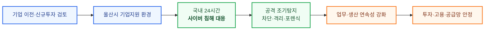
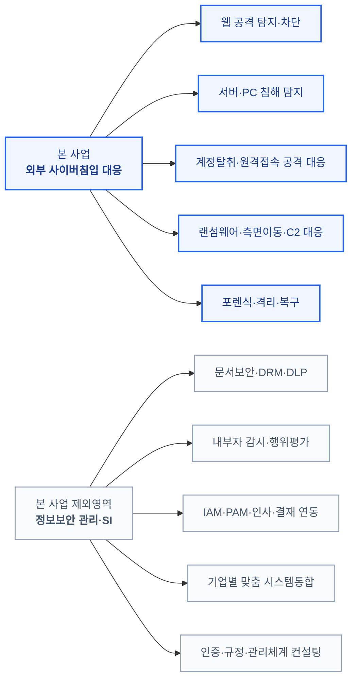
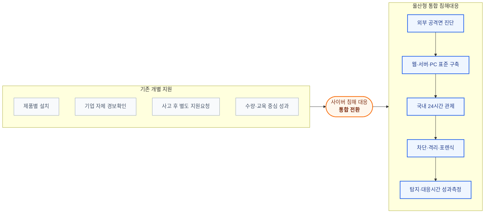
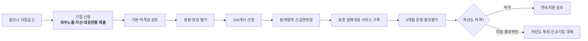
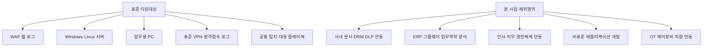
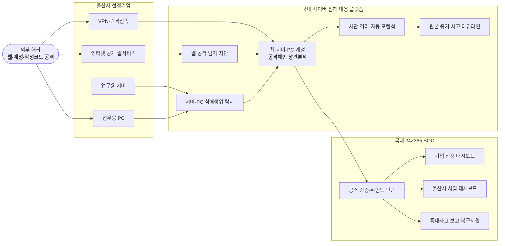
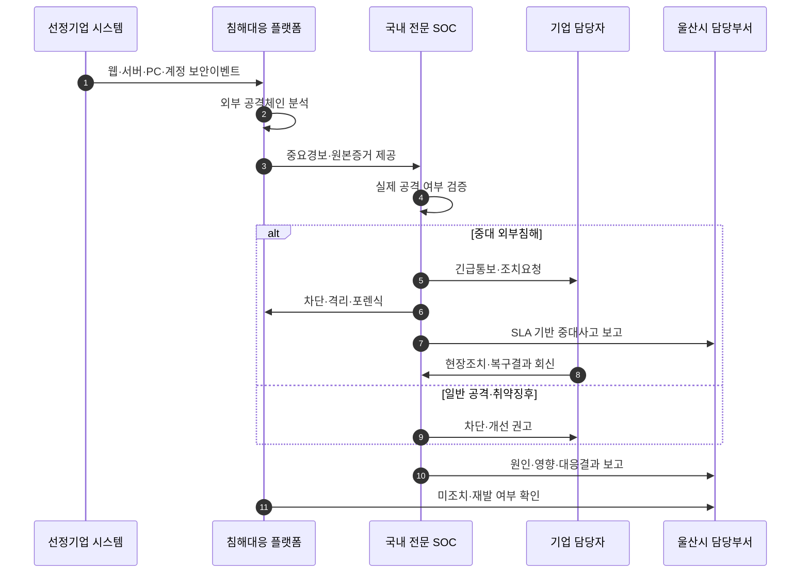
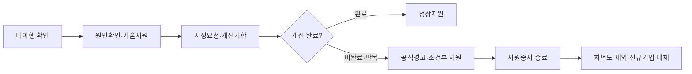
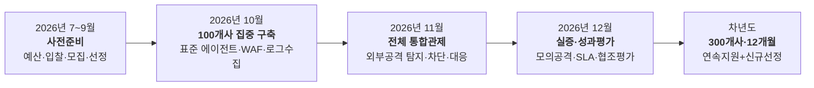

# 울산광역시 기업 사이버 침해 대응
# 소버린 사이버시큐리티 통합지원사업 최종 제안서

## 외부 해커의 침입을 탐지·차단하고, 사고 발생 시 즉시 대응하는 울산형 통합 사이버보안 사업

### 1차 100개사·2026년 10~12월 집중 실증확산에서 차년도 총 300개사·12개월 본사업으로

---

# 제안 요약

기업의 디지털 전환과 인터넷 연결이 확대되면서 웹서비스, 업무용 서버와 PC, 원격접속 계정과 클라우드 환경을 노리는 외부 사이버공격도 빠르게 증가하고 있습니다.

그러나 많은 기업은 보안제품을 일부 도입하고도 다음 문제를 해결하지 못하고 있습니다.

- 외부 해커의 공격이 실제 침입으로 이어졌는지 판단하기 어려움
- 웹·서버·PC에서 발생한 경보가 서로 분리되어 전체 공격 흐름을 보기 어려움
- 24시간 경보를 확인하고 즉시 대응할 전문인력이 부족함
- 공격을 발견한 뒤 차단·격리·포렌식·복구까지 수행할 체계가 부족함
- 사고 발생 후에야 외부 전문기관에 도움을 요청하여 초기 대응이 늦어짐

본 사업은 울산광역시가 기업의 신청을 받아 외부 공격 노출도, 침해 시 업무영향, 현재 탐지·대응 역량과 사업 참여의지를 평가하고, **1차로 100개 기업을 선정하여 2026년 10월부터 12월까지 3개월간 사이버 침해 대응 서비스를 제공하는 사업**입니다.

선정기업에는 기업당 월 1천만 원 상당의 표준화된 통합 사이버보안 서비스를 제공하며, 1차 사업비는 30억 원입니다. 차년도에는 1차 사업의 기술·운영성과와 기업별 협조·개선 실적을 평가한 뒤, 연속지원 기업과 신규 선정기업을 합하여 **총 300개 기업을 12개월간 지원하는 360억 원 규모의 본사업**으로 확대합니다.

본 사업은 기존 울산기업을 보호하는 데 그치지 않습니다. 울산으로 이전하거나 울산에 새로운 생산·연구·서비스 거점을 구축하려는 기업에 **외부 사이버공격을 24시간 탐지하고 사고 발생 시 즉시 대응하는 지역 차원의 사이버안전망**을 제공함으로써, 울산의 기업환경과 투자유치 경쟁력을 높이는 사업입니다.

> **기업이 울산을 선택하면 부지·행정·금융지원뿐 아니라, 해킹으로 인한 생산·영업 중단과 막대한 손실을 줄일 수 있는 사이버안전 환경도 함께 제공받을 수 있어야 합니다.**

> **본 사업의 최우선 목표는 외부 해커가 기업의 웹서비스·서버·PC·원격접속 계정을 공격하여 내부 시스템에 침입하는 것을 조기에 탐지·차단하고, 침해가 발생한 경우 피해가 확산되기 전에 대응하는 것입니다.**

> **본 사업은 문서보안, 내부자 감시 또는 기업의 전반적인 정보보안 관리체계를 대신하는 사업이 아닙니다.**

본 사업은 모든 기업에 공통 적용할 수 있는 표준 서비스로 구성합니다.

- 외부 노출 웹서비스 공격 탐지·차단
- 서버·PC 침해행위 탐지
- 계정탈취·크리덴셜 스터핑·원격접속 공격 탐지
- 랜섬웨어·악성코드·권한상승·측면이동 탐지
- 외부 공격자의 데이터 수집·외부전송 탐지
- 국내 24시간 전문 보안관제
- 공격 차단·호스트 격리·자동 포렌식·사고대응
- 기업별 독립 대시보드와 울산시 통합 사업관리 대시보드

기업별 문서등급, 내부 결재, 인사·조직, 직무권한과 업무절차를 분석하는 내부자 관리 플랫폼은 기업마다 시스템과 정책이 달라 표준화가 어렵습니다. 이를 본 사업에 포함하면 기업별 맞춤 개발과 시스템통합이 필요해지고, 비용과 기간이 크게 증가하며 100개 기업을 3개월 안에 지원한다는 사업목표를 달성하기 어렵습니다.

따라서 사업범위를 외부 사이버침입과 침해사고 대응에 집중합니다.

> **본 사업은 표준화할 수 있는 외부 사이버침입 대응에만 집중합니다. 기업별 문서보안·내부자 관리·업무권한 통제·맞춤형 정보보안 SI는 본 사업의 목적과 지원범위에 포함하지 않습니다.**

---

# 1. 사이버안전은 기업 유치를 위한 핵심 산업 인프라입니다

## 1.1 기업이 울산을 선택하려면 안전한 사업환경이 필요합니다

울산광역시가 기업을 유치하고 지역 내 투자를 확대하기 위해서는 부지, 교통, 인력, 금융과 행정지원뿐 아니라 기업이 안심하고 사업을 운영할 수 있는 디지털 안전환경을 함께 제공해야 합니다.

오늘날 기업의 생산·영업·계약·품질관리와 고객서비스는 웹서비스, 업무용 서버와 PC, 원격접속, 클라우드와 협업시스템에 의존하고 있습니다. 사이버공격은 단순한 전산장애가 아니라 기업의 지속운영과 투자성과를 위협하는 경영위험입니다.

기업의 입지와 투자환경을 검토할 때 다음 질문이 중요해지고 있습니다.

- 외부 해커의 공격을 24시간 탐지할 수 있는가
- 랜섬웨어와 서버침해가 발생하면 즉시 도움을 받을 수 있는가
- 자체 보안인력이 부족해도 전문적인 사고대응이 가능한가
- 고객사와 공급망이 요구하는 보안수준을 충족할 수 있는가
- 보안데이터와 사고정보를 국내에서 안전하게 관리할 수 있는가
- 해킹으로 인한 예기치 않은 생산·영업 손실을 줄일 수 있는가

> **울산은 ‘기업하기 좋은 도시’에서 한 단계 더 나아가 ‘안전하게 기업할 수 있는 도시’가 되어야 합니다.**

## 1.2 기업의 해킹 피해는 지역경제의 손실로 이어집니다

기업이 해킹을 당하면 시스템 복구비용만 발생하는 것이 아닙니다.

| No. | 피해영역 | 기업과 지역경제에 미치는 영향 |
|---:|---|---|
| 1 | 생산·업무 중단 | 공장·서비스·납품·계약업무 차질과 매출손실 |
| 2 | 랜섬웨어·시스템 복구 | 긴급복구, 포렌식, 재구축과 대체업무 비용 발생 |
| 3 | 기술·고객·거래정보 유출 | 경쟁력 저하, 거래처 손해와 법률대응 부담 |
| 4 | 공급망 피해 | 고객사·협력사·물류·납품 일정으로 피해 확산 |
| 5 | 대외 신뢰 훼손 | 신규계약, 투자유치와 고객관계에 부정적 영향 |
| 6 | 고용·세수 영향 | 장기 업무중단과 경영악화가 일자리·지역경제에 영향 |
| 7 | 추가 보안투자 | 사고 이후 단기간에 높은 복구·보완비용 부담 |

특히 자동차, 조선, 석유화학, 에너지와 기계산업이 밀집한 울산에서는 한 기업의 침해사고가 해당 기업에만 머무르지 않고 다른 기업의 생산·납품과 지역 공급망으로 확대될 수 있습니다.

따라서 기업의 사이버안전은 개별기업이 자체적으로 해결해야 할 비용항목만이 아니라, 기업 유치와 지역 산업의 지속가능성을 뒷받침하는 핵심 산업 인프라로 보아야 합니다.

## 1.3 울산형 사이버안전망은 기업유치 경쟁력이 됩니다

본 사업은 울산 소재 기업의 외부 사이버침입 대응 공백을 해소하고, 울산에 투자하려는 기업에 차별화된 사업환경을 제공할 수 있습니다.

| No. | 기업환경 개선요소 | 기업에 제공되는 가치 | 울산시 정책효과 |
|---:|---|---|---|
| 1 | 국내 24시간 전문관제 | 야간·휴일 보안 대응공백 해소 | 자체 SOC가 없는 기업도 유치·정착 가능 |
| 2 | 웹·서버·PC·계정 통합보호 | 주요 외부 공격경로를 하나의 체계로 보호 | 기업환경의 기본 안전수준 향상 |
| 3 | 차단·격리·포렌식 지원 | 침해사고 초기 대응시간과 피해확산 최소화 | 생산·고용·세수 손실 위험 완화 |
| 4 | 국내 데이터·국내 대응 | 보안데이터와 사고정보에 대한 통제권 확보 | 소버린 사이버시큐리티 도시 이미지 구축 |
| 5 | 울산시 지원체계 | 중소·중견기업의 전문인력·투자 부족 보완 | 기업 이전·신규투자의 차별화된 유인 |
| 6 | 지역 공격정보 통합분석 | 반복 공격과 공통위협 조기 인지 | 지역 공급망 전체의 안정성 강화 |

본 사업은 “울산에 오면 해킹을 당하지 않는다”고 약속하는 사업이 아닙니다.

> **울산에서 사업하는 기업이 외부 사이버공격을 받더라도 이를 조기에 발견하고, 생산·영업·기술과 고객의 피해가 확대되기 전에 대응할 수 있는 지역 차원의 기업안전망을 제공하는 사업입니다.**

## 1.4 기업유치 정책과 지원대상 선정의 연계

사업의 기본대상은 울산시 소재 기업으로 하되, 울산시의 기업유치 정책목표에 따라 다음 기업에 가점을 부여하거나 정책배정 물량을 운영하는 방안을 검토할 수 있습니다.

- 울산으로 본사 또는 사업장을 이전하는 기업
- 울산에 신규 생산·연구·서비스 거점을 설립하는 기업
- 울산시와 투자협약을 체결한 기업
- 지역 내 신규고용과 공급망 확대효과가 큰 기업
- 울산 주력산업의 핵심기술·부품·서비스를 담당하는 기업

다만 지원대상과 가점기준은 사업공고 전에 공개하고, 외부 공격 노출도·침해 시 영향·표준 구축 가능성과 함께 객관적으로 평가해야 합니다.

기업유치 가점이 사이버위험 평가를 대신해서는 안 되며, 사업기간 안에 표준 침해대응 서비스를 구축할 수 있는 기업을 선정해야 합니다.

## 1.5 시장·정책결정자 관점의 핵심 메시지

본 사업은 보안제품 보급에 그치지 않고 다음 정책목표를 동시에 달성합니다.

- 기존 울산기업의 생산·영업·일자리 보호
- 랜섬웨어와 해킹으로 인한 지역경제 손실 예방
- 중소·중견기업의 보안격차 해소
- 울산 이전·신규투자 기업에 대한 차별화된 지원환경 제공
- 대기업·협력기업으로 연결되는 지역 공급망 안정성 강화
- 국내 최초 수준의 소버린 사이버시큐리티 기반 기업유치 모델 구축

> **“울산에 투자하는 기업에는 행정·금융지원뿐 아니라, 외부 해커의 공격으로부터 기업의 생산과 성장을 지키는 사이버안전망도 제공하겠습니다.”**

---

# 2. 사업의 정의와 범위

## 2.1 본 사업의 정의

본 사업은 다음과 같이 정의합니다.

> **울산시가 선정한 기업의 인터넷 노출영역, 업무용 서버·PC와 원격접속 환경을 대상으로 외부 해커의 공격을 탐지·차단하고, 침해 발생 시 국내 전문인력이 즉시 분석·격리·포렌식·복구를 지원하는 사이버 침해 대응 사업**

핵심은 기업의 전반적인 정보보안 행정을 대신하는 것이 아니라, 실제 외부 공격과 침해사고에 대응하는 것입니다.

## 2.2 가장 중차대한 사업목표

사업의 성과는 규정과 문서가 얼마나 많이 만들어졌는지가 아니라 다음 결과로 판단해야 합니다.

- 외부 해커의 웹 공격을 실제로 탐지·차단했는가
- 계정탈취와 원격접속 공격을 조기에 식별했는가
- 서버·PC 내부에서 실행된 악성 명령과 프로세스를 확인했는가
- 랜섬웨어와 내부 확산을 피해 확대 전에 끊었는가
- 침해 이후 외부통신과 데이터 반출을 탐지했는가
- 중대 공격을 정해진 시간 안에 기업과 울산시에 통보했는가
- 사고 발생 시 공격 경로와 영향범위를 확인할 증거를 확보했는가
- 기업이 차단·격리·복구와 재발방지에 적극 협조했는가

## 2.3 사업범위

| No. | 구분 | 지원내용 |
| ---: | --- | --- |
| 1 | 외부 공격면 보호 | 인터넷 공개 웹서비스, 외부 접근 서비스, 원격접속 경로 |
| 2 | 웹 침입 대응 | WAF, 웹 요청·응답 분석, 변형·제로데이 의심 공격 분석 |
| 3 | 서버 침해 대응 | 로그인, 명령, 프로세스, 파일, 권한변경과 외부통신 분석 |
| 4 | PC 침해 대응 | 악성코드, 랜섬웨어, 의심 프로세스와 자격증명 탈취 행위 분석 |
| 5 | 계정공격 대응 | 브루트포스, 크리덴셜 스터핑, 탈취계정과 비정상 원격접속 탐지 |
| 6 | 공격 확산 대응 | 권한상승, 내부 시스템 탐색, 측면이동과 C2 통신 탐지 |
| 7 | 침해 후 유출 대응 | 외부 공격자가 침해 후 수행하는 파일수집·압축·외부전송 탐지 |
| 8 | 사고대응 | 차단·격리·포렌식·영향분석·복구와 결과보고 |
| 9 | 관제 | 국내 24×365 전문 보안관제와 SLA 기반 대응 |

## 2.4 명시적인 사업 제외범위

본 사업은 다음 영역을 지원하지 않습니다.

| No. | 제외영역 | 제외사유 |
| ---: | --- | --- |
| 1 | 문서보안·DRM·DLP 구축 | 외부 해커의 침입 탐지·차단과 직접 관련이 없는 문서관리·업무통제 영역 |
| 2 | 내부자 감시·행위평가 | 외부 공격 대응이 아닌 인사·감사·노무 기반의 내부 업무관리 영역 |
| 3 | 정보등급·문서분류 체계 | 외부 사이버침입 대응이 아닌 문서분류·정보등급 관리영역 |
| 4 | IAM·PAM 전면 재설계 | 외부 계정공격 탐지를 넘어 기업 내부 권한·결재체계를 재설계하는 영역 |
| 5 | 내부 업무프로세스 통제 | 기업 내부 업무절차와 애플리케이션을 통제하는 관리·개발 영역 |
| 6 | 개인정보·ISMS 등 인증 컨설팅 | 외부 침해 대응이 아닌 인증·규정·컴플라이언스 관리영역 |
| 7 | 기업별 맞춤 애플리케이션 연동 | 표준 침해대응 서비스가 아닌 기업별 애플리케이션 개발영역 |
| 8 | OT·ICS 제어장비 직접 통제 | 본 사업의 표준 IT 침해대응 범위를 벗어나는 제어설비 직접 통제영역 |
| 9 | 백업시스템 신규 구축 | 기존 백업을 활용한 복구지원만 포함하며, 백업 인프라 신규구축은 지원범위에서 제외 |
| 10 | 상시 내부 직원 모니터링 | 본 사업의 외부 사이버침입 대응 목적과 다름 |

### 제외영역에 대한 해석 원칙

위 항목을 추가 구매나 추가 예산이 필요한 후속 과제로 제안하는 것이 아닙니다.

> **외부 해커의 침입 탐지·차단·포렌식·복구를 목적으로 하는 본 사이버 침해 대응사업과 직접 관련이 없으므로, 이번 사업의 요구사항·비용·성과평가에서 제외한다는 의미입니다.**

본 사업의 예산은 문서관리, 직원감시, 인사·권한체계와 기업별 업무시스템 개발에 사용하지 않고 외부 사이버공격 대응에 집중합니다.

계정과 데이터 외부전송을 분석하는 경우에도 범위를 명확히 제한합니다.

- 정상 직원의 업무행위를 평가하거나 감시하지 않음
- 외부 공격자가 계정을 탈취한 정황이 있는 경우에 한해 계정공격으로 분석
- 외부 침입 이후 나타난 악성 프로세스·파일수집·C2·외부전송 흐름을 침해사고로 분석
- 문서의 업무적 적정성이나 직원의 충성도·행동성향을 판단하지 않음

> **사업범위를 분명히 제한해야 100개 기업에 동일한 품질의 침해대응 서비스를 제공하고, 3개월 안에 측정 가능한 성과를 만들 수 있습니다.**

---

# 3. 제안 배경

## 3.1 외부 해커의 침입은 기업의 규모와 관계없이 발생합니다

외부 공격자는 보안인력이 부족하고 인터넷 노출서비스가 관리되지 않는 기업을 우선적으로 공격할 수 있습니다.

주요 공격경로는 다음과 같습니다.

- 웹사이트와 API의 취약점
- 원격접속·VPN·관리자 서비스
- 취약하거나 재사용된 계정정보
- 피싱과 악성 첨부파일
- 패치되지 않은 서버와 PC
- 외부 유지보수와 협력사 접속경로
- 공개된 관리포트와 잘못된 방화벽 정책

공격자가 최초 침입에 성공하면 다음과 같이 피해가 확대될 수 있습니다.

> 외부 공격  
> → 최초 침입  
> → 악성 명령 실행  
> → 권한상승  
> → 내부 시스템 탐색  
> → 측면이동  
> → 랜섬웨어 또는 데이터 외부전송  
> → 로그 삭제와 증거훼손

## 3.2 기업별 자체 대응만으로는 24시간 방어가 어렵습니다

다수 기업은 다음 제약을 가지고 있습니다.

- 전담 보안인력 부족
- 웹·서버·PC 보안제품의 분리 운영
- 야간·휴일 경보 확인의 어려움
- 실제 공격과 오탐을 구분할 전문성 부족
- 침해사고 발생 시 포렌식과 증거보존 역량 부족
- 긴급 차단과 복구 의사결정 지연

따라서 단순 제품 보급이 아니라 국내 전문 보안관제와 사고대응을 결합해야 합니다.

## 3.3 울산 제조업의 외부 연결경로도 보호해야 합니다

울산의 자동차·조선·석유화학·에너지·기계 기업은 일반 업무망뿐 아니라 다음 연결경로를 운영할 수 있습니다.

- 원격 유지보수 VPN
- 생산망 접속용 관리자 PC
- 점프서버
- 패치·배포 서버
- 파일전송 서버
- 협력사 자료교환 웹서비스
- 인터넷과 연결된 품질·설계·생산관리 시스템

1차 사업은 생산제어장비를 직접 통제하지 않습니다. 대신 외부 해커가 생산환경으로 접근할 때 거쳐야 하는 IT·OT 경계의 관리자 PC, 원격접속, 점프서버와 파일전송 경로를 우선 탐지·관제합니다.

---

# 4. 기존 지원방식의 한계와 전환방향

## 4.1 제품을 설치해도 침해대응 공백이 남을 수 있습니다

개별 보안제품 지원은 다음 한계를 가질 수 있습니다.

- 설치 후 경보를 확인하는 인력이 없음
- 웹·서버·PC 경보를 연결하지 못함
- 제품마다 정책·보고서·유지보수 창구가 다름
- 실제 사고가 발생하면 별도 업체를 다시 찾아야 함
- 사업성과가 제품 수량과 교육횟수로만 측정됨

## 4.2 정보보안 관리사업으로 확대하면 표준화가 무너집니다

문서보안과 내부자 관리는 기업마다 다음 요소가 다릅니다.

- 인사조직과 직무
- 문서분류와 결재절차
- ERP·그룹웨어·생산·품질시스템
- 협력사와 외부반출 승인절차
- 개인정보와 영업비밀 관리규정
- 노무·감사·법무 요구사항

이를 100개 기업에 동일한 플랫폼으로 적용하려면 기업마다 요구사항 분석, 데이터모델 설계, 시스템 연동, 정책개발과 사용자 교육을 별도로 수행해야 합니다.

이는 표준 사이버 침해 대응 서비스가 아니라 기업 내부 업무체계를 각각 분석·개발해야 하는 맞춤형 관리 SI에 해당하므로 본 사업의 지원범위에서 제외해야 합니다.

기업별 SI를 현재 월 지원한도와 3개월 일정에 포함하면 다음 문제가 발생할 수 있습니다.

- 구축완료 전에 사업기간 종료
- 기업별 범위와 품질의 큰 차이
- 시스템 연동 실패와 책임공방
- 외부 침입 탐지보다 문서·권한정책 협의에 인력 집중
- 성과 측정 불가능
- 예산 부족과 추가비용 발생
- 차년도 300개사 확대 불가능

> **외부 침입 대응과 기업별 정보보안 SI를 한 사업에 섞으면 핵심목표가 흐려지고, 성과 없이 사업이 종료될 위험이 큽니다.**

## 4.3 기존 방식에서 침해대응 플랫폼으로 전환

| No. | 구분 | 개별 제품·관리 중심 | 제안하는 침해대응 중심 |
| ---: | --- | --- | --- |
| 1 | 목표 | 제품 구축과 관리체계 개선 | 외부 공격의 탐지·차단·사고대응 |
| 2 | 대상 | 광범위한 정보보안 항목 | 웹·서버·PC·계정·원격접속 공격 |
| 3 | 구축 | 기업별 상이 | 표준 패키지 |
| 4 | 운영 | 기업 자체 대응 | 국내 24시간 전문 SOC |
| 5 | 분석 | 제품별 경보 | 공격 전체 흐름 상관분석 |
| 6 | 사고 | 발생 후 별도 요청 | 실시간 차단·격리·포렌식 |
| 7 | 성과 | 구축수량·교육횟수 | 탐지율·통보시간·차단·복구결과 |
| 8 | 확장성 | 기업별 SI로 확대 어려움 | 100개사에서 300개사로 표준 확장 |

---

# 5. 사업규모와 추진구조

## 5.1 1차 사업과 차년도 확대

| No. | 구분 | 지원대상 | 지원기간 | 기업당 지원규모 | 총사업비 |
| ---: | --- | ---: | ---: | ---: | ---: |
| 1 | 1차 집중 실증확산 | 울산시 선정 100개사 | 2026년 10~12월, 3개월 | 월 1천만 원, 총 3천만 원 | 30억 원 |
| 2 | 차년도 본사업 | 연속지원·신규선정 총 300개사 | 12개월 | 연 1억 2천만 원 | 360억 원 |
| 3 | 전체 사업규모 | 100개사에서 총 300개사로 확대 | 총 15개월 | 단계적 적용 | 390억 원 |

※ 부가가치세 포함 여부와 최종 산정기준은 예산편성과 공개입찰 과정에서 확정합니다.

울산시는 공개입찰을 통해 단일 책임사업자와 계약하고, 선정기업에 필요한 표준 침해대응 서비스 비용을 전액(100%) 지원합니다.

기업에 현금을 지급하는 방식이 아니라 울산시가 서비스를 계약하여 기업에 제공합니다.

## 5.2 3개월 사업의 목표

3개월은 장기적인 관리체계를 구축하는 기간이 아닙니다.

다음 성과를 집중적으로 확인합니다.

- 100개 기업을 표준절차로 구축할 수 있는가
- 외부 공격면과 보호대상 자산이 정상적으로 관제되는가
- 실제 공격을 탐지하고 SLA 안에 통보할 수 있는가
- 차단·격리·포렌식과 사고대응이 작동하는가
- 기업이 긴급 대응과 개선조치에 협조하는가
- 차년도 300개사로 확장할 기술·인력·인프라가 충분한가

## 5.3 공개모집과 선정

## 5.4 기본 적격요건

- 울산광역시에 본사·사업장 또는 주요 운영거점을 보유
- 인터넷 공개서비스, 서버·PC 또는 원격접속 환경을 운영
- 표준 에이전트와 로그수집 기능을 설치할 수 있음
- 기업 보안책임자와 기술담당자를 지정
- 긴급경보 연락과 차단·격리·포렌식에 협조
- 2026년 10월 안에 표준 구축을 완료할 수 있음
- 기업별 맞춤 개발 없이 표준 지원범위 적용 가능
- 보호대상 자산과 공격 노출현황을 사실대로 제출
- 다른 공공지원사업과의 중복 여부 공개

기업별 별도 애플리케이션 개발, 문서보안·인사·권한시스템 연동이 필수인 경우에는 1차 표준사업 대상에서 제외하거나 표준 자산만 제한적으로 지원합니다.

## 5.5 최초 선정평가표

| No. | 평가영역 | 배점 | 평가내용 |
| ---: | --- | ---: | --- |
| 1 | 외부 공격 노출도 | 30점 | 웹서비스, 외부포트, VPN, 원격접속, 외부 유지보수 경로 |
| 2 | 침해 시 운영영향 | 20점 | 업무중단, 생산·거래·고객서비스와 공급망 영향 |
| 3 | 현재 탐지·대응 공백 | 20점 | WAF·EDR·로그수집·24시간 관제·사고대응 부재 |
| 4 | 표준 구축 적합성 | 15점 | 에이전트·로그연계 가능성, 10월 구축 가능 여부 |
| 5 | 기업 협조의지 | 10점 | 담당자 지정, 긴급조치·포렌식·훈련 참여확약 |
| 6 | 업종·정책 확산성 | 5점 | 울산 주력산업 대표성과 확산 가능성 |
| 7 | **합계** | **100점** | － |

동점은 외부 공격 노출도, 침해 시 운영영향, 현재 탐지·대응 공백 순으로 판단합니다.

---

# 6. 표준 지원패키지와 비용구조

## 6.1 기업당 월 1천만 원 표준 패키지

| No. | 지원항목 | 표준범위 예시 |
| ---: | --- | --- |
| 1 | 외부 웹서비스 | 인터넷 공개 웹서비스 1식의 WAF·웹 공격 탐지·차단 |
| 2 | 업무용 서버 | 최대 20대의 로그인·명령·프로세스·파일·권한·외부통신 분석 |
| 3 | 업무용 PC | 최대 100대의 악성코드·랜섬웨어·이상 프로세스 탐지 |
| 4 | 원격접속 | 표준 VPN·관리자·원격접속 로그 연계 |
| 5 | 통합분석 | 웹·서버·PC·계정 경보의 공격체인 상관분석 |
| 6 | 전문관제 | 국내 24×365 SOC의 공격 검증·통보·대응지원 |
| 7 | 사고대응 | 차단·격리·자동 포렌식·영향분석·복구지원 |
| 8 | 교육·훈련 | 담당자 교육과 1회 이상의 모의시나리오 또는 대응점검 |
| 9 | 대시보드·보고 | 기업별 대시보드, 울산시 대시보드, 월간·종합보고 |

웹서비스가 없는 기업은 서버·PC·원격접속 관제범위를 확대하는 방식으로 표준 지원한도 안에서 조정할 수 있습니다.

표준수량을 초과하는 자산은 RFP의 초과단가 기준으로 관리하되, 비표준 시스템의 맞춤 개발·연동은 본 사업 지원범위에서 제외합니다.

## 6.2 월 지원금의 산정근거

| No. | 비용영역 | 주요내용 |
| ---: | --- | --- |
| 1 | 진단·온보딩 | 외부 공격면 확인, 자산등록, 에이전트와 로그연계 |
| 2 | 플랫폼·인프라 | 기업별 분리환경, 로그수집·저장·검색·분석 |
| 3 | WAF·EDR·XDR | 웹·서버·PC·계정 공격 탐지·차단 기능 |
| 4 | 24시간 SOC | 공격 검증, 위험분류, 기업·울산시 통보 |
| 5 | 사고대응 | 격리·포렌식·영향분석·복구지원 |
| 6 | 교육·실증 | 담당자 교육, 공격시나리오와 대응절차 점검 |
| 7 | 사업관리 | 대시보드, SLA·KPI·기업협조 평가와 보고 |
| 8 | 기술지원 | 수집장애, 오탐, 정책업데이트와 긴급지원 |

세부 원가와 금액은 참여사업자가 실제 인력·인프라·관제계획을 근거로 가격산출서에 제출하도록 합니다.

## 6.3 표준화 원칙

사업의 성공을 위해 다음 원칙을 적용합니다.

- 지원대상 운영체제와 로그형식을 사전에 고지
- 에이전트와 표준 수집방식 중심으로 구축
- 기업별 별도 개발을 최소화
- 비표준 연동과 맞춤 개발은 본 사업 지원범위에서 제외
- 기업별 문서·인사·업무시스템 분석 금지
- 동일한 탐지정책·SLA·보고체계를 공통 적용
- 예외정책은 외부 침입 탐지에 필요한 범위로 제한

---

# 7. 울산형 통합 사이버 침해 대응 플랫폼

## 7.1 플랫폼의 역할

통합플랫폼은 단순히 여러 경보를 한 화면에 표시하는 시스템이 아닙니다.

외부 해커의 공격이 웹·서버·PC·계정에서 어떻게 진행되는지를 하나의 타임라인으로 연결합니다.

> 외부 공격  
> → 웹·원격접속 침입  
> → 명령·프로세스 실행  
> → 권한상승  
> → 내부 시스템 탐색·측면이동  
> → 랜섬웨어·C2·외부전송  
> → 차단·격리·포렌식

## 7.2 제안 아키텍처

## 7.3 기업별 데이터 분리

- 각 기업은 자사 자산·경보·사고정보만 조회
- 다른 참여기업의 상세 데이터 접근 금지
- 울산시는 구축률·위험등급·중대사고·미조치·SLA 등 사업관리 지표 확인
- 상세 원본로그는 중대사고 대응 등 승인된 목적에 한해 제한적으로 사용
- 사용자·관리자 접근기록과 권한을 감사 가능하도록 관리

## 7.4 PLURA-XDR의 구체적인 역할

PLURA-XDR를 기반으로 다음 기능을 통합 제공할 것을 제안합니다.

- WAF 기반 알려진 웹 공격 탐지·차단
- 웹 요청본문과 응답정보 기반 변형·제로데이 의심 공격 분석
- 서버·PC의 명령·프로세스·파일·권한·네트워크 행위 분석
- 브루트포스·크리덴셜 스터핑·탈취계정 탐지
- 웹 침입과 서버 내부 명령실행의 연계분석
- MITRE ATT&CK 기반 권한상승·측면이동·C2 공격체인 분석
- 랜섬웨어와 정상 시스템도구 악용행위 탐지
- 외부 공격자의 파일수집·압축·외부전송 탐지
- 공격 IP·웹 요청·계정·세션·호스트 대응
- 자동 포렌식과 원본로그 증거보전
- 기업별 독립 대시보드와 울산시 중앙 대시보드
- 국내 24시간 전문 보안관제와 사고대응

---

# 8. 소버린 사이버시큐리티

## 8.1 보안데이터의 중요성

사이버 침해 대응 데이터에는 다음 정보가 포함됩니다.

- 인터넷 노출서비스와 네트워크 구성
- 서버·PC 운영체제와 보안상태
- 공격자가 사용한 IP·명령·파일·프로세스
- 취약점과 침해흔적
- 사고원인과 대응절차
- 탐지·차단 정책과 포렌식 증거

따라서 데이터 저장위치, 관제주체, 기술지원과 사고대응 권한을 함께 검토해야 합니다.

## 8.2 소버린 사이버시큐리티 원칙

| No. | 영역 | 원칙 |
| ---: | --- | --- |
| 1 | 데이터 주권 | 원본로그·사고정보·백업을 국내에 저장·처리 |
| 2 | 운영 주권 | 국내 SOC와 국내 사고대응 인력이 직접 운영 |
| 3 | 기술 주권 | 핵심 탐지·차단이 해외 SaaS 장애 없이 지속 |
| 4 | 통제 주권 | 울산시와 기업이 계정·정책·보존·반출·삭제를 통제 |
| 5 | 이관 주권 | 사업자 변경 시 표준형식으로 데이터·정책·사고이력 이관 |

## 8.3 외부 AI와 해외서비스 통제

- 기업 원본로그를 외부 생성형 AI에 직접 전송하지 않음
- 외부 AI 연계 시 사전승인·최소수집·마스킹 적용
- 외부 AI가 중단되어도 기본 탐지·차단·관제 지속
- 승인 없는 국외 이전 금지
- 해외 재위탁자와 데이터 처리위치 공개

국내 기술이라는 이유가 성능검증을 대신하지는 않습니다. 다만 국내 데이터·국내 관제·국내 사고대응은 성능과 별개로 검증해야 할 보안주권 요건입니다.

---

# 9. 실제 외부 공격 시나리오와 대응

## 9.1 웹서비스 침해

외부 해커가 웹 취약점을 악용하여 서버에 명령을 실행하려는 상황입니다.

> 악성 웹 요청  
> → WAF 탐지 또는 우회  
> → 웹서버 명령·프로세스 실행  
> → 파일 생성·외부통신  
> → 통합플랫폼 상관분석  
> → 웹 차단·호스트 격리·포렌식

## 9.2 크리덴셜 스터핑과 계정탈취

외부 공격자가 유출된 계정정보를 이용해 로그인하거나 원격접속을 시도합니다.

- 다수 IP의 반복 로그인
- 여러 계정에 대한 분산 시도
- 로그인 성공 후 비정상 원격접속
- 탈취계정 사용 이후 서버·파일·명령 접근

본 사업은 직원의 정상업무를 평가하는 것이 아니라, 외부 계정탈취 징후와 침해 후 행위를 탐지합니다.

## 9.3 악성코드와 랜섬웨어

피싱·악성파일·취약점 공격으로 PC 또는 서버가 감염됩니다.

- 의심 프로세스와 스크립트 실행
- 자격증명 접근
- 대량 파일변경과 암호화
- 네트워크 공유와 내부 확산
- 외부 C2 통신

위험이 확인되면 감염 호스트를 격리하고, 공격경로와 영향범위를 확인합니다.

## 9.4 권한상승과 측면이동

외부 공격자가 최초 침입 후 관리자 권한과 다른 시스템으로의 접근을 시도합니다.

- 운영체제·패치·보안제품 탐색
- 관리자 권한 획득
- 내부 호스트·서비스 탐색
- 원격명령과 측면이동
- 신규 계정·서비스·예약작업 생성

웹·서버·PC·계정 이벤트를 하나의 공격체인으로 연결합니다.

## 9.5 침해 이후 데이터 외부전송

외부 공격자가 서버나 PC를 침해한 뒤 파일을 수집·압축하여 C2 또는 외부 웹서비스로 전송하려는 상황입니다.

본 사업은 문서의 등급이나 직원의 업무 적정성을 판단하지 않습니다.

다음 침해흐름만 분석합니다.

> 외부 침입  
> → 악성 명령 실행  
> → 비정상 파일검색·수집  
> → 압축파일 생성  
> → 비정상 외부통신

## 9.6 로그 삭제와 탐지회피

공격자가 감사기능·에이전트를 중지하거나 로그를 삭제하려는 행위를 탐지합니다.

중앙에 이미 수집된 원본로그를 보존하여 포렌식 증거를 보호합니다.

---

# 10. 사고대응 절차와 SLA

## 10.1 공통 대응절차

## 10.2 권고 SLA

| No. | 등급 | 외부침해 예시 | 기업 최초 통보 | 대응 착수 | 차단·격리 또는 조치계획 |
| ---: | --- | --- | ---: | ---: | ---: |
| 1 | P1 긴급 | 침해 진행, 랜섬웨어, C2, 대량 외부전송 | SOC 확인 후 15분 이내 | 30분 이내 | 사전 승인범위 즉시, 그 외 60분 이내 협의 |
| 2 | P2 높음 | 웹침해 의심, 계정탈취, 권한상승, 측면이동 | 30분 이내 | 1시간 이내 | 4시간 이내 조치계획 |
| 3 | P3 보통 | 반복공격, 취약설정, 의심행위 | 4시간 이내 | 1영업일 이내 | 합의된 기한 |
| 4 | P4 정보 | 공격경향·정책개선 정보 | 정기보고 | 필요 시 | 월간 개선 반영 |

공통 운영지표:

- 플랫폼 월 가용성 99.9% 이상
- 정상 로그수집률 98% 이상
- 로그수집 중단 15분 이내 인지·통보
- P1 울산시 최초 보고: SOC 확인 후 30분 이내
- 기업 월간보고: 익월 5영업일 이내
- 중대사고 결과보고: 초동대응 종료 후 5영업일 이내
- 사업종료 종합보고: 종료 후 10영업일 이내

최종 수치는 기술검증과 초기 구축결과를 반영하여 RFP에서 확정합니다.

---

# 11. 선정기업의 협조의무와 차년도 지원

## 11.1 선정기업의 필수 의무

- 대표 또는 권한 있는 책임자의 참여확약
- 기술·보안담당자와 24시간 긴급연락망 지정
- 웹·서버·PC·원격접속 자산정보 제공
- 표준 에이전트·로그수집·WAF 정책 설치와 유지
- P1·P2 경보 확인과 현장조치
- 차단·격리·포렌식·복구 협조
- 수집중단과 반복 취약점 개선
- 교육과 모의공격·대응훈련 참여
- 에이전트와 로그를 고의로 중지·삭제하지 않을 의무
- 사업성과와 차년도 적격평가 협조

## 11.2 3개월 참여·이행 평가

| No. | 평가기간 | 평가중점 |
| ---: | --- | --- |
| 1 | 10월 | 자산정보·설치·담당자·로그수집 정상화 |
| 2 | 11월 | 긴급경보 대응·차단·포렌식·개선협조 |
| 3 | 12월 | 모의훈련·잔여 미조치·종합성과 |

| No. | 평가영역 | 배점 | 주요지표 |
| ---: | --- | ---: | --- |
| 1 | 구축·로그수집 협조 | 20점 | 설치일정, 정상수집, 임의중지 여부 |
| 2 | 긴급경보 대응 | 25점 | 연락수신, 확인, 차단·격리와 회신 |
| 3 | 침해사고 조사·복구 | 20점 | 포렌식·증거보전·영향분석 협조 |
| 4 | 기술 개선조치 | 20점 | 외부노출·취약설정·반복 공격 개선 |
| 5 | 교육·모의훈련 | 10점 | 담당자 교육과 대응훈련 참여 |
| 6 | 자산정보 현행화 | 5점 | 신규·변경·폐기 자산 통보 |
| 7 | **합계** | **100점** | － |

차년도 연속지원 기본조건:

- 종합점수 70점 이상
- 중대한 배제사유 없음
- P1 경보와 필수 개선의 장기 미조치 없음
- 표준 플랫폼을 정상적으로 유지할 수 있음

## 11.3 미협조·방임 기업의 조치

일시적인 기술문제에는 먼저 기술지원과 합리적인 개선기간을 제공합니다.

반복되거나 정당한 사유 없이 다음 행위가 지속되면 지원을 중단하거나 차년도에서 제외할 수 있습니다.

- 보안에이전트·WAF·로그수집의 반복적 중지
- P1·P2 경보 연락과 조치의 반복적 거부
- 침해사고 은폐 또는 포렌식·증거보전 방해
- 외부 노출 취약점과 반복공격의 장기 방치
- 자산·보안현황 허위제출
- 교육·모의훈련 반복 불참
- 로그·증거 삭제·조작
- 서비스의 부당 사용 또는 제3자 제공

고의적 보안기능 무력화, 중대사고 은폐, 로그·증거 조작, 긴급사고 대응거부와 부정수급은 즉시 배제심사를 진행할 수 있습니다.

지원중단 전에는 사전통지·소명·이의신청 절차를 보장합니다.

## 11.4 중도탈락과 잔여 지원분

- 서비스 개시 전 또는 10월 초기 탈락은 예비순위 기업으로 대체
- 예비기업의 기본환경과 즉시 구축 가능성을 사전에 확인
- 구축 이후 탈락은 잔여기간과 대체 실효성을 검토
- 즉시 대체가 어렵다면 미제공분을 감액·정산
- 잔여 지원분은 수행사업자의 수익으로 자동 인정하지 않음

---

# 12. 울산시와 기업 대시보드

## 12.1 울산시 사업관리 정보

울산시는 기업의 문서내용과 직원행위를 확인하지 않습니다.

다음 사이버 침해 대응 지표만 확인합니다.

- 100개사 구축·정상수집 현황
- 웹·서버·PC·원격접속 보호자산 수
- 기업별 외부 공격 위험등급
- P1·P2 사고와 대응상태
- 반복 공격과 공통 취약 노출
- 로그수집 중단과 미조치 기업
- 탐지·통보·차단·복구 소요시간
- 기업별 협조·이행점수
- 300개사 확대를 위한 기술·인프라 성과

## 12.2 기업 대시보드

- 자사 보호대상 자산
- 수집·에이전트·WAF 동작상태
- 최근 외부 공격과 침해경보
- 긴급조치와 미조치 항목
- 사고 타임라인과 포렌식 결과
- 월간 침해대응 보고서

다른 기업의 정보에는 접근할 수 없습니다.

---

# 13. 역할과 책임

## 13.1 울산광역시

- 사업목표를 외부 사이버침입 대응으로 명확히 정의
- 예산·지원범위·표준자산 수량 확정
- 공개모집과 100개사 선정
- RFP·SLA·기술검증 기준 수립
- 단일 책임사업자 선정
- 울산시 대시보드와 사업성과 관리
- 중대사고 보고체계 운영
- 미협조 기업의 시정·지원중단·차년도 제외
- 차년도 총 300개사 확대 결정

## 13.2 선정기업

- 외부 노출서비스와 보호자산 정보제공
- 표준 설치와 로그수집 협조
- 긴급경보와 침해사고 현장대응
- 포렌식·격리·복구 협조
- 반복 공격과 취약 노출 개선
- 교육·훈련 참여
- 긴급연락망과 자산정보 현행화

## 13.3 수행사업자

- 표준 침해대응 플랫폼과 24시간 SOC 제공
- 100개사 차수별 온보딩
- WAF·서버·PC·계정 공격 분석
- 공격 검증·통보·차단·격리·포렌식
- 기업별 데이터 분리
- 울산시·기업 대시보드와 보고서
- SLA·KPI·기업협조 기록
- 탐지정책·플레이북 지속 업데이트
- 사업종료 데이터 이관·폐기

수행사업자는 기업별 정보보안 규정·문서체계·인사·결재시스템을 분석하거나 맞춤 SI를 수행할 의무를 부담하지 않습니다.

---

# 14. 추진일정

공개입찰·모집·선정은 서비스 개시 전에 완료하고, 2026년 10~12월을 실제 운영기간으로 확보합니다.

## 14.1 2026년 7~9월 사전준비

- 정책·예산·RFP 확정
- 수행사업자 입찰·계약
- 기업 공개모집
- 선정평가와 예비기업 지정
- 참여협약·긴급연락망
- 사전 자산정보 수집
- 구축일정과 표준 지원환경 확정

## 14.2 2026년 10월 집중 구축

| No. | 차수 | 기업 수 | 주요내용 |
| ---: | --- | ---: | --- |
| 1 | 선행 | 20~25개사 | 대표 업종·환경 구축, 표준절차 검증 |
| 2 | 2차 | 25~30개사 | 선행결과 반영, 병렬확산 |
| 3 | 3차 | 25~30개사 | 웹·원격접속·고위험 기업 우선 |
| 4 | 4차 | 잔여기업 | 월말까지 정상수집과 대시보드 확인 |

## 14.3 2026년 11월 전체 관제

- 100개사 24시간 관제
- P1·P2 사고 대응
- 외부 노출 취약점과 반복 공격 개선
- 로그수집 장애와 기업 미조치 관리
- 기업별 월간보고

## 14.4 2026년 12월 실증·평가

- 웹공격·계정탈취·랜섬웨어·C2 모의시나리오
- 탐지·통보·차단·포렌식 SLA 검증
- 기업 협조·개선실적 평가
- 연속지원 적격기업 선정
- 300개사 확대 기술·예산·운영계획 확정

## 14.5 차년도 300개사 본사업

- 1차 연속지원 적격기업
- 제외기업을 대체하는 신규기업
- 차년도 추가 신규선정 기업
- 총 300개사 12개월 운영

---

# 15. 핵심 성과지표

| No. | 영역 | 지표 | 목표·관리방향 |
| ---: | --- | --- | --- |
| 1 | 구축 | 선정기업 | 100개사 |
| 2 | 구축 | 10월 정상수집 | 합의된 대상기업·자산 완료 |
| 3 | 운영 | 로그수집률 | 98% 이상 |
| 4 | 운영 | 플랫폼 가용성 | 99.9% 이상 |
| 5 | 탐지 | 웹·서버·PC·계정 공격 | 합의 시나리오 탐지근거 제공 |
| 6 | 대응 | P1 기업 통보 | SOC 확인 후 15분 이내 |
| 7 | 대응 | P1 울산시 보고 | SOC 확인 후 30분 이내 |
| 8 | 대응 | 차단·격리·포렌식 | 승인된 절차 정상 수행 |
| 9 | 증거 | 원본로그·사고 타임라인 | 중대사고 확보 |
| 10 | 협조 | 기업 이행점수 | 연속지원 기본 70점 이상 |
| 11 | 배제 | 고의중지·은폐·증거조작 | 중대 배제사유 |
| 12 | 주권 | 국내 저장·관제·대응 | 전 대상 적용 |
| 13 | 확대 | 차년도 준비 | 총 300개사 운영계획 확정 |

사업성과는 문서보안 규정 수, 내부자 적발건수 또는 관리체계 컨설팅 산출물로 측정하지 않습니다.

---

# 16. 공개입찰과 기술검증 기준

## 16.1 필수 검증항목

- 2026년 10월 안에 100개사를 구축할 인력·절차·자동화
- 300개사로 확장 가능한 플랫폼·SOC 인프라
- 기업별 데이터·권한 분리
- WAF·서버·PC·계정 공격의 통합 상관분석
- 웹 요청본문과 서버행위 연계
- 크리덴셜 스터핑·랜섬웨어·권한상승·측면이동 탐지
- 공격 차단·호스트 격리·자동 포렌식
- 로그수집 중단과 증거보존
- 수치화된 SLA
- 국내 데이터 저장과 국내 관제·사고대응
- 외부 AI·해외 SaaS 중단 시 기본기능 지속
- 표준형식 데이터 반출과 API
- 사업자 변경 시 최소 30일 전환지원
- 데이터 반환·폐기확인서
- 울산시·기업별 대시보드
- 기업별 맞춤 SI 없이 표준 구축할 수 있는 구조

## 16.2 기술사례 제시원칙

수행사업자는 공개 또는 고객승인을 받은 다음 사례를 제시하도록 합니다.

- 웹 변형·제로데이 의심 공격 탐지
- 크리덴셜 스터핑 탐지·차단
- 서버 명령실행·권한상승·측면이동 분석
- 랜섬웨어와 C2 탐지
- 외부 침해 이후 파일수집·외부전송 탐지
- 자동 포렌식과 사고영향 분석
- 다수 기업의 데이터 분리·통합관제

비공개 사례는 고객명을 익명화하고, 검증 가능한 탐지근거와 대응결과만 제시합니다.

## 16.3 사업자 종속 방지

- CSV·JSON 등 표준형식 로그·사고이력 반출
- 문서화된 API와 데이터 사전
- 자산·정책·예외·대응이력 이관
- 계약종료 전 30일 이상의 전환지원
- 백업·복제본 포함 데이터 폐기확인
- 신규 사업자 인수인계
- 사업자 변경 중 긴급관제 연속성

---

# 17. 울산시가 얻게 되는 효과

## 17.1 기업유치와 투자환경의 차별화

울산으로 이전하거나 신규 투자하는 기업에 국내 24시간 사이버 침해 대응을 제공함으로써, 부지·금융·행정지원과 함께 차별화된 기업안전 환경을 제시할 수 있습니다.

## 17.2 기존 기업의 생산·영업 연속성 보호

외부 웹공격, 계정탈취, 랜섬웨어와 서버침해를 조기에 발견하여 생산·영업·납품과 고객서비스의 장기 중단 가능성을 낮춥니다.

## 17.3 외부 해커 침입에 대한 실질적인 방어

울산시는 제품 설치수량이 아니라 실제 공격의 탐지·차단·격리·포렌식 결과를 확보합니다.

## 17.4 중소·중견기업의 24시간 대응 공백 해소

자체 SOC를 운영하기 어려운 기업도 국내 전문인력의 24시간 지원을 받습니다.

## 17.5 공통 공격의 지역 단위 가시성

여러 기업에서 반복되는 웹 공격, 계정공격, 악성코드와 랜섬웨어 경향을 확인하고 지역 차원의 공통위협으로 대응할 수 있습니다.

## 17.6 울산 제조업의 IT·OT 경계 보호

원격유지보수·VPN·점프서버·관리자 PC 등 외부 해커가 생산환경으로 접근하는 경로를 우선 보호합니다.

## 17.7 공공예산의 측정 가능한 성과

- 구축률
- 정상수집률
- 실제 탐지사례
- 통보·차단시간
- 포렌식 결과
- 기업 협조·개선실적
- 차년도 확대 가능성
- 이전·신규투자 기업의 참여와 정착성과

## 17.8 실패위험의 감소

문서보안·내부자 관리·맞춤 SI를 본 사업 제외영역으로 명확히 하여 범위확대, 일정지연과 예산부족을 방지합니다.

## 17.9 울산형 소버린 사이버시큐리티 기업유치 모델

국내 플랫폼·국내 데이터·국내 전문관제·국내 사고대응을 기반으로, 다른 지역과 차별화되고 확산 가능한 기업유치·산업보호 모델을 확보합니다.

---
# 18. 제안드리는 의사결정

1. 본 사업을 **기업 유치와 기존 기업 보호를 함께 지원하는 울산형 사이버안전 산업 인프라**로 정의
2. 사업명을 **울산광역시 기업 사이버 침해 대응 통합지원사업**으로 확정
3. 목표를 외부 해커의 침입 탐지·차단·사고대응으로 명확히 한정
4. 문서보안·내부자 감시·내부 권한체계 재설계·맞춤 SI는 외부 사이버침입 대응과 직접 관련이 없는 제외영역으로 명시
5. 1차 사업을 100개사·2026년 10~12월·30억 원 규모로 추진
6. 기업당 월 1천만 원의 표준 패키지와 자산 상한 확정
7. 외부 공격 노출도·표준 구축 적합성과 함께 이전·신규투자 기업에 대한 정책가점 검토
8. 국내 24시간 SOC와 PLURA-XDR 기반 통합 침해대응 제공
9. SLA와 실제 탐지·차단·포렌식 성과로 사업 평가
10. 미협조·방임 기업은 시정기회를 거쳐 지원중단·차년도 제외
11. 1차 성과를 기반으로 차년도 총 300개사·12개월·360억 원 규모로 확대
12. 울산시 기업유치 자료와 투자협약에 사이버안전 지원환경을 핵심 인센티브로 활용

---
# 19. 맺음말

울산시 기업지원사업이 성공하려면 목표를 넓히는 것이 아니라 가장 중요한 목표에 집중해야 합니다.

동시에 기업이 울산을 선택하고 계속 투자하려면 생산시설과 행정지원뿐 아니라 사이버공격에도 흔들리지 않는 안전한 사업환경이 필요합니다. 기업의 해킹사고는 해당 기업의 전산문제로 끝나지 않고 생산·영업·납품·고용·세수와 지역 공급망의 손실로 이어질 수 있습니다.

외부 해커가 기업의 웹서비스, 원격접속, 서버와 PC를 공격하여 내부에 침입하는 것을 발견하고 멈추는 것이 가장 중차대한 목표입니다.

문서보안, 내부자 관리, 직무권한, 인사·결재와 업무프로세스 통제는 외부 해커의 침입을 탐지·차단하는 본 사업의 목표와 직접 관련이 없습니다. 이러한 관리영역을 포함하면 기업별 시스템 분석과 맞춤 개발이 필요해져 표준 구축이 불가능해지고, 100개 기업의 외부 침입 대응성과를 만들지 못할 위험이 있습니다.

> **본 사업은 정보보안 관리사업이 아니라 사이버 침해 대응사업이어야 합니다.**

> **외부 해커의 공격을 탐지하고, 침입을 차단하며, 침해가 발생하면 즉시 격리·포렌식·복구하는 데 모든 역량과 예산을 집중해야 합니다.**

이를 통해 2026년 10월부터 12월까지 100개 기업에서 실제 침해대응 성과를 만들고, 기술성능과 기업협조를 검증한 뒤 차년도 총 300개 기업으로 확대할 것을 제안드립니다.

국내에서 개발·운영되는 PLURA-XDR와 국내 전문 SOC를 기반으로, 외부 사이버공격으로부터 울산 기업을 보호하는 **울산형 소버린 사이버시큐리티 침해대응 체계**를 구축할 것을 제안드립니다.

> **기업이 울산을 선택하고, 울산에서 안심하고 투자하며, 해킹사고에도 흔들리지 않고 지속적으로 성장할 수 있는 산업환경을 만드는 것이 본 제안의 궁극적인 정책가치입니다.**

---

# 사업명 제안

공식 사업명:

> **울산광역시 기업 사이버 침해 대응 소버린 사이버시큐리티 통합지원사업**

기업 안내용 명칭:

> **울산 기업 사이버안심 100**

차년도 확대명칭:

> **울산 기업 사이버안심 300**

부제:

> **외부 해커의 웹·서버·PC·계정 공격을 국내 통합플랫폼과 24시간 전문관제로 탐지·차단·대응하는 기업지원사업**
