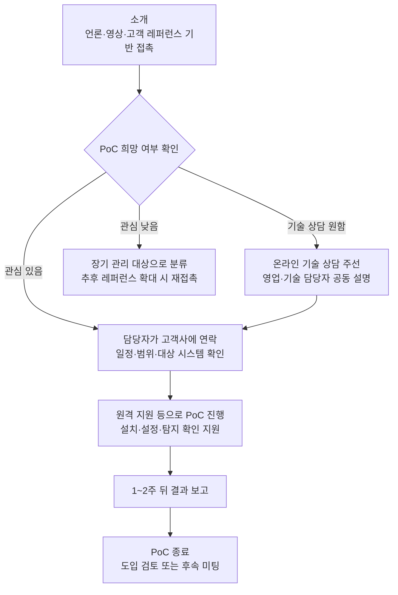

# PLURA-XDR Sales Kit – 표준 절차형

**기술을 몰라도 바로 사용할 수 있는 영업 사원용 기본본**

**문서 성격:** 이 문서는 보안 기술 설명보다 **짧은 소개, 고객 선별, PoC 연결**을 우선하는 영업 사원용 기본 Sales Kit입니다.

**적합한 영업 사원:**

- 짧고 정확한 설명을 선호하는 영업 사원
- 고객을 많이 접촉하고 빠르게 선별해야 하는 영업 사원
- 기술 설명은 담당자에게 연결하고, 본인은 미팅과 PoC를 만드는 역할에 집중하는 영업 사원

**핵심 원칙:** 많이 설명하지 말고, 많이 만나고, 관심 있는 고객만 다음 단계로 넘깁니다.

---

## 1. 인트로 소개

**이제 해킹 당하면 기업이 망하는 시대입니다.**

개인정보 유출과 해킹 사고는 더 이상 단순한 IT 장애가 아닙니다.  
언론 보도, 고객 이탈, 법적 책임, 과징금, 기업 신뢰 하락이 동시에 발생하는 **경영 리스크**입니다.

최근 한국경제 보도에 따르면, 대규모 개인정보 유출 사고에 대해 기업 전체 매출액의 최대 10%까지 과징금을 부과하는 법 개정이 추진되고 있습니다.  
즉, 보안 사고는 한 번의 장애가 아니라 기업의 매출과 생존을 위협하는 문제가 되고 있습니다.

- 참고 기사: https://www.hankyung.com/article/202512092396i

영업 사원은 아래 문장으로 대화를 시작합니다.

> “이제 해킹 당하면 기업이 망하는 시대입니다. PLURA-XDR은 기업의 웹·서버·PC 해킹 시도를 실시간으로 보고, 탐지하고, 차단하는 통합 사이버보안 플랫폼입니다.”

조금 더 짧게 말할 때는 아래 문장을 사용합니다.

> “PLURA-XDR은 보이지 않던 공격까지 보이게 하고, 빠르게 대응하는 통합 사이버보안 플랫폼입니다.”

---

## 2. 고객이 기술 상담을 원하면

고객이 제품 구조, 설치 방식, 탐지 방식, PoC 진행 방법 등 기술 상담을 원하면 영업 사원이 깊게 설명하려고 하지 않습니다.

바로 온라인 상담을 주선하고, 영업 담당자와 기술 담당자가 함께 빠르게 설명을 진행합니다.

영업 사원은 아래 문장으로 연결합니다.

> “기술적인 부분은 담당자가 온라인으로 바로 설명드릴 수 있도록 연결하겠습니다. 가능하신 시간을 알려주시면 빠르게 일정을 잡겠습니다.”

진행 원칙은 단순합니다.

- 온라인 상담 주선
- 빠른 영업 / 기술 설명 진행
- 고객의 PoC 가능 여부 확인
- 기술 문의는 담당자에게 즉시 연결

---

## 3. 기술 문의 담당자 연락처

기술 상담, PoC 범위 확인, 원격 지원 일정 조율이 필요하면 아래 담당자에게 연결합니다.

- 박은수 팀장 / 010-9193-6031 / 070-8802-0880
- 박준모 책임 / 010-8782-2621 / 070-8802-0880

영업 사원은 고객에게 직접 기술을 설명하기보다, **관심 고객을 기술 상담으로 빠르게 넘기는 것**에 집중합니다.

---

## 4. 한 문장 소개

**PLURA-XDR은 기업의 해킹 시도를 실시간으로 탐지하고 차단하는 통합 사이버보안 플랫폼입니다.**

영업 사원은 복잡한 기술 설명보다 아래 한 문장으로 소개합니다.

> “저희는 보안 장비 하나를 파는 것이 아니라, 기업의 웹·서버·PC 해킹 시도를 실시간으로 보고 막는 통합 보안 플랫폼을 제공합니다.”

고객이 더 자세히 묻는 경우에는 아래처럼 답합니다.

> “상세 기술 설명은 담당자가 온라인으로 바로 설명드리겠습니다. 저는 귀사에 필요한 대응 체계인지 빠르게 확인해 드리고자 합니다.”

---

## 5. 첫 번째 영업 메시지

고객에게 처음 말할 핵심 문장은 단순해야 합니다.

> “PLURA-XDR은 부산대학교와 주택도시보증공사에서 사용 중인 통합 사이버보안 플랫폼입니다.”

이 문장에 반응이 없거나 관심이 없다면, 너무 오래 설득하지 않습니다.

> “보안 이슈가 생기거나 내부 검토가 필요하실 때 다시 연락드리겠습니다.”

그리고 다음 고객으로 넘어갑니다.

영업의 핵심은 **모든 고객을 설득하는 것**이 아니라, **관심 있는 고객을 빠르게 찾는 것**입니다.

---

## 6. 레퍼런스 기반 영업 접근

PLURA-XDR은 부산 지역에서 **부산대학교와 주택도시보증공사**가 사용하고 있습니다.

부산에는 아직 더 많은 공공기관, 대학, 병원, 금융기관, 제조기업, IT기업이 있습니다.  
따라서 부산대학교와 주택도시보증공사의 사용 사례를 기반으로, 부산 지역 내 유사 고객을 넓게 접촉하는 방식으로 영업을 진행합니다.

고객에게는 다음과 같이 간단히 설명합니다.

> “PLURA-XDR은 부산 지역에서 부산대학교와 주택도시보증공사에서 사용 중인 통합 사이버보안 플랫폼입니다. 부산 지역의 다른 공공기관, 대학, 기업에서도 충분히 검토할 만한 보안 체계라고 판단하여 소개드립니다.”

전국 단위의 최신 사용 기업 정보는 PLURA 공식 고객 페이지에서 확인하도록 안내합니다.

- 최신 고객 정보: https://www.plura.io/ko/customer.html

첫 페이지 또는 제목 문구로는 아래 표현을 사용합니다.

> **“부산대학교와 주택도시보증공사가 선택한 통합 사이버보안 플랫폼, PLURA-XDR”**

향후 부산 지역 내 도입 고객이 추가되면, 이전에 미온적이었던 고객에게 다시 연락합니다.

> “이전에 소개드렸던 PLURA-XDR이 부산대학교와 주택도시보증공사에 이어, 다른 기관과 기업에서도 검토 또는 도입이 확대되고 있습니다. 귀사도 보안 대응 체계 점검 차원에서 다시 한번 검토해 보시면 좋겠습니다.”

---

## 7. 우리가 찾는 고객

PLURA-XDR 영업은 모든 고객을 설득하는 방식이 아닙니다.  
**관심 있는 고객을 빠르게 찾는 방식**입니다.

우선 접촉할 고객은 다음과 같습니다.

- 웹사이트, 회원 서비스, 쇼핑몰, 포털, SaaS를 운영하는 기업
- 개인정보를 보유한 기업
- 해킹 사고가 발생하면 언론 보도·평판 리스크가 큰 기업
- 기존 WAF, EDR, SIEM을 사용하지만 실제 공격 대응에 불안이 있는 기업
- 보안 인력이 부족해 관제와 대응을 함께 원하는 기업
- 공공기관, 대학, 금융, 병원, 대기업 계열사, 중견기업

---

## 8. 고객에게 던질 질문

기술을 몰라도 아래 질문만 하면 됩니다.

> “최근 웹 해킹이나 개인정보 유출 사고가 계속 발생하고 있는데, 내부적으로 대응 체계를 점검하고 계신가요?”

> “현재 사용 중인 보안 장비로 실제 공격이 성공했는지, 실패했는지까지 확인 가능하신가요?”

> “웹 공격 이후 서버나 PC에서 어떤 행위가 발생했는지 추적 가능하신가요?”

> “보안 사고 발생 시, 개인정보보호위원회나 내부 감사에 제출할 수 있는 탐지·차단·포렌식 근거가 준비되어 있으신가요?”

고객이 이 질문에 관심을 보이면 미팅 대상입니다.  
관심이 없으면 장기 관리 대상으로 넘깁니다.

---

## 9. 고객에게 설명할 문제

요즘 공격은 세 가지가 문제입니다.

**첫째, 공격이 너무 빠릅니다.**  
짧은 시간에 대량으로 취약점을 찾고 침투를 시도합니다.

**둘째, 기존 보안 장비를 우회합니다.**  
정상 요청처럼 보이거나, 기존 탐지 규칙을 피해서 들어옵니다.

**셋째, 반복 공격이 쉽습니다.**  
공격자는 실패해도 비용이 거의 들지 않기 때문에 계속 다시 시도합니다.

그래서 기업은 단순히 장비를 많이 두는 것보다, **공격을 실제로 보고, 연결해서 분석하고, 즉시 차단하는 체계**가 필요합니다.

---

## 10. PLURA-XDR이 제공하는 것

PLURA-XDR은 여러 보안 기능을 하나의 플랫폼으로 제공합니다.

- **WAF:** 웹 공격 탐지 및 차단
- **EDR:** 서버와 PC의 이상 행위 탐지
- **SIEM:** 보안 로그 통합 분석
- **Forensic:** 사고 흔적 분석
- **SOAR:** 자동 대응
- **VAS:** 취약 설정 및 위험 요소 점검
- **SOC:** 보안 관제 서비스 연계
- **sysMon:** 서버와 PC의 리소스 사용량 모니터링 및 장애·공격 징후 알림

- XDR 소개: https://www.plura.io/ko/platform_xdr.html

영업 표현은 이렇게 정리합니다.

> “여러 보안 제품을 따로따로 운영하지 않아도, PLURA-XDR 하나로 웹·서버·PC 공격을 통합적으로 보고 대응할 수 있습니다.”

sysMon은 기술적으로 깊게 설명할 필요가 없습니다. 아래처럼 말하면 됩니다.

> “PLURA-XDR은 보안 공격뿐 아니라 서버와 PC의 CPU, 메모리, 디스크, 네트워크 사용량도 함께 모니터링합니다. 리소스 사용량이 비정상적으로 증가하면 장애나 공격 징후로 보고 알림을 받을 수 있습니다.”

- sysMon 소개: https://www.plura.io/ko/platform_sysmon.html

---

## 11. 경쟁 제품과 다르게 말할 포인트

표준 절차형 영업에서는 비유보다 **짧은 차이점**을 말합니다.

> “기존 보안 장비는 공격을 일부만 봅니다. PLURA-XDR은 웹 요청, 서버 행위, PC 행위, 리소스 이상, 포렌식 증거까지 연결해서 봅니다.”

> “해킹 사고가 났을 때 중요한 것은 ‘정말 공격이 성공했는지’, ‘어디까지 침투했는지’, ‘무엇을 차단했는지’를 확인하는 것입니다.”

> “PLURA-XDR은 탐지, 차단, 분석, 보고까지 하나의 플랫폼에서 제공합니다.”

고객이 경쟁 제품명을 언급하면 아래처럼 답합니다.

> “각 제품의 장단점 비교는 기술 담당자가 정확히 설명드리겠습니다. 영업 관점에서 중요한 차이는 PLURA-XDR이 여러 보안 기능을 하나의 공격 흐름으로 연결한다는 점입니다.”

---

## 12. 영업 방식: 투망식 접근

이번 Sales Kit의 핵심은 **넓게 접촉하고, 관심 고객만 선별하는 것**입니다.

먼저 아래 자료를 전달해 신뢰를 만듭니다.

- 부산일보 기고
- 보도자료
- YTN 최강기업 영상
- MTN 인터뷰 영상
- PLURA-XDR 1페이지 소개자료
- 주요 고객사 레퍼런스
- PLURA 공식 고객 페이지

목적은 기술 설명이 아니라 **신뢰 형성**입니다.

짧은 연락 문구는 아래와 같이 사용합니다.

> “PLURA-XDR은 부산대학교와 주택도시보증공사에서 사용 중인 통합 사이버보안 플랫폼입니다. 최근 AI 기반 웹 공격과 개인정보 유출 사고 대응을 위해 많은 기관과 기업에서 검토하고 있어 간단히 소개드리고자 연락드렸습니다.”

고객이 관심을 보이면 30분 미팅 또는 온라인 기술 상담을 잡습니다.  
관심이 없으면 무리하게 설득하지 않습니다.

도입 고객이 늘어나면 과거 미온 고객에게 다시 연락합니다.

> “이전에 소개드렸던 PLURA-XDR이 최근 A기관, B기업, C고객사에서도 도입 검토 또는 사용을 시작했습니다. 귀사도 보안 대응 체계 점검 차원에서 다시 한번 검토해 보시면 좋겠습니다.”

---

## 13. 영업 진행 흐름

영업 사원은 위 흐름만 기억하면 됩니다.

> “소개 → PoC 희망 확인 → 담당자 연결 → 원격 지원 진행 → 1~2주 뒤 결과 보고”

---

## 14. 영업 사원이 하지 말아야 할 것

영업 사원은 보안 전문가처럼 설명하려고 하면 안 됩니다.

하지 말아야 할 말:

- “AI가 모든 공격을 완벽하게 막습니다.”
- “기존 보안 제품은 전부 필요 없습니다.”
- “기술적으로는 제가 자세히 설명드리겠습니다.”
- “무조건 도입하셔야 합니다.”

대신 이렇게 말합니다.

> “기술적인 부분은 보안 전문가가 별도 설명드리겠습니다. 저는 귀사에 필요한 대응 체계인지 빠르게 확인해 드리고자 합니다.”

---

## 15. 영업 사원용 30초 스크립트

> “안녕하세요. 큐비트시큐리티의 PLURA-XDR을 소개드리고자 연락드렸습니다. 이제 해킹 당하면 기업이 망하는 시대입니다. PLURA-XDR은 부산대학교와 주택도시보증공사에서 사용 중인 통합 사이버보안 플랫폼으로, 웹 공격, 서버 침해, PC 이상 행위를 하나의 플랫폼에서 보고 탐지·차단·분석까지 지원합니다. 귀사도 보안 대응 체계 점검 차원에서 간단한 소개나 PoC를 검토해 보시면 좋겠습니다.”

고객이 기술 질문을 하면 바로 이어서 말합니다.

> “기술적인 부분은 담당자가 온라인으로 바로 설명드리겠습니다. 가능하신 시간을 알려주시면 빠르게 일정을 잡겠습니다.”

---

## 16. 최종 목표

이 Sales Kit의 목표는 계약을 바로 따내는 것이 아닙니다.

목표는 세 가지입니다.

- PLURA-XDR을 들어본 고객을 늘린다.
- 관심 있는 고객만 빠르게 선별한다.
- 레퍼런스가 쌓이면 미온 고객에게 다시 접근한다.

핵심 원칙은 단순합니다.

> “많이 설명하지 말고, 많이 만나고, 관심 있는 고객만 다음 단계로 넘긴다.”
