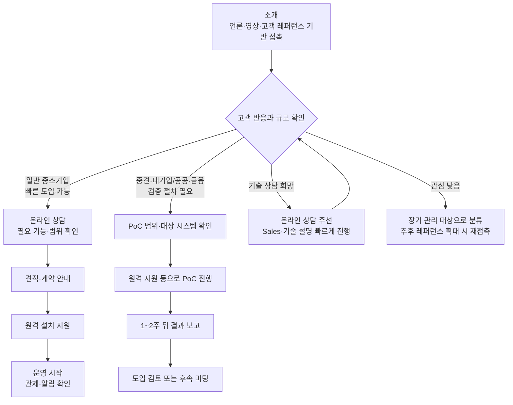

# PLURA-XDR Sales Kit – 비유·사례 설득형

**기술을 몰라도 고객이 이해하도록 설명하는 Sales/Marketing 접근법**

**문서 성격:** 이 문서는 기술 설명보다 **비유, 질문, 사례, 짧은 스크립트**로 고객의 관심을 끌어내는 Sales/Marketing 공용 Sales Kit입니다.

**적합한 활용자:**

- 고객과 대화를 잘 풀어가는 Sales/Marketing 담당자
- 어려운 기술을 쉬운 비유로 설명하는 데 강한 고객 접점 담당자
- “왜 지금 검토해야 하는가”를 고객에게 직관적으로 납득시키는 파트너·마케터·Sales 담당자

**활용 대상:** Sales, 마케팅, 파트너 영업, 고객 접점 담당자 모두 사용할 수 있습니다.

**핵심 원칙:** 고객에게 기술을 설명하려고 하지 말고, 고객이 이미 아는 생활 비유와 사고 사례로 문제를 이해시키고 관심 고객만 다음 단계로 넘깁니다.  
단, **PoC는 중견·대기업 중심으로 진행**합니다. 일반적인 중소기업은 별도 PoC 없이 상담, 견적, 계약, 원격 설치로 빠르게 진행하는 것이 목표입니다.

---

## 1. 인트로 소개: 이제 해킹 당하면 기업이 망하는 시대입니다

**이제 해킹 당하면 기업이 망하는 시대입니다.**

개인정보 유출과 해킹 사고는 더 이상 단순한 IT 장애가 아닙니다.  
언론 보도, 고객 이탈, 법적 책임, 과징금, 기업 신뢰 하락이 동시에 발생하는 **경영 리스크**입니다.

2026년 3월 10일 공포되어 **2026년 9월 11일**부터 시행되는 개정 「개인정보 보호법」에 따라, 반복적이거나 중대한 개인정보 침해·법 위반 행위에는 **전체 매출액의 최대 10%까지 과징금**이 부과될 수 있습니다.

실제 제재 사례도 이미 크게 나타나고 있습니다.

- **쿠팡:** 개인정보보호위원회는 2026년 6월 10일 제11회 전체회의를 열고, 쿠팡의 안전조치 의무 위반과 법적 근거 없는 개인정보 수집 등에 대해 **과징금 총 6,246억 8,100만 원**과 **과태료 1,680만 원**을 부과하기로 결정했습니다.
- **SK텔레콤:** 개인정보보호위원회는 SK텔레콤 개인정보 유출 사고에 대해 **과징금 1,347억 9,100만 원**과 **과태료 960만 원**을 부과했습니다.

- 개정 개인정보 보호법·10% 과징금 참고: https://www.hankyung.com/article/202512092396i
- 쿠팡 과징금 보도: https://www.etnews.com/20260611000247
- SK텔레콤 개인정보위 보도자료: https://www.korea.kr/briefing/pressReleaseView.do?newsId=156733808

대화는 아래 문장으로 시작합니다.

> “이제 해킹 당하면 기업이 망하는 시대입니다. 2026년 9월 11일부터는 반복적이거나 중대한 개인정보 침해에 대해 전체 매출액의 최대 10%까지 과징금이 부과될 수 있습니다. 쿠팡과 SK텔레콤 사례처럼 보안 사고는 IT 부서만의 문제가 아니라, 매출·신뢰·평판이 한 번에 흔들리는 경영 리스크가 됐습니다.”

이후 PLURA-XDR을 연결합니다.

> “PLURA-XDR은 기업의 웹·서버·PC 해킹 시도를 실시간으로 보고, 탐지하고, 차단하는 통합 사이버보안 플랫폼입니다.”

## 2. 먼저 확인할 것: PoC가 필요한 고객인가

비유·사례형 영업에서도 모든 고객에게 PoC를 제안하지 않습니다.

### 중소기업 고객

중소기업은 별도 PoC 없이 진행하는 것이 목표입니다.

고객에게는 아래처럼 말합니다.

> “중소기업은 PoC를 오래 진행하기보다, 온라인 상담으로 필요한 범위를 확인하고 빠르게 시작해 실제 보호를 받는 것이 더 중요합니다.”

진행은 아래처럼 단순하게 가져갑니다.

- 온라인 상담
- 필요 기능과 대상 확인
- 견적·계약 안내
- 원격 설치 지원
- 운영 시작

### 중견·대기업 고객

중견·대기업은 내부 검증과 승인 절차가 있는 경우가 많으므로 PoC로 연결합니다.

고객에게는 아래처럼 말합니다.

> “중견·대기업은 내부 검증 절차가 필요하실 수 있으므로, 담당자가 PoC 범위와 일정을 확인한 뒤 1~2주 검증과 결과 보고 방식으로 진행할 수 있습니다.”

---

## 3. 고객이 기술 상담을 원하면

고객이 기술 상담을 원하면 고객 접점 담당자가 길게 설명하려고 하지 않습니다.  
이 문서는 **관심을 만드는 문서**이고, 기술 설명은 담당자가 맡습니다.

고객에게는 아래처럼 말합니다.

> “좋은 질문입니다. 이 부분은 기술 담당자가 온라인으로 바로 설명드리는 것이 정확합니다. 가능하신 시간을 알려주시면 Sales 담당자와 기술 담당자가 함께 빠르게 설명드리겠습니다.”

진행은 단순합니다.

- 고객 관심 확인
- 온라인 상담 주선
- Sales / 기술 담당자 공동 설명
- 중소기업은 바로 도입 가능 여부 확인
- 중견·대기업은 PoC 필요 여부 확인
- 필요 시 원격 지원으로 진행

---

## 4. 기술 문의 담당자 연락처

기술 상담, 도입 범위 확인, 원격 설치 지원, PoC 범위 확인이 필요하면 아래 담당자에게 연결합니다.

- 박은수 팀장 / 010-9193-6031 / 070-8802-0880
- 박준모 책임 / 010-8782-2621 / 070-8802-0880

고객 접점 담당자의 역할은 기술을 모두 답변하는 것이 아니라, **관심 있는 고객을 상담, 도입 또는 PoC 절차로 연결하는 것**입니다.

---

## 5. 한 문장 소개

기술 용어 없이 아래 한 문장으로 소개합니다.

> “저희는 보안 장비 하나를 파는 것이 아니라, 기업의 웹·서버·PC에서 발생하는 해킹 시도를 한눈에 보고 막는 통합 보안 플랫폼을 제공합니다.”

조금 더 짧게 말할 때는 아래 문장을 사용합니다.

> “PLURA-XDR은 보이지 않던 공격까지 보이게 하고, 빠르게 대응하는 통합 사이버보안 플랫폼입니다.”

고객이 반응하면 다음 질문으로 넘어갑니다.

> “현재 사용 중인 보안 장비로 실제 공격이 성공했는지, 실패했는지까지 확인 가능하신가요?”

---

## 6. 레퍼런스 기반 영업 접근

PLURA-XDR은 부산 지역에서 **부산대학교와 주택도시보증공사**가 사용하고 있습니다.

부산에는 아직 더 많은 공공기관, 대학, 병원, 금융기관, 제조기업, IT기업이 있습니다.  
따라서 부산대학교와 주택도시보증공사의 사용 사례를 기반으로, 부산 지역 내 유사 고객을 넓게 접촉하는 방식으로 영업을 진행합니다.

고객에게는 아래처럼 말합니다.

> “PLURA-XDR은 부산 지역에서 부산대학교와 주택도시보증공사에서 사용 중인 통합 사이버보안 플랫폼입니다. 부산 지역의 다른 공공기관, 대학, 기업에서도 충분히 검토할 만한 보안 체계라고 판단해 소개드립니다.”

전국 단위의 최신 사용 기업 정보는 PLURA 공식 고객 페이지에서 확인하도록 안내합니다.

- 최신 고객 정보: https://www.plura.io/ko/customer.html

제목이나 첫 장에는 아래 문구를 사용합니다.

> **“부산대학교와 주택도시보증공사가 선택한 통합 사이버보안 플랫폼, PLURA-XDR”**

도입 고객이 더 늘어나면 과거 미온 고객에게 다시 연락합니다.

> “이전에 소개드렸던 PLURA-XDR이 부산대학교와 주택도시보증공사에 이어, 다른 기관과 기업에서도 검토 또는 도입이 확대되고 있습니다. 귀사도 보안 대응 체계 점검 차원에서 다시 한번 검토해 보시면 좋겠습니다.”

---

## 7. 고객에게 문제를 느끼게 하는 질문

비유·사례형 영업에서는 먼저 고객이 스스로 문제를 느끼게 해야 합니다.

아래 질문을 사용합니다.

> “왜 티빙이, 왜 CU편의점택배가 해킹 사고를 겪었겠습니까?”

여기서 중요한 포인트는 특정 회사를 비난하는 것이 아닙니다.  
고객에게 아래 메시지를 전달하는 것이 목적입니다.

> “보안 장비가 하나도 없어서 사고가 나는 것이 아닙니다. 웹, 계정, 서버, PC, 클라우드, 로그가 서로 따로 움직이면 공격 흐름 전체를 놓치기 쉽기 때문입니다.”

고객이 고개를 끄덕이면 다음 문장으로 이어갑니다.

> “요즘 해킹은 한 지점만 막는다고 끝나지 않습니다. 웹에서 시작해서 계정, 서버, PC, 내부 시스템으로 이어지기 때문에 전체 흐름을 봐야 합니다.”

---

## 8. 공격을 쉽게 설명하는 세 가지 말

요즘 공격은 세 가지가 문제입니다.

**첫째, 공격이 너무 빠릅니다.**  
짧은 시간에 대량으로 취약점을 찾고 침투를 시도합니다.

**둘째, 기존 보안 장비를 우회합니다.**  
정상 요청처럼 보이거나, 기존 탐지 규칙을 피해서 들어옵니다.

**셋째, 반복 공격이 쉽습니다.**  
공격자는 실패해도 비용이 거의 들지 않기 때문에 계속 다시 시도합니다.

따라서 고객에게는 이렇게 말합니다.

> “보안 제품을 많이 두는 것보다 중요한 것은 공격을 실제로 보고, 서로 연결해서 분석하고, 바로 차단하는 체계입니다.”

---

## 9. 자동차 비유로 설명하기

고객이 기술 용어를 어려워하면 자동차 비유를 사용합니다.

> “자동차 구매하실 때 차체, 대시보드, 시트, 엔진, 브레이크를 따로따로 구매해서 직접 조립하시겠습니까?”

그리고 바로 사이버보안으로 연결합니다.

> “보안도 마찬가지입니다. WAF, EDR, SIEM, Forensic을 따로따로 운영하면 각각은 동작해도 전체 공격 흐름을 놓칠 수 있습니다.”

고객이 이해하면 아래 문장으로 정리합니다.

> “PLURA-XDR은 이 기능들을 하나의 플랫폼으로 연결해 실제 공격이 어디서 시작됐고, 어디까지 들어왔고, 무엇을 차단했는지 보여줍니다.”

중소기업 고객에게는 아래처럼 바로 도입 흐름으로 연결합니다.

> “그래서 중소기업은 복잡한 PoC보다, 검증된 플랫폼을 빠르게 도입해 바로 보호받는 방향이 더 현실적입니다.”

---

## 10. PLURA-XDR이 제공하는 것

PLURA-XDR은 여러 보안 기능을 하나의 플랫폼으로 제공합니다.

- **XDR:** https://www.plura.io/ko/platform_xdr.html

- **WAF:** 웹 공격 탐지 및 차단
- **EDR:** 서버와 PC의 이상 행위 탐지
- **SIEM:** 보안 로그 통합 분석
- **Forensic:** 사고 흔적 분석
- **SOAR:** 자동 대응
- **VAS:** 취약 설정 및 위험 요소 점검
- **sysMon:** 서버와 PC의 리소스 사용량 모니터링 및 장애·공격 징후 알림

※ **원격보안관제**(SOC)는 위 기능 목록 안의 한 줄로 설명하지 않고, 아래 별도 항목에서 서비스 차별점으로 설명합니다.

Sales/Marketing 표현은 이렇게 정리합니다.

> “여러 보안 제품을 따로따로 운영하지 않아도, PLURA-XDR 하나로 웹·서버·PC 공격을 통합적으로 보고 대응할 수 있습니다.”

sysMon은 아래처럼 쉽게 말합니다.

> “PLURA-XDR은 보안 공격뿐 아니라 서버와 PC의 CPU, 메모리, 디스크, 네트워크 사용량도 함께 봅니다. 리소스가 갑자기 튀면 장애일 수도 있고 공격 징후일 수도 있기 때문에 함께 보는 것이 중요합니다.”

- sysMon 소개: https://www.plura.io/ko/platform_sysmon.html

---

## 11. 원격보안관제: 서울의 최고 수준 사이버보안 요원이 보호합니다

PLURA-XDR은 단순히 제품만 제공하는 것이 아닙니다.  
서울의 최고 수준 사이버보안 요원이 고객 시스템에서 발생하는 웹 공격, 서버 침해, PC 이상 행위, 리소스 이상 알림을 함께 살펴보고 고객 보호를 지원합니다.

고객에게는 아래처럼 설명합니다.

> “PLURA-XDR은 제품만 설치해 드리는 방식이 아닙니다. 서울의 최고 수준 사이버보안 요원이 고객 시스템을 함께 지켜보며, 공격 징후를 확인하고 대응을 지원합니다. 일반적인 보안 제품 도입과는 차원이 다른 원격보안관제 서비스를 제공하는 것이 핵심입니다.”

중소기업 고객에게는 특히 아래 메시지가 중요합니다.

> “보안 인력을 별도로 크게 늘리기 어려운 중소기업도 PLURA-XDR과 원격보안관제를 함께 이용하면, 서울의 전문 사이버보안 요원이 고객 시스템을 함께 보호하는 효과를 얻을 수 있습니다.”

중견·대기업 고객에게는 아래처럼 말합니다.

> “내부 보안 조직이 있더라도 외부 전문 관제 인력이 함께 보면, 웹·서버·PC 공격 흐름을 더 빠르게 확인하고 대응 근거를 남길 수 있습니다.”

정리 문구는 아래와 같습니다.

> “PLURA-XDR은 제품 + 플랫폼 + 원격보안관제가 결합된 서비스입니다. 고객은 복잡한 보안 운영 부담을 줄이고, 서울의 전문 보안 인력과 함께 차원이 다른 보호 체계를 갖출 수 있습니다.”

---

## 12. 경쟁 제품과 다르게 말할 포인트

기술적으로 깊게 설명하지 않아도 됩니다.  
아래 비유 하나만 기억하면 됩니다.

> “자동차 구매하실 때 차체, 대시보드, 시트, 엔진을 따로따로 구매하시겠습니까?”

사이버보안도 마찬가지입니다.

- WAF만 있으면 웹 앞단만 봅니다.
- EDR만 있으면 서버와 PC 행위만 봅니다.
- SIEM만 있으면 로그를 모으지만, 공격 흐름을 놓칠 수 있습니다.
- Forensic만 있으면 사고 이후 분석은 가능하지만, 실시간 대응은 늦을 수 있습니다.

PLURA-XDR은 이 기능들을 하나의 흐름으로 연결합니다.

> “기존 보안 장비는 공격을 일부만 봅니다. PLURA-XDR은 웹 요청, 서버 행위, PC 행위, 리소스 이상, 포렌식 증거까지 연결해서 봅니다.”

조금 더 강하게 말할 때는 아래 문장을 사용합니다.

> “보안 제품을 많이 샀는데도 사고가 나는 이유는, 제품이 부족해서가 아니라 서로 연결되지 않았기 때문입니다. PLURA-XDR은 공격의 흐름을 하나로 연결해서 보는 플랫폼입니다.”

---

## 13. 우리가 찾는 고객과 질문

PLURA-XDR 영업은 모든 고객을 설득하는 방식이 아닙니다.  
**관심 있는 고객을 빠르게 찾고, 고객 규모에 따라 다음 단계를 다르게 안내하는 방식**입니다.

### 빠른 도입 대상 고객

일반 중소기업은 별도 PoC 없이 진행하는 것이 목표입니다.

- 웹사이트, 쇼핑몰, 회원 서비스를 운영하는 중소기업
- 개인정보를 보유한 중소기업
- 보안 인력이 부족해 제품과 원격보안관제를 함께 원하는 기업
- 보안 사고가 나면 매출과 평판에 즉시 타격을 받는 기업
- 원격 설치와 빠른 운영 시작을 원하는 기업

### PoC 검증 대상 고객

아래 고객은 PoC로 연결할 가능성이 높습니다.

- 중견기업
- 대기업
- 공공기관
- 금융기관
- 대기업 계열사
- 내부 검증 절차가 있는 기업
- 여러 부서의 승인이 필요한 기업

기술을 몰라도 아래 질문만 하면 됩니다.

> “현재 사용 중인 보안 장비로 실제 공격이 성공했는지, 실패했는지까지 확인 가능하신가요?”

> “웹 공격 이후 서버나 PC에서 어떤 행위가 발생했는지 추적 가능하신가요?”

> “보안 사고 발생 시, 내부 감사나 대외 보고에 제출할 수 있는 탐지·차단·포렌식 근거가 준비되어 있으신가요?”

고객 규모를 확인할 때는 아래처럼 묻습니다.

> “귀사는 별도 PoC가 필요한 내부 검증 절차가 있으신가요, 아니면 온라인 상담 후 바로 도입 검토가 가능하신가요?”

---

## 14. 영업 방식: 투망식 접근

이번 Sales Kit의 핵심은 **넓게 접촉하고, 관심 고객만 선별한 뒤 고객 규모에 따라 다르게 진행하는 것**입니다.

먼저 아래 자료를 전달해 신뢰를 만듭니다.

- 부산일보 기고
- 보도자료
- YTN 최강기업 영상
- MTN 인터뷰 영상
- PLURA-XDR 1페이지 소개자료
- 주요 고객사 레퍼런스
- PLURA 공식 고객 페이지
- 티빙·CU편의점택배 등 최근 개인정보 유출 사고 관련 참고 자료

목적은 기술 설명이 아니라 **신뢰 형성**입니다.

짧은 연락 문구는 아래와 같이 사용합니다.

> “PLURA-XDR은 부산대학교와 주택도시보증공사에서 사용 중인 통합 사이버보안 플랫폼입니다. 최근 개인정보 유출과 웹 공격 대응 때문에 많은 기관과 기업에서 보안 체계를 다시 점검하고 있어 간단히 소개드리고자 연락드렸습니다.”

고객이 관심을 보이면 30분 미팅 또는 온라인 기술 상담을 잡습니다.  
관심이 없으면 무리하게 설득하지 않습니다.

고객 규모에 따라 다음 단계를 나눕니다.

**일반 중소기업**

> “중소기업은 PoC 없이 온라인 상담 후 필요한 범위를 확인하고, 견적·계약·원격 설치로 빠르게 진행하는 것을 권장드립니다.”

**중견·대기업**

> “중견·대기업은 필요 시 PoC 범위와 일정을 협의해 1~2주 검증 후 결과 보고 방식으로 진행합니다.”

도입 고객이 늘어나면 과거 미온 고객에게 다시 연락합니다.

> “이전에 소개드렸던 PLURA-XDR이 최근 A기관, B기업, C고객사에서도 도입 검토 또는 사용을 시작했습니다. 귀사도 보안 대응 체계 점검 차원에서 다시 한번 검토해 보시면 좋겠습니다.”

---

## 15. 영업 진행 흐름

Sales/Marketing 담당자는 위 흐름만 기억하면 됩니다.

> “중소기업은 PoC 없이 빠른 도입, 중견·대기업은 필요 시 PoC 검증”

---

## 16. 상황별 스크립트

**30초 소개 스크립트**

> “안녕하세요. 큐비트시큐리티의 PLURA-XDR을 소개드리고자 연락드렸습니다. 이제 해킹 당하면 기업이 망하는 시대입니다. PLURA-XDR은 부산대학교와 주택도시보증공사에서 사용 중인 통합 사이버보안 플랫폼으로, 웹 공격, 서버 침해, PC 이상 행위를 하나의 플랫폼에서 보고 탐지·차단·분석·원격보안관제까지 지원합니다. 일반 중소기업은 별도 PoC 없이 온라인 상담 후 빠르게 도입할 수 있고, 중견·대기업은 필요 시 PoC 검증도 가능합니다.”

**자동차 비유 스크립트**

> “자동차 구매하실 때 차체, 대시보드, 시트, 엔진을 따로따로 구매하시지는 않으실 겁니다. 보안도 마찬가지입니다. WAF, EDR, SIEM, Forensic이 따로 있으면 각각은 동작해도 전체 공격 흐름을 놓칠 수 있습니다. PLURA-XDR은 이 기능들을 하나의 플랫폼으로 연결해 실제 공격을 보고 대응합니다.”

**중소기업 고객에게**

> “중소기업은 별도 PoC를 오래 진행하기보다, 온라인 상담으로 필요한 범위를 정하고 빠르게 도입해 실제 보호를 시작하는 것이 좋습니다.”

**중견·대기업 고객에게**

> “내부 검증 절차가 필요하시다면 PoC 범위와 대상 시스템을 먼저 정리하고, 1~2주 검증 후 결과 보고 방식으로 진행하겠습니다.”

**기술 상담을 원하는 고객에게**

> “기술적인 부분은 담당자가 온라인으로 바로 설명드리는 것이 정확합니다. 가능하신 시간을 알려주시면 빠르게 일정을 잡겠습니다.”

**관심이 낮은 고객에게**

> “알겠습니다. 지금 당장 검토 단계가 아니시라면, 보안 이슈가 생기거나 내부 점검이 필요하실 때 다시 연락드리겠습니다.”

**재접촉할 때**

> “이전에 소개드렸던 PLURA-XDR이 최근 다른 기관과 기업에서도 검토 또는 도입이 확대되고 있습니다. 귀사도 보안 대응 체계 점검 차원에서 다시 한번 검토해 보시면 좋겠습니다.”

---

## 17. Sales/Marketing 시 주의할 점

Sales/Marketing 담당자는 보안 전문가처럼 무리하게 설명하려고 하면 안 됩니다.

하지 말아야 할 말:

- “AI가 모든 공격을 완벽하게 막습니다.”
- “기존 보안 제품은 전부 필요 없습니다.”
- “기술적으로는 제가 자세히 설명드리겠습니다.”
- “무조건 도입하셔야 합니다.”
- “모든 고객은 PoC를 먼저 해야 합니다.”

대신 이렇게 말합니다.

> “기술적인 부분은 보안 전문가가 별도 설명드리겠습니다. 중소기업은 빠른 도입이 가능한지, 중견·대기업은 PoC 검증이 필요한지 먼저 확인해 드리겠습니다.”

---

## 18. 최종 목표

이 Sales Kit의 목표는 계약을 바로 따내는 것이 아닙니다.

목표는 네 가지입니다.

- PLURA-XDR을 들어본 고객을 늘린다.
- 관심 있는 고객만 빠르게 선별한다.
- 중소기업은 PoC 없이 온라인 상담과 빠른 도입으로 연결한다.
- 제품뿐 아니라 서울의 전문 인력이 함께 보호하는 원격보안관제 가치를 전달한다.
- 중견·대기업은 필요 시 PoC 검증으로 연결한다.

핵심 원칙은 단순합니다.

> “많이 설명하지 말고, 많이 만나고, 고객 규모에 맞게 다음 단계로 넘긴다.”

---

## 19. 서비스 이용 방법 안내

실제 서비스 가입과 이용 방법은 PLURA 공식 매뉴얼의 Quickstart 문서에 자세히 정리되어 있습니다.  
Sales/Marketing 단계에서는 고객에게 전체 절차를 길게 설명하기보다, 아래처럼 간단히 안내하고 공식 매뉴얼 링크를 함께 제공합니다.

고객에게는 아래처럼 설명합니다.

> “PLURA-XDR은 온라인 상담 후 필요한 범위를 확인하고, 공식 매뉴얼에 따라 가입·설치·이용을 진행할 수 있습니다. 실제 서비스 이용 절차는 PLURA Quickstart 문서에 정리되어 있어 고객 담당자도 쉽게 확인하실 수 있습니다.”

중소기업 고객에게는 아래 문장을 사용합니다.

> “중소기업은 복잡한 PoC 없이 온라인 상담 후 필요한 기능을 정하고, Quickstart 문서를 참고해 빠르게 가입·설치·운영을 시작할 수 있습니다.”

중견·대기업 고객에게는 아래 문장을 사용합니다.

> “중견·대기업은 내부 검토나 PoC 이후 실제 서비스 전환 시, Quickstart 문서를 기준으로 가입·설치·운영 절차를 확인하시면 됩니다.”

- 서비스 가입 및 이용 방법: https://docs.plura.io/ko/v6/quickstart

---

## 20. 월 구독료 가격표

> [PLURA-XDR 가격표](https://w.plura.io/index.html?doc=/ko/sales/pricing.md)

