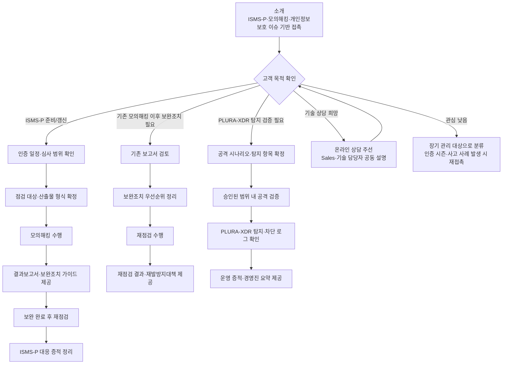

# Pentrace Sales Kit – ISMS-P·모의해킹·탐지검증 설득형

**모의해킹 보고서로 끝내지 않고, 보완조치·재점검·ISMS-P 증적까지 완성하는 Sales/Marketing 접근법**

**문서 성격:** 이 문서는 기술 설명보다 **비유, 질문, 사례, 짧은 스크립트**로 고객의 관심을 끌어내는 Sales/Marketing 공용 Sales Kit입니다.

**적합한 활용자:**

- 고객과 대화를 잘 풀어가는 Sales/Marketing 담당자
- ISMS-P, 개인정보보호, 모의해킹을 쉽게 설명해야 하는 파트너·마케터·Sales 담당자
- “왜 단순 모의해킹이 아니라 Pentrace인가”를 직관적으로 납득시켜야 하는 고객 접점 담당자
- PLURA-XDR 도입 고객에게 탐지 검증, 재점검, 증적 패키지를 추가 제안해야 하는 담당자

**활용 대상:** Sales, 마케팅, 파트너 영업, 고객 접점 담당자 모두 사용할 수 있습니다.

**핵심 원칙:** Pentrace는 **모의해킹 단품**으로 팔지 않습니다.  
Pentrace는 **모의해킹 + PLURA-XDR 탐지 검증 + ISMS-P 증적 + 보완조치 재점검**을 묶어 판매하는 공격 검증·증적 패키지입니다.

---

## 1. 인트로 소개: 이제 모의해킹 보고서만으로는 부족합니다

**이제 모의해킹 보고서만으로는 부족합니다.**

많은 기업이 모의해킹을 받습니다.  
하지만 실제 현장에서는 아래와 같은 문제가 반복됩니다.

- 보고서는 받았지만 어떤 취약점부터 조치해야 할지 모릅니다.
- 보완조치를 했지만 제대로 막혔는지 다시 확인하지 않습니다.
- ISMS-P 심사에 제출할 수 있는 증적이 부족합니다.
- 실제 공격이 들어왔을 때 보안 장비가 탐지·차단했는지 검증하지 않습니다.
- 경영진에게 설명할 수 있는 요약 자료가 없습니다.

고객에게는 아래 문장으로 시작합니다.

> “모의해킹은 보고서를 받는 것으로 끝나면 안 됩니다. 중요한 것은 취약점을 발견한 뒤, 실제로 보완하고, 다시 점검하고, ISMS-P 대응 증적까지 남기는 것입니다.”

이후 Pentrace를 연결합니다.

> “Pentrace는 모의해킹 결과를 보완조치, 재점검, PLURA-XDR 탐지 검증, ISMS-P 증적으로 연결하는 공격 검증 서비스입니다.”

---

## 2. Pentrace를 한 문장으로 설명하기

기술 용어 없이 아래 한 문장으로 소개합니다.

> “Pentrace는 모의해킹을 보고서로 끝내지 않고, 보완조치와 재점검, ISMS-P 증적까지 완성하는 공격 검증 서비스입니다.”

조금 더 짧게 말할 때는 아래 문장을 사용합니다.

> “Pentrace는 모의해킹 결과를 실제 보안 개선과 인증 대응 증적으로 바꿔주는 서비스입니다.”

PLURA-XDR과 함께 설명할 때는 아래처럼 말합니다.

> “Pentrace는 PLURA-XDR이 실제 공격을 탐지하고 차단하는지 검증하고, 그 결과를 고객의 보안 증적으로 남깁니다.”

고객이 반응하면 다음 질문으로 넘어갑니다.

> “최근 모의해킹 결과가 실제 보완조치와 재점검 증적까지 연결되어 있으신가요?”

---

## 3. 가장 중요한 포지셔닝: 모의해킹 단품이 아닙니다

Pentrace 영업에서 가장 중요한 포인트는 **가격이 저렴한 모의해킹 업체처럼 보이면 안 된다는 것**입니다.

일반 모의해킹은 보통 아래에서 끝납니다.

- 취약점 발견
- 위험도 분류
- 결과보고서 제출

Pentrace는 여기서 끝내지 않습니다.

- 취약점 발견
- 공격 재현 절차와 영향도 설명
- 위험도별 조치 우선순위 제시
- 보완조치 가이드 제공
- 보완 완료 후 재점검
- PLURA-XDR 탐지·차단 로그 검증
- ISMS-P 대응용 증적 정리
- 경영진 보고용 요약본 제공
- 재발방지대책 권고안 제공

고객에게는 아래처럼 말합니다.

> “Pentrace는 취약점 몇 개를 찾아주는 서비스가 아닙니다. 취약점을 발견한 뒤 고객이 실제로 조치하고, 다시 확인하고, 인증과 내부 보고에 사용할 수 있는 증적까지 남기는 서비스입니다.”

---

## 4. 먼저 확인할 것: 고객이 원하는 것은 점검인가, 증적인가

모든 고객에게 같은 방식으로 설명하지 않습니다.  
먼저 고객이 원하는 것이 단순 점검인지, 인증 대응인지, 실제 보안 개선인지 확인합니다.

### 빠른 도입 대상 고객

아래 고객은 별도 PoC보다 온라인 상담 후 범위를 정하고 빠르게 진행하는 것이 좋습니다.

- ISMS-P 인증을 처음 준비하는 기업
- ISMS-P 갱신 또는 사후관리를 준비하는 기업
- 개인정보를 보유한 중소·중견기업
- 웹사이트, 쇼핑몰, 회원 서비스, 예약 서비스, 결제 연계 서비스를 운영하는 기업
- 기존 모의해킹 보고서는 있지만 보완조치와 재점검 증적이 부족한 기업
- 보안 인력이 부족해 외부 전문가의 점검과 증적 정리가 필요한 기업

고객에게는 아래처럼 말합니다.

> “Pentrace는 오래 검토하는 서비스가 아니라, 인증 일정과 보완조치 일정에 맞춰 빠르게 범위를 정하고 실행하는 서비스입니다.”

진행은 아래처럼 단순하게 가져갑니다.

- 온라인 상담
- 점검 대상과 인증 일정 확인
- 견적·계약 안내
- 승인된 범위 내 모의해킹 수행
- 결과보고서와 보완조치 가이드 제공
- 보완 완료 후 재점검
- ISMS-P 대응 증적 정리

### 중견·대기업·공공·금융 고객

중견·대기업, 공공기관, 금융기관은 내부 승인 절차와 점검 범위 협의가 중요합니다.

고객에게는 아래처럼 말합니다.

> “중견·대기업은 시스템 영향도와 내부 승인 절차가 중요하므로, 먼저 점검 범위와 일정, 테스트 계정, 제외 대상, 보고 방식을 정리한 뒤 진행하는 것이 안전합니다.”

필요 시 아래 방식으로 연결합니다.

- 사전 범위 협의
- NDA 및 점검 승인 범위 확정
- 테스트 계정·도메인·API 목록 확인
- 운영 영향 최소화 계획 수립
- 1~2주 점검 및 결과 보고
- 보완조치 재점검 및 경영진 요약 보고

---

## 5. 고객이 기술 상담을 원하면

고객이 기술 상담을 원하면 고객 접점 담당자가 길게 설명하려고 하지 않습니다.  
이 문서는 **관심을 만드는 문서**이고, 기술 설명은 담당자가 맡습니다.

고객에게는 아래처럼 말합니다.

> “좋은 질문입니다. 점검 범위와 방식은 시스템 구조에 따라 달라지므로, 기술 담당자가 온라인으로 바로 설명드리는 것이 정확합니다. 가능하신 시간을 알려주시면 Sales 담당자와 기술 담당자가 함께 설명드리겠습니다.”

진행은 단순합니다.

- 고객 관심 확인
- 온라인 상담 주선
- Sales / 기술 담당자 공동 설명
- 점검 대상과 인증 일정 확인
- 견적·계약 또는 사전 범위 협의 진행
- 필요 시 PLURA-XDR 탐지 검증 범위까지 함께 확인

---

## 6. 기술 문의 담당자 연락처

기술 상담, 도입 범위 확인, 점검 대상 확인, PLURA-XDR 연계 검증, ISMS-P 증적 정리가 필요하면 아래 담당자에게 연결합니다.

- 담당자명 / 휴대폰 / 대표번호 / 이메일
- 담당자명 / 휴대폰 / 대표번호 / 이메일

고객 접점 담당자의 역할은 기술을 모두 답변하는 것이 아니라, **관심 있는 고객을 상담, 견적, 계약, 점검 또는 재점검 절차로 연결하는 것**입니다.

---

## 7. 고객에게 문제를 느끼게 하는 질문

비유·사례형 영업에서는 먼저 고객이 스스로 문제를 느끼게 해야 합니다.

아래 질문을 사용합니다.

> “지난번 모의해킹 보고서에서 발견된 취약점이 실제로 모두 조치됐는지 재점검하셨나요?”

> “ISMS-P 심사 때 제출할 수 있는 보완조치 증적과 재점검 결과가 준비되어 있으신가요?”

> “웹 공격이 실제로 들어왔을 때, WAF나 XDR에서 탐지·차단되는지 검증해 보셨나요?”

> “경영진에게 ‘어떤 위험이 있었고, 무엇을 조치했고, 현재 얼마나 안전해졌는지’를 한 장으로 설명할 수 있으신가요?”

> “보안 사고 발생 시, 개인정보보호위원회나 고객사에 재발방지대책을 설명할 수 있는 자료가 있으신가요?”

고객이 고개를 끄덕이면 다음 문장으로 이어갑니다.

> “그래서 Pentrace는 모의해킹 결과보고서만 제공하지 않고, 보완조치·재점검·증적·탐지 로그까지 함께 정리합니다.”

---

## 8. Pentrace가 해결하는 세 가지 문제

Pentrace는 아래 세 가지 문제를 해결합니다.

**첫째, 보고서로 끝나는 문제를 해결합니다.**  
취약점 목록만 전달하지 않고, 실제 조치 우선순위와 보완 가이드를 제공합니다.

**둘째, 조치 여부가 불분명한 문제를 해결합니다.**  
보완 완료 후 재점검을 통해 실제로 막혔는지 확인합니다.

**셋째, 인증 대응 증적이 부족한 문제를 해결합니다.**  
ISMS-P 대응에 활용할 수 있도록 결과보고서, 조치 내역, 재점검 결과, 탐지·차단 로그 증적을 정리합니다.

고객에게는 이렇게 말합니다.

> “모의해킹은 발견이 목적이 아니라 개선이 목적입니다. Pentrace는 발견, 조치, 재점검, 증적까지 이어지게 만듭니다.”

---

## 9. 건강검진 비유로 설명하기

고객이 기술 용어를 어려워하면 건강검진 비유를 사용합니다.

> “건강검진을 받고 이상 소견이 나왔는데, 치료도 하지 않고 재검사도 하지 않으면 의미가 없습니다.”

그리고 바로 보안으로 연결합니다.

> “모의해킹도 같습니다. 취약점 보고서를 받는 것만으로는 부족합니다. 조치하고, 다시 확인하고, 그 기록을 남겨야 실제 보안 수준이 올라갑니다.”

고객이 이해하면 아래 문장으로 정리합니다.

> “Pentrace는 보안 건강검진에서 끝나는 것이 아니라, 치료 계획, 재검사, 진료기록까지 남기는 방식입니다.”

---

## 10. 소방훈련 비유로 설명하기

PLURA-XDR 탐지 검증을 설명할 때는 소방훈련 비유가 좋습니다.

> “화재경보기와 스프링클러를 설치했다고 해서 끝난 것이 아닙니다. 실제 훈련을 해봐야 경보가 울리는지, 담당자가 알림을 받는지, 대응 절차가 작동하는지 알 수 있습니다.”

보안으로 연결합니다.

> “WAF, EDR, XDR도 마찬가지입니다. 장비가 설치되어 있어도 실제 공격 시나리오가 탐지·차단되는지 검증해야 합니다.”

정리 문구는 아래와 같습니다.

> “Pentrace는 공격을 재현하고, PLURA-XDR이 어떻게 탐지·차단했는지 확인해 고객의 보안 대응 증적으로 남깁니다.”

---

## 11. 일반 모의해킹과 다르게 말할 포인트

기술적으로 깊게 설명하지 않아도 됩니다.  
아래 차이만 기억하면 됩니다.

| 구분 | 일반 모의해킹 | Pentrace |
|---|---|---|
| 판매 포인트 | 취약점 발견 | 보완조치와 증적 완성 |
| 결과물 | 결과보고서 중심 | 보고서 + 조치 가이드 + 재점검 + 증적 |
| ISMS-P 대응 | 참고자료 수준 | 심사 대응용 증적 자료로 정리 |
| 탐지 검증 | 별도 수행 필요 | PLURA-XDR 탐지·차단 로그 검증 연계 |
| 경영진 보고 | 제한적 | 경영진 보고용 요약본 제공 |
| 재발방지 | 고객 내부 과제 | 재발방지대책 권고안 제공 |

고객에게는 아래처럼 말합니다.

> “일반 모의해킹이 취약점을 찾아주는 서비스라면, Pentrace는 취약점을 조치 가능한 업무로 바꾸고, 다시 확인하고, 인증 대응 증적으로 남기는 서비스입니다.”

조금 더 강하게 말할 때는 아래 문장을 사용합니다.

> “보고서만 받으면 보안 업무가 시작됩니다. Pentrace는 그 업무를 끝까지 마무리하도록 도와드립니다.”

---

## 12. Pentrace가 제공하는 것

Pentrace는 아래 항목을 하나의 서비스 흐름으로 제공합니다.

- **모의해킹 결과보고서**
- **취약점 상세 분석표**
- **위험도별 조치 우선순위**
- **공격 재현 절차 및 영향도 설명**
- **보완조치 가이드**
- **보완 완료 후 재점검 결과**
- **ISMS-P 대응용 증적 자료**
- **경영진 보고용 요약본**
- **PLURA-XDR 탐지·차단 로그 증적**
- **재발방지대책 권고안**

Sales/Marketing 표현은 이렇게 정리합니다.

> “Pentrace는 취약점 보고서를 제출하고 끝나는 서비스가 아니라, 보완조치와 인증 대응까지 이어지는 실무형 모의해킹 서비스입니다.”

PLURA-XDR 연계를 강조할 때는 아래처럼 말합니다.

> “Pentrace는 공격 시나리오를 검증하고, PLURA-XDR에서 실제 탐지·차단 로그가 남는지 확인해 보안 운영 증적으로 제공합니다.”

---

## 13. PLURA-XDR과 함께 팔 때의 메시지

Pentrace는 PLURA-XDR을 대체하는 제품이 아닙니다.  
오히려 PLURA-XDR의 가치를 증명하고, 고객의 보안 운영 수준을 높이는 서비스입니다.

### PLURA-XDR을 이미 쓰는 고객에게

> “PLURA-XDR을 사용 중이시라면, 이번에는 실제 공격 시나리오가 탐지·차단되는지 검증하고 그 로그를 ISMS-P 증적으로 남기는 방식으로 진행하시면 좋습니다.”

### PLURA-XDR을 아직 쓰지 않는 고객에게

> “모의해킹으로 취약점은 찾을 수 있지만, 실제 공격이 들어왔을 때 탐지·차단되는지는 별도 검증이 필요합니다. Pentrace 결과를 바탕으로 PLURA-XDR 도입 필요성까지 함께 검토하실 수 있습니다.”

### 보안관제 고객에게

> “관제 서비스가 실제 공격 흐름을 얼마나 빠르게 확인하는지도 함께 검증할 수 있습니다. 단순 점검이 아니라 탐지·대응 체계 점검으로 보시면 됩니다.”

정리 문구는 아래와 같습니다.

> “Pentrace는 공격 검증 서비스이고, PLURA-XDR은 그 공격을 탐지·차단·분석하는 플랫폼입니다. 함께 사용하면 보고서와 실제 보안 운영 증적이 연결됩니다.”

---

## 14. 우리가 찾는 고객과 질문

Pentrace 영업은 모든 고객을 설득하는 방식이 아닙니다.  
**ISMS-P, 개인정보보호, 보완조치, 재점검, 탐지 검증이 필요한 고객을 빠르게 찾는 방식**입니다.

### 우선 접촉 대상 고객

- ISMS-P 인증을 준비하는 기업
- ISMS-P 갱신 심사를 앞둔 기업
- 개인정보를 보유한 기업
- 웹사이트, 쇼핑몰, 회원 서비스, SaaS 서비스를 운영하는 기업
- 최근 모의해킹을 받았지만 보완조치가 지연된 기업
- 대기업 협력사 보안 점검을 준비하는 기업
- 고객사 또는 본사로부터 보안 증적 제출을 요구받는 기업
- PLURA-XDR을 이미 사용 중이거나 도입 검토 중인 기업

### 빠른 선별 질문

> “ISMS-P 인증 또는 갱신 일정이 있으신가요?”

> “최근 모의해킹 결과에 대한 보완조치와 재점검이 완료되셨나요?”

> “고객사나 내부 감사에서 제출을 요구하는 보안 증적이 있으신가요?”

> “웹 공격 탐지·차단 로그까지 함께 증적으로 남길 필요가 있으신가요?”

> “이번 점검의 목적이 취약점 발견인지, 인증 대응인지, 실제 보안 개선인지 어느 쪽에 더 가까우신가요?”

---

## 15. 영업 방식: 투망식 접근

이번 Sales Kit의 핵심은 **넓게 접촉하고, 관심 고객만 선별한 뒤 고객 목적에 따라 다르게 진행하는 것**입니다.

먼저 아래 자료를 전달해 신뢰를 만듭니다.

- Pentrace 1페이지 소개자료
- Pentrace 서비스 개요서
- 모의해킹 결과보고서 샘플
- ISMS-P 대응용 증적 샘플
- 보완조치 재점검 결과 샘플
- PLURA-XDR 탐지·차단 로그 증적 샘플
- 최근 개인정보 유출 및 웹 공격 사고 참고 자료
- PLURA-XDR 소개자료

목적은 기술 설명이 아니라 **신뢰 형성**입니다.

짧은 연락 문구는 아래와 같이 사용합니다.

> “Pentrace는 모의해킹을 보고서로 끝내지 않고, 보완조치·재점검·ISMS-P 증적까지 정리해 드리는 공격 검증 서비스입니다. 최근 개인정보보호와 인증 대응 때문에 많은 기업이 기존 모의해킹 결과를 다시 점검하고 있어 소개드립니다.”

고객이 관심을 보이면 30분 미팅 또는 온라인 기술 상담을 잡습니다.  
관심이 없으면 무리하게 설득하지 않습니다.

고객 목적에 따라 다음 단계를 나눕니다.

**ISMS-P 준비 고객**

> “인증 일정에 맞춰 점검 범위와 산출물 형식을 먼저 정리하고, 심사 대응에 필요한 증적까지 맞춰 제공드리겠습니다.”

**기존 모의해킹 완료 고객**

> “기존 보고서를 바탕으로 보완조치 완료 여부를 확인하고, 재점검 결과와 증적 자료를 정리하는 방식으로 진행할 수 있습니다.”

**PLURA-XDR 고객**

> “실제 공격 시나리오가 PLURA-XDR에서 탐지·차단되는지 검증하고, 그 로그를 보안 운영 증적으로 남길 수 있습니다.”

**중견·대기업 고객**

> “내부 승인 절차가 필요하시면 점검 범위, 일정, 테스트 계정, 제외 대상, 보고 방식을 먼저 정리한 뒤 진행하겠습니다.”

---

## 16. 영업 진행 흐름



Sales/Marketing 담당자는 위 흐름만 기억하면 됩니다.

> “Pentrace는 점검, 조치, 재점검, 증적을 하나로 묶는 서비스입니다.”

---

## 17. 상황별 스크립트

### 30초 소개 스크립트

> “안녕하세요. Pentrace를 소개드리고자 연락드렸습니다. Pentrace는 모의해킹을 보고서로 끝내지 않고, 보완조치와 재점검, ISMS-P 대응 증적까지 정리해 드리는 공격 검증 서비스입니다. 특히 PLURA-XDR과 연계하면 실제 공격 시나리오가 탐지·차단되는지 확인하고, 그 로그를 보안 운영 증적으로 남길 수 있습니다.”

### ISMS-P 담당자에게

> “ISMS-P 심사에서는 단순히 점검을 했다는 사실보다, 발견된 문제를 조치했고 재점검했으며 그 증적이 남아 있는지가 중요합니다. Pentrace는 모의해킹 결과를 ISMS-P 대응 증적으로 정리해 드리는 방식으로 진행합니다.”

### 경영진에게

> “대표님 입장에서는 취약점 개수보다 중요한 것이 ‘우리 회사가 지금 얼마나 위험한가, 무엇을 조치해야 하는가, 조치 후 안전해졌는가’입니다. Pentrace는 기술 보고서와 별도로 경영진 보고용 요약본을 제공합니다.”

### IT·보안 담당자에게

> “현장에서 가장 어려운 것은 보고서 이후입니다. 어떤 취약점부터 조치해야 하는지, 조치가 제대로 됐는지, 심사나 감사 때 어떤 증적을 제출해야 하는지가 문제입니다. Pentrace는 이 부분을 함께 정리합니다.”

### 기존 모의해킹을 받은 고객에게

> “이미 모의해킹을 받으셨다면, 이번에는 그 보고서가 실제 조치와 재점검까지 이어졌는지 확인하는 것이 좋습니다. Pentrace는 기존 결과를 바탕으로 보완조치 검증과 재점검 증적을 정리할 수 있습니다.”

### PLURA-XDR 고객에게

> “PLURA-XDR을 사용 중이시라면, 실제 공격 시나리오가 어떻게 탐지·차단되는지 확인해 보는 것이 좋습니다. Pentrace는 이 과정을 검증하고 로그 증적으로 정리합니다.”

### 가격 저항이 있는 고객에게

> “단순히 취약점 몇 개를 찾는 비용으로 보시면 비싸게 느껴질 수 있습니다. Pentrace는 결과보고서뿐 아니라 보완조치 가이드, 재점검, ISMS-P 증적, 경영진 요약까지 포함하는 패키지로 보시면 됩니다.”

### 기술 상담을 원하는 고객에게

> “기술적인 부분은 시스템 구조와 점검 범위에 따라 달라집니다. 가능하신 시간을 알려주시면 Sales 담당자와 기술 담당자가 함께 온라인으로 설명드리겠습니다.”

### 관심이 낮은 고객에게

> “알겠습니다. 지금 당장 인증 일정이나 점검 계획이 없으시다면, 향후 ISMS-P 갱신이나 고객사 보안 점검 요청이 있을 때 다시 검토하시면 좋겠습니다.”

### 재접촉할 때

> “이전에 소개드렸던 Pentrace는 단순 모의해킹이 아니라 보완조치·재점검·ISMS-P 증적까지 제공하는 서비스입니다. 인증 일정이나 보안 점검 요청이 있으시면 이번에 다시 검토해 보시면 좋겠습니다.”

---

## 18. 고객 메일 예시

### 첫 소개 메일

```text
안녕하세요.

모의해킹 및 ISMS-P 대응 증적 정리 서비스 Pentrace를 소개드리고자 연락드립니다.

Pentrace는 모의해킹을 결과보고서로 끝내지 않고,
발견된 취약점에 대한 보완조치 가이드, 보완 완료 후 재점검,
ISMS-P 대응용 증적 자료, 경영진 보고용 요약본까지 함께 제공하는 공격 검증 서비스입니다.

특히 PLURA-XDR과 연계할 경우,
실제 공격 시나리오가 탐지·차단되는지 검증하고
그 로그를 보안 운영 증적으로 남길 수 있습니다.

ISMS-P 인증 준비, 갱신, 고객사 보안 점검, 기존 모의해킹 결과에 대한 재점검이 필요하시다면
30분 정도 온라인으로 간단히 설명드리고자 합니다.

감사합니다.
```

### 기존 모의해킹 고객 재접촉 메일

```text
안녕하세요.

이전에 모의해킹을 진행하셨더라도,
발견된 취약점이 실제로 조치되었는지 재점검하고
ISMS-P 또는 내부 감사에 제출 가능한 증적으로 정리하는 과정이 중요합니다.

Pentrace는 기존 모의해킹 결과를 바탕으로
보완조치 우선순위, 재점검 결과, ISMS-P 대응 증적,
재발방지대책 권고안까지 정리해 드릴 수 있습니다.

필요하시면 기존 보고서를 기준으로
추가 재점검 범위와 산출물 구성을 먼저 검토해 드리겠습니다.

감사합니다.
```

---

## 19. Sales/Marketing 시 주의할 점

Sales/Marketing 담당자는 보안 전문가처럼 무리하게 설명하려고 하면 안 됩니다.

하지 말아야 할 말:

- “모든 취약점을 100% 찾습니다.”
- “Pentrace를 하면 ISMS-P 인증이 무조건 통과됩니다.”
- “허가되지 않은 외부 시스템도 점검할 수 있습니다.”
- “운영 서비스에 영향 없이 무조건 점검 가능합니다.”
- “기술적으로는 제가 자세히 설명드리겠습니다.”
- “단순 모의해킹보다 무조건 저렴합니다.”
- “PLURA-XDR이 모든 공격을 완벽하게 막습니다.”

대신 이렇게 말합니다.

> “점검은 고객이 승인한 범위 안에서 안전하게 진행합니다. Pentrace는 취약점 발견뿐 아니라 보완조치, 재점검, ISMS-P 대응 증적까지 정리하는 것이 핵심입니다. 기술적인 범위는 담당자가 별도 설명드리겠습니다.”

---

## 20. 견적 산정 기준

Pentrace는 단순 페이지 수나 취약점 개수만으로 가격을 설명하지 않습니다.  
아래 요소를 기준으로 범위와 비용을 산정합니다.

- 점검 대상 수: 도메인, 웹사이트, 관리자 페이지, API, 모바일 연동 등
- 로그인/권한 구조: 일반 사용자, 관리자, 파트너, 내부 운영자 등
- 테스트 계정 제공 여부
- 개인정보·결제·예약·회원정보 등 주요 기능 포함 여부
- 운영 서비스 영향도와 점검 가능 시간
- 재점검 횟수
- ISMS-P 대응 증적 정리 범위
- 경영진 보고용 요약본 제공 여부
- PLURA-XDR 탐지·차단 로그 검증 포함 여부
- 보고회 또는 기술 설명회 포함 여부

고객에게는 아래처럼 말합니다.

> “Pentrace는 단순 URL 개수보다, 실제 공격 표면과 인증 대응 산출물 범위에 따라 견적이 달라집니다. 먼저 점검 목적과 대상 범위를 확인한 뒤 가장 현실적인 구성으로 제안드리겠습니다.”

---

## 21. 패키지 제안 방식

가격표를 먼저 제시하기보다 고객 목적에 맞춰 패키지로 설명합니다.

### Pentrace Basic

- 기본 모의해킹
- 취약점 결과보고서
- 위험도별 조치 우선순위
- 보완조치 가이드

적합 고객:

- 소규모 웹서비스 운영 기업
- 최초 모의해킹이 필요한 기업
- 빠른 위험 확인이 필요한 기업

### Pentrace ISMS-P

- 모의해킹
- 취약점 상세 분석표
- 공격 재현 절차 및 영향도 설명
- 보완조치 가이드
- 보완 완료 후 재점검
- ISMS-P 대응용 증적 자료
- 경영진 보고용 요약본

적합 고객:

- ISMS-P 인증 준비 기업
- ISMS-P 갱신 또는 사후관리 기업
- 내부 감사와 대외 보고가 필요한 기업

### Pentrace XDR Validation

- 공격 시나리오 기반 모의해킹
- PLURA-XDR 탐지·차단 로그 검증
- 탐지 누락 항목 확인
- 보안 운영 증적 정리
- 재발방지대책 권고안

적합 고객:

- PLURA-XDR 도입 고객
- PLURA-XDR 도입 검토 고객
- 보안관제·탐지 체계 검증이 필요한 기업

### Pentrace Enterprise

- 대규모 웹·API·계정·서버 연계 점검
- 내부 승인 절차 기반 점검 계획 수립
- 부서별 보고자료 구성
- 경영진 보고용 요약본
- 보완조치 재점검
- ISMS-P 및 내부 감사 대응 증적 패키지

적합 고객:

- 중견·대기업
- 공공기관
- 금융기관
- 대기업 계열사 및 주요 협력사

---

## 22. Pentrace 도입 후 고객이 얻는 것

고객이 실제로 얻는 가치는 아래처럼 정리합니다.

- 취약점이 무엇인지 알 수 있습니다.
- 어떤 취약점부터 조치해야 하는지 알 수 있습니다.
- 보완조치가 실제로 완료됐는지 확인할 수 있습니다.
- ISMS-P 심사 대응용 증적을 준비할 수 있습니다.
- 경영진에게 위험도와 조치 결과를 설명할 수 있습니다.
- PLURA-XDR 탐지·차단 로그를 통해 실제 보안 운영 근거를 남길 수 있습니다.
- 재발방지대책을 문서화할 수 있습니다.

고객에게는 아래 문장으로 정리합니다.

> “Pentrace의 결과물은 보안팀만 보는 보고서가 아니라, 인증 심사, 내부 감사, 경영진 보고, 고객사 대응에 함께 사용할 수 있는 자료입니다.”

---

## 23. 최종 목표

이 Sales Kit의 목표는 계약을 바로 따내는 것이 아닙니다.

목표는 여섯 가지입니다.

- Pentrace를 단순 모의해킹이 아닌 **공격 검증·증적 서비스**로 인식시킨다.
- ISMS-P 준비·갱신 고객을 빠르게 선별한다.
- 기존 모의해킹 고객에게 보완조치 재점검 수요를 만든다.
- PLURA-XDR 고객에게 탐지·차단 로그 검증 서비스를 추가 제안한다.
- 고객이 경영진 보고와 내부 감사에 활용할 수 있는 산출물 가치를 이해하게 한다.
- 장기적으로 연간 정기 점검, 재점검, PLURA-XDR 연계 검증으로 확장한다.

핵심 원칙은 단순합니다.

> “모의해킹을 팔지 말고, 보완조치와 증적 완성을 팔아야 합니다.”

---

## 24. 마지막 한 문장

고객과 대화를 마무리할 때는 아래 문장을 사용합니다.

> “Pentrace는 취약점을 찾는 데서 끝나는 서비스가 아니라, 조치하고, 다시 확인하고, ISMS-P 증적으로 남기는 서비스입니다.”

