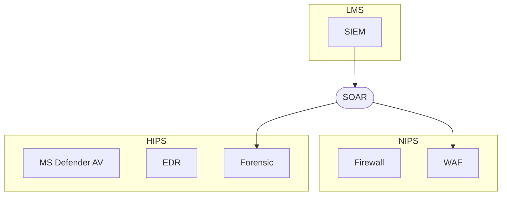

# PLURA-XDR の哲学 🧠

> 「るサイバーセキュリティは単一製品ではなく、プラットフォームであるべきだ。」  
> – リー・クラリッチ（Lee Klarich）、Palo Alto Networks CPO

---

## 1) 情報セキュリティの歴史と発展

### 📅 1990年代：ネットワーク境界セキュリティの始まり

情報セキュリティシステムの基礎は、1990年代の**ネットワーク境界セキュリティ**（Network Perimeter Security Model）中心のアプローチから始まりました。これは、ネットワークの接続ポイントを一元化し、その地点で強力なセキュリティ制御を適用してセキュリティ目標を達成する構造です。そのために、単一の製品ではなく複数のセキュリティ製品を**多段階でネットワーク上に配置**し、さまざまな攻撃に対応するコンセプトが導入されました。

代表的なネットワーク境界セキュリティ製品は次のとおりです：

1. **ファイアウォール**（Firewall）
2. **統合脅威管理**（UTM、Unified Threat Management）
3. **ウェブアプリケーションファイアウォール**（WAF、Web Application Firewall）
4. **侵入防止システム**（IPS、Intrusion Prevention System）
5. **侵入検知システム**（IDS、Intrusion Detection System）
6. **ネットワーク検知と対応**（NDR、Network Detection and Response）

### 🛡️ PLURA-XDR 対応システム構成図

---

### 📅 2000年代：統合セキュリティイベント管理と自動化された対応の発展

2000年代に入り、単一製品の限界が明らかになり始め、**ログ管理システム**（LMS、Log Management System）から**統合セキュリティイベント管理**（SIEM、Security Information and Event Management）システムへと進化しました。複数のネットワーク機器のログを統合収集し、**相関分析**を通じて異常兆候を検知する方式です。

統合セキュリティイベント管理の核心目標は、相関分析を通じて異常兆候を検知することですが、さらに進んで**セキュリティ運用自動化**（SOAR、Security Orchestration, Automation and Response）システムを通じて自動化された対応を提案するようになりました。

用語説明：

1. **ネットワーク侵入防止システム**（NIPS、Network-based Intrusion Prevention System）
2. **ログ管理システム**（LMS、Log Management System）
3. **ホスト侵入防止システム**（HIPS、Host-based Intrusion Prevention System）
4. **運用自動化** (SOAR, Security Orchestration, Automation and Response)
---

### 📅 2020年代：ゼロトラストアーキテクチャの登場

2020年代に入り、セキュリティの核心パラダイムは「**全てを疑え**」という原則に基づく**ゼロトラストアーキテクチャ**（ZTA、Zero Trust Architecture）へと拡張しています。ゼロトラストは内部ネットワークをもはや信頼せず、ネットワーク内外のすべてのアクセスを継続的に検証し、認証と権限付与を通じて厳格に管理するセキュリティモデルです。

従来の境界セキュリティ方式と異なり、ZTAは**データ保護の中心**をネットワーク境界ではなく資産（データおよびアプリケーション）に移し、権限のないすべてのアクセスを遮断し、すべてのユーザーを疑う方式を取ります。このようなアプローチは、特にリモートワーク環境、クラウドベースのインフラ、そして多様なデバイスの接続が一般化した現代環境で必須のセキュリティ戦略として位置づけられています。

PLURA-XDRは、このゼロトラストの概念を垂直的に統合し、さらに発展させたプラットフォームです。特に、PLURA-XDRはZTAの核心要素として以下を提供します：

- **アクティビティログ（Activity Logs）**  
  ネットワークおよびシステム内で発生するすべての活動を詳細に記録し、異常の兆候をリアルタイムでモニタリングおよび分析することが可能です。これにより、潜在的な脅威を早期に検出し、対応することができます。

- **統合セキュリティイベント管理システム（SIEM System）**  
  各種セキュリティイベントを中央で収集・相関分析し、複雑な脅威にも迅速かつ正確に対応します。SIEMシステムはアクティビティログと連携し、セキュリティインテリジェンスを向上させます。

これらの機能により、PLURA-XDRはネットワーク内外のすべてのアクセスを継続的に検証し、侵害事故の前後に発生するすべての活動を追跡し、自動で遮断します。また、組織全体の資産を知的に防御する体制を提供し、セキュリティプロセスの複雑さを減らし、対応の効率性を最大化します。

---

## 2) 問題認識と解決：PLURAの革新的アプローチ

### 💡 PLURAの問題意識

PLURAは次のような問題意識から出発しました：

1. **暗号化されたトラフィックの分析限界**  
   ネットワークベースのセキュリティ製品である侵入防止システム（IPS）、侵入検知システム（IDS）、ネットワーク検知と対応（NDR）は、**暗号化されたパケットを適切に分析するのが困難**という限界があります。これらの機器は主に暗号化されていないトラフィックでのみ効果的に動作し、暗号化されたウェブトラフィックの場合、**ウェブアプリケーションファイアウォール（WAF）がより効果的です**。[1]

2. **ウェブアプリケーションファイアウォールの回避攻撃への脆弱性**  
   WAFは主にウェブトラフィックを保護するために最適化されていますが、一部の**高度な回避攻撃手法に脆弱**な場合があります。単一の製品では、**クレデンシャルスタッフィング**などの特定の攻撃に対応するのが困難です。[2][3]

3. **SIEMシステムの情報収集限界**  
   SIEMシステムは主にネットワークセキュリティ機器のログ（syslog）を収集しますが、ほとんどのセキュリティ機器は**具体的な検知説明や本文情報を十分に提供していません**。WAFのみが本文情報を含む場合が多いです。[4]

4. **相関分析の信頼性不足**  
   本文（Body）情報を提供する情報セキュリティ製品がほとんどないため、SIEMシステムのログ情報が十分に詳細でなく、結果として**相関分析の信頼性が低下します**。検知された脅威を評価し対応するために必要な情報を提供できず、誤った警告や検知失敗が発生する可能性があります。

5. **SOARと連動した自動対応の限界**  
   情報が不足したSIEMシステムと連動した**セキュリティ運用自動化（SOAR）**機能は、実際の環境で円滑に動作せず、自動対応の信頼性と効率性が低下します。これにより、実際のセキュリティ事故対応過程で**手作業が要求**される場合が多いです。

6. **複雑なセキュリティシステム構成の非効率性**  
   IPS、IDS、NDRなど複数のセキュリティ機器が複雑に構成された環境では、機器間の**相互運用性が不足**し、管理負担が増大します。また、**重複警告**（duplicate alerts）や**警告疲れ**（alert fatigue）が発生し、管理者が脅威を適時に認識できないリスクがあります。

7. **リアルタイム対応の困難さ**  
   従来のセキュリティ製品は、**リアルタイムな攻撃検知および対応に限界**があり、迅速な脅威検知と即時の遮断が困難で、結果的に非効率的なセキュリティ体制を招く可能性があります。

8. **システム間の統合不足**  
   分離されたセキュリティシステムはデータを共有し、相互に分析する能力が低下します。これにより、包括的な脅威情報の把握が難しく、多角的な脅威分析と対応が制限されます。

9. **セキュリティ境界の弱体化**  
   リモートワークやクラウドの利用が増加し、従来のネットワーク境界が消失しています。従来の境界セキュリティモデルは、現代の**分散型インフラ**や**多様な接続環境**で十分なセキュリティ効果を提供できません。

10. **セキュリティ監視の信頼性低下**  
    限られた情報と複雑な機器構成により、**セキュリティ監視サービスの信頼性**が低下します。セキュリティ監視要員は限定的な情報しか提供されず、攻撃の有無を迅速に判断するのが難しく、侵害事故発生時に**運用システムへのアクセスに制約**があります。

---

### 🌐 ウェブトラフィックと暗号化の影響

インターネット上のTCP/IPパケットのうち、**ウェブトラフィック**（HTTP/HTTPS）はおおよそ80～90%を占め、その中でHTTPSの比率は83%から93%に達すると推定されています。ほとんどが**暗号化されたウェブトラフィック**で構成されており、これはネットワークセキュリティのパラダイムに大きな影響を与えています。

暗号化されたトラフィックの増加により、従来のネットワークセキュリティ機器は次のような問題に直面しています：

1. **暗号化トラフィックの可視性不足**  
   多機能ネットワークセキュリティ機器（UTM、IPS、IDS、NDR）らは、さまざまな脅威を検知し対応するために設計されていますが、暗号化されたトラフィックを分析するには**復号化プロセス**が必要です。しかし、復号化はセキュリティポリシー上困難な場合があり、追加の証明書管理や複雑な設定が要求されます。

2. **性能低下と遅延増加**  
   暗号化されたトラフィックを復号化して検査する過程は、機器の**CPUやメモリ使用量**を大幅に増加させ、**性能低下**を招きます。これはネットワークの**遅延**（latency）を増加させ、ユーザーエクスペリエンスを悪化させる可能性があります。

3. **管理の複雑性の増加**  
   復号化のためにはSSL/TLS証明書の管理やキー交換などが必要で、ネットワーク管理者に**追加の負担**を与えます。また、複雑な設定により**構成エラー**が発生する可能性も高まります。

4. **セキュリティ脆弱性の増加**  
   中間で復号化を行うことは「**中間者攻撃**」と類似した構造を持ち、誤った設定や脆弱性を通じて攻撃者が機密情報を奪取するリスクがあります。

5. **プライバシーおよび規制遵守の問題**  
   暗号化されたトラフィックを復号化することは、**ユーザープライバシーを侵害**する可能性があり、一部の業界や国では法的規制により制限される場合があります。

6. **暗号化技術の発展**  
   **QUICプロトコル**や**TLS 1.3**などの最新の暗号化技術は、中間者復号化をさらに困難にしており、既存の機器の対応能力を制限しています。

7. **特化されたソリューションの必要性**  
   これらの限界により、暗号化されたウェブトラフィックに効果的に対応するためには、**ウェブアプリケーションファイアウォール（WAF）**のように暗号化されたトラフィックを処理するよう設計された**特化されたソリューション**が必要です。

8. **ネットワーク構造の複雑性増加**  
   暗号化トラフィック処理のために複数の機器を追加導入すると、ネットワーク構造が複雑化し、障害発生時の**原因分析と復旧**が困難になります。

9. **コスト増加**  
   追加の機器導入と管理による**運用コスト**（OPEX）と**機器購入コスト**（CAPEX）が増加し、企業の財政的負担が大きくなります。

10. **リアルタイム脅威対応の困難さ**  
    暗号化されたトラフィック内の脅威を迅速に検知し対応することが難しく、セキュリティ事故発生時に被害を最小限に抑えるのに限界があります。

---

### ✅ PLURA-XDRを通じた問題解決

PLURA-XDRは、これらの問題点を解決するために垂直的に統合されたセキュリティプラットフォームを提供します。

1. **暗号化されたトラフィックの効果的な分析**  
   PLURA-XDRのウェブアプリケーションファイアウォールは、**暗号化されたウェブトラフィックを復号化**し、正確な脅威分析と対応を行います。

2. **エンドポイントセキュリティの強化**  
   **ホストセキュリティ**（EDR）を通じて、最終サーバーやPCで直接悪性行為を検知し遮断します。

3. **正確な情報収集と相関分析**  
   SIEMシステムは詳細な検知情報と本文データを収集し、**信頼性の高い相関分析**を可能にします。

4. **自動化されたリアルタイム対応**  
   SOARシステムとの連動を通じて、リアルタイムで脅威を自動遮断し対応します。

5. **管理効率性の向上**  
   垂直的に統合されたプラットフォームを通じてネットワーク構造を単純化し、**管理負担を軽減**します。

6. **脅威の全ライフサイクル管理**  
   検知から対応、事後処理まで、脅威管理のすべての段階をサポートします。

7. **警告疲れの軽減**  
   中央化された警告管理で**重複警告を最小化**し、重要な脅威に集中できます。

8. **ゼロトラストアーキテクチャの実装**  
   内部と外部を区別しないセキュリティモデルを**実装し**、現代的なセキュリティ環境に対応します。

9. **内部脅威への包括的対応**  
   内部ユーザーやシステムへのモニタリングと保護を強化します。

10. **セキュリティ監視の信頼性向上**  
    詳細な情報とリアルタイム対応で、**セキュリティ監視の効率性と信頼性**を高めます。

---

## 3) 強力なセキュリティへの提案：PLURA-XDRの未来と私たちの提案

情報セキュリティの問題は、単純なソリューション選択を超えて、**セキュリティ監視**（MSS、Managed Security Service）との有機的な運用が必要です。しかし、現在のセキュリティ監視サービスは、限定された情報と運用システムへのアクセス制約により、十分な保護を提供するのが難しい状況です。これらの限界は、PLURAが認識した問題の核心でもあります。

**PLURA-XDRプラットフォーム**は、詳細な検知説明と元のログを提供し、セキュリティ管理者が**より正確かつ迅速な判断**を行えるよう支援し、運用システムに直接アクセスせずに**侵害事故を分析**できる環境を提供します。また、**リアルタイム対応**を通じて進行中の攻撃を即時に遮断し、脅威に対する**可視性とコンテキスト**を提供して主導的な対応が可能です。

このようなPLURA-XDRの差別化されたアプローチは、**完璧なハッキング対応体制**を実現し、最新のセキュリティ要件に合わせて絶えず進化しています。今こそ、**PLURA-XDR**を通じて強力で革新的な情報セキュリティの未来を築いてみませんか。PLURA-XDRは、組織の情報セキュリティを新たに定義する**最先端統合セキュリティプラットフォーム**です。

---

### 📖 PLURA Blog

* [なぜ私たちはGET/POSTログを分析するのか？](https://blog.plura.io/ja/column/why_analyze_get_post_logs/)
* [Webの完全なログ分析はなぜ重要なのか?](https://blog.plura.io/ja/respond/very_important_analyze_web_logs/)
* [多層・階層型セキュリティ、本当に必要か？](https://blog.plura.io/ja/column/overkill-multi-layer-security/)
* [従来のSOC対PLURA-XDRプラットフォーム](https://blog.plura.io/ja/column/traditional_soc_vs_plura_xdr/)
* [PLURA-XDRを活用したサプライチェーンセキュリティ強化策](https://blog.plura.io/ja/column/campaign_supplychain_security/)  
* [ハッキング事件に対応するクラウドセキュリティプラットフォームの重要性](https://blog.plura.io/ja/column/importance_of_cloud_security_platform_in_hacking_incidents/)  
* [クレデンシャルスタッフィング攻撃に対応する](https://blog.plura.io/ja/respond/credential-stuffing-countermeasures/)   
* [WAF vs IPS vs UTM：Web攻撃に最適な防御ソリューションを選択する](https://blog.plura.io/ja/column/waf_ips_utm_comparison/)  
* [侵入遮断システム（IPS）を理解する](https://blog.plura.io/ja/column/ips_understanding/)  
* [セキュリティと保険の違い](https://blog.plura.io/ja/column/cybersecurity_vs_insurance/)  

---

