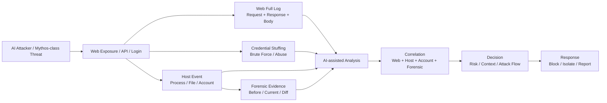

# PLURA-XDR 철학 🧠

> “보안은 단일 제품이 아닌 플랫폼에서 기본적으로 통합되어야 한다.”  
> – 리 클라리치 (Lee Klarich), Palo Alto Networks CPO

PLURA-XDR의 철학은 여러 보안 제품을 단순히 나열하는 데 있지 않습니다.  
웹 요청·응답, 호스트 이벤트, 계정 행위, 포렌식, 대응을 하나의 흐름으로 연결하여 **공격을 증거 기반으로 이해하고, 실시간으로 판단하며, 즉시 대응할 수 있는 통합 보안 플랫폼**을 구축하는 데 있습니다.

AI가 공격자의 도구가 되는 시대에는 보안의 기준도 달라져야 합니다.  
공격은 더 빨라지고, 더 자주 변형되며, 더 많은 경로를 동시에 시험합니다. PLURA-XDR은 이러한 변화에 대응하기 위해 **정확한 기록, 실시간 분석, 행위 기반 상관분석, 자동 대응**을 하나의 철학으로 통합합니다.

---

## 1) 정보보안의 역사와 발전

### 📅 1990년대: 네트워크 경계 보안의 시작

정보보안 시스템의 기초는 1990년대 **네트워크 경계 보안**(Network Perimeter Security Model) 중심의 접근 방식에서 시작되었습니다. 이는 네트워크 접속 지점을 단일화하고 해당 지점에서 강력한 보안 통제를 적용하여 보안 목표를 달성하는 구조입니다. 이를 위해 단일 제품이 아닌 여러 보안 제품을 **다단계로 네트워크 상에 배치**하여 다양한 공격에 대응하는 개념을 도입했습니다.

대표적인 네트워크 경계 보안 제품은 다음과 같습니다:

1. **방화벽** (Firewall)
2. **통합 위협 관리** (UTM, Unified Threat Management)
3. **웹 방화벽** (WAF, Web Application Firewall)
4. **침입 차단 시스템** (IPS, Intrusion Prevention System)
5. **침입 탐지 시스템** (IDS, Intrusion Detection System)
6. **네트워크 탐지 및 대응** (NDR, Network Detection and Response)

### 🛡️ PLURA-XDR 대응 시스템 구성도

PLURA-XDR의 통합 대응 구조와 서비스 구성은 아래 공식 서비스 페이지에서 확인할 수 있습니다.

> [PLURA-XDR 통합 보안 플랫폼](https://www.plura.io/ko/platform_xdr.html)

---

### 📅 2000년대: 통합 보안 이벤트 관리와 자동화된 대응의 발전

2000년대에 들어서면서 단일 제품의 한계가 드러나기 시작했고, **로그 관리 시스템** (LMS, Log Management System)에서 **통합 보안 이벤트 관리** (SIEM, Security Information and Event Management) 시스템으로 발전하게 되었습니다. 여러 네트워크 장비의 로그를 통합 수집하여, **상관 분석**을 통해 이상 징후를 탐지하는 방식입니다.

통합 보안 이벤트 관리의 핵심 목표는 상관 분석을 통해 이상 징후를 탐지하는 것이지만, 더 나아가 **보안 운영 자동화** (SOAR, Security Orchestration, Automation and Response) 시스템을 통해 자동화된 대응을 제안하게 되었습니다.


용어 설명:

1. **네트워크 침입 차단 시스템** (NIPS, Network-based Intrusion Prevention System)
2. **로그 관리 시스템** (LMS, Log Management System)
3. **호스트 침입 차단 시스템** (HIPS, Host-based Intrusion Prevention System)
4. **보안 운영 자동화** (SOAR, Security Orchestration, Automation and Response)
---

### 📅 2020년대: 클라우드·SaaS·분산 인프라와 통합 보안 플랫폼의 필요성

2020년대에 들어서면서 기업의 업무 환경은 온프레미스 중심에서 클라우드, SaaS, 원격 접속, 다양한 디바이스가 함께 운영되는 구조로 바뀌고 있습니다.  
이 변화는 보안의 중심을 단순한 네트워크 경계에서 **실제 서비스, 사용자 행위, 시스템 이벤트, 데이터 흐름**으로 이동시키고 있습니다.

PLURA-XDR의 철학은 “모든 것을 의심하라”는 선언에 있지 않습니다.  
PLURA-XDR은 **모든 행위를 기록하고, 증거를 연결하며, 공격 흐름을 확인한 뒤, 실시간으로 대응한다**는 운영 중심의 보안 철학을 지향합니다.

기존의 보안 체계는 장비별 탐지와 개별 경고에 의존하는 경우가 많았습니다. 그러나 현대의 공격은 웹 요청, 계정 행위, 서버 이벤트, 파일 변화, 권한 상승, 내부 이동이 서로 연결되어 나타납니다. 따라서 단일 장비의 탐지 결과만으로는 공격의 전체 맥락을 파악하기 어렵습니다.

**PLURA-XDR**은 이러한 환경 변화에 대응하기 위해 다음을 핵심 원칙으로 삼습니다:

1. **기록 중심 보안**  
   보안의 출발점은 추상적인 신뢰 판단이 아니라 실제 행위의 기록입니다. 웹 요청·응답, 시스템 이벤트, 계정 행위, 포렌식 정보를 남겨 공격의 증거를 확보합니다.

2. **상관분석 중심 보안**  
   개별 이벤트를 따로 보지 않고, 웹 → 호스트 → 계정 → 포렌식으로 이어지는 공격 흐름을 하나의 맥락으로 분석합니다.

3. **실시간 대응 중심 보안**  
   공격이 끝난 뒤 리포트를 작성하는 데 그치지 않고, 공격이 진행 중일 때 탐지·판단·차단이 이루어질 수 있어야 합니다.

4. **운영 가능한 보안**  
   보안은 복잡한 장비 조합이 아니라 실제 운영자가 이해하고 판단하며 대응할 수 있는 형태로 제공되어야 합니다. PLURA-XDR은 탐지 설명, 원본 로그, 분석 근거, 대응 이력을 함께 제공하여 관제의 신뢰성을 높입니다.

이러한 접근을 통해 PLURA-XDR은 분산된 인프라와 클라우드 환경에서도 보안 운영의 복잡성을 줄이고, 침해사고 발생 전·후의 모든 활동을 증거 기반으로 추적하며, 필요한 경우 즉시 대응할 수 있는 통합 보안 플랫폼을 제공합니다.

---

### 📅 2020년대 후반: AI 주도 공격과 공세적 보안 시대

2020년대 후반의 보안 환경은 단순히 “더 많은 공격”의 문제가 아니라, **AI가 공격자의 속도와 변형 능력을 증폭시키는 시대**로 변화하고 있습니다. Mythos(미토스)와 같은 AI 기반 공격 모델은 새로운 마법 같은 공격 기법이라기보다, 기존 공격 과정을 훨씬 빠르게 자동화하고 조합하는 위협으로 이해해야 합니다.

AI 공격자는 다음과 같은 방식으로 기존 보안 체계를 압박합니다.

1. **취약점 탐색 속도의 증가**  
   노출된 웹 자산, API, 로그인 페이지, 관리자 페이지를 빠르게 식별하고 반복적으로 시험합니다.

2. **공격 페이로드의 지속적 변형**  
   동일한 공격 목적을 유지하면서 요청 헤더, 파라미터, 본문, 인코딩, User-Agent, Referer 등을 계속 바꾸어 기존 탐지 규칙을 우회하려고 합니다.

3. **크리덴셜 공격의 자동화**  
   계정 탈취, 크리덴셜 스터핑, 인증번호·쿠폰·예약번호·카드번호 대입과 같은 반복 공격을 대규모로 수행합니다.

4. **웹 공격과 호스트 침해의 연계**  
   웹 취약점 악용 이후 웹쉘 업로드, 명령 실행, 권한 상승, 내부 이동, 데이터 유출, 랜섬웨어 실행까지 하나의 흐름으로 연결합니다.

5. **탐지 회피와 로그 공백 악용**  
   탐지 장비가 보지 못하는 본문 정보, 응답 정보, 호스트 행위, 계정 행위의 빈틈을 이용합니다.

따라서 AI 해킹 시대의 핵심 질문은 “공격자가 AI를 사용했는가?”가 아닙니다.  
핵심은 **공격 과정이 실제 시스템에 어떤 흔적을 남겼는가, 그 흔적을 실시간으로 연결해 공격 흐름으로 판단할 수 있는가, 그리고 즉시 차단할 수 있는가**입니다.

PLURA-XDR은 바로 이 지점에서 출발합니다.  
AI 공격을 막기 위해 더 많은 보안 장비를 쌓는 것이 아니라, **웹 전체 로그, 호스트 이벤트, 계정 행위, 포렌식 정보, 자동 대응을 하나의 증거 체계로 통합**합니다.

### 🤖 PLURA-XDR의 Mythos 대응 개념도


```mermaid
flowchart LR
  A[AI Attacker / Mythos-class Threat] --> B[Web Exposure / API / Login]
  B --> C[Web Full Log<br/>Request + Response + Body]
  B --> D[Credential Stuffing<br/>Brute Force / Abuse]
  B --> E[Host Event<br/>Process / File / Account]
  E --> F[Forensic Evidence<br/>Before / Current / Diff]
  C --> G[AI-assisted Analysis]
  D --> G
  E --> G
  F --> G
  G --> H[Correlation<br/>Web + Host + Account + Forensic]
  H --> I[Decision<br/>Risk / Context / Attack Flow]
  I --> J[Response<br/>Block / Isolate / Report]
```

PLURA-XDR의 AI 대응 철학은 단순합니다.  
**AI 공격의 속도는 실시간 분석으로 대응하고, AI 공격의 변형성은 전체 로그와 행위 기반 상관분석으로 대응하며, AI 공격의 불확실성은 포렌식 증거와 설명 가능한 판단으로 대응합니다.**


---

## 2) 문제 인식과 해결: PLURA의 혁신적 접근

### 💡 PLURA의 문제 의식  

PLURA는 다음과 같은 문제 의식에서 출발했습니다:

1. **암호화된 트래픽의 분석 한계**  
   네트워크 기반 보안 제품인 침입 차단 시스템 (IPS), 침입 탐지 시스템 (IDS), 네트워크 탐지 및 대응 (NDR)은 **암호화된 패킷을 제대로 분석하기 어려운 한계**가 있습니다. 이러한 장비들은 주로 암호화되지 않은 트래픽에서만 효과적으로 작동하며, 암호화된 웹 트래픽의 경우 **웹 방화벽이 더 효과적입니다**. [1]

2. **웹 방화벽의 우회 공격 취약성**  
   웹 방화벽 (WAF)은 주로 웹 트래픽을 보호하는 데 최적화되어 있지만, 일부 **고도화된 우회 공격 기법에 취약**할 수 있습니다. 단일 제품으로는 **크리덴셜 스터핑**과 같은 특정 공격에 대응하기 어렵습니다. [2][3]

3. **SIEM 시스템의 정보 수집 한계**  
   통합 보안 이벤트 관리 (SIEM) 시스템은 주로 네트워크 보안 장비의 로그 (syslog)를 수집하는데, 대부분의 보안 장비는 **구체적 탐지 설명이나 본문 정보를 충분히 제공하지 않습니다**. 웹 방화벽 (WAF)만이 본문 정보를 포함하는 경우가 많습니다. [4]

4. **상관 분석의 신뢰성 부족**  
   본문 (Body) 정보를 제공하는 정보보안 제품이 거의 없기 때문에 SIEM 시스템의 로그 정보가 충분히 상세하지 않습니다. 결과적으로 **상관 분석의 신뢰성이 낮아집니다**. 탐지된 위협을 평가하고 대응하기에 필요한 정보를 제공하지 못해, 잘못된 경고 또는 탐지 실패가 발생할 수 있습니다.

5. **SOAR와 연동된 자동 대응의 한계**  
   정보가 부족한 SIEM 시스템과 연동된 **보안 운영 자동화 (SOAR)** 기능은 실제 환경에서 원활히 동작하지 않으며, 자동 대응의 신뢰성과 효율성이 떨어집니다. 이로 인해 실제 보안 사고 대응 과정에서 **수작업이 요구**되는 경우가 많습니다.

6. **복잡한 보안 시스템 구성의 비효율성**  
   IPS, IDS, NDR 등 여러 보안 장비가 복잡하게 구성된 환경에서는 장비 간 **상호 운용성이 부족**하여 관리 부담이 가중됩니다. 또한, **중복 경고**(duplicate alerts)와 **경고 피로**(alert fatigue)가 발생해 관리자가 위협을 적시에 인지하지 못할 위험이 있습니다.

7. **실시간 대응의 어려움**  
   기존 보안 제품은 **실시간 공격 탐지 및 대응에 한계**를 보이며, 빠른 위협 탐지와 즉각적인 차단이 어려워 결과적으로 비효율적인 보안 체계를 초래할 수 있습니다.

8. **시스템 간 통합 부족**  
   분리된 보안 시스템은 데이터를 공유하고 상호 분석하는 능력이 떨어집니다. 이로 인해 포괄적인 위협 정보 파악이 어렵고, 다각적인 위협 분석과 대응이 제한됩니다.

9. **보안 경계의 약화**  
   원격 근무와 클라우드 사용이 증가하면서 전통적인 네트워크 경계가 사라지고 있습니다. 기존의 경계 보안 모델은 현대의 **분산된 인프라**와 **다양한 접속 환경**에서 충분한 보안 효과를 제공하지 못합니다.

10. **보안 관제의 신뢰성 저하**  
    제한된 정보와 복잡한 장비 구성으로 인해 **보안 관제 서비스의 신뢰성**이 떨어집니다. 보안 관제 요원은 제한적인 정보만 제공받아 공격 여부를 빠르게 판단하기 어려우며, 침해사고 발생 시 **운영 시스템에 접근하는 데 제약**이 따릅니다.

11. **AI 공격 속도에 대한 대응 한계**  
    AI 기반 공격은 취약점 탐색, 요청 변형, 계정 대입, 내부 확산 시도를 빠르게 반복합니다. 사람이 사후에 로그를 검토하는 방식만으로는 공격 속도를 따라가기 어렵습니다.

12. **시그니처 중심 탐지의 한계**  
    AI 공격은 동일한 공격 목적을 유지하면서 요청 형식과 페이로드를 계속 바꿀 수 있습니다. 기존 시그니처나 고정 규칙만으로는 변형 공격을 안정적으로 탐지하기 어렵습니다.

13. **지연 분석 중심 대응의 한계**  
    중앙 서버 배치 분석, 샌드박스 분석, 사후 리포트 중심 대응은 공격이 진행 중인 순간의 차단에는 충분하지 않습니다. AI 공격 시대에는 분석 결과보다 먼저 피해가 발생할 수 있습니다.

14. **단일 신호 기반 판단의 위험**  
    하나의 이벤트, 하나의 경고, 하나의 탐지명만으로는 실제 공격 여부를 판단하기 어렵습니다. 웹 요청, 응답, 호스트 이벤트, 계정 행위, 포렌식 상태를 연결해야 공격의 의도를 정확히 판단할 수 있습니다.

15. **설명 불가능한 AI 판단의 위험**  
    AI가 위험하다고 판단했다는 이유만으로 자동 차단을 수행하면 운영 안정성을 해칠 수 있습니다. AI 대응은 반드시 원본 로그, 탐지 근거, 공격 흐름, 포렌식 증거와 함께 설명 가능해야 합니다.

---

### 🌐 웹 트래픽과 암호화의 영향

인터넷 상의 TCP/IP 패킷 중 **웹 트래픽** (HTTP/HTTPS)은 대략 80~90%를 차지하며, 그중 HTTPS 비중은 83%에서 93%에 이르는 것으로 추정됩니다. 대부분이 **암호화된 웹 트래픽**으로 이루어져 있으며, 이는 네트워크 보안의 패러다임에 큰 영향을 미치고 있습니다.

암호화된 트래픽의 증가로 인해, 기존의 네트워크 보안 장비들은 다음과 같은 문제점에 직면하고 있습니다:

1. **암호화 트래픽의 가시성 부족**  
   다기능 네트워크 보안 장비 (UTM, IPS, IDS, NDR) 들은 다양한 위협을 감지하고 대응하기 위해 설계되었지만, 암호화된 트래픽을 분석하려면 **복호화 과정**이 필요합니다. 그러나 복호화는 보안 정책상 어려울 수 있으며, 이를 위해 추가적인 인증서 관리와 복잡한 설정이 요구됩니다.

2. **성능 저하와 지연 증가**  
   암호화된 트래픽을 복호화하여 검사하는 과정은 장비의 **CPU와 메모리 사용량**을 크게 증가시켜 **성능 저하**를 초래합니다. 이는 네트워크 **지연**(latency)을 증가시켜 사용자 경험을 악화시킬 수 있습니다.

3. **관리 복잡성의 증가**  
   복호화를 위해서는 SSL/TLS 인증서의 관리와 키 교환 등이 필요하며, 이는 네트워크 관리자에게 **추가적인 부담**을 줍니다. 또한, 복잡한 설정으로 인해 **구성 오류**가 발생할 가능성도 높아집니다.

4. **보안 취약성의 증가**  
   중간에서 복호화를 수행하는 것은 “**중간자 공격**“과 유사한 구조를 가지며, 잘못된 설정이나 취약점을 통해 공격자가 민감한 정보를 탈취할 수 있는 위험이 있습니다.

5. **프라이버시 및 규제 준수 문제**  
   암호화된 트래픽을 복호화하는 것은 **사용자 프라이버시를 침해**할 수 있으며, 일부 산업이나 국가에서는 법적 규제로 인해 제한될 수 있습니다.

6. **암호화 기술의 발전**  
   **QUIC 프로토콜**이나 **TLS 1.3**과 같은 최신 암호화 기술은 중간자 복호화를 더욱 어렵게 만들고 있으며, 기존 장비들의 대응 능력을 제한하고 있습니다.

7. **특화된 솔루션의 필요성**  
   이러한 한계로 인해 암호화된 웹 트래픽에 효과적으로 대응하기 위해서는 **웹 방화벽** (WAF)과 같이 암호화된 트래픽을 처리하도록 설계된 **특화된 솔루션**이 필요합니다.

8. **네트워크 구조의 복잡성 증가**  
   암호화 트래픽 처리를 위해 여러 장비를 추가로 도입하면 네트워크 구조가 복잡해지고, 이는 장애 발생 시 **원인 분석과 복구**를 어렵게 만듭니다.

9. **비용 증가**  
   추가적인 장비 도입과 관리로 인한 **운영 비용** (OPEX)과 **장비 구매 비용** (CAPEX)이 증가하여 기업의 재정 부담이 커집니다.

10. **실시간 위협 대응의 어려움**  
    암호화된 트래픽 내의 위협을 신속하게 탐지하고 대응하는 것이 어려워, 보안 사고 발생 시 피해를 최소화하는 데 한계가 있습니다.

---

### ✅ PLURA-XDR을 통한 문제 해결

PLURA-XDR은 위 문제점들을 해결하기 위해 수직적으로 통합된 보안 플랫폼을 제공합니다.

1. **암호화된 트래픽의 효과적인 분석**  
   PLURA-XDR의 웹 방화벽은 **암호화된 웹 트래픽을 복호화**하여 정확한 위협 분석과 대응을 수행합니다.

2. **엔드포인트 보안 강화**  
   **호스트 보안** (EDR)을 통해 최종 서버와 PC에서 직접 악성 행위를 감지하고 차단합니다.

3. **정확한 정보 수집과 상관 분석**  
   SIEM 시스템은 상세한 탐지 정보와 본문 데이터를 수집하여 **신뢰성 높은 상관 분석**을 가능하게 합니다.

4. **자동화된 실시간 대응**  
   SOAR 시스템과의 연동을 통해 실시간으로 위협을 자동 차단하고 대응합니다.

5. **관리 효율성 증대**  
   수직적으로 통합된 플랫폼을 통해 네트워크 구조를 단순화하고 **관리 부담을 줄입니다**.

6. **위협의 전체 라이프사이클 관리**  
   탐지부터 대응, 사후 처리까지 위협 관리의 모든 단계를 지원합니다.

7. **경고 피로 감소**  
   중앙화된 경고 관리로 **중복 경고를 최소화**하고, 중요한 위협에 집중할 수 있습니다.

8. **분산 인프라 통합 가시성 확보**  
   클라우드, SaaS, 원격 접속, 내부 시스템에서 발생하는 보안 이벤트를 하나의 흐름으로 연결하여 현대적인 보안 환경에 대응합니다.

9. **내부 위협에 대한 포괄적 대응**  
   내부 사용자와 시스템에 대한 모니터링과 보호를 강화합니다.

10. **보안 관제 신뢰성 향상**  
    상세한 정보와 실시간 대응으로 **보안 관제의 효율성과 신뢰성**을 높입니다.

11. **AI 보조 제로데이 탐지**  
    알려진 규칙에만 의존하지 않고, 공격자 IP와 의심 행위 중심으로 웹 요청·응답, 본문, 응답 코드, 응답 길이, 에러 패턴, 호스트 이벤트를 함께 분석하여 알려지지 않은 공격 가능성을 판단합니다.

12. **웹·호스트·계정·포렌식 통합 상관분석**  
    웹 공격이 실제 서버 행위로 이어졌는지, 계정 행위와 연결되는지, 시스템 상태가 변경되었는지를 하나의 흐름으로 분석합니다. 이를 통해 단순 경고가 아닌 공격 경로와 영향 범위를 확인할 수 있습니다.

13. **실시간 분석 → 즉시 판단 → 즉시 대응**  
    PLURA-XDR은 공격이 끝난 뒤 리포트를 제공하는 데 머물지 않습니다. 공격이 진행 중인 시점에 실시간으로 분석하고, 위험도가 충분히 확인되면 즉시 차단과 대응으로 연결합니다.

14. **증거 기반 AI 대응**  
    AI 분석 결과는 원본 로그, 탐지 설명, 공격 흐름, 포렌식 차이 정보와 함께 제공되어야 합니다. PLURA-XDR은 AI 판단을 블랙박스로 두지 않고, 보안 담당자가 납득할 수 있는 증거 중심 대응을 지향합니다.

15. **SOC 운영자의 판단을 강화하는 자동화**  
    자동화는 사람을 배제하기 위한 것이 아니라, 사람이 더 빠르고 정확하게 판단하도록 돕기 위한 것입니다. PLURA-XDR은 반복 분석과 차단 업무는 자동화하고, 중요한 의사결정에는 충분한 맥락과 증거를 제공합니다.

---

## 3) AI 해킹 시대의 PLURA 철학: Mythos 대응 원칙

AI 해킹 시대의 본질은 공격 기술이 완전히 새로워졌다는 데 있지 않습니다.  
본질은 **공격의 속도, 변형성, 자동화, 연계성**이 이전과 비교할 수 없을 정도로 커졌다는 데 있습니다.

Mythos(미토스)와 같은 AI 기반 공격 위협에 대응하기 위해 PLURA-XDR은 다음 원칙을 지향합니다.

### 1. AI를 AI로만 막지 않습니다. 기록과 증거가 먼저입니다.

AI 공격에 대응한다고 해서 AI 모델의 판단에만 의존해서는 안 됩니다.  
보안의 출발점은 여전히 **기록**입니다. 웹 요청, 웹 응답, 본문, 호스트 이벤트, 계정 행위, 포렌식 상태가 남아 있어야 AI도 분석할 수 있고, 사람도 판단할 수 있으며, 자동 대응도 신뢰할 수 있습니다.

PLURA-XDR의 AI 대응은 “AI가 위험하다고 판단했다”에서 끝나지 않습니다.  
**무엇을 보았고, 왜 위험하며, 어떤 흐름으로 공격이 진행되었는지**를 설명할 수 있어야 합니다.

### 2. 공격자의 속도보다 빠른 실시간 대응이 필요합니다.

AI 공격은 사람이 수동으로 확인하고 회의한 뒤 대응하기에는 너무 빠르게 진행될 수 있습니다.  
따라서 PLURA-XDR은 다음 흐름을 핵심 원칙으로 삼습니다.

```text
실시간 수집 → 실시간 분석 → 즉시 판단 → 즉시 차단 → 포렌식 확인
```

중앙 서버에서 나중에 분석하거나, 샌드박스에서 결과가 나올 때까지 기다리는 방식만으로는 충분하지 않습니다. AI 공격 시대에는 **공격이 진행 중일 때 멈추게 하는 능력**이 중요합니다.

### 3. 웹은 AI 공격의 가장 중요한 출발점입니다.

현대 공격의 상당수는 웹으로 시작됩니다.  
AI 공격자도 노출된 웹 자산, 로그인 페이지, API, 관리자 페이지, 파일 업로드 경로, 취약한 파라미터를 빠르게 탐색합니다.

따라서 PLURA-XDR은 웹 요청과 응답을 단순 접속 로그로 보지 않습니다.  
웹 로그는 **공격자의 의도와 침투 시도를 보여주는 1차 증거**입니다. 특히 요청 본문과 응답 본문, 응답 코드, 응답 길이, 에러 패턴은 제로데이와 우회 공격을 판단하는 중요한 근거가 됩니다.

### 4. 본문 없는 상관분석은 반쪽짜리입니다.

AI 공격은 요청 형식과 페이로드를 계속 바꾸며 탐지를 우회할 수 있습니다.  
이때 본문 정보가 없으면 공격자가 실제로 무엇을 시도했는지 확인하기 어렵습니다.

PLURA-XDR은 웹 요청·응답 본문을 포함한 상세 로그를 기반으로, 단순 URL 접근 여부가 아니라 **무엇을 입력했고, 서버가 어떻게 반응했으며, 이후 호스트에서 어떤 변화가 발생했는지**를 연결합니다.

### 5. 단일 경고가 아니라 공격 흐름으로 판단합니다.

AI 공격은 여러 작은 행위로 나뉘어 나타날 수 있습니다.  
각각의 이벤트만 보면 낮은 위험으로 보일 수 있지만, 웹 요청 → 명령 실행 → 파일 생성 → 권한 상승 → 내부 이동 → 데이터 접근으로 이어지면 명확한 공격 흐름이 됩니다.

PLURA-XDR은 단일 탐지명보다 **공격의 연결 관계**를 중시합니다.  
이것이 PLURA-XDR이 웹방화벽, EDR, SIEM, SOAR, 포렌식을 하나의 플랫폼으로 통합하는 이유입니다.

### 6. 자동화는 증거가 충분할 때 강력합니다.

자동 차단은 빠르지만, 근거가 부족하면 운영 장애를 만들 수 있습니다.  
PLURA-XDR의 자동화는 무조건적인 차단이 아니라, 충분한 로그와 상관분석을 기반으로 한 **증거 기반 자동 대응**을 지향합니다.

위험도가 높은 공격 흐름은 즉시 차단하고, 판단이 필요한 경우에는 관리자에게 수동 차단 근거와 권고를 제공합니다. 이를 통해 자동화의 속도와 운영 안정성을 함께 확보합니다.

### 7. 관제는 감시가 아니라 대응 체계입니다.

기존 관제는 경고를 보고 전달하는 데 머무르는 경우가 많았습니다.  
그러나 AI 공격 시대의 관제는 단순 모니터링이 아니라, 공격 흐름을 이해하고 즉시 조치할 수 있는 **대응 중심 관제**가 되어야 합니다.

PLURA-XDR은 관제 담당자가 운영 서버에 직접 접속하지 않아도, 원본 로그와 포렌식 정보를 통해 침해 여부를 판단하고 대응할 수 있도록 지원합니다.

### 8. AI 보안은 일부 조직만의 고급 기능이 아니라 기본 인프라입니다.

AI 해킹 대응 역량은 특정 조직만의 선택지가 되어서는 안 됩니다.  
어느 누구라도 정보보안을 고민 없이 책임질 수 있는 기본 인프라가 되어야 합니다.

PLURA-XDR은 복잡한 장비 조합과 고비용 SIEM 구축 없이도, 웹·호스트·계정·포렌식·자동 대응을 통합하여 더 많은 조직이 현실적으로 활용할 수 있는 보안 체계를 제공합니다.

### 🧭 PLURA-XDR AI 대응 선언

> AI 해킹 대응의 핵심은 더 많은 보안 장비를 쌓는 것이 아닙니다.  
> 더 정확한 로그, 더 빠른 상관분석, 더 신뢰할 수 있는 자동 대응을 하나의 플랫폼으로 통합하는 것입니다.

> PLURA-XDR은 AI 공격의 속도에는 실시간 대응으로,  
> AI 공격의 변형성에는 전체 로그와 행위 기반 분석으로,  
> AI 공격의 불확실성에는 포렌식 증거와 설명 가능한 판단으로 대응합니다.

---

## 4) 강력한 보안에 대한 제안: PLURA-XDR의 미래와 우리의 제안

정보보안 문제는 단순한 솔루션 선택을 넘어서 **보안 관제** (SOC, Security Operation Center)와의 유기적인 운영이 필요합니다. 그러나 현재의 보안 관제 서비스는 제한된 정보와 운영 시스템 접근의 제약으로 인해 충분한 보호를 제공하기 어려운 상황입니다. 이러한 한계는 PLURA가 인식한 문제의 핵심이기도 합니다.

**PLURA-XDR 플랫폼**은 상세한 탐지 설명과 원본 로그를 제공하여 보안 관리자가 **보다 정확하고 신속한 판단**을 할 수 있도록 돕고, 운영 시스템에 직접 접근하지 않고도 **침해 사고를 분석**할 수 있는 환경을 제공합니다. 또한, **실시간 대응**을 통해 진행 중인 공격을 즉시 차단하고, 위협에 대한 **가시성과 컨텍스트**를 제공하여 주도적인 대응이 가능하도록 합니다.

이러한 PLURA-XDR의 차별화된 접근은 “완벽하다”는 선언에 머무르지 않습니다.  
PLURA-XDR은 공격이 발생했을 때 **놓치지 않고 기록하며, 증거를 연결하고, 즉시 판단하며, 필요한 대응까지 실행하는 운영 체계**를 지향합니다.

AI 해킹 시대의 보안은 더 이상 단일 제품, 사후 분석, 장비 중심 관제만으로 충분하지 않습니다.  
이제 보안은 웹에서 시작된 공격을 호스트, 계정, 포렌식, 대응까지 하나의 흐름으로 연결하는 플랫폼이어야 합니다.

PLURA-XDR은 조직의 정보보안을 새롭게 정의하는 **AI 해킹 대응 통합 보안 플랫폼**입니다.

---

### 📖 PLURA Blog

* [우리는 왜 GET/POST 로그를 분석하는가?](https://blog.plura.io/ko/column/why_analyze_get_post_logs/)
* [웹의 전체 로그 분석은 왜 중요한가?](https://blog.plura.io/ko/respond/very_important_analyze_web_logs/)
* [다중∙계층 보안, 정말 필요한가?](https://blog.plura.io/ko/column/overkill-multi-layer-security/)
* [전통적인 SOC vs PLURA-XDR 플랫폼](https://blog.plura.io/ko/column/traditional_soc_vs_plura_xdr/)
* [PLURA-XDR을 활용한 공급망 보안 강화 방안](https://blog.plura.io/ko/column/campaign_supplychain_security/)  
* [해킹 사건에 대응하는 클라우드 보안 플랫폼의 중요성](https://blog.plura.io/ko/column/importance_of_cloud_security_platform_in_hacking_incidents/)  
* [크리덴셜 스터핑 공격 대응하기](https://blog.plura.io/ko/respond/credential-stuffing-countermeasures/)   
* [WAF vs IPS vs UTM: 웹 공격 최적의 방어 솔루션 선택하기](https://blog.plura.io/ko/column/waf_ips_utm_comparison/)  
* [침입차단시스템(IPS) 이해하기](https://blog.plura.io/ko/column/ips_understanding/)  
* [보안은 보험일까?](https://blog.plura.io/ko/column/cybersecurity_vs_insurance/)  

---
