# PLURA-XDR 철학 🧠

> “보안은 단일 제품이 아닌 플랫폼에서 기본적으로 통합되어야 한다.”  
> – 리 클라리치 (Lee Klarich), Palo Alto Networks CPO

---

## 1) 정보보안의 역사와 발전

### 📅 1990년대: 네트워크 경계 보안의 시작

정보보안 시스템의 기초는 1990년대 **네트워크 경계 보안**(Network Perimeter Security Model) 중심의 접근 방식에서 시작되었습니다. 이는 네트워크 접속 지점을 단일화하고 해당 지점에서 강력한 보안 통제를 적용하여 보안 목표를 달성하는 구조입니다. 이를 위해 단일 제품이 아닌 여러 보안 제품을 **다단계로 네트워크 상에 배치**하여 다양한 공격에 대응하는 개념을 도입했습니다.

대표적인 네트워크 경계 보안 제품은 다음과 같습니다:

1. **방화벽** (Firewall)
2. **통합 위협 관리** (UTM, Unified Threat Management)
3. **웹 방화벽** (WAF, Web Application Firewall)
4. **침입 차단 시스템** (IPS, Intrusion Prevention System)
5. **침입 탐지 시스템** (IDS, Intrusion Detection System)
6. **네트워크 탐지 및 대응** (NDR, Network Detection and Response)

### 🛡️ PLURA-XDR 대응 시스템 구성도

```mermaid
flowchart TB
  %% 상단 3개 그룹
  subgraph NIPS
    direction TB
    FW[Firewall]
    WAF[WAF]
  end

  subgraph LMS
    direction TB
    SIEM[SIEM]
  end

  subgraph HIPS
    direction TB
    AV[MS Defender AV]
    EDR[EDR]
    Forensic[Forensic]
  end

  %% SOAR 중앙 배치
  SOAR([SOAR])

  %% 연결 관계
  SOAR --> WAF
  SIEM --> SOAR
  SOAR --> Forensic
```

---

### 📅 2000년대: 통합 보안 이벤트 관리와 자동화된 대응의 발전

2000년대에 들어서면서 단일 제품의 한계가 드러나기 시작했고, **로그 관리 시스템** (LMS, Log Management System)에서 **통합 보안 이벤트 관리** (SIEM, Security Information and Event Management) 시스템으로 발전하게 되었습니다. 여러 네트워크 장비의 로그를 통합 수집하여, **상관 분석**을 통해 이상 징후를 탐지하는 방식입니다.

통합 보안 이벤트 관리의 핵심 목표는 상관 분석을 통해 이상 징후를 탐지하는 것이지만, 더 나아가 **보안 운영 자동화** (SOAR, Security Orchestration, Automation and Response) 시스템을 통해 자동화된 대응을 제안하게 되었습니다.

용어 설명:

1. **네트워크 침입 차단 시스템** (NIPS, Network-based Intrusion Prevention System)
2. **로그 관리 시스템** (LMS, Log Management System)
3. **호스트 침입 차단 시스템** (HIPS, Host-based Intrusion Prevention System)
4. **보안 운영 자동화** (SOAR, Security Orchestration, Automation and Response)
---

### 📅 2020년대: 제로 트러스트 아키텍처의 등장

2020년대에 들어서면서 보안의 핵심 패러다임은 “모든 것을 의심하라”는 원칙을 기반으로 한 **제로 트러스트 아키텍처** (ZTA, Zero Trust Architecture)로 확장하고 있습니다. 제로 트러스트는 내부 네트워크를 더 이상 신뢰하지 않고, 네트워크 내·외부의 모든 접근을 지속적으로 검증하며, 인증 및 권한 부여를 통해 엄격히 관리하는 보안 모델입니다.

기존 경계 보안 방식과 달리, ZTA는 **데이터 보호의 중심**을 네트워크 경계가 아닌 자산(데이터 및 애플리케이션)으로 이동시켜, 권한이 없는 모든 접근을 차단하고, 모든 사용자를 의심하는 방식을 취합니다. 이러한 접근 방식은 특히 원격 근무 환경, 클라우드 기반 인프라, 그리고 다양한 디바이스의 접속이 일반화된 현대 환경에서 의미있는 보안 전략으로 자리 잡고 있습니다.

**PLURA-XDR**은 이러한 제로 트러스트 개념을 수직적으로 통합하여 더욱 발전시킨 플랫폼입니다. 특히, PLURA-XDR은 ZTA의 핵심 요소 중 다음을 제공합니다:

1. **활동 로그 (Activity Logs)**  
   네트워크와 시스템에서 발생하는 모든 활동을 상세히 기록하여, 이상 징후를 실시간으로 모니터링하고 분석할 수 있습니다. 이를 통해 잠재적인 위협을 조기에 탐지하고 대응할 수 있습니다.

2. **통합 보안 이벤트 관리 시스템 (SIEM System)**  
   다양한 보안 이벤트를 중앙에서 수집하고 상관 분석하여, 복잡한 위협에도 신속하고 정확하게 대응할 수 있습니다. SIEM 시스템은 활동 로그와 연동되어 보안 인텔리전스를 향상시킵니다.

이러한 기능들을 통해 PLURA-XDR은 네트워크 내·외부의 모든 접근을 지속적으로 검증하고, 침해사고 발생 전·후의 모든 활동을 추적하며 자동으로 차단합니다. 또한, 조직 전반의 자산을 지능적으로 방어하는 체계를 제공하여, 보안 프로세스의 복잡성을 줄이고 대응의 효율성을 극대화합니다.

---

## 2) 문제 인식과 해결: PLURA의 혁신적 접근

### 💡 PLURA의 문제 의식  

PLURA는 다음과 같은 문제 의식에서 출발했습니다:

1. **암호화된 트래픽의 분석 한계**  
   네트워크 기반 보안 제품인 침입 차단 시스템 (IPS), 침입 탐지 시스템 (IDS), 네트워크 탐지 및 대응 (NDR)은 **암호화된 패킷을 제대로 분석하기 어려운 한계**가 있습니다. 이러한 장비들은 주로 암호화되지 않은 트래픽에서만 효과적으로 작동하며, 암호화된 웹 트래픽의 경우 **웹 방화벽이 더 효과적입니다**. [1]

2. **웹 방화벽의 우회 공격 취약성**  
   웹 방화벽 (WAF)은 주로 웹 트래픽을 보호하는 데 최적화되어 있지만, 일부 **고도화된 우회 공격 기법에 취약**할 수 있습니다. 단일 제품으로는 **크리덴셜 스터핑**과 같은 특정 공격에 대응하기 어렵습니다. [2][3]

3. **SIEM 시스템의 정보 수집 한계**  
   통합 보안 이벤트 관리 (SIEM) 시스템은 주로 네트워크 보안 장비의 로그 (syslog)를 수집하는데, 대부분의 보안 장비는 **구체적 탐지 설명이나 본문 정보를 충분히 제공하지 않습니다**. 웹 방화벽 (WAF)만이 본문 정보를 포함하는 경우가 많습니다. [4]

4. **상관 분석의 신뢰성 부족**  
   본문 (Body) 정보를 제공하는 정보보안 제품이 거의 없기 때문에 SIEM 시스템의 로그 정보가 충분히 상세하지 않습니다. 결과적으로 **상관 분석의 신뢰성이 낮아집니다**. 탐지된 위협을 평가하고 대응하기에 필요한 정보를 제공하지 못해, 잘못된 경고 또는 탐지 실패가 발생할 수 있습니다.

5. **SOAR와 연동된 자동 대응의 한계**  
   정보가 부족한 SIEM 시스템과 연동된 **보안 운영 자동화 (SOAR)** 기능은 실제 환경에서 원활히 동작하지 않으며, 자동 대응의 신뢰성과 효율성이 떨어집니다. 이로 인해 실제 보안 사고 대응 과정에서 **수작업이 요구**되는 경우가 많습니다.

6. **복잡한 보안 시스템 구성의 비효율성**  
   IPS, IDS, NDR 등 여러 보안 장비가 복잡하게 구성된 환경에서는 장비 간 **상호 운용성이 부족**하여 관리 부담이 가중됩니다. 또한, **중복 경고**(duplicate alerts)와 **경고 피로**(alert fatigue)가 발생해 관리자가 위협을 적시에 인지하지 못할 위험이 있습니다.

7. **실시간 대응의 어려움**  
   기존 보안 제품은 **실시간 공격 탐지 및 대응에 한계**를 보이며, 빠른 위협 탐지와 즉각적인 차단이 어려워 결과적으로 비효율적인 보안 체계를 초래할 수 있습니다.

8. **시스템 간 통합 부족**  
   분리된 보안 시스템은 데이터를 공유하고 상호 분석하는 능력이 떨어집니다. 이로 인해 포괄적인 위협 정보 파악이 어렵고, 다각적인 위협 분석과 대응이 제한됩니다.

9. **보안 경계의 약화**  
   원격 근무와 클라우드 사용이 증가하면서 전통적인 네트워크 경계가 사라지고 있습니다. 기존의 경계 보안 모델은 현대의 **분산된 인프라**와 **다양한 접속 환경**에서 충분한 보안 효과를 제공하지 못합니다.

10. **보안 관제의 신뢰성 저하**  
    제한된 정보와 복잡한 장비 구성으로 인해 **보안 관제 서비스의 신뢰성**이 떨어집니다. 보안 관제 요원은 제한적인 정보만 제공받아 공격 여부를 빠르게 판단하기 어려우며, 침해사고 발생 시 **운영 시스템에 접근하는 데 제약**이 따릅니다.

---

### 🌐 웹 트래픽과 암호화의 영향

인터넷 상의 TCP/IP 패킷 중 **웹 트래픽** (HTTP/HTTPS)은 대략 80~90%를 차지하며, 그중 HTTPS 비중은 83%에서 93%에 이르는 것으로 추정됩니다. 대부분이 **암호화된 웹 트래픽**으로 이루어져 있으며, 이는 네트워크 보안의 패러다임에 큰 영향을 미치고 있습니다.

암호화된 트래픽의 증가로 인해, 기존의 네트워크 보안 장비들은 다음과 같은 문제점에 직면하고 있습니다:

1. **암호화 트래픽의 가시성 부족**  
   다기능 네트워크 보안 장비 (UTM, IPS, IDS, NDR) 들은 다양한 위협을 감지하고 대응하기 위해 설계되었지만, 암호화된 트래픽을 분석하려면 **복호화 과정**이 필요합니다. 그러나 복호화는 보안 정책상 어려울 수 있으며, 이를 위해 추가적인 인증서 관리와 복잡한 설정이 요구됩니다.

2. **성능 저하와 지연 증가**  
   암호화된 트래픽을 복호화하여 검사하는 과정은 장비의 **CPU와 메모리 사용량**을 크게 증가시켜 **성능 저하**를 초래합니다. 이는 네트워크 **지연**(latency)을 증가시켜 사용자 경험을 악화시킬 수 있습니다.

3. **관리 복잡성의 증가**  
   복호화를 위해서는 SSL/TLS 인증서의 관리와 키 교환 등이 필요하며, 이는 네트워크 관리자에게 **추가적인 부담**을 줍니다. 또한, 복잡한 설정으로 인해 **구성 오류**가 발생할 가능성도 높아집니다.

4. **보안 취약성의 증가**  
   중간에서 복호화를 수행하는 것은 “**중간자 공격**“과 유사한 구조를 가지며, 잘못된 설정이나 취약점을 통해 공격자가 민감한 정보를 탈취할 수 있는 위험이 있습니다.

5. **프라이버시 및 규제 준수 문제**  
   암호화된 트래픽을 복호화하는 것은 **사용자 프라이버시를 침해**할 수 있으며, 일부 산업이나 국가에서는 법적 규제로 인해 제한될 수 있습니다.

6. **암호화 기술의 발전**  
   **QUIC 프로토콜**이나 **TLS 1.3**과 같은 최신 암호화 기술은 중간자 복호화를 더욱 어렵게 만들고 있으며, 기존 장비들의 대응 능력을 제한하고 있습니다.

7. **특화된 솔루션의 필요성**  
   이러한 한계로 인해 암호화된 웹 트래픽에 효과적으로 대응하기 위해서는 **웹 방화벽** (WAF)과 같이 암호화된 트래픽을 처리하도록 설계된 **특화된 솔루션**이 필요합니다.

8. **네트워크 구조의 복잡성 증가**  
   암호화 트래픽 처리를 위해 여러 장비를 추가로 도입하면 네트워크 구조가 복잡해지고, 이는 장애 발생 시 **원인 분석과 복구**를 어렵게 만듭니다.

9. **비용 증가**  
   추가적인 장비 도입과 관리로 인한 **운영 비용** (OPEX)과 **장비 구매 비용** (CAPEX)이 증가하여 기업의 재정 부담이 커집니다.

10. **실시간 위협 대응의 어려움**  
    암호화된 트래픽 내의 위협을 신속하게 탐지하고 대응하는 것이 어려워, 보안 사고 발생 시 피해를 최소화하는 데 한계가 있습니다.

---

### ✅ PLURA-XDR을 통한 문제 해결

PLURA-XDR은 위 문제점들을 해결하기 위해 수직적으로 통합된 보안 플랫폼을 제공합니다.

1. **암호화된 트래픽의 효과적인 분석**  
   PLURA-XDR의 웹 방화벽은 **암호화된 웹 트래픽을 복호화**하여 정확한 위협 분석과 대응을 수행합니다.

2. **엔드포인트 보안 강화**  
   **호스트 보안** (EDR)을 통해 최종 서버와 PC에서 직접 악성 행위를 감지하고 차단합니다.

3. **정확한 정보 수집과 상관 분석**  
   SIEM 시스템은 상세한 탐지 정보와 본문 데이터를 수집하여 **신뢰성 높은 상관 분석**을 가능하게 합니다.

4. **자동화된 실시간 대응**  
   SOAR 시스템과의 연동을 통해 실시간으로 위협을 자동 차단하고 대응합니다.

5. **관리 효율성 증대**  
   수직적으로 통합된 플랫폼을 통해 네트워크 구조를 단순화하고 **관리 부담을 줄입니다**.

6. **위협의 전체 라이프사이클 관리**  
   탐지부터 대응, 사후 처리까지 위협 관리의 모든 단계를 지원합니다.

7. **경고 피로 감소**  
   중앙화된 경고 관리로 **중복 경고를 최소화**하고, 중요한 위협에 집중할 수 있습니다.

8. **제로 트러스트 아키텍처 구현**  
   내부와 외부를 구분하지 않는 보안 모델을 **구현하여** 현대적인 보안 환경에 대응합니다.

9. **내부 위협에 대한 포괄적 대응**  
   내부 사용자와 시스템에 대한 모니터링과 보호를 강화합니다.

10. **보안 관제 신뢰성 향상**  
    상세한 정보와 실시간 대응으로 **보안 관제의 효율성과 신뢰성**을 높입니다.

---

## 3) 강력한 보안에 대한 제안: PLURA-XDR의 미래와 우리의 제안

정보보안 문제는 단순한 솔루션 선택을 넘어서 **보안 관제** (SOC, Security Operation Center)와의 유기적인 운영이 필요합니다. 그러나 현재의 보안 관제 서비스는 제한된 정보와 운영 시스템 접근의 제약으로 인해 충분한 보호를 제공하기 어려운 상황입니다. 이러한 한계는 PLURA가 인식한 문제의 핵심이기도 합니다.

**PLURA-XDR 플랫폼**은 상세한 탐지 설명과 원본 로그를 제공하여 보안 관리자가 **보다 정확하고 신속한 판단**을 할 수 있도록 돕고, 운영 시스템에 직접 접근하지 않고도 **침해 사고를 분석**할 수 있는 환경을 제공합니다. 또한, **실시간 대응**을 통해 진행 중인 공격을 즉시 차단하고, 위협에 대한 **가시성과 컨텍스트**를 제공하여 주도적인 대응이 가능하도록 합니다.

이러한 PLURA-XDR의 차별화된 접근은 **완벽한 해킹 대응 체계**를 실현하며, 최신 보안 요구에 맞춰 끊임없이 진화하고 있습니다. 이제 **PLURA-XDR**을 통해 강력하고 혁신적인 정보보안의 미래를 구축해 보십시오. PLURA-XDR은 조직의 정보보안을 새롭게 정의할 **최첨단 통합 보안 플랫폼**입니다.

---

### 📖 PLURA Blog

* [우리는 왜 GET/POST 로그를 분석하는가?](https://blog.plura.io/ko/column/why_analyze_get_post_logs/)
* [웹의 전체 로그 분석은 왜 중요한가?](https://blog.plura.io/ko/respond/very_important_analyze_web_logs/)
* [다중∙계층 보안, 정말 필요한가?](https://blog.plura.io/ko/column/overkill-multi-layer-security/)
* [전통적인 SOC vs PLURA-XDR 플랫폼](https://blog.plura.io/ko/column/traditional_soc_vs_plura_xdr/)
* [PLURA-XDR을 활용한 공급망 보안 강화 방안](https://blog.plura.io/ko/column/campaign_supplychain_security/)  
* [해킹 사건에 대응하는 클라우드 보안 플랫폼의 중요성](https://blog.plura.io/ko/column/importance_of_cloud_security_platform_in_hacking_incidents/)  
* [크리덴셜 스터핑 공격 대응하기](https://blog.plura.io/ko/respond/credential-stuffing-countermeasures/)   
* [WAF vs IPS vs UTM: 웹 공격 최적의 방어 솔루션 선택하기](https://blog.plura.io/ko/column/waf_ips_utm_comparison/)  
* [침입차단시스템(IPS) 이해하기](https://blog.plura.io/ko/column/ips_understanding/)  
* [보안은 보험일까?](https://blog.plura.io/ko/column/cybersecurity_vs_insurance/)  

---
