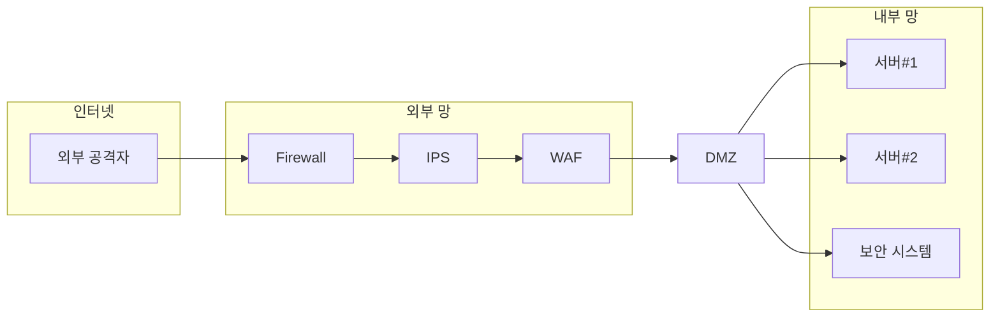

# PLURA XDR 철학

> “보안은 단일 제품이 아닌 플랫폼에서 기본적으로 통합되어야 한다.”   
> – 리 클라리치 (Lee Klarich), Palo Alto Networks CPO

## 1990년대

정보보안 시스템의 기초는 1990년대 `네트워크 경계 보안` (Network Perimeter Security Model) 중심의 접근 방식에서 시작되었습니다. 이는 네트워크 접속 지점을 단일화하고 해당 지점에서 강력한 보안 통제를 적용하여 보안 목표를 달성하는 구조입니다. 이를 위해 단일 제품이 아닌 여러 보안 제품을 다단계로 네트워크 상에 배치하여 다양한 공격에 대응하는 개념을 도입했습니다.

대표적인 네트워크 경계 보안 제품은 다음과 같습니다:

1. 방화벽 (Firewall)
2. 통합 위협 관리 (UTM, Unified Threat Management)
3. 웹 방화벽 (WAF, Web Application Firewall)
4. 침입 차단 시스템 (IPS, Intrusion Prevention System)
5. 침입 탐지 시스템 (IDS, Intrusion Detection System)
6. 네트워크 탐지 및 대응 (NDR, Network Detection and Response)

---

## 2000년대

2000년대에 들어서며 단일 제품의 한계가 드러나기 시작했고, `로그 관리 시스템` (LMS, Log Management System)에서 `통합 보안 이벤트 관리` (SIEM, Security Information and Event Management) 시스템으로 발전하게 됩니다. 여러 네트워크 장비의 로그를 통합 수집하여, 상관 분석을 통해 이상 징후를 탐지하는 방식입니다.

통합 보안 이벤트 관리의 핵심 목표는 상관 분석을 통해 이상 징후를 탐지하는 것이지만, 더 나아가 `보안 운영 자동화` (SOAR, Security Orchestration, Automation and Response) 시스템을 통해 자동화된 대응을 제안하게 되었습니다.

1. 네트워크 침입차단 시스템 (NIPS, Network based Intrusion Prevention System)
2. 로그 관리 시스템 (LMS, Log Management System)
3. 호스트 침입차단 시스템 (HIPS, Host based Intrusion Prevention System)

---

## 2020년대

2020년대에 들어서면서 보안의 핵심 패러다임은 “모든 것을 의심하라”는 원칙을 기반으로 한 `제로 트러스트 아키텍처` (ZTA, Zero Trust Architecture)로 전환되었습니다. 제로 트러스트는 더 이상 내부 네트워크를 신뢰할 수 없다는 전제를 두고, 네트워크 내·외부의 모든 접근을 지속적으로 검증하고, 인증 및 권한 부여를 통해 엄격히 관리하는 보안 모델입니다. 

기존 경계 보안 방식과 달리, ZTA는 **데이터 보호의 중심**을 네트워크 경계가 아닌 자산(데이터 및 애플리케이션)으로 이동시켜, 권한이 없는 모든 접근을 차단하고, 모든 사용자를 의심하는 방식을 취합니다. 이러한 접근 방식은 특히 원격 근무 환경, 클라우드 기반 인프라, 그리고 다양한 디바이스의 접속이 일반화된 현대 환경에서 필수적인 보안 전략으로 자리잡고 있습니다.

**PLURA-XDR**은 제로 트러스트 개념을 수직적으로 통합하여 더욱 발전시킨 플랫폼입니다. PLURA-XDR은 데이터 및 시스템 보호를 위한 다단계 검증과 지속적 모니터링을 기반으로, 침해사고 발생 전·후의 모든 활동을 추적하고 자동으로 차단하며, 조직 전반의 자산을 지능적으로 방어하는 체계를 제공합니다. 또한, 다양한 보안 제품들을 하나의 통합 플랫폼에서 관리할 수 있어, 보안 프로세스의 복잡성을 줄이고 대응의 효율성을 극대화합니다.

이러한 통합된 대응 방식은 기존의 분리된 보안 시스템들이 제로 트러스트 원칙을 완벽히 적용하는 데 한계를 보이는 상황을 개선하며, **최적화된 위협 탐지와 신속한 대응**을 가능하게 합니다.

---

## PLURA의 문제 의식

PLURA는 다음과 같은 문제 의식에서 출발했습니다:

1. **암호화된 트래픽의 분석 한계**  
   네트워크 기반 보안 제품인 침입 차단 시스템(IPS), 침입 탐지 시스템(IDS), 네트워크 탐지 및 대응(NDR)은 암호화된 패킷을 제대로 분석하기 어려운 한계가 있습니다. 이러한 장비들은 주로 암호화되지 않은 트래픽에서만 효과적으로 작동하며, 암호화 트래픽의 경우 웹 방화벽이 더 효과적입니다. [1]

2. **웹 방화벽의 우회 공격 취약성**  
   웹 방화벽(WAF)은 주로 웹 트래픽을 보호하는 데 최적화되어 있지만, 일부 고도화된 우회 공격 기법에 취약할 수 있습니다. 단일 제품으로는 크리덴셜 스터핑과 같은 특정 공격에 완벽하게 대응하기 어렵습니다. [2][3]

3. **SIEM 시스템의 정보 수집 한계**  
   통합 보안 이벤트 관리(SIEM) 시스템은 주로 네트워크 보안 장비의 로그(syslog)를 수집하는데, 대부분의 보안 장비는 구체적 탐지 설명이나 본문 정보를 충분히 제공하지 않습니다. 웹 방화벽(WAF)만이 본문 정보를 포함하는 경우가 많습니다. [4]

4. **상관 분석의 신뢰성 부족**  
   SIEM 시스템의 로그 정보가 충분히 상세하지 않아 상관 분석의 신뢰성이 낮아집니다. 탐지된 위협을 평가하고 대응하기에 필요한 정보를 제공하지 못해, 잘못된 경고 또는 탐지 실패가 발생할 수 있습니다.

5. **SOAR와 연동된 자동 대응의 한계**  
   정보가 부족한 SIEM 시스템과 연동된 보안 운영 자동화(SOAR) 기능은 실제 환경에서 원활히 동작하지 않으며, 자동 대응의 신뢰성과 효율성이 떨어집니다. 이로 인해 실제 보안 사고 대응 과정에서 수작업이 요구되는 경우가 많습니다.

6. **복잡한 보안 시스템 구성의 비효율성**  
   IPS, IDS, NDR 등 여러 보안 장비가 복잡하게 구성된 환경에서는 장비 간 상호 운용성이 부족하여 관리 부담이 가중됩니다. 또한, 중복 경고(duplicate alerts)와 경고 피로(alert fatigue)가 발생해 관리자가 위협을 적시에 인지하지 못할 위험이 있습니다.

7. **실시간 대응의 어려움**  
   기존 보안 제품은 실시간 공격 탐지 및 대응에 한계를 보이며, 빠른 위협 탐지와 즉각적인 차단이 어려워 결과적으로 비효율적인 보안 체계를 초래할 수 있습니다.

8. **시스템 간 통합 부족**  
   분리된 보안 시스템은 데이터를 공유하고 상호 분석하는 능력이 떨어집니다. 이로 인해 포괄적인 위협 정보 파악이 어렵고, 다각적인 위협 분석과 대응이 제한됩니다.

9. **보안 경계의 약화**  
   원격 근무와 클라우드 사용이 증가하면서 전통적인 네트워크 경계가 사라지고 있습니다. 기존의 경계 보안 모델은 현대의 분산된 인프라와 다양한 접속 환경에서 충분한 보안 효과를 제공하지 못합니다.

10. **보안 관제의 신뢰성 저하**  
    제한된 정보와 복잡한 장비 구성으로 인해 보안 관제 서비스의 신뢰성이 떨어집니다. 보안 관제 요원은 제한적인 정보만 제공받아 공격 여부를 빠르게 판단하기 어려우며, 침해사고 발생 시 운영 시스템에 접근하는 데 제약이 따릅니다.

---

## 웹 패킷과 암호화의 영향

인터넷 상의 TCP/IP 패킷 중 웹 패킷(HTTP/HTTPS)은 대략 80~90%를 차지하며, 그 중 HTTPS 비중은 83%에서 93%에 이르는 것으로 추정됩니다. 대부분이 암호화된 웹 패킷으로 이루어져 있으며, 이는 네트워크 보안의 패러다임에 큰 영향을 미치고 있습니다.

암호화된 트래픽의 증가로 인해, 기존의 네트워크 보안 장비들은 다음과 같은 문제점에 직면하고 있습니다:

1. **암호화 트래픽의 가시성 부족**  
   다기능 네트워크 보안 장비(UTM, IPS, IDS, NDR)는 다양한 위협을 감지하고 대응하기 위해 설계되었지만, 암호화된 트래픽을 분석하려면 복호화 과정이 필요합니다. 그러나 복호화는 보안 정책상 어려울 수 있으며, 이를 위해 추가적인 인증서 관리와 복잡한 설정이 요구됩니다.

2. **성능 저하와 지연 증가**  
   암호화된 트래픽을 복호화하여 검사하는 과정은 장비의 CPU와 메모리 사용량을 크게 증가시켜 성능 저하를 초래합니다. 이는 네트워크 지연(latency)을 증가시켜 사용자 경험을 악화시킬 수 있습니다.

3. **관리 복잡성의 증가**  
   복호화를 위해서는 SSL/TLS 인증서의 관리와 키 교환 등이 필요하며, 이는 네트워크 관리자에게 추가적인 부담을 줍니다. 또한, 복잡한 설정으로 인해 설정 오류가 발생할 가능성도 높아집니다.

4. **보안 취약성의 증가**  
   중간에서 복호화를 수행하는 것은 '중간자 공격'과 유사한 구조를 가지며, 잘못된 설정이나 취약점을 통해 공격자가 민감한 정보를 탈취할 수 있는 위험이 있습니다.

5. **프라이버시 및 규제 준수 문제**  
   암호화된 트래픽을 복호화하는 것은 사용자 프라이버시를 침해할 수 있으며, 일부 산업이나 국가에서는 법적 규제로 인해 제한될 수 있습니다.

6. **암호화 기술의 발전**  
   QUIC 프로토콜이나 TLS 1.3과 같은 최신 암호화 기술은 중간자 복호화를 더욱 어렵게 만들고 있으며, 기존 장비들의 대응 능력을 제한하고 있습니다.

7. **특화된 솔루션의 필요성**  
   이러한 한계로 인해 암호화된 웹 패킷에 효과적으로 대응하기 위해서는 웹 방화벽(WAF)과 같이 암호화 트래픽을 처리하도록 설계된 특화된 솔루션이 필요합니다.

8. **네트워크 구조의 복잡성 증가**  
   암호화 트래픽 처리를 위해 여러 장비를 추가로 도입하면 네트워크 구조가 복잡해지고, 이는 장애 발생 시 원인 분석과 복구를 어렵게 만듭니다.

9. **비용 증가**  
   추가적인 장비 도입과 관리로 인한 운영 비용(OPEX)과 장비 구매 비용(CAPEX)이 증가하여 기업의 재정 부담이 커집니다.

10. **실시간 위협 대응의 어려움**  
    암호화된 트래픽 내의 위협을 신속하게 탐지하고 대응하는 것이 어려워, 보안 사고 발생 시 피해를 최소화하는 데 한계가 있습니다.

이러한 문제들을 해결하기 위해서는 네트워크 보안 구조를 단순화하고, 암호화된 웹 패킷에 특화된 웹 방화벽(WAF)과 같은 솔루션을 중심으로 보안 체계를 재구성하는 것이 필요합니다. 이는 보안 성능과 효율성을 높이고, 관리 부담과 비용을 줄이는 데 도움이 됩니다.

또한, PLURA-XDR과 같은 수직적으로 통합된 보안 플랫폼은 이러한 한계를 극복하고, 암호화된 트래픽에 대한 가시성을 확보하며, 실시간으로 위협을 탐지하고 대응할 수 있는 종합적인 솔루션을 제공합니다. 이를 통해 조직은 복잡한 네트워크 보안 환경에서 발생하는 다양한 위협에 효과적으로 대응할 수 있습니다.

---

## PLURA-XDR의 가치

PLURA-XDR은 수직적으로 통합된 보안 플랫폼을 통해 현재의 정보보안 문제를 종합적으로 해결하고자 합니다. PLURA-XDR은 네트워크와 엔드포인트 보안, 통합 보안 이벤트 관리 및 자동화 대응을 하나의 플랫폼으로 제공하여, 보안 체계의 일관성과 효율성을 극대화합니다.

### 수직 통합 플랫폼이 제공하는 주요 가치

1. **웹 방화벽(WAF)의 고도화된 암호화 패킷 대응**  
   PLURA-XDR의 웹 방화벽(WAF)은 암호화된 웹 패킷을 복호화하여 깊이 있는 분석을 수행합니다. 이를 통해 HTTPS 트래픽에서 발생하는 위협을 효과적으로 탐지하고 대응할 수 있으며, 암호화된 데이터 내에서도 잠재적인 공격을 차단할 수 있습니다.

2. **호스트 보안(EDR)의 엔드포인트 방어**  
   호스트 보안(Endpoint Detection and Response, EDR)은 최종 서버와 PC에 직접 설치되어 악성 행위를 실시간으로 모니터링하고 대응합니다. 공격이 엔드포인트에 도달하기 전, 탐지된 위협을 즉각 차단하여 중요한 데이터를 보호하며, 잠재적인 내부 위협에도 대응할 수 있습니다.

3. **SIEM 시스템의 정확한 정보 수집 및 상관 분석**  
   PLURA-XDR의 SIEM(Security Information and Event Management) 시스템은 정확한 탐지 정보와 본문 정보를 통합하여 수집합니다. 이를 통해 다양한 보안 이벤트 간의 상관 관계를 분석하고, 보다 정교한 이상 징후 탐지가 가능해져 위협을 조기에 파악할 수 있습니다.

4. **자동화된 보안 운영 대응 (SOAR)과 연동된 실시간 해킹 대응**  
   SOAR(Security Orchestration, Automation, and Response) 시스템은 SIEM의 정교한 탐지 결과를 바탕으로 자동화된 대응을 수행합니다. 예를 들어, 계정 탈취 공격인 크리덴셜 스터핑을 실시간으로 탐지하여 차단하고, 기타 보안 이벤트에 대해 자동화된 조치를 취하여 인적 개입을 최소화합니다.

5. **위협의 전체 라이프사이클 관리**  
   PLURA-XDR은 위협의 탐지, 분석, 대응, 및 사후 처리까지 위협 관리의 전체 사이클을 지원합니다. 이를 통해 보안 팀은 위협의 근본 원인을 파악하고, 향후 유사한 공격을 방지하는 체계를 구축할 수 있습니다.

6. **중앙화된 통합 관리로 인한 운영 효율성**  
   여러 보안 시스템을 하나의 중앙화된 플랫폼에서 통합 관리할 수 있어, 중복 경고와 경고 피로를 줄이며 보안 관리의 효율성을 극대화합니다. 이로써 보안 인프라가 단순화되고 운영자들이 보다 신속하고 일관된 대응을 할 수 있습니다.

7. **정교한 보안 가시성 및 실시간 위협 모니터링**  
   PLURA-XDR은 네트워크와 엔드포인트 전반에 걸쳐 실시간으로 발생하는 모든 보안 이벤트를 한눈에 파악할 수 있는 통합된 보안 가시성을 제공합니다. 이를 통해 보안 관리자는 조직 내 모든 위협 상황을 직관적으로 모니터링하고 즉각적으로 대응할 수 있습니다.

8. **내부 및 외부 위협에 대한 균형 잡힌 보호**  
   PLURA-XDR은 내부의 잠재적 위협과 외부로부터의 공격에 대해 균형 잡힌 보호를 제공하여, 전방위적인 보안 체계를 구현합니다. 이는 단순한 외부 위협 방어를 넘어, 내부 위협에도 효과적으로 대응할 수 있도록 지원합니다.

---

## 결론

정보보안 문제는 솔루션 선택만이 아닌, 필요한 `보안관제`(MSS, Managed Security Service)와의 조화로운 운영이 필수적입니다. 그러나 현재 보안관제는 제한된 서비스만을 제공합니다. 이는 PLURA의 문제 인식과 일맥상통합니다.

- 보안 관제 요원이 제한된 정보만 제공받음
- 운영 시스템 접근의 제한성

## PLURA-XDR 플랫폼의 활용 효과

- 상세 탐지 설명과 원본 로그 제공으로 정확한 판단 제공
- 운영 시스템 접근 없이도 자유롭게 침해사고 분석 제공
- **실시간 대응**으로 진행 중인 공격 차단
- 공격에 대한 가시성과 컨텍스트 제공으로 주도적인 대응 제공

이러한 차별점을 통해 **완벽한 해킹 대응 시스템**을 제공합니다.

---

### 참고 자료
1. [IPS와 NDR 차이와 한계 with ChatGPT](http://blog.plura.io/?p=18953)
2. [웹 방화벽 우회 공격 대응](http://blog.plura.io/?p=19174)
3. [크리덴셜 스터핑 공격 대응하기 with ChatGPT](http://blog.plura.io/?p=18955)
4. [Splunk에서 요청 본문 로그 분석하기 with ChatGPT](http://blog.plura.io/?p=18910)
5. [WAF vs IPS vs UTM 비교하여 웹 공격 최상의 제품 선택하기 with ChatGPT](http://blog.plura.io/?p=19190)

---
