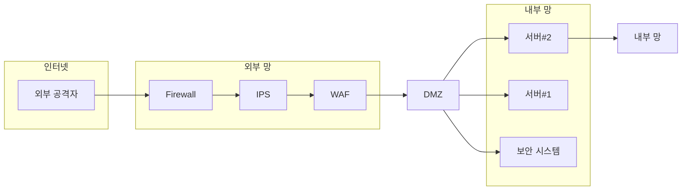

# PLURA-XDR 철학

> “보안은 단일 제품이 아닌 플랫폼에서 기본적으로 통합되어야 한다.”  
> – 리 클라리치 (Lee Klarich), Palo Alto Networks CPO

---

## 1) 정보보안의 논리적 전개: 1990년대부터 현재까지의 변화

### 1990년대: 네트워크 경계 보안 모델의 시작

정보보안의 초기 접근 방식은 **네트워크 경계 보안(Network Perimeter Security Model)**에 초점을 맞추었습니다. 이는 네트워크 접속 지점을 단일화하고 해당 지점에서 강력한 보안 통제를 적용하여 보안 목표를 달성하는 구조입니다. 다양한 공격에 대응하기 위해 여러 보안 제품을 다단계로 네트워크에 배치하는 개념을 도입했습니다.

대표적인 네트워크 경계 보안 제품은 다음과 같습니다:

1. 방화벽(Firewall)
2. 통합 위협 관리(UTM, Unified Threat Management)
3. 웹 방화벽(WAF, Web Application Firewall)
4. 침입 차단 시스템(IPS, Intrusion Prevention System)
5. 침입 탐지 시스템(IDS, Intrusion Detection System)
6. 네트워크 탐지 및 대응(NDR, Network Detection and Response)

### 2000년대: 통합 보안 이벤트 관리와 자동화된 대응의 발전

2000년대에 들어서면서 단일 제품의 한계가 드러나기 시작했습니다. 이에 따라 **로그 관리 시스템(LMS)**에서 **통합 보안 이벤트 관리(SIEM, Security Information and Event Management)** 시스템으로 발전하게 되었습니다. 다양한 네트워크 장비의 로그를 통합 수집하고, 상관 분석을 통해 이상 징후를 탐지하는 방식입니다.

또한, 자동 차단에 대한 요구가 증가함에 따라 **보안 운영 자동화(SOAR, Security Orchestration, Automation and Response)** 시스템이 도입되어 SIEM의 탐지 결과를 바탕으로 자동화된 대응을 가능하게 했습니다.

### 2020년대: 제로 트러스트 아키텍처의 등장

2020년대에는 "모든 것을 의심하라"는 개념의 **제로 트러스트 아키텍처(ZTA, Zero Trust Architecture)**가 제안되었습니다. 이는 내부와 외부를 구분하지 않고 모든 접근을 엄격히 검증하여 보안 수준을 높이는 접근 방식입니다.

**PLURA-XDR**은 이러한 제로 트러스트 개념을 수직적으로 통합하여, 대응 방식을 혁신하는 플랫폼입니다. 데이터 보호와 실시간 위협 차단을 하나의 플랫폼에서 제공하여 보안의 새로운 패러다임을 제시합니다.

---

## 2) 문제 인식과 해결: PLURA의 혁신적 접근

### PLURA가 인식한 주요 문제점

1. **암호화된 트래픽에 대한 가시성 부족**  
   네트워크 기반 보안 제품인 IPS, IDS, NDR은 암호화된 패킷을 분석하는 데 한계가 있습니다. 암호화된 웹 패킷(HTTPS)은 전체 트래픽의 80~90%를 차지하며, 이러한 암호화된 트래픽을 효과적으로 분석하기 위해서는 복호화 과정이 필요하지만, 이는 성능 저하와 보안 취약성을 초래할 수 있습니다.

2. **웹 방화벽의 우회 공격 취약성**  
   웹 방화벽(WAF)은 암호화된 웹 트래픽을 복호화하여 분석하지만, 일부 우회 공격 및 크리덴셜 스터핑과 같은 고도화된 공격에는 취약할 수 있습니다.

3. **SIEM 시스템의 정보 부족**  
   SIEM 시스템은 주로 네트워크 장비의 로그만 수집하여 구체적인 탐지 설명이나 본문 정보가 부족합니다. 이는 정확한 위협 탐지와 상관 분석을 어렵게 만듭니다.

4. **자동화된 대응의 한계**  
   SIEM의 정보 부족으로 인해 SOAR와 연동된 자동화 대응 기능이 제한되며, 실질적인 보안 사고 대응에 어려움이 있습니다.

5. **복잡한 네트워크 구조와 관리 부담**  
   여러 보안 장비의 도입으로 네트워크 구조가 복잡해지고, 관리와 유지보수에 대한 부담과 비용이 증가합니다.

6. **실시간 위협 대응의 어려움**  
   기존 보안 시스템은 실시간으로 위협을 탐지하고 대응하는 데 한계를 보입니다.

7. **중복 경고와 경고 피로**  
   여러 장비에서 동일한 위협에 대한 중복 경고가 발생하여 경고 피로(alert fatigue)를 유발하고, 중요한 경고를 놓칠 위험이 있습니다.

8. **보안 경계의 약화**  
   원격 근무와 클라우드 서비스의 증가로 전통적인 네트워크 경계가 약화되었으며, 기존의 경계 보안 모델은 이러한 환경 변화에 대응하기 어렵습니다.

9. **내부 위협에 대한 대응 부족**  
   내부 사용자에 의한 보안 위협이나 내부 시스템의 취약성에 대한 대응이 미흡합니다.

10. **보안 관제의 신뢰성 저하**  
    제한된 정보와 복잡한 시스템으로 인해 보안 관제 서비스의 효율성과 신뢰성이 낮아지고 있습니다.

### PLURA-XDR을 통한 문제 해결과 통합 보안 제공

1. **암호화된 트래픽의 효과적인 분석**  
   PLURA-XDR의 웹 방화벽은 암호화된 웹 패킷을 복호화하여 정확한 위협 분석과 대응을 수행합니다.

2. **엔드포인트 보안 강화**  
   호스트 보안(EDR)을 통해 최종 서버와 PC에서 직접 악성 행위를 감지하고 차단합니다.

3. **정확한 정보 수집과 상관 분석**  
   SIEM 시스템은 상세한 탐지 정보와 본문 데이터를 수집하여 신뢰성 높은 상관 분석을 가능하게 합니다.

4. **자동화된 실시간 대응**  
   SOAR 시스템과의 연동을 통해 실시간으로 위협을 자동 차단하고 대응합니다.

5. **관리 효율성 증대**  
   수직적으로 통합된 플랫폼을 통해 네트워크 구조를 단순화하고 관리 부담을 줄입니다.

6. **위협의 전체 라이프사이클 관리**  
   탐지부터 대응, 사후 처리까지 위협 관리의 모든 단계를 지원합니다.

7. **경고 피로 감소**  
   중앙화된 경고 관리로 중복 경고를 최소화하고, 중요한 위협에 집중할 수 있습니다.

8. **제로 트러스트 아키텍처 구현**  
   내부와 외부를 구분하지 않는 보안 모델을 통해 현대적인 보안 환경에 대응합니다.

9. **내부 위협에 대한 포괄적 대응**  
   내부 사용자와 시스템에 대한 모니터링과 보호를 강화합니다.

10. **보안 관제 신뢰성 향상**  
    상세한 정보와 실시간 대응으로 보안 관제의 효율성과 신뢰성을 높입니다.

---

## 3) 강력한 보안에 대한 제안: PLURA-XDR의 미래와 우리의 제안

정보보안은 단순히 솔루션을 선택하는 것을 넘어, **보안 관제(MSS, Managed Security Service)**와의 유기적인 운영이 필수적입니다. 그러나 현재의 보안 관제 서비스는 제한된 정보와 운영 시스템 접근의 제약으로 인해 충분한 보호를 제공하기 어렵습니다. 이러한 한계는 PLURA가 인식한 문제의 핵심입니다.

**PLURA-XDR 플랫폼**은 상세한 탐지 설명과 원본 로그를 제공하여 보안 관리자가 정확하고 신속한 판단을 할 수 있도록 지원합니다. 운영 시스템에 직접 접근하지 않고도 침해 사고를 분석할 수 있으며, 실시간 대응을 통해 진행 중인 공격을 즉시 차단합니다. 또한, 위협에 대한 가시성과 컨텍스트를 제공하여 주도적인 대응이 가능합니다.

PLURA-XDR의 이러한 차별화된 접근은 완벽한 해킹 대응 체계를 실현하며, 최신 보안 요구에 부응하여 끊임없이 진화하고 있습니다. 이제 **PLURA-XDR**을 통해 강력하고 혁신적인 정보보안의 미래를 함께 구축해 보십시오. PLURA-XDR은 조직의 정보보안을 새롭게 정의할 최첨단 통합 보안 플랫폼입니다.

---
