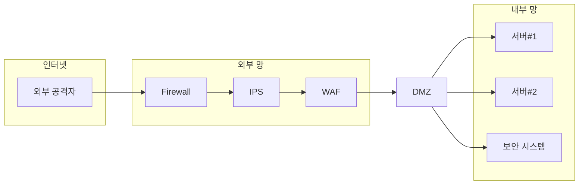

# PLURA XDR 철학

> “보안은 단일 제품이 아닌 플랫폼에서 기본적으로 통합되어야 한다.”   
> – 리 클라리치 (Lee Klarich), Palo Alto Networks CPO

## 1990년대

정보보안 시스템의 기초는 1990년대 `네트워크 경계 보안` (Network Perimeter Security Model) 중심의 접근 방식에서 시작되었습니다. 이는 네트워크 접속 지점을 단일화하고 해당 지점에서 강력한 보안 통제를 적용하여 보안 목표를 달성하는 구조입니다. 이를 위해 단일 제품이 아닌 여러 보안 제품을 다단계로 네트워크 상에 배치하여 다양한 공격에 대응하는 개념을 도입했습니다.

대표적인 네트워크 경계 보안 제품은 다음과 같습니다:

1. 방화벽 (Firewall)
2. 통합 위협 관리 (UTM, Unified Threat Management)
3. 웹 방화벽 (WAF, Web Application Firewall)
4. 침입 차단 시스템 (IPS, Intrusion Prevention System)
5. 침입 탐지 시스템 (IDS, Intrusion Detection System)
6. 네트워크 탐지 및 대응 (NDR, Network Detection and Response)

---

## 2000년대

2000년대에 들어서며 단일 제품의 한계가 드러나기 시작했고, `로그 관리 시스템` (LMS, Log Management System)에서 `통합 보안 이벤트 관리` (SIEM, Security Information and Event Management) 시스템으로 발전하게 됩니다. 여러 네트워크 장비의 로그를 통합 수집하여, 상관 분석을 통해 이상 징후를 탐지하는 방식입니다.

통합 보안 이벤트 관리의 핵심 목표는 상관 분석을 통해 이상 징후를 탐지하는 것이지만, 더 나아가 `보안 운영 자동화` (SOAR, Security Orchestration, Automation and Response) 시스템을 통해 자동화된 대응을 제안하게 되었습니다.

1. 네트워크 침입차단 시스템 (NIPS, Network based Intrusion Prevention System)
2. 로그 관리 시스템 (LMS, Log Management System)
3. 호스트 침입차단 시스템 (HIPS, Host based Intrusion Prevention System)

---

## 2020년대

이 개념이 발전하여 2020년대에는 `제로 트러스트 아키텍처` (ZTA, Zero Trust Architecture)가 제안되고 있습니다.

**PLURA-XDR**은 이러한 개념을 수직적으로 통합하여 대응 방식을 혁신하는 플랫폼입니다.

---

## PLURA의 문제 의식

PLURA는 다음과 같은 문제 의식에서 출발했습니다:

- 네트워크 기반 보안 제품인 침입 차단 시스템(IPS), 침입 탐지 시스템(IDS), 네트워크 탐지 및 대응(NDR)은 암호화된 패킷을 분석하는 데 있어 한계가 있습니다. 이를 위해 웹 패킷(HTTP/HTTPS)만을 분석하는 경우가 많으며, 이 점에서 웹 방화벽이 탁월한 성능을 발휘합니다. [1]
- 웹 방화벽은 우회 공격에 취약할 수 있으며, 단일 제품으로는 크리덴셜 스터핑 공격에 완벽히 대응할 수 없습니다. [2][3]
- 통합 보안 이벤트 관리(SIEM) 시스템은 네트워크 보안 장비의 로그만을 수집하며, 구체적 탐지 설명이나 본문 정보가 부족한 경우가 많습니다. 웹 방화벽(WAF)만이 본문 정보를 포함하는 경우가 많습니다. [4]
- SIEM 시스템의 정보가 부족해 탐지 신뢰성이 낮아지며, SOAR와 연동된 자동 대응 기능을 실현하기 어려운 상황입니다.

---

## 웹 패킷과 암호화의 영향

인터넷 상의 TCP/IP 패킷 중 웹 패킷(HTTP/HTTPS)은 대략 80~90%를 차지하며, 그 중 HTTPS 비중은 83%에서 93%에 이르는 것으로 추정됩니다. 대부분이 암호화된 웹 패킷으로 이루어져 있으며, 이로 인해 암호화된 트래픽을 다루기 위한 네트워크 보안 장비의 요구가 증가하고 있습니다. 

다기능 네트워크 보안 장비(UTM, IPS, IDS, NDR)들은 다양한 위협을 감지하고 대응하기 위해 설계되었지만, 암호화된 트래픽의 경우 **복호화** 과정이 추가로 필요합니다. 이로 인해 성능 저하, 관리 복잡성, 그리고 보안 취약성이 증가할 수 있습니다. 복잡한 기능을 담당하는 이러한 장비들은 전체 트래픽 중 암호화되지 않은 부분에서만 제 기능을 발휘하기에, **가시성이 제한되는 단점**이 있습니다. 

따라서 네트워크 보안 구조를 보다 효율적으로 단순화하고, 웹 방화벽(WAF)과 같은 특화된 제품을 암호화된 웹 패킷 대응의 중심으로 두는 접근 방식이 보안 성능과 효율성을 높이는 해결책입니다.

---

## PLURA-XDR의 가치

우리는 수직적으로 통합된 보안 플랫폼, **PLURA-XDR**을 통해 현재의 정보보안 문제를 해결하고자 합니다.

### 수직 통합 플랫폼이 제공하는 가치

1. 웹 방화벽(WAF)은 암호화된 패킷을 복호화하여 대응합니다.
2. 호스트 보안(EDR)은 최종 서버 및 PC에 설치되어 악성 행위에 대응합니다.
3. SIEM 시스템은 정확한 탐지 정보와 본문 정보를 수집하여, 통합 보안 이벤트 관리를 가능하게 합니다.
4. SOAR 시스템이 정확한 탐지 결과를 바탕으로 SIEM과 연동되어 해킹에 대응합니다. 예를 들어, 계정 탈취 공격인 크리덴셜 스터핑을 실시간으로 탐지하고 차단하는 방식입니다.

---

## 결론

정보보안 문제는 솔루션 선택만이 아닌, 필요한 `보안관제`(MSS, Managed Security Service)와의 조화로운 운영이 필수적입니다. 그러나 현재 보안관제는 제한된 서비스만을 제공합니다. 이는 PLURA의 문제 인식과 일맥상통합니다.

- 보안 관제 요원이 제한된 정보만 제공받음
- 운영 시스템 접근의 제한성

## PLURA-XDR 플랫폼의 활용 효과

- 상세 탐지 설명과 원본 로그 제공으로 정확한 판단 제공
- 운영 시스템 접근 없이도 자유롭게 침해사고 분석 제공
- **실시간 대응**으로 진행 중인 공격 차단
- 공격에 대한 가시성과 컨텍스트 제공으로 주도적인 대응 제공

이러한 차별점을 통해 **완벽한 해킹 대응 시스템**을 제공합니다.

---

### 참고 자료
1. [IPS와 NDR 차이와 한계 with ChatGPT](http://blog.plura.io/?p=18953)
2. [웹 방화벽 우회 공격 대응](http://blog.plura.io/?p=19174)
3. [크리덴셜 스터핑 공격 대응하기 with ChatGPT](http://blog.plura.io/?p=18955)
4. [Splunk에서 요청 본문 로그 분석하기 with ChatGPT](http://blog.plura.io/?p=18910)
5. [WAF vs IPS vs UTM 비교하여 웹 공격 최상의 제품 선택하기 with ChatGPT](http://blog.plura.io/?p=19190)

---
