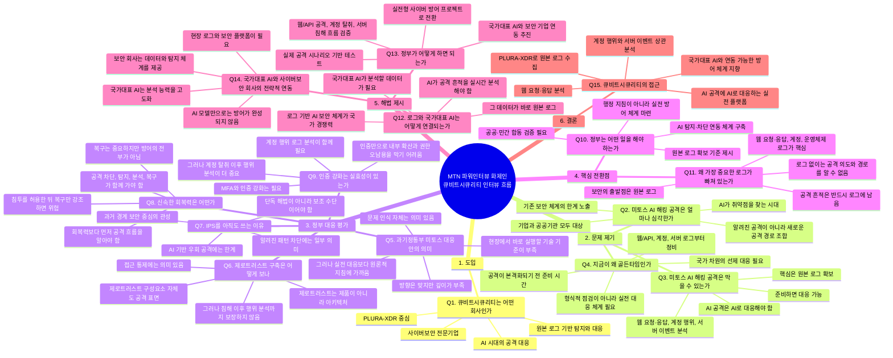

아래처럼 구성하면 **기승전결의 흐름**이 자연스럽습니다.



## 전체 질문 흐름 요약

```text
회사 소개
→ 미토스 AI 해킹 공격의 심각성
→ 막을 수 있다는 메시지
→ 지금이 골든타임이라는 문제의식
→ 정부 대응안 평가
→ 제로트러스트·IPS·회복력·인증 강화의 한계
→ 빠져 있는 핵심은 로그
→ 로그와 국가대표 AI의 결합
→ 정부가 해야 할 일
→ 큐비트시큐리티의 실전 대응 방향
```

## 방송 리듬 기준 정리

| 구간 | 질문      | 역할       | 핵심 메시지                          |
| -: | ------- | -------- | ------------------------------- |
|  1 | Q1      | 신뢰 형성    | 큐비트시큐리티는 AI 시대 사이버보안 기업         |
|  2 | Q2~Q4   | 위기 제기    | 미토스 AI 공격은 심각하지만 준비하면 막을 수 있음   |
|  3 | Q5~Q9   | 정부 대응 평가 | 방향은 의미 있지만 실전 대응 기준이 부족         |
|  4 | Q10~Q11 | 핵심 전환    | 빠져 있는 것은 원본 로그                  |
|  5 | Q12~Q14 | 국가 해법    | 국가대표 AI와 보안 기업의 전략적 연동 필요       |
|  6 | Q15     | 회사 결론    | 큐비트시큐리티는 PLURA-XDR로 이 문제를 풀고 있음 |

## 각 질문의 한 줄 목적

### Q1. 큐비트시큐리티 어떤 곳인지 소개해 주십시오.

회사와 제품의 신뢰를 먼저 확보하는 질문입니다.
“AI 시대의 사이버 공격에 대응하는 원본 로그 기반 XDR 기업”이라는 정체성을 제시합니다.

### Q2. 미토스 AI 해킹 공격 얼마나 심각한 건가요?

위협의 크기를 설명하는 질문입니다.
AI가 취약점을 찾고 공격 경로를 조합하는 시대가 왔다는 점을 강조합니다.

### Q3. 그렇다면 막을 수 있는 건가요?

불안만 조성하지 않고 대응 가능성을 제시하는 질문입니다.
핵심 메시지는 “준비하면 막을 수 있다”입니다.

### Q4. 왜 지금이 골든타임인가요?

시급성을 만드는 질문입니다.
지금은 아직 대응 체계를 정비할 수 있는 시간이며, 실전 준비가 필요하다는 흐름으로 연결합니다.

### Q5. 정부 대응안의 의미는 어떻게 보시나요?

정부 비판으로 바로 가지 않고 균형 있게 시작하는 질문입니다.
“문제 인식은 의미 있지만, 실전 대응 기준은 부족하다”로 정리합니다.

### Q6. 제로트러스트 구축은요?

제로트러스트를 부정하지 않고 한계를 짚는 질문입니다.
접근 통제는 필요하지만, 침해 이후 행위 분석까지 해결하지 못한다는 점을 말합니다.

### Q7. IPS가 의미 없는 제품인데 아직도 사용하는 이유는 뭔가요?

기존 경계 보안의 한계를 지적하는 질문입니다.
알려진 패턴 차단에는 일부 의미가 있지만, AI 기반 우회 공격에는 한계가 있다는 방향이 좋습니다.

### Q8. 신속한 회복력은요?

“복구 중심 보안”의 위험을 짚는 질문입니다.
복구는 필요하지만, 침투를 전제로 한 회복력만으로는 부족하다는 점을 강조합니다.

### Q9. 인증 강화는 실효성이 있는 건가요?

MFA와 인증 강화의 필요성은 인정하되, 한계를 설명하는 질문입니다.
인증 이후의 계정 행위와 내부 이동까지 봐야 한다는 흐름으로 연결합니다.

### Q10. 이번에는 정부가 어떤 일을 해야 한다고 보시나요?

비판에서 대안으로 넘어가는 질문입니다.
정부는 지침 발표가 아니라 실전형 탐지·분석·차단 체계를 만들어야 한다고 제안합니다.

### Q11. 왜 보안에서 가장 중요하다는 로그는 없는 건가요?

전체 인터뷰의 핵심 전환 질문입니다.
공격 흔적은 반드시 로그에 남고, 로그 없이는 AI도 판단할 수 없다는 메시지로 연결합니다.

### Q12. 로그와 국가대표 AI 선발 대회는 어떤 접근이 있나요?

국가 정책과 기술 해법을 연결하는 질문입니다.
국가대표 AI가 사이버 공격 로그를 실시간 분석하도록 연동해야 한다는 방향입니다.

### Q13. 정부가 어떻게 하면 되면 될까요?

실행 방안을 묻는 질문입니다.
국가대표 AI, 사이버보안 기업, 공공기관이 함께 실전 공격 시나리오를 검증해야 한다는 답으로 이어집니다.

### Q14. 국가대표 AI와 사이버보안 회사 간 전략적 연동이 필요하다는 것이군요.

진행자가 내용을 정리해 주는 확인형 질문입니다.
“맞습니다. AI 모델만으로는 안 되고, 현장의 원본 로그와 보안 플랫폼이 결합되어야 합니다”로 받으면 좋습니다.

### Q15. 큐비트시큐리티는 어떻게 접근하고 있나요?

결론 질문입니다.
PLURA-XDR이 웹 요청·응답, 계정 행위, 서버 이벤트, 원본 로그를 수집·분석하고 AI와 연동 가능한 체계를 지향한다는 메시지로 마무리합니다.
